# EdgeFirst Hardware Abstraction Layer - Architecture

**Version:** 3.1
**Last Updated:** March 2026
**Status:** Production
**Audience:** Developers contributing to EdgeFirst HAL or integrating it into applications

---

## Overview

The EdgeFirst Hardware Abstraction Layer (HAL) is a Rust-based system that provides hardware-accelerated abstractions for computer vision and machine learning tasks on embedded Linux platforms. The HAL consists of multiple specialized crates that work together to provide high-performance image processing, tensor operations, model inference decoding, and object tracking.

## System Architecture

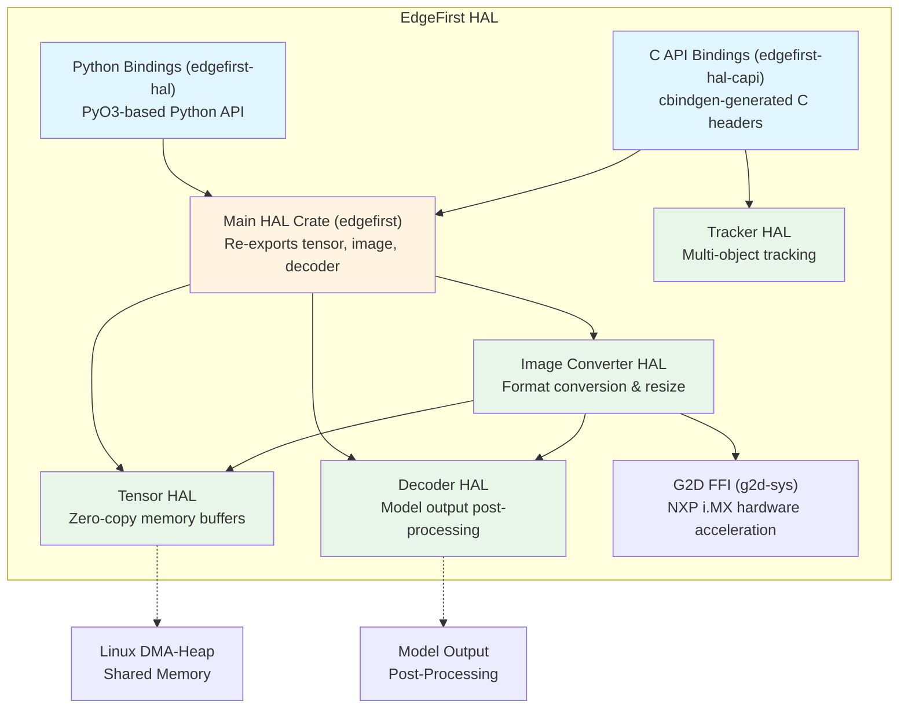
```mermaid
graph TB
    subgraph "EdgeFirst HAL"
        Python["Python Bindings (edgefirst-hal)<br/>PyO3-based Python API"]
        CAPI["C API Bindings (edgefirst-hal-capi)<br/>cbindgen-generated C headers"]
        Main["Main HAL Crate (edgefirst)<br/>Re-exports tensor, image, decoder"]

        Python --> Main
        CAPI --> Main

        Tensor["Tensor HAL<br/>Zero-copy memory buffers"]
        Image["Image Converter HAL<br/>Format conversion & resize"]
        Decoder["Decoder HAL<br/>Model output post-processing"]
        Tracker["Tracker HAL<br/>Multi-object tracking"]

        Main --> Tensor
        Main --> Image
        Main --> Decoder

        Image --> Tensor
        Image --> Decoder
        Image --> G2D["G2D FFI (g2d-sys)<br/>NXP i.MX hardware acceleration"]
        CAPI --> Tracker
    end

    Tensor -.-> DMA["Linux DMA-Heap<br/>Shared Memory"]
    Decoder -.-> PostProc["Model Output<br/>Post-Processing"]

    style Python fill:#e1f5ff
    style CAPI fill:#e1f5ff
    style Main fill:#fff4e1
    style Tensor fill:#e8f5e9
    style Image fill:#e8f5e9
    style Decoder fill:#e8f5e9
    style Tracker fill:#e8f5e9
```

## Core Components

### 1. Tensor HAL (`edgefirst_tensor`)

**Purpose**: Provides zero-copy memory buffers optimized for hardware accelerators.

**Architecture**:
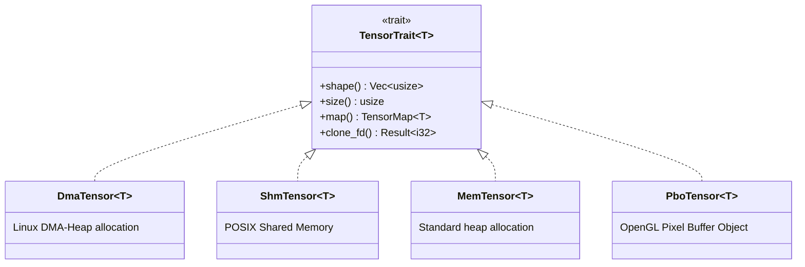
```mermaid
classDiagram
    class TensorTrait~T~ {
        <<trait>>
        +shape() Vec~usize~
        +size() usize
        +map() TensorMap~T~
        +clone_fd() Result~i32~
    }
    
    class DmaTensor~T~ {
        Linux DMA-Heap allocation
    }
    
    class ShmTensor~T~ {
        POSIX Shared Memory
    }
    
    class MemTensor~T~ {
        Standard heap allocation
    }

    class PboTensor~T~ {
        OpenGL Pixel Buffer Object
    }

    TensorTrait <|.. DmaTensor
    TensorTrait <|.. ShmTensor
    TensorTrait <|.. MemTensor
    TensorTrait <|.. PboTensor
```

**Key Features**:
- Generic over numeric types (`T: Num + Clone + Debug + Send + Sync`) — commonly u8, i8, u16, i16, u32, i32, f32, f64
- Automatic memory type selection with fallback chain: DMA → Shared Memory → Heap
- PBO (Pixel Buffer Object) tensors for GPU-accelerated image processing
- Memory mapping with `TensorMap<T>` for safe access (RAII map/unmap lifecycle)
- `BufferIdentity` for cache keying and liveness tracking (monotonic ID + `Arc<()>` guard with weak reference detection)
- File descriptor sharing for zero-copy IPC (DMA-buf and SHM both support fd cloning)
- Cross-platform support (Linux optimized, macOS via SHM + heap, Windows via heap only)

**Tensor Memory Mapping**:

Each tensor backend provides a corresponding map type that implements `TensorMapTrait<T>`:

| Tensor | Map | Mechanism |
|--------|-----|-----------|
| `DmaTensor<T>` | `DmaMap<T>` | `mmap` + `DMA_BUF_IOCTL_SYNC` for cache coherency |
| `ShmTensor<T>` | `ShmMap<T>` | `mmap`/`munmap` on POSIX shared memory fd |
| `MemTensor<T>` | `MemMap<T>` | Direct raw pointer into `Vec<T>` (no syscall) |
| `PboTensor<T>` | `PboMap<T>` | GL thread `glMapBufferRange`/`glUnmapBuffer` via channel |

`TensorMap<T>` implements `Deref<Target=[T]>` and `DerefMut`, providing slice access. When the `ndarray` feature is enabled, `TensorMapTrait` also provides `view()` and `view_mut()` for ndarray `ArrayView` access.

**Memory Type Selection Logic**:
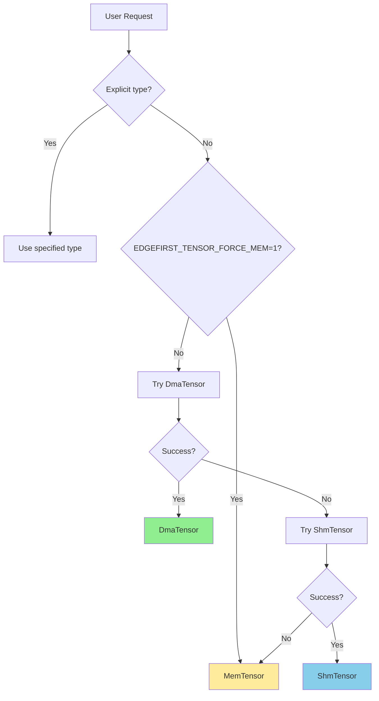
```mermaid
flowchart TD
    Start[User Request] --> Explicit{Explicit type?}
    Explicit -->|Yes| UseSpec[Use specified type]
    Explicit -->|No| CheckEnv{EDGEFIRST_TENSOR_FORCE_MEM=1?}
    CheckEnv -->|Yes| UseMem[MemTensor]
    CheckEnv -->|No| TryDMA[Try DmaTensor]
    TryDMA --> DMASuccess{Success?}
    DMASuccess -->|Yes| UseDMA[DmaTensor]
    DMASuccess -->|No| TryShm[Try ShmTensor]
    TryShm --> ShmSuccess{Success?}
    ShmSuccess -->|Yes| UseShm[ShmTensor]
    ShmSuccess -->|No| UseMem
    
    style UseDMA fill:#90ee90
    style UseShm fill:#87ceeb
    style UseMem fill:#ffeb9c
```

**PBO Tensor Memory (`PboTensor<T>`)**:

PBO tensors are a GPU-native memory type created by the OpenGL backend when
`ImageProcessor::create_image()` is called and DMA-buf is not available. Unlike
the other tensor types, PBO tensors are not allocated by the tensor crate
directly — they are OpenGL Pixel Buffer Objects managed by the GL thread. The
tensor crate provides the `PboTensor` wrapper and the `PboOps` trait that the
GL backend implements to perform map/unmap/delete operations.

PBO tensors use a `WeakSender` to communicate with the GL thread. This is a
critical design choice: if `PboTensor` held a strong `Sender`, any surviving
PBO tensor would keep the GL thread's message channel alive, preventing
`GLProcessorThreaded::drop()` from joining the GL thread at shutdown. The
`WeakSender` pattern allows the GL thread to exit cleanly when the
`ImageProcessor` is dropped, even if PBO tensors still exist — subsequent
PBO operations on orphaned tensors return `PboDisconnected`.

### 2. Image HAL (`edgefirst_image`)

**Purpose**: Hardware-accelerated image format conversion and resizing.

**Architecture**:
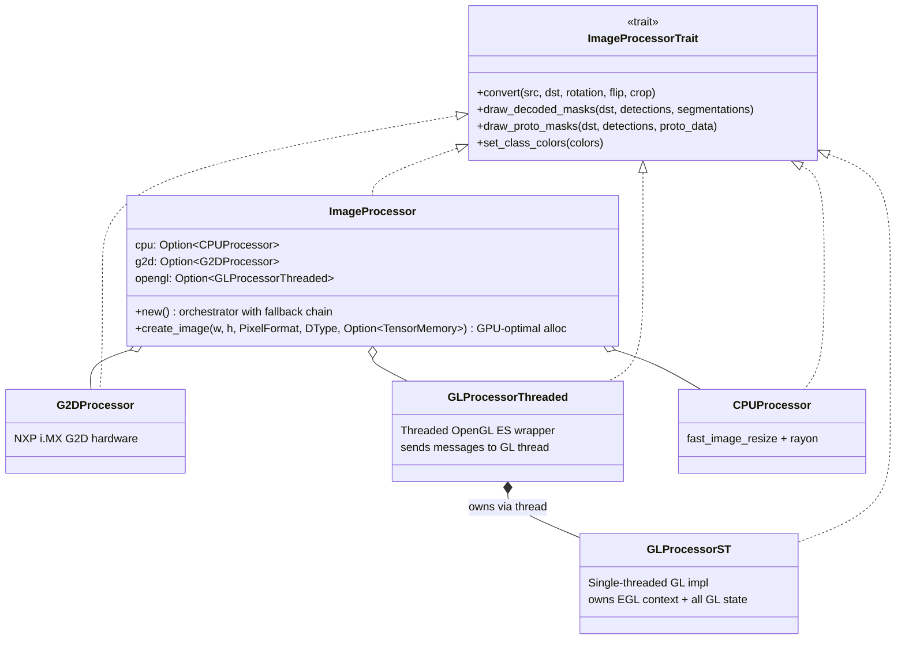
```mermaid
classDiagram
    class ImageProcessorTrait {
        <<trait>>
        +convert(src, dst, rotation, flip, crop)
        +draw_decoded_masks(dst, detections, segmentations)
        +draw_proto_masks(dst, detections, proto_data)
        +set_class_colors(colors)
    }

    class ImageProcessor {
        cpu: Option~CPUProcessor~
        g2d: Option~G2DProcessor~
        opengl: Option~GLProcessorThreaded~
        +new() orchestrator with fallback chain
        +create_image(w, h, PixelFormat, DType, Option~TensorMemory~) GPU-optimal alloc
    }

    class G2DProcessor {
        NXP i.MX G2D hardware
    }

    class GLProcessorThreaded {
        Threaded OpenGL ES wrapper
        sends messages to GL thread
    }

    class GLProcessorST {
        Single-threaded GL impl
        owns EGL context + all GL state
    }

    class CPUProcessor {
        fast_image_resize + rayon
    }

    ImageProcessorTrait <|.. ImageProcessor
    ImageProcessorTrait <|.. G2DProcessor
    ImageProcessorTrait <|.. GLProcessorThreaded
    ImageProcessorTrait <|.. GLProcessorST
    ImageProcessorTrait <|.. CPUProcessor
    ImageProcessor o-- G2DProcessor
    ImageProcessor o-- GLProcessorThreaded
    ImageProcessor o-- CPUProcessor
    GLProcessorThreaded *-- GLProcessorST : owns via thread
```

**`ImageProcessor` Dispatch Priority**: OpenGL (GPU-accelerated) → G2D (if supported for the format pair) → CPU (general fallback). Environment variables `EDGEFIRST_DISABLE_GL`, `EDGEFIRST_DISABLE_G2D`, `EDGEFIRST_DISABLE_CPU` can override this chain.

**Supported Operations**:
- Format conversion (YUYV, VYUY, NV12, NV16, RGB, RGBA, BGRA, GREY, Planar RGB, Planar RGBA, RGB int8, Planar RGB int8)
- Resize with various interpolation methods
- Rotation (0°, 90°, 180°, 270°)
- Flip (horizontal, vertical)
- Crop and region-of-interest
- Instance segmentation mask rendering (draw and decode workflows)

**TensorDyn (Image Representation)**:

`TensorDyn` is the type-erased tensor enum that serves as the primary image type.
It wraps `Tensor<T>` variants for different element types and carries an optional
`PixelFormat` describing the spatial pixel layout. The format and element type are
orthogonal: `PixelFormat` describes the spatial arrangement (e.g. packed RGB,
semi-planar NV12) while `DType` describes the element storage (e.g. `U8`, `I8`,
`F32`).

```rust
pub struct Tensor<T> {
    storage: TensorStorage<T>,
    format: Option<PixelFormat>,
    /// Second plane for multiplane NV12/NV16 (separate DMA-BUF allocation).
    chroma: Option<Box<Tensor<T>>>,
}
```

The `chroma` field supports multi-plane DMA-BUF NV12/NV16 where Y and UV planes
are in separate allocations (common with V4L2 `NV12M` format). Constructed via
`Tensor::from_planes()`. See [Appendix A: Multi-Plane DMA-BUF](#appendix-a-multi-plane-dma-buf-limitation) for details.

Image construction uses `TensorDyn::image(w, h, PixelFormat, DType, mem)` which
allocates the appropriate tensor shape and sets the pixel format metadata.

Width, height, channels, and stride are **not stored** — they are computed from the tensor shape and `PixelFormat` on every access. The tensor shape encoding depends on the pixel format:

| Format | Tensor Shape | Notes |
|--------|-------------|-------|
| Rgb, Rgba, Bgra, Grey, Yuyv, Vyuy | `[H, W, C]` | Interleaved (channels-last) |
| PlanarRgb, PlanarRgba | `[C, H, W]` | Channels-first |
| Nv12 | `[H*3/2, W]` | 2D — Y plane (H rows) + UV plane (H/2 rows) |
| Nv16 | `[H*2, W]` | 2D — Y plane (H rows) + UV plane (H rows) |

**PixelFormat Enum**:

Pixel formats are variants of the `PixelFormat` enum defined in the tensor crate.
Int8 variants use `DType::I8` with any `PixelFormat` rather than separate format constants.

| Variant | Display | Channels | Layout |
|---------|---------|----------|--------|
| `PixelFormat::Rgb` | RGB | 3 | Packed |
| `PixelFormat::Rgba` | RGBA | 4 | Packed |
| `PixelFormat::Bgra` | BGRA | 4 | Packed |
| `PixelFormat::Grey` | Y800 | 1 | Packed |
| `PixelFormat::Yuyv` | YUYV | 2 | Packed |
| `PixelFormat::Vyuy` | VYUY | 2 | Packed |
| `PixelFormat::Nv12` | NV12 | 1 | SemiPlanar |
| `PixelFormat::Nv16` | NV16 | 1 | SemiPlanar |
| `PixelFormat::PlanarRgb` | PlanarRgb | 3 | Planar |
| `PixelFormat::PlanarRgba` | PlanarRgba | 4 | Planar |

**Planar RGB Format**:
Planar RGB (`PixelFormat::PlanarRgb`) stores color channels in separate planes rather than interleaved. This format is particularly useful for:
- Neural network preprocessing where planar layout is required
- Hardware accelerators that prefer planar data
- Efficient SIMD operations on individual color channels
- GPU texture operations via OpenGL with swizzled grayscale textures

**Image Processing Flow**:
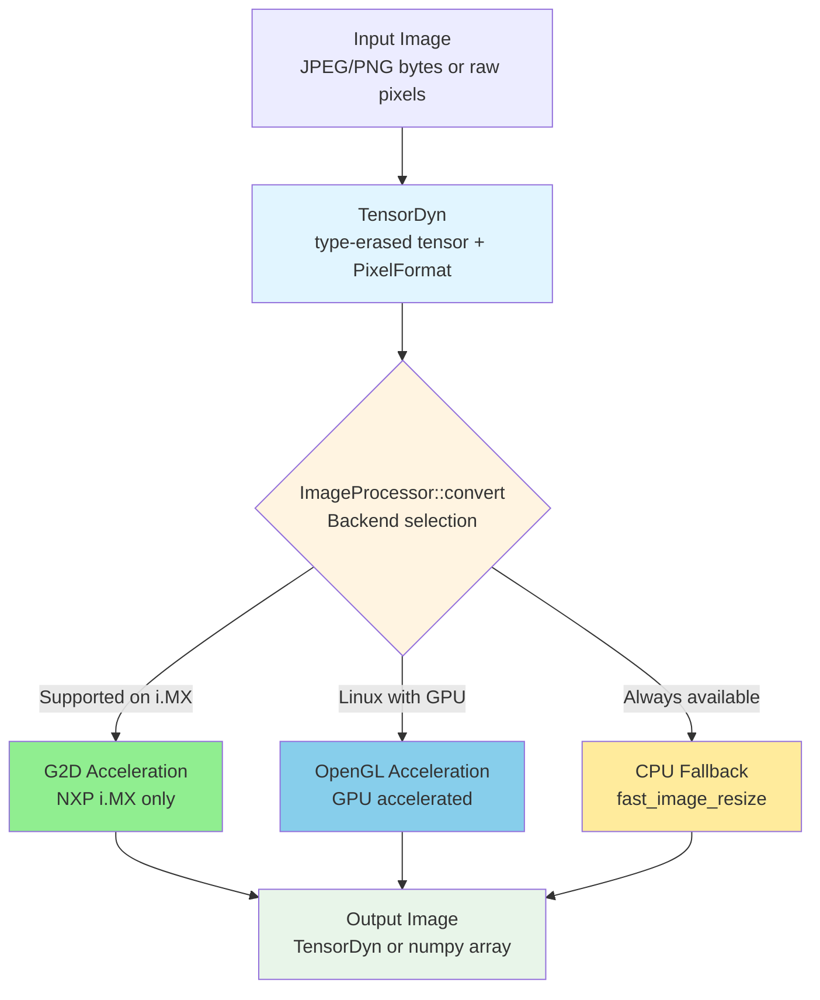
```mermaid
flowchart TD
    Input[Input Image<br/>JPEG/PNG bytes or raw pixels]
    TI[TensorDyn<br/>type-erased tensor + PixelFormat]
    Conv{ImageProcessor::convert<br/>Backend selection}
    G2D[G2D Acceleration<br/>NXP i.MX only]
    GL[OpenGL Acceleration<br/>GPU accelerated]
    CPU[CPU Fallback<br/>fast_image_resize]
    Output[Output Image<br/>TensorDyn or numpy array]
    
    Input --> TI
    TI --> Conv
    Conv -->|Supported on i.MX| G2D
    Conv -->|Linux with GPU| GL
    Conv -->|Always available| CPU
    G2D --> Output
    GL --> Output
    CPU --> Output
    
    style TI fill:#e1f5ff
    style Conv fill:#fff4e1
    style G2D fill:#90ee90
    style GL fill:#87ceeb
    style CPU fill:#ffeb9c
    style Output fill:#e8f5e9
```

**GPU-Optimal Image Creation (`ImageProcessor::create_image()`)**:

`create_image()` is the preferred way to allocate images for use with
`ImageProcessor::convert()`. It probes the GPU at initialization time and
selects the best available memory backend in priority order:

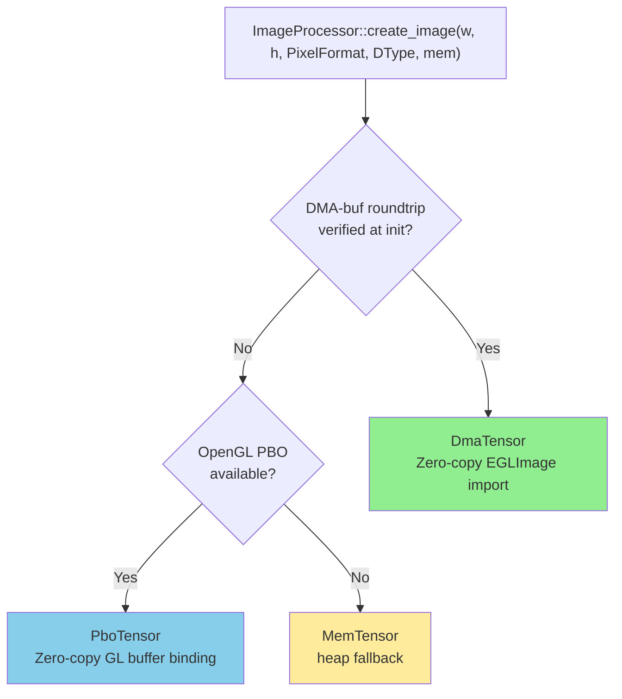
```mermaid
flowchart TD
    Create["ImageProcessor::create_image(w, h, PixelFormat, DType, mem)"]
    DMA{DMA-buf roundtrip<br/>verified at init?}
    PBO{OpenGL PBO<br/>available?}
    Mem[MemTensor<br/>heap fallback]

    Create --> DMA
    DMA -->|Yes| UseDMA["DmaTensor<br/>Zero-copy EGLImage import"]
    DMA -->|No| PBO
    PBO -->|Yes| UsePBO["PboTensor<br/>Zero-copy GL buffer binding"]
    PBO -->|No| Mem

    style UseDMA fill:#90ee90
    style UsePBO fill:#87ceeb
    style Mem fill:#ffeb9c
```

| Backend | When selected | GPU transfer method | Platforms |
|---------|---------------|---------------------|-----------|
| DMA-buf | GPU supports EGLImage import from DMA-buf FDs | Zero-copy: `EGL_EXT_image_dma_buf_import` — the GPU reads/writes the DMA buffer directly via EGLImage, no pixel copies | NXP i.MX 8M Plus (Vivante), NXP i.MX 95 (Mali/Panfrost) |
| PBO | OpenGL ES 3.0 available but DMA-buf roundtrip fails | Zero-copy GL binding: `GL_PIXEL_UNPACK_BUFFER` for upload, `GL_PIXEL_PACK_BUFFER` for readback — data stays in GPU-accessible memory | NVIDIA desktop GPUs, systems without DMA-buf permissions |
| Mem | No GPU or OpenGL not available | CPU `memcpy` via `glTexImage2D`/`glReadnPixels` with mapped host pointers | All platforms (fallback) |

**GL Transfer Backend Selection**:

The OpenGL processor selects a transfer backend at initialization time:

| Backend | Detection | GPU Upload | GPU Readback |
|---------|-----------|-----------|--------------|
| `DmaBuf` | `verify_dma_buf_roundtrip()` passes | `EGL_EXT_image_dma_buf_import` (zero-copy) | EGLImage export (zero-copy) |
| `Pbo` | OpenGL ES 3.0 available, DMA-buf fails | `GL_PIXEL_UNPACK_BUFFER` | `GL_PIXEL_PACK_BUFFER` |
| `Sync` | Fallback | `glTexImage2D` with host pointer | `glReadnPixels` to host pointer |

**GL Thread Architecture**:

`GLProcessorThreaded` is the public thread-safe wrapper. It spawns a dedicated GL thread that owns the EGL context and all GL state (`GLProcessorST`). All operations are sent as `GLProcessorMessage` enum variants through a channel and block on a oneshot reply. This design is required because EGL contexts are thread-local — all GL calls must happen on the thread that created the context.

The `PboOps` trait bridges the tensor crate and the GL thread: `PboTensor` holds a `WeakSender` to the GL thread channel. When the tensor needs to map/unmap/delete the PBO, it sends a message through this channel. The weak sender ensures PBO tensors don't prevent GL thread shutdown.

**GLES 3.1 Context and Compute Shader Path**:

At context creation time, the GL thread attempts to create a GLES 3.1 context
first. If the driver does not support GLES 3.1, it falls back to GLES 3.0:

```
Try GLES 3.1  →  success: compute shaders available
              →  failure: fall back to GLES 3.0 (no compute shaders)
```

When a GLES 3.1 context is active, an opt-in compute shader path is available for
HWC→CHW proto tensor repack. Enable it by setting `EDGEFIRST_PROTO_COMPUTE=1`
before launching the process:

```sh
EDGEFIRST_PROTO_COMPUTE=1 ./my_app
```

The compute shader performs the HWC→CHW layout transpose of the proto tensor on
the GPU using an SSBO, avoiding a CPU-side copy. If compilation fails at runtime,
the implementation logs a warning and falls back to the CPU repack path
transparently — no API changes are required.

**Why PBO matters**: On desktop Linux with NVIDIA GPUs, DMA-buf allocation
succeeds (via `/dev/dma_heap/system`) but the NVIDIA EGL driver cannot import
those buffers — the `verify_dma_buf_roundtrip()` check catches this at
initialization. Without PBO, every `convert()` call would fall back to CPU
`memcpy` for upload and readback. PBO keeps the data in GPU-accessible buffers,
enabling the same zero-copy shader pipeline used on DMA platforms.

**PBO Convert Dispatch**:

When `convert()` is called with PBO-backed images, the GL thread must not call
`tensor.map()` on those images — doing so would send a message back to itself
and deadlock. Instead, the convert path dispatches to specialized methods:

```
┌─────────────────────────────┬──────────────────────────────────────────┐
│ Source → Destination        │ Method                                    │
├─────────────────────────────┼──────────────────────────────────────────┤
│ DMA → DMA                   │ convert_dest_dma (EGLImage both sides)   │
│ PBO → PBO                   │ convert_pbo_to_pbo (UNPACK + PACK)       │
│ Mem/DMA → PBO               │ convert_any_to_pbo (texture + PACK)      │
│ PBO → Mem                   │ convert_pbo_to_mem (UNPACK + ReadnPixels) │
│ Mem/DMA → Mem/DMA           │ convert_dest_non_dma (texture + memcpy)  │
└─────────────────────────────┴──────────────────────────────────────────┘
```

**EGL Image Cache**:

The OpenGL backend maintains two independent LRU caches of EGLImages — one for
source tensors (`src_egl_cache`) and one for destination tensors
(`dst_egl_cache`). Each entry is keyed by `(BufferIdentity.id, chroma_id)`.

`BufferIdentity` is a small struct that pairs a globally unique monotonic ID
(allocated from an `AtomicU64` counter) with an `Arc<()>` liveness guard:

```
BufferIdentity {
    id:    u64,     // unique per allocation — new value each time from_fd() is called
    guard: Arc<()>, // cache entries hold Weak<()>; when tensor drops, weak dies
}
```

When a tensor is freed, its `Arc<()>` guard drops. The cache holds only a
`Weak<()>` reference, so `sweep()` detects dead entries without requiring an
explicit removal call.

| Pattern | Cache behavior | Performance |
|---------|---------------|-------------|
| Same tensor object reused across frames | Cache hit on every frame | Fast path — no EGLImage re-import |
| New tensor created from same fd each frame | Cache miss on every frame | Slow path — EGLImage re-imported each call |
| `dst` of call N reused as `src` of call N+1 | Hit in both caches | Two separate entries, no collision |

**Key design implications**:

- `hal_tensor_from_fd()` and `hal_import_image()` always allocate a new
  `BufferIdentity`. Callers that re-wrap the same fd each frame will see a cache
  miss on every `convert()` call. Hold the tensor object alive across frames.

- Content written into a DMA-BUF between `convert()` calls (e.g., by a V4L2
  decoder) is visible on the next call. EGLImage is a handle to live physical
  memory — it is not a snapshot. The tensor wrapper does not need to be recreated
  when the buffer contents change.

- The `last_bound_src_egl` optimization skips the `glEGLImageTargetTexture2DOES`
  rebind when the source EGLImage has not changed between consecutive calls. This
  is safe because the texture already points at the correct DMA-BUF memory; skipping
  the rebind does not prevent new frame data from being read.

- A `glFinish()` is issued at the end of every `convert()` call. This guarantees
  that all GPU reads of the source and writes to the destination are complete
  before the function returns, making it safe to chain calls and to let the caller
  write new data into a source buffer immediately after `convert()` returns.

**Vivante NV12 to Planar RGB Two-Pass Workaround**:

A single-pass NV12 → PlanarRgb shader causes a GPU hang on the Vivante GC7000UL
(NXP i.MX 8M Plus). The workaround splits the conversion into two passes:

```
Pass 1:  NV12  →  RGBA  (intermediate)
         All geometry operations here: resize, crop, rotation, flip, letterbox

Pass 2:  RGBA  →  PlanarRgb  (at destination resolution)
         Deinterleaves RGBA to three separate planes using sampler2D variants
```

Pass 1 reuses the existing `packed_rgb_intermediate_tex` GL texture — no new
GPU resources are allocated. Pass 2 uses the same shader infrastructure as
direct RGBA → PlanarRgb conversions. The two-pass path is selected automatically
when `is_vivante && src_fmt == Nv12 && dst_fmt.layout() == Planar`. No API
changes are required from callers.

### 3. Decoder HAL (`edgefirst_decoder`)

**Purpose**: Post-processing for object detection and segmentation model outputs.

**Supported Decoders**:
- **YOLO** (YOLOv5, YOLOv8, YOLOv11, YOLOv26)
  - Object detection
  - Instance segmentation
  - Split output format support
  - End-to-end models with embedded NMS (YOLOv26)
  - Mixed data type support (different types per input tensor)
- **ModelPack** (Au-Zone proprietary format)
  - Detection with anchor-based decoding

**`YoloSegDet2Way` Model Type**:

TFLite INT8 segmentation models exported with 3 separate output tensors use the
`YoloSegDet2Way` model type. The builder auto-selects this variant when 3 outputs
are detected matching the expected shapes:

| Tensor | Shape | Content |
|--------|-------|---------|
| detection | `[1, nc+4, N]` | Combined boxes and class scores |
| mask_coeff | `[1, 32, N]` | Per-detection mask coefficients |
| protos | `[1, H/4, W/4, 32]` | Prototype masks |

This differs from the standard `YoloSegDet` variant (which combines boxes and
mask coefficients into a single tensor). The builder auto-selects `YoloSegDet2Way`
when the output count and shapes match the 3-tensor layout.

**YOLO26 End-to-End Support**:

YOLOv26 models can be exported with embedded NMS (one-to-one matching heads),
eliminating external NMS post-processing. The `DecoderVersion::Yolo26` variant
triggers end-to-end model type selection:

| Config Field | Value | Effect |
|-------------|-------|--------|
| `decoder_version` | `"yolo26"` | Selects end-to-end model types, bypasses NMS |
| `decoder_version` | `"yolov8"` | Uses traditional model types with external NMS |

When `decoder_version` is `"yolo26"`, `DecoderVersion::is_end_to_end()` returns
`true` and the decoder selects one of the end-to-end `ModelType` variants:

| ModelType | Tensors | Format |
|-----------|---------|--------|
| `YoloEndToEndDet` | 1 | `[batch, N, 6+]` — xyxy, conf, class |
| `YoloEndToEndSegDet` | 2 | `[batch, N, 6+num_protos]` + protos |
| `YoloSplitEndToEndDet` | 3 | boxes `[B,N,4]` + scores `[B,N,1]` + classes `[B,N,1]` |
| `YoloSplitEndToEndSegDet` | 5 | boxes + scores + classes + mask_coeff + protos |

For non-end-to-end YOLO26 exports (`end2end=false`), use `decoder_version: "yolov8"`
with an explicit `nms` field (`ClassAgnostic` or `ClassAware`).

**NMS Modes** (`Option<Nms>`):
- `Some(Nms::ClassAgnostic)` — suppress overlapping boxes regardless of class (default)
- `Some(Nms::ClassAware)` — only suppress boxes sharing the same class label
- `None` — bypass NMS entirely (auto-set for end-to-end models)

**Output Tensor Physical-Order Contract** (EDGEAI-1288):

Every output declared to the decoder — whether programmatically via
`hal_decoder_params_add_output` / `DecoderBuilder`, or through YAML/JSON config
— must have its `shape` and `dshape` fields listed in **physical memory order,
outermost axis first, innermost axis last**. HAL derives C-contiguous strides
from `shape` and wraps the raw buffer bytes with those strides; it never
reorders bytes. When `dshape` is also supplied, HAL uses it to permute the
stride tuple into the decoder's canonical logical order for the output role
(e.g. `[batch, height, width, num_protos]` for protos); only the stride
indices change, not the bytes.

When `dshape` is omitted, HAL assumes `shape` is already in the decoder's
canonical order for the role. This is appropriate for producers like
Ultralytics ONNX/TFLite flat-detection, which emit outputs in the order the
decoder kernels expect.

Mis-declaring physical order (e.g. using NCHW dim names on an NHWC buffer)
causes every element access to index the wrong byte. This was the root cause of
two distinct production bugs: a vertical-stripe mask artifact on i.MX 8M Plus
TFLite segmentation, and a coordinate mis-decode with Ara-2 anchor-first
split-tensor boxes. HAL cannot detect the mismatch at runtime because it has no
visibility into how the inference engine laid out the bytes.

`DecoderBuilder::build` validates each output at construction time:
- `dshape.len()` must equal `shape.len()` when `dshape` is present.
- Each `dshape[i].size` must equal `shape[i]` — catches the common mistake of
  declaring `dshape` in a different order than `shape`.
- No axis name may appear twice within a single output's `dshape`.

Common physical layouts by framework:

| Framework | Typical proto layout | How to declare |
|-----------|---------------------|----------------|
| TFLite (NNStreamer) | `[1, H, W, C]` NHWC | `shape=[1,H,W,C]`, `dshape=[batch,height,width,num_protos]` |
| ONNX / PyTorch | `[1, C, H, W]` NCHW | `shape=[1,C,H,W]`, `dshape=[batch,num_protos,height,width]` |
| Ara-2 DVM | `[1, N, 1, 4]` anchor-first | `shape=[1,N,1,4]`, `dshape=[batch,num_boxes,padding,box_coords]` |
| Ultralytics flat | already canonical | `shape=[1,C,N]`, `dshape` may be omitted |

**Proto Mask API**:

For segmentation models, `decode_quantized_proto()` and `decode_float_proto()`
return raw proto data and mask coefficients without materializing pixel masks.
These are the preferred entry point for fused GPU rendering via
`ImageProcessor::draw_proto_masks()`.

**Architecture**:
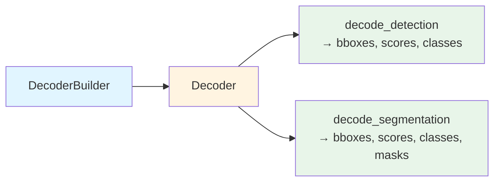
```mermaid
flowchart LR
    Builder[DecoderBuilder]
    Decoder[Decoder]
    Det[decode_detection<br/>→ bboxes, scores, classes]
    Seg[decode_segmentation<br/>→ bboxes, scores, classes, masks]
    
    Builder --> Decoder
    Decoder --> Det
    Decoder --> Seg
    
    style Builder fill:#e1f5ff
    style Decoder fill:#fff4e1
    style Det fill:#e8f5e9
    style Seg fill:#e8f5e9
```

**Detection Pipeline**:
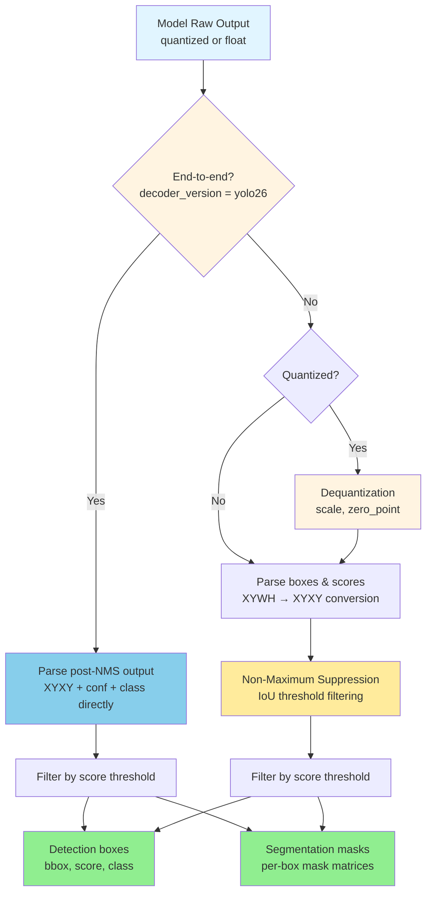
```mermaid
flowchart TD
    Raw[Model Raw Output<br/>quantized or float]
    E2E{End-to-end?<br/>decoder_version = yolo26}

    Quant{Quantized?}
    Dequant[Dequantization<br/>scale, zero_point]

    Parse[Parse boxes & scores<br/>XYWH → XYXY conversion]
    NMS[Non-Maximum Suppression<br/>IoU threshold filtering]
    Filter[Filter by score threshold]

    E2EParse[Parse post-NMS output<br/>XYXY + conf + class directly]
    E2EFilter[Filter by score threshold]

    Det[Detection boxes<br/>bbox, score, class]
    Seg[Segmentation masks<br/>per-box mask matrices]

    Raw --> E2E
    E2E -->|Yes| E2EParse
    E2EParse --> E2EFilter
    E2EFilter --> Det
    E2EFilter --> Seg

    E2E -->|No| Quant
    Quant -->|Yes| Dequant
    Quant -->|No| Parse
    Dequant --> Parse
    Parse --> NMS
    NMS --> Filter
    Filter --> Det
    Filter --> Seg

    style Raw fill:#e1f5ff
    style E2E fill:#fff4e1
    style Dequant fill:#fff4e1
    style NMS fill:#ffeb9c
    style E2EParse fill:#87ceeb
    style Det fill:#90ee90
    style Seg fill:#90ee90
```

#### Instance Segmentation Mask Rendering

YOLO segmentation models produce **proto masks** (shared basis masks at reduced
resolution, typically 160x160) and **mask coefficients** (per-detection linear
combination weights). The raw mask for detection `i` is:

```
mask_raw[i] = coefficients[i] @ protos    # shape: (proto_h, proto_w)
```

The HAL provides two workflows for consuming these masks:

| Workflow | Python | Rust | C | CPU | OpenGL | G2D |
|----------|--------|------|---|:---:|:------:|:---:|
| **Draw** — fused overlay onto image | `processor.draw_masks()` | `draw_proto_masks()` | `hal_image_processor_draw_masks()` | Yes | Yes | No |
| **Draw pre-decoded** — draw already-decoded masks | `processor.draw_decoded_masks()` | `draw_decoded_masks()` | `hal_image_processor_draw_decoded_masks()` | Yes | Yes | No |
| **Draw with tracking** — decode, track, and draw in one call | `processor.draw_masks_tracked()` | `draw_masks_tracked()` | `hal_image_processor_draw_masks_tracked()` | Yes | Yes | No |

**`MaskOverlay` Parameters**:

The `draw_decoded_masks` and `draw_proto_masks` methods (and `draw_masks_tracked`)
accept a `MaskOverlay<'_>` struct controlling compositing behaviour:

```rust
pub struct MaskOverlay<'a> {
    pub background: Option<&'a TensorDyn>,  // blit this image into dst before drawing masks
    pub opacity: f32,                        // scale mask alpha; 1.0 = fully opaque
}
```

Use the builder API to construct it:

```rust
// Default: no background blit, full opacity
let overlay = MaskOverlay::default();

// With a background frame and reduced opacity
let overlay = MaskOverlay::new()
    .with_background(&bg_tensor)
    .with_opacity(0.7);
```

`draw_masks_tracked` combines decoding, tracking, and mask rendering in a single
call, returning `(Vec<DetectBox>, Vec<TrackInfo>)`:

```rust
let (boxes, tracks) = processor.draw_masks_tracked(
    &decoder, &mut tracker, timestamp, &outputs, &mut dst, overlay)?;
```

> **G2D limitation:** The NXP G2D hardware accelerator does not support mask
> rendering. On platforms where G2D is the primary image processor (e.g.
> i.MX 8M Plus without EGL), all mask methods return `NotImplemented`. Use
> an OpenGL-capable `ImageProcessor` (pass an `egl_display`) or fall back
> to CPU rendering.

**Choosing between `draw_masks` workflows:**

| Use case | Recommended API | Why |
|----------|----------------|-----|
| Overlay colored masks onto a display frame | `processor.draw_masks()` | Fused path — masks never leave Rust/GPU, lowest latency |
| Draw masks you already have (e.g. from a previous `decode()` call) | `processor.draw_decoded_masks()` | Accepts pre-decoded `(H, W, C)` mask arrays |

**Format requirements:**

- **CPU backend:** destination image must be `RGBA` or `RGB`.
- **OpenGL backend:** destination image must be `RGBA`, `BGRA`, or `RGB`.

> These are representative ranges for typical COCO-class detections. Actual
> timings depend on detection count, bounding box sizes, and proto tensor
> quantization format. Use `mask_benchmark` for precise on-target measurements:
> `cargo bench -p edgefirst-image --bench mask_benchmark`

**Fused proto→pixel algorithm (`draw_proto_masks`)**

Instead of computing the matmul at proto resolution and upsampling the result,
the fused path upsamples the proto field itself and evaluates the dot product at
every output pixel:

```
For each output pixel (x, y) in bbox at 640×640:
    bilinear_sample(protos, proto_coords(x, y))  →  32 interpolated values
    dot(coefficients, interpolated_protos)        →  raw logit
    sigmoid(raw)                                  →  mask value [0, 1]
    threshold at 0.5 → blend color onto pixel
```

This is algebraically equivalent to bilinear upsampling after matmul (because
both bilinear interpolation and the dot product are linear), but avoids
materializing intermediate tensors. Key design choices:

- **No proto-resolution crop** — the full 160×160 proto field is sampled,
  avoiding the boundary erosion artifact of crop-before-upsample approaches.
- **Sigmoid after interpolation** — sigmoid is nonlinear, so applying it after
  spatial operations preserves the full dynamic range through interpolation.
- The draw path uses the sigmoid value for alpha-blend weighting.

This approach is mathematically equivalent to Ultralytics' `retina_masks=True`
(`process_mask_native`) for binary mask output. Empirical validation across 26
matched detections on COCO val2017 images confirms **0.993 mean mask IoU**
between the two methods.

**GPU implementation (OpenGL)**

*Draw path (`draw_proto_masks`) — sigmoid shaders with alpha blending:*

The fragment shader computes sigmoid(logit) and blends the detection color onto
the framebuffer using `GL_SRC_ALPHA / GL_ONE_MINUS_SRC_ALPHA`.

The GPU renders a quad per detection, and the fragment shader evaluates the mask
at every output pixel.

### 4. Tracker HAL (`edgefirst_tracker`)

**Purpose**: Multi-object tracking across video frames.

**Implementation**: ByteTrack algorithm with Kalman filtering

**Architecture**:
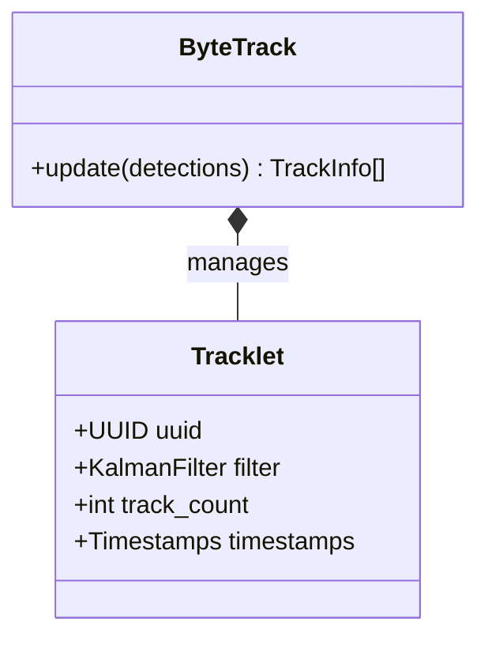
```mermaid
classDiagram
    class ByteTrack {
        +update(detections) TrackInfo[]
    }
    
    class Tracklet {
        +UUID uuid
        +KalmanFilter filter
        +int track_count
        +Timestamps timestamps
    }
    
    ByteTrack *-- Tracklet : manages
```

**Tracking Flow**:
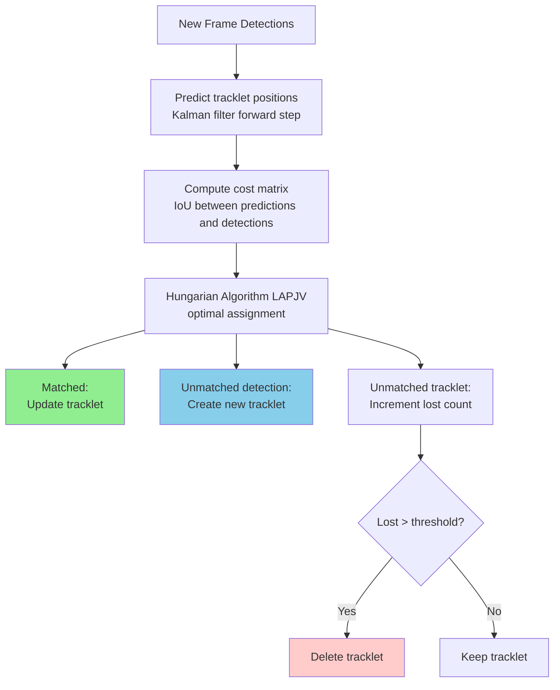
```mermaid
flowchart TD
    NewFrame[New Frame Detections]
    Predict[Predict tracklet positions<br/>Kalman filter forward step]
    Cost[Compute cost matrix<br/>IoU between predictions and detections]
    Hungarian[Hungarian Algorithm LAPJV<br/>optimal assignment]
    
    Matched[Matched:<br/>Update tracklet]
    UnmatchedDet[Unmatched detection:<br/>Create new tracklet]
    UnmatchedTrack[Unmatched tracklet:<br/>Increment lost count]
    
    CheckLost{Lost > threshold?}
    Delete[Delete tracklet]
    Keep[Keep tracklet]
    
    NewFrame --> Predict
    Predict --> Cost
    Cost --> Hungarian
    Hungarian --> Matched
    Hungarian --> UnmatchedDet
    Hungarian --> UnmatchedTrack
    UnmatchedTrack --> CheckLost
    CheckLost -->|Yes| Delete
    CheckLost -->|No| Keep
    
    style Matched fill:#90ee90
    style UnmatchedDet fill:#87ceeb
    style Delete fill:#ffcccb
```

### 5. Python Bindings (`edgefirst-hal`)

**Purpose**: Expose HAL functionality to Python via PyO3.

**Exposed Classes**:
- `Tensor`: Unified tensor with image support and numpy buffer protocol
- `ImageProcessor`: Image processing operations
- `Decoder`: Model output decoding
- `PixelFormat`, `Normalization`, `Rect`, `Rotation`, `Flip`: Configuration types

**Python Integration**:

```mermaid
flowchart LR
    Py[Python Code]
    PyO3[PyO3 Bindings]
    Rust[Rust Core HAL]
    HW[Hardware Accelerators / CPU]

    Py --> PyO3
    PyO3 --> Rust
    Rust --> HW

    style Py fill:#3776ab,color:#fff
    style PyO3 fill:#ce422b
    style Rust fill:#dea584
    style HW fill:#90ee90
```

### Cross-Crate Dependencies

The `edgefirst_image` crate depends on `edgefirst_decoder` for the `DetectBox`, `ProtoData`, and `Segmentation` types used in the mask rendering APIs (`draw_decoded_masks`, `draw_proto_masks`). This means the image crate imports decoder types but does not import the `Decoder` itself — it only needs the output data structures that describe detections and masks.

### 6. C API Bindings (`edgefirst-hal-capi`)

**Purpose**: Expose HAL functionality to C/C++ consumers via cbindgen-generated headers.

**Architecture**:
- Builds as both `staticlib` and `cdylib`
- cbindgen generates C headers from Rust source annotations
- Opaque handle pattern: C code operates on `HalTensor*`, `HalImageProcessor*`, etc.
- All functions return error codes; error messages retrieved via `hal_error_message()`
- Covers tensor, image, decoder, and tracker APIs

**Source files** (`crates/capi/src/`):

| File | Lines | Scope |
|------|------:|-------|
| `tensor.rs` | ~1,200 | Tensor create, map, reshape, fd sharing |
| `image.rs` | ~2,600 | ImageProcessor, convert, draw |
| `decoder.rs` | ~3,200 | Decoder create, decode detection/segmentation |
| `tracker.rs` | ~300 | ByteTrack create, update |
| `error.rs` | ~120 | Error handling utilities |
| `delegate.rs` | ~200 | Delegate DMA-BUF ABI types and camera adaptor format info |
| `log.rs` | ~50 | C-side logging configuration |

### 7. G2D FFI (`g2d-sys`)

**Purpose**: Foreign Function Interface to NXP i.MX G2D library.

**Architecture**:
- Raw FFI bindings via bindgen
- Safe Rust wrapper types
- IOCTL interface for DMA buffer operations
- Version detection and capability queries

### 8. GPU Probe (`gpu-probe`)

**Purpose**: Standalone binary for probing GPU capabilities and benchmarking transfer methods.

Used during development and CI to verify EGL/OpenGL support, benchmark RGB packing strategies, test DMA-buf roundtrip, and measure pipeline throughput on target hardware.

## Common API Usage Patterns

### Pattern 1: Basic Image Conversion

```rust
use edgefirst_image::{load_image, ImageProcessor, ImageProcessorTrait, Rotation, Flip, Crop};
use edgefirst_tensor::{PixelFormat, DType, TensorDyn};

// Load image from JPEG
let bytes = std::fs::read("testdata/zidane.jpg")?;
let input = load_image(&bytes, Some(PixelFormat::Rgb), None)?;

// Create converter (auto-selects best backend: OpenGL, G2D, CPU)
let mut converter = ImageProcessor::new()?;

// Create output buffer with optimal GPU memory (DMA > PBO > Mem)
let mut output = converter.create_image(640, 640, PixelFormat::Rgb, DType::U8, None)?;

// Convert and resize — zero-copy if DMA or PBO backend is active
converter.convert(&input, &mut output, Rotation::None, Flip::None, Crop::default())?;
```

### Pattern 2: Detection Decoding

```rust
use edgefirst_decoder::{Decoder, DetectBox, Segmentation};
use edgefirst_tensor::TensorDyn;

// Build decoder from JSON configuration
let decoder = DecoderBuilder::new()
    .with_config_json_str(&config_json)?
    .with_score_threshold(0.5)
    .with_iou_threshold(0.45)
    .build()?;

// Decode model outputs into pre-allocated output vectors
let mut output_boxes: Vec<DetectBox> = Vec::new();
let mut output_masks: Vec<Segmentation> = Vec::new();
let outputs: Vec<&TensorDyn> = vec![&boxes_tensor, &scores_tensor];
decoder.decode(&outputs, &mut output_boxes, &mut output_masks)?;
```

**Python Example**:
```python
import edgefirst_hal
import numpy as np

# Create decoder from config dict or YAML
decoder = edgefirst_hal.Decoder(config_dict, 0.5, 0.45)

# Decode outputs (automatically handles quantization)
boxes, scores, classes = decoder.decode([output0, output1])
```

### Pattern 3: Multi-Frame Tracking

```rust
use edgefirst_hal::tracker::{ByteTrack, Tracker, DetectionBox};

let mut tracker = ByteTrack::default();

for frame in video_frames {
    let detections = run_detection(frame)?;
    let track_infos = tracker.update(&detections, frame.timestamp);
    
    for track_info in track_infos {
        println!("Object {}: {:?}", track_info.uuid, track_info.tracked_location);
    }
}
```

### Pattern 4: Zero-Copy Tensor Sharing

```rust
use edgefirst_hal::tensor::{Tensor, TensorTrait};

// Create tensor in process A
let tensor = Tensor::<u8>::new(&[1920, 1080, 3], None, Some("frame1"))?;
let fd = tensor.clone_fd()?;

// Send fd to process B (via Unix domain socket, etc.)
// ...

// Process B recreates tensor from fd
let shared_tensor = Tensor::<u8>::from_fd(fd, &[1920, 1080, 3], None)?;
```

### Pattern 5: Python API Usage

```python
import edgefirst_hal as ef
import numpy as np

# Load image from file
tensor_img = ef.Tensor.load("testdata/zidane.jpg", ef.PixelFormat.Rgb)

# Create converter
converter = ef.ImageProcessor()

# Create output image with optimal GPU memory (DMA > PBO > Mem)
output = converter.create_image(640, 640, ef.PixelFormat.Rgb)

# Resize with hardware acceleration
converter.convert(tensor_img, output)

# Convert to numpy for processing
output_array = np.zeros((640, 640, 3), dtype=np.uint8)
output.normalize_to_numpy(output_array)
```

## Design Patterns

### 1. Trait-Based Polymorphism

The HAL uses Rust traits extensively to provide polymorphic behavior:
- `TensorTrait<T>`: Common interface for all tensor types
- `ImageProcessorTrait`: Common interface for all image converters
- `DetectionBox`: Trait for objects with bounding boxes

### 2. Enum Dispatch

Uses `enum_dispatch` crate for zero-cost polymorphism without dynamic dispatch overhead.

### 3. Builder Pattern

Complex objects use the builder pattern (e.g., `DecoderBuilder`) for flexible construction.

### 4. Zero-Copy Operations

Extensive use of:
- Memory-mapped file descriptors
- Slice views into tensors
- ndarray views for array operations

### 5. Hardware Fallback Chain

Operations try hardware accelerators first, falling back to CPU implementations gracefully.

### 6. Type-Safe Foreign Interfaces

Raw FFI bindings are wrapped in safe Rust types that enforce correct usage at compile time.

### 7. Python Wrapper Naming Convention

Python wrapper types use a `Py` prefix (e.g., `PyTensor`, `PyPixelFormat`) to clearly distinguish them from their Rust counterparts. The Python `Tensor` class wraps `TensorDyn` internally. This convention makes it explicit which types are Python-facing and which are internal Rust types.

## EGL/GL Resource Cleanup at Process Shutdown

### Problem

The OpenGL headless renderer (`crates/image/src/opengl_headless.rs`) uses EGL and
OpenGL ES via dynamically loaded shared libraries (`libEGL.so.1`, `libGLESv2.so`).
When the process exits — particularly from a Python interpreter running PyO3
extensions — EGL resource cleanup can crash with heap corruption, segfaults, or
panics. This is a well-documented, industry-wide problem with no clean solution.

The crash occurs due to a fundamental conflict between four systems during
process shutdown:

1. **Python finalization order is non-deterministic.** During `Py_FinalizeEx()`,
   Python destroys modules and objects in random order. A PyO3 `#[pyclass]`
   wrapping `GlContext` may have its Rust `Drop` invoked after dependent state
   has already been torn down.

2. **Linux `atexit` handler ordering is unreliable.** The glibc `__cxa_finalize`
   mechanism interacts with `dlclose` in ways that produce non-deterministic
   ordering between atexit handlers registered by different shared libraries.
   A known glibc bug ([glibc #21032](https://sourceware.org/bugzilla/show_bug.cgi?id=21032))
   prevents proper cleanup of TLS destructors from unloaded libraries.

3. **Mesa's `_eglAtExit` use-after-free.** Mesa registers an atexit handler
   that frees per-thread EGL state (`_EGLThreadInfo`). If our `Drop` calls
   `eglReleaseThread()` after this handler has already run, it dereferences
   freed memory ([Ubuntu Bug #1946621](https://bugs.launchpad.net/ubuntu/+source/mesa/+bug/1946621)).

4. **Vendor EGL driver bugs.** Some vendor EGL drivers (e.g. Qualcomm Adreno,
   older NVIDIA) may misbehave during cleanup. On NXP Vivante, earlier
   observations suggested a double-free in `gcoOS_FreeMemo` when both
   `eglDestroyContext` and `eglTerminate` are called, but this was not
   conclusively confirmed. The `catch_unwind` guard (Layer 3) absorbs any
   driver-side panics during cleanup.

### Solution

The implementation uses a defense-in-depth strategy with four layers, each
addressing a different failure mode:

```
┌─────────────────────────────────────────────────────────┐
│ Layer 1: Box::leak — EGL library handle                 │
│   Prevents dlclose from unmapping shared library code   │
├─────────────────────────────────────────────────────────┤
│ Layer 2: ManuallyDrop<Rc<Egl>> — EGL instance           │
│   Prevents khronos-egl Drop from calling                │
│   eglReleaseThread() into freed Mesa state              │
├─────────────────────────────────────────────────────────┤
│ Layer 3: catch_unwind — EGL cleanup calls               │
│   Catches panics from eglDestroyContext/eglMakeCurrent  │
│   if function pointers are invalidated                  │
├─────────────────────────────────────────────────────────┤
│ Layer 4: eglTerminate inside catch_unwind               │
│   Releases ref-counted display; catch_unwind absorbs    │
│   any driver-side misbehaviour                          │
└─────────────────────────────────────────────────────────┘
```

The `GlContext::drop` implementation performs explicit EGL resource cleanup
(destroy context, destroy surface, terminate display) inside `catch_unwind`,
then intentionally skips dropping the `Rc<Egl>` wrapper. The EGL library
handle is leaked via `Box::leak` at load time so it is never `dlclose`'d.
`eglTerminate` is ref-counted per the EGL spec: each `eglInitialize`
increments a reference count and each `eglTerminate` decrements it, so the
display is only truly torn down when the last reference is released.

### Industry Precedent

This approach is consistent with how other major graphics projects handle the
same problem:

- **Chromium/ANGLE** skips full EGL teardown on GPU process exit, treating
  cleanup as more dangerous than no cleanup during shutdown.

- **wgpu** (the Rust WebGPU implementation used by Firefox) wraps its
  `glow::Context` in `ManuallyDrop` and loads EGL with `RTLD_NODELETE` to
  prevent library unloading. The `khronos-egl` crate itself adopted
  `RTLD_NOW | RTLD_NODELETE` on Linux after
  [khronos-egl #14](https://github.com/timothee-haudebourg/khronos-egl/issues/14),
  referencing the same glibc root cause.

- **Smithay** (Wayland compositor toolkit) supports skipping `eglTerminate`
  via a feature flag for the same class of driver bugs.

### Limitations

`catch_unwind` catches Rust panics but cannot catch fatal signals (`SIGABRT`,
`SIGSEGV`, `SIGBUS`) that originate from heap corruption inside the C driver.
The `Box::leak` layer prevents `dlclose` from unmapping driver code, and the
`ManuallyDrop<Rc<Egl>>` layer avoids `eglReleaseThread` calls into freed
Mesa state. If a driver causes a fatal signal during `eglTerminate`, the
process will crash — but this has not been observed in practice on any
supported platform (NXP i.MX8 Vivante, NXP i.MX95 Mali/Panfrost, Mesa x86_64).

### References

- Mesa atexit use-after-free: [Ubuntu Bug #1946621](https://bugs.launchpad.net/ubuntu/+source/mesa/+bug/1946621)
- glibc TLS destructor bug: [glibc #21032](https://sourceware.org/bugzilla/show_bug.cgi?id=21032)
- khronos-egl RTLD_NODELETE fix: [khronos-egl #14](https://github.com/timothee-haudebourg/khronos-egl/issues/14)
- wgpu SIGSEGV on library unload: [wgpu #246](https://github.com/gfx-rs/wgpu/issues/246)
- PyO3 Drop after finalization: [PyO3 #4632](https://github.com/PyO3/pyo3/issues/4632)
- Python finalization order: [CPython docs — Py_FinalizeEx](https://docs.python.org/3/c-api/init.html)

## G2D Resource Cleanup

### Problem

On NXP i.MX platforms, the G2D hardware accelerator (`libg2d.so.2`) and the EGL
library (`libEGL.so.1`) share kernel driver state through the Vivante `galcore`
device (`/dev/galcore`). When both libraries are loaded, calling `dlclose` on
either one can trigger heap corruption (`corrupted double-linked list`) during
process exit because the atexit handlers registered by the shared `galcore`
driver become inconsistent.

### Solution

For production code, `G2DProcessor` is used normally and dropped by Rust's
ownership system. The `Box::leak` of the EGL library handle (Layer 1 in the
EGL cleanup strategy above) prevents `dlclose` from unmapping `libEGL.so.1`,
which keeps the shared `galcore` state intact during process shutdown.

For benchmark code (where `G2DProcessor` instances are created and destroyed
many times within a single process), use `ManuallyDrop<G2DProcessor>` to
prevent repeated `g2d_close` + `dlclose` cycles that can exhaust driver
resources. The benchmark harness (`crates/bench`) wraps G2D processor
instances in `ManuallyDrop` to avoid this pattern.

### Resource Leak Prevention Policy

All GPU and DMA resources must be properly released. Specifically:

- **EGL displays**: `eglTerminate` must be called in `GlContext::drop`. The
  EGL spec ref-counts display connections, so each `eglTerminate` decrements
  the count and only tears down state when it reaches zero.
- **EGL contexts**: `eglDestroyContext` must be called before `eglTerminate`.
  No EGL surfaces are created — the HAL uses surfaceless contexts
  (`EGL_KHR_surfaceless_context` + `EGL_KHR_no_config_context`) and renders
  exclusively through FBOs backed by EGLImages imported from DMA-buf.
- **DMA buffers**: Closed via file descriptor `close()` in `Drop`.
- **G2D contexts**: `g2d_close` via `G2DProcessor::drop`.

Intentional leaks are limited to the EGL **library handle** (`Box::leak` to
prevent `dlclose`) and the `Rc<Egl>` wrapper (`ManuallyDrop` to prevent
`eglReleaseThread`). These are lightweight Rust-side objects; the actual
GPU/display resources are released by the explicit cleanup calls above.

## GL Command Serialization (GL_MUTEX)

### Problem

Multiple `ImageProcessor` instances can coexist in the same process, each
backed by a `GLProcessorThreaded` that spawns a dedicated OS thread with
its own EGL display and GL context. While EGL and OpenGL ES specify that
independent contexts on separate threads should not interfere, several
embedded GPU drivers violate this assumption:

- **Vivante `galcore` (i.MX8M Plus)**: Concurrent `eglInitialize`,
  `eglCreateContext`, DMA-BUF import ioctls, and `eglTerminate` from
  multiple threads corrupt driver-internal state, causing SIGSEGV
  (null pointer dereference at offset 0x18 inside `galcore` ioctl) and
  futex-based deadlocks. This affects both initialization and runtime
  operations.

- **Broadcom V3D 7.1.10.2 (Raspberry Pi 5)**: Concurrent `eglTerminate`
  calls break the spec-required ref-counting, causing `EGL(NotInitialized)`
  errors on surviving contexts. Subsequent GL operations (DMA-BUF roundtrip
  verification) fail with GL error 0x502 (`GL_INVALID_OPERATION`).

- **ARM Mali-G310 (i.MX95)**: No issues observed. The Panfrost driver
  handles concurrent EGL/GL operations correctly.

### Solution

A global `GL_MUTEX` (`std::sync::Mutex<()>` in `crates/image/src/gl/context.rs`)
serializes **all** EGL and GL operations across every `GLProcessorST` instance.
The mutex is acquired in `GLProcessorThreaded`'s GL thread message loop at
three points:

1. **Initialization**: Wraps `GLProcessorST::new()` — EGL display creation,
   context setup, shader compilation, and DMA-BUF roundtrip verification.
2. **Message dispatch**: Wraps every incoming message (convert, draw masks,
   PBO create/download, etc.) so that only one GL thread executes driver
   calls at any time.
3. **Teardown**: Wraps `GLProcessorST::drop()` → `GlContext::drop()` so
   that `eglDestroyContext`/`eglTerminate` are serialized.

The mutex uses `unwrap_or_else(|e| e.into_inner())` to recover from
poisoning: if a prior GL operation panicked, subsequent operations on
other instances can still proceed rather than propagating a poison error.

### Performance Implications

All GL operations are serialized — there is no concurrent GPU execution
across `ImageProcessor` instances. This is acceptable because:

- The primary use case (edge AI inference pipelines) typically uses a
  single `ImageProcessor` per pipeline. Multiple instances exist mainly
  in test scenarios or when multiple independent pipelines share a process.
- GPU operations are already I/O-bound on embedded targets; the mutex
  overhead (microseconds) is negligible compared to DMA transfers and
  shader execution (milliseconds).
- The alternative (concurrent GPU access) crashes on Vivante hardware,
  which is a primary deployment target.

Future work could relax this to init/teardown-only serialization if a
driver is known to be safe for concurrent runtime operations (e.g., Mali),
but the current approach prioritizes correctness across all targets.

## Testing with GPU Resources

### Single-Threaded Test Execution

All test execution must use single-threaded mode (`--test-threads=1` for
`cargo test`, `-j 1` for `cargo nextest`). This is required because:

1. **EGL display sharing**: When multiple tests run in parallel threads within
   one process, `eglTerminate` on one thread can tear down a shared EGL display
   while other threads still reference it. This causes intermittent test failures
   that are difficult to reproduce.

2. **G2D driver state**: The `galcore` kernel driver maintains per-process state
   that is not safe to access from concurrent threads creating and destroying
   G2D contexts.

3. **DMA-heap allocation**: Concurrent DMA-heap allocations from multiple test
   threads can exhaust the CMA pool on memory-constrained embedded targets.

This constraint applies to CI (`test.yml`), the Makefile, and local development.
The `cargo nextest` runner already provides per-test process isolation, but
`-j 1` is still specified to prevent DMA/GPU contention across test processes.

### Mask Rendering Benchmarks

The mask rendering benchmarks use a custom in-process harness (`edgefirst-bench`)
instead of Criterion to avoid GPU driver crashes from fork-based benchmarking
on i.MX8/i.MX95 targets.

**Rust benchmark** (`crates/image/benches/mask_benchmark.rs`):
- `decode_masks/proto` — NMS + extract mask coefficients (no mask materialization)
- `decode_masks/materialize` — NMS + extract proto data + materialize pixel masks on CPU
- `draw_masks/{cpu,opengl}` — pre-decoded mask overlay
- `draw_proto_masks/{cpu,opengl}` — fused proto→overlay

Run: `cargo bench -p edgefirst-image --bench mask_benchmark`

**Python benchmarks** (`tests/bench_decode_render.py`):
- `decode() + draw_decoded_masks()` — 2-step path (decode to proto-res masks, then draw)
- `draw_masks() [fused]` — single-call fused decode+draw path

Run: `python tests/bench_decode_render.py [--iterations N] [--json results.json]`

**Python profiling** (`tests/profile_decode_render.py`):
Isolated hot-loop profiling designed for `perf record`. Separates setup (model
load, EGL init) from the measured loop.

Run: `perf record -F 997 --call-graph dwarf -- python tests/profile_decode_render.py fused`

## Performance Considerations

### Memory Allocation Strategy

The choice of memory type significantly impacts performance depending on the workload:

1. **Heap Memory** (`MemTensor<T>`): Fastest for pure CPU algorithms (image resizing, filtering, format conversion). Standard heap allocation has minimal overhead and is optimized by the OS. Recommended when no hardware acceleration is required.

2. **DMA Memory** (`DmaTensor<T>`): Introduces CPU-level overhead for allocation and memory mapping, but provides substantial benefits when interfacing with hardware accelerators:
   - Zero-copy access from G2D (NXP i.MX graphics processor)
   - Zero-copy access from OpenGL/GPU
   - Zero-copy access from V4L2 video capture and codec engines
   - Hardware DMA operations benefit from DMA-capable memory alignment and page locking
   - Best for workloads that combine CPU processing with hardware acceleration

3. **Shared Memory** (`ShmTensor<T>`): Slowest option with CPU overhead from POSIX shared memory operations. Does not support hardware DMA operations. Use only for cross-process buffer sharing when dma-buf is unavailable due to insufficient permissions, non-Linux platforms, or when persistent memory that survives process termination is required.

**Memory Selection Guidance**:
- Pure CPU workloads (algorithms only): Use `MemTensor` (Heap)
- Hardware-accelerated operations (G2D, OpenGL, V4L2, codec): Use `DmaTensor`
- Cross-process buffer sharing: Use `ShmTensor` (when dma memory cannot be used)

### Image Processing Strategy

The HAL supports multiple image processing backends that are selected automatically based on hardware availability:
- **G2D**: NXP i.MX graphics processor acceleration
- **OpenGL**: GPU-accelerated image processing
- **CPU**: Fallback using vectorized operations and parallelization with Rayon

**BGRA destination format**: BGRA (byte order B, G, R, A) is supported as a
destination-only format for Cairo/Wayland compositing, where the native pixel
format is ARGB32 (big-endian), which is BGRA in memory on little-endian AArch64.
OpenGL renders natively via `GL_BGRA` (`GL_EXT_texture_format_BGRA8888`), G2D
uses the native `G2D_BGRA8888` format, and the CPU backend converts to RGBA
then swizzles R↔B channels in-place.

### C API Performance Recommendations (DMA-BUF / EGL Path)

The following patterns apply when using the DMA-BUF tensor APIs
(`hal_import_image()`, `hal_tensor_from_fd()`)
together with `hal_image_processor_convert()` from C or C++.

> **Reference implementation**: The `bench_preproc` C benchmark
> (`crates/capi/tests/bench_preproc.c`) demonstrates every pattern described
> below in a complete, runnable program. Build it with `make bench` from
> `crates/capi/tests/`. Use it as a starting point for new integrations.

#### Core Principle: Allocate Once, Reuse Every Frame, Free on Exit

Every call to the tensor-from-fd family of functions allocates a new
`BufferIdentity` with a globally unique ID. The OpenGL EGL image cache is
keyed by this ID (see the "EGL Image Cache" section above). A new
`BufferIdentity` means a cache miss, which means a full `eglCreateImageKHR`
import on the next `convert()` call. On the i.MX 8M Plus this costs roughly
0.5--1.5 ms per import — enough to drop below real-time at 30 fps when source
and destination are both re-imported every frame.

The correct lifecycle follows three phases:

```
 INIT                         LOOP                         TEARDOWN
 ──────────────────────────   ──────────────────────────   ─────────────
 Allocate processor           Reuse same tensors           Free tensors
 Allocate src/dst tensors     Call convert()               Free processor
 (from fd or create_image)    (EGL cache hits)
```

#### Phase 1 — Initialization

Allocate all tensors before entering the processing loop. When the source
dimensions are not known until the first frame arrives (e.g., V4L2 resolution
negotiation), allocate on first use and keep the tensors for all subsequent
frames.

> **Important**: When using `hal_image_processor_convert()`, all
> internally-allocated tensors (intermediate buffers, output buffers) **must**
> be created via `hal_image_processor_create_image()`, **not** via
> `hal_tensor_new()` or `hal_tensor_from_fd()`. The processor's
> `create_image` method selects the optimal memory backend for the active
> GPU: DMA-BUF when the GPU uses EGLImage imports (Vivante, Mali), PBO when
> it uses pixel buffer transfers (NVIDIA desktop), and heap as fallback.
> Using `hal_tensor_new()` with a hardcoded memory type bypasses this
> selection and can force a slow transfer path.
>
> **`hal_import_image` is NOT the same as `create_image`.** Despite
> living on the processor object, `hal_import_image()` does not use the
> processor's backend intelligence — it simply wraps an external DMA-BUF
> fd as a DMA tensor. It exists only for importing buffers that are
> **externally allocated** by V4L2, GStreamer, or codec output. Do not
> use it to create intermediate or destination buffers; use
> `hal_image_processor_create_image()` for those.
>
> | Function | Use for | Memory selection |
> |----------|---------|-----------------|
> | `hal_image_processor_create_image()` | Intermediate and output buffers | **Auto** (DMA / PBO / Mem based on GPU) |
> | `hal_import_image()` | External DMA-BUF import only | Always DMA (wraps caller's fd) |
> | `hal_tensor_new()` / `hal_tensor_from_fd()` | Low-level tensor creation | Caller-specified (no GPU awareness) |

```c
// --- Initialization (once) ------------------------------------------------

struct hal_image_processor *proc = hal_image_processor_new();

// Source: external DMA-BUF from a V4L2 capture buffer.
// hal_plane_descriptor_new dups the fd — caller keeps its copy.
struct hal_plane_descriptor *pd = hal_plane_descriptor_new(v4l2_buf.m.fd);
struct hal_tensor *src = hal_import_image(
    proc, pd, NULL, width, height, HAL_PIXEL_FORMAT_NV12, HAL_DTYPE_U8);
// pd is consumed by hal_import_image — do NOT free

// Intermediate: processor-allocated RGBA for chained conversion.
// MUST use create_image (not hal_tensor_new) for optimal memory backend.
struct hal_tensor *mid = hal_image_processor_create_image(
    proc, model_w, model_h, HAL_PIXEL_FORMAT_RGBA, HAL_DTYPE_U8);

// Destination: PlanarRgb for model input, also processor-allocated.
// MUST use create_image (not hal_tensor_new) for optimal memory backend.
struct hal_tensor *dst = hal_image_processor_create_image(
    proc, model_w, model_h, HAL_PIXEL_FORMAT_RGB, HAL_DTYPE_U8);
```

When the external buffer has row padding (stride > width * bytes_per_pixel),
set the stride on the plane descriptor:

```c
struct hal_plane_descriptor *pd = hal_plane_descriptor_new(v4l2_buf.m.fd);
hal_plane_descriptor_set_stride(pd, v4l2_fmt.fmt.pix.bytesperline);
struct hal_tensor *src = hal_import_image(
    proc, pd, NULL, width, height, HAL_PIXEL_FORMAT_NV12, HAL_DTYPE_U8);
// pd is consumed — do NOT free
```

#### Phase 2 — Main Processing Loop

Reuse the same tensor objects on every frame. The EGL image cache hits on
the second and all subsequent iterations because the `BufferIdentity.id` has
not changed.

```c
// --- Main loop (every frame) ----------------------------------------------

while (running) {
    // Upstream writes new pixel data into the DMA-BUF (V4L2 DQBUF, decoder
    // output, etc.). The tensor and its cached EGLImage remain valid — no
    // need to recreate anything. EGLImage is a handle to live physical memory.

    // Two-pass conversion: NV12 → RGBA → PlanarRgb
    hal_image_processor_convert(proc, src, mid,
                                HAL_ROTATION_NONE, HAL_FLIP_NONE, &crop);
    hal_image_processor_convert(proc, mid, dst,
                                HAL_ROTATION_NONE, HAL_FLIP_NONE, NULL);

    // Feed dst to the model ...
}
```

Both `mid` entries (as destination in pass 1 and as source in pass 2) live in
independent EGL image caches (`dst_egl_cache` and `src_egl_cache`), so both
sides achieve cache hits after the first frame.

The `glFinish()` issued at the end of each `convert()` call guarantees
coherency, making chained calls safe without explicit synchronization.

#### Phase 3 — Teardown

Free tensors only when the pipeline is torn down — typically at program exit
or when a pipeline is reconfigured (e.g., resolution change).

```c
// --- Teardown (once) ------------------------------------------------------

hal_tensor_free(dst);
hal_tensor_free(mid);
hal_tensor_free(src);
hal_image_processor_free(proc);
```

#### Buffer Pool Integration (V4L2 / GStreamer)

When upstream provides DMA-BUF fds from a buffer pool (V4L2 MMAP, GStreamer
allocator, codec output ring), a small number of physical buffers are cycled
through a queue. The correct pattern maps each pool slot to a HAL tensor that
is created once and reused whenever that slot is dequeued.

```c
// Pool integration example (V4L2 MMAP with N_BUFS buffers)

#define N_BUFS 4
struct hal_tensor *pool_tensors[N_BUFS] = { NULL };

// At DQBUF time, lazily create or reuse the tensor for this buffer index.
int buf_index = v4l2_buf.index;  // 0..N_BUFS-1

if (pool_tensors[buf_index] == NULL) {
    // First time this pool slot is seen — create the HAL tensor.
    // hal_plane_descriptor_new dups the fd, so V4L2 keeps its copy.
    struct hal_plane_descriptor *pd = hal_plane_descriptor_new(v4l2_buf.m.fd);
    pool_tensors[buf_index] = hal_import_image(
        proc, pd, NULL, width, height,
        HAL_PIXEL_FORMAT_NV12, HAL_DTYPE_U8);
    // pd is consumed — do NOT free
}

// Reuse the existing tensor — cache hit on every subsequent dequeue.
hal_image_processor_convert(proc, pool_tensors[buf_index], dst, ...);

// QBUF returns the buffer to the driver; the tensor stays alive.
ioctl(fd, VIDIOC_QBUF, &v4l2_buf);

// --- Teardown (when stopping capture) ---
for (int i = 0; i < N_BUFS; i++) {
    hal_tensor_free(pool_tensors[i]);  // NULL-safe
    pool_tensors[i] = NULL;
}
```

With `hal_tensor_from_fd()` the pattern is similar. The function dups
the fd internally — the caller retains ownership of the original:

```c
// When using hal_tensor_from_fd (dups fd, caller retains original):
if (pool_tensors[buf_index] == NULL) {
    size_t shape[] = { height, width, 1 };    // NV12 luma plane
    pool_tensors[buf_index] = hal_tensor_from_fd(
        HAL_DTYPE_U8, v4l2_buf.m.fd, shape, 3, "v4l2_src");
    hal_tensor_set_format(pool_tensors[buf_index], HAL_PIXEL_FORMAT_NV12);
}
```

#### fd Ownership Summary

| Function | fd ownership | When to `dup()` |
|----------|-------------|-----------------|
| `hal_plane_descriptor_new()` | Dups eagerly — caller retains original fd | Never — caller keeps its fd |
| `hal_import_image()` | Consumes both descriptors (success or fail) | Never — descriptors already duped the fd |
| `hal_tensor_from_fd()` | Dups internally — caller retains original fd | Never — caller keeps its fd |

#### Anti-Patterns

The following patterns cause severe performance regressions. Each is explained
with the underlying cost so that the reason is clear, not just the rule.

**1. Creating a tensor from fd every frame**

```c
// BAD: ~1-3 ms overhead per frame from EGLImage re-import
while (running) {
    struct hal_plane_descriptor *pd = hal_plane_descriptor_new(v4l2_buf.m.fd);
    struct hal_tensor *src = hal_import_image(
        proc, pd, NULL, width, height, HAL_PIXEL_FORMAT_NV12, HAL_DTYPE_U8);
    hal_image_processor_convert(proc, src, dst, ...);
    hal_tensor_free(src);
}
```

*Why it is slow*: Every call allocates a new `BufferIdentity` with a fresh ID.
The EGL image cache keys on `(BufferIdentity.id, chroma_id)`, so the cache
never hits. Each `convert()` call must call `eglCreateImageKHR` to re-import
the DMA-BUF as a GL texture. On the Vivante GC7000UL this takes 0.5--1.5 ms.
When both source and destination are re-imported, the cost doubles.

**2. Freeing and reallocating tensors between frames**

```c
// BAD: same cost as #1, plus heap allocation overhead
while (running) {
    struct hal_tensor *dst = hal_image_processor_create_image(
        proc, model_w, model_h, HAL_PIXEL_FORMAT_RGB, HAL_DTYPE_U8);
    hal_image_processor_convert(proc, src, dst, ...);
    // ... use dst ...
    hal_tensor_free(dst);
}
```

*Why it is slow*: In addition to EGL image cache misses, every iteration
allocates and frees a DMA-BUF (or PBO), which involves kernel calls
(`dma-heap ioctl` or `glBufferData`). On memory-constrained embedded
targets, CMA pool fragmentation can also cause allocation failures
after sustained operation.

**3. Using the same tensor as both src and dst**

```c
// BAD: undefined behavior
hal_image_processor_convert(proc, tensor, tensor, ...);
```

*Why it fails*: The OpenGL backend binds `src` as a texture and `dst` as a
framebuffer attachment. Sampling from and rendering to the same image in a
single draw call is undefined behavior per the OpenGL ES specification.
Results range from correct output (by accident) to GPU hangs.

**4. Using `hal_tensor_new()` instead of `hal_image_processor_create_image()`**

```c
// BAD: bypasses processor's memory backend selection
size_t shape[] = { 640, 640, 3 };
struct hal_tensor *dst = hal_tensor_new(HAL_DTYPE_U8, shape, 3,
                                         HAL_TENSOR_MEMORY_DMA, "output");
hal_image_processor_convert(proc, src, dst, ...);
```

*Why it is slow*: `hal_image_processor_create_image()` inspects the active GPU
backend and selects the optimal memory type — DMA-BUF for EGLImage-capable
GPUs (Vivante, Mali), PBO for desktop GPUs (NVIDIA), heap for CPU-only.
Calling `hal_tensor_new()` with a hardcoded memory type skips this selection.
On a PBO-preferred system, a DMA tensor forces a slow `glTexSubImage2D`
upload; on a DMA-preferred system, a heap tensor forces a full CPU readback.
Always use `create_image` for tensors that will be passed to `convert()`.

**5. Ignoring row stride for padded buffers**

```c
// BAD: corrupted output (skewed image)
struct hal_plane_descriptor *pd = hal_plane_descriptor_new(padded_fd);
struct hal_tensor *src = hal_import_image(
    proc, pd, NULL, width, height, HAL_PIXEL_FORMAT_NV12, HAL_DTYPE_U8);
```

*Why it fails*: Many V4L2 drivers and GStreamer allocators pad rows to
alignment boundaries (e.g., 128-byte or 256-byte alignment). If the
stride is not communicated to HAL, the GPU interprets rows at `width *
bpp` spacing while the actual data is at `stride` spacing, producing a
skewed or corrupted image. Set the stride on the plane descriptor via
`hal_plane_descriptor_set_stride()` when
`bytesperline > width * bytes_per_pixel`.

#### Live-Memory Semantics

After a V4L2 decoder, camera ISP, or codec writes new pixel data into a
DMA-BUF, the existing tensor and its cached EGLImage remain valid. Do not
free and recreate the tensor. Simply call `convert()` again. The GPU reads
the updated content because EGLImage is a handle to physical memory, not a
snapshot of its contents at import time. This is the key property that makes
the allocate-once / reuse-every-frame pattern work.

### Decoder Optimization

Decoder implementations use:
- Quantized integer math where applicable
- Vectorized operations via ndarray
- Parallel processing with Rayon
- Early termination in NMS loops

## Thread Safety

All major types implement `Send + Sync`:
- `Tensor<T>`: Safe to share across threads
- `TensorDyn`: Thread-safe
- `ImageProcessor`: Thread-local (create per thread)
- `Decoder`: Thread-safe for read operations

## Error Handling

Consistent error handling throughout:
- Custom `Result<T, Error>` types per crate following the standard Rust pattern
- Each crate defines its own `Error` enum (e.g., `tensor::Error`, `image::Error`, `decoder::Error`)
- Errors are enums with context
- Conversion to PyErr for Python bindings
- All public APIs return `Result<T, Error>` for fallible operations

## Platform Support

| Feature | Linux (i.MX) | Linux (Generic) | macOS | Windows |
|---------|--------------|-----------------|-------|---------|
| DMA Tensors | ✅ | ✅ | ❌ | ❌ |
| PBO Tensors (GPU) | ✅ | ✅ | ❌ | ❌ |
| Shared Memory Tensors | ✅ | ✅ | ✅ | ❌ |
| Heap Tensors | ✅ | ✅ | ✅ | ✅ |
| G2D Acceleration | ✅ | ❌ | ❌ | ❌ |
| OpenGL Acceleration | ✅ (optional) | ✅ (optional) | ❌ | ❌ |
| CPU Fallback | ✅ | ✅ | ✅ | ✅ |

> **Note**: Shared Memory uses POSIX `shm_open` and is available on Unix platforms only (`#[cfg(unix)]`). Windows is not supported for SHM tensors.

## Dependencies

### Key External Dependencies

- **PyO3**: Python bindings
- **ndarray**: N-dimensional arrays
- **rayon**: Data parallelism
- **fast_image_resize**: CPU image operations
- **zune-jpeg/zune-png**: Image decoding
- **dma-heap**: Linux DMA allocation
- **nix**: Unix system calls

### Internal Dependency Graph

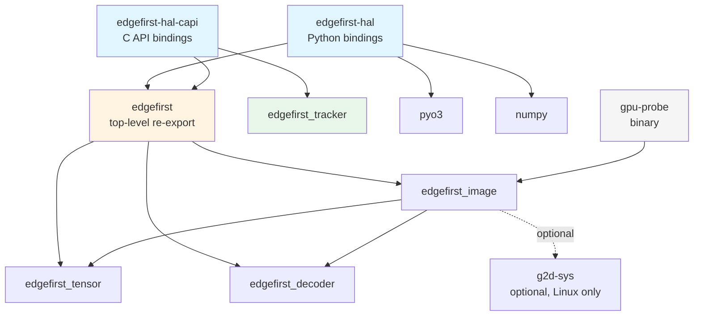
```mermaid
graph TD
    EF[edgefirst<br/>top-level re-export]
    Tensor[edgefirst_tensor]
    Image[edgefirst_image]
    Decoder[edgefirst_decoder]
    Tracker[edgefirst_tracker]
    G2D[g2d-sys<br/>optional, Linux only]

    EF --> Tensor
    EF --> Image
    EF --> Decoder
    Image --> Tensor
    Image --> Decoder
    Image -.optional.-> G2D

    Python[edgefirst-hal<br/>Python bindings]
    PyO3[pyo3]
    Numpy[numpy]

    Python --> EF
    Python --> PyO3
    Python --> Numpy

    CAPI[edgefirst-hal-capi<br/>C API bindings]
    CAPI --> EF
    CAPI --> Tracker

    GpuProbe[gpu-probe<br/>binary]
    GpuProbe --> Image

    style EF fill:#fff4e1
    style Python fill:#e1f5ff
    style CAPI fill:#e1f5ff
    style Tracker fill:#e8f5e9
    style GpuProbe fill:#f5f5f5
```

## Source Code Organization

### Repository Structure
```
hal/
├── .github/
│   └── workflows/          # CI/CD automation
│       ├── test.yml        # Rust + Python testing
│       ├── release.yml     # PyPI + crates.io publishing
│       └── nightly.yml     # Nightly builds
├── crates/
│   ├── hal/                # Top-level re-export crate (edgefirst)
│   ├── tensor/             # Zero-copy tensor abstraction
│   ├── image/              # Image processing HAL
│   │   └── src/
│   │       ├── lib.rs      # load_image, save_jpeg, ImageProcessor
│   │       ├── cpu/        # CPU format conversion, resize, masks
│   │       ├── g2d.rs      # NXP G2D hardware accelerator
│   │       ├── gl/         # EGL/OpenGL headless renderer
│   │       │   ├── mod.rs      # Public types, Int8InterpolationMode
│   │       │   ├── processor.rs # GPU rendering pipelines
│   │       │   ├── shaders.rs  # GLSL shader generators
│   │       │   ├── context.rs  # EGL context management
│   │       │   ├── threaded.rs # Thread-safe wrapper
│   │       │   ├── resources.rs # GL resource management
│   │       │   └── cache.rs    # Shader/texture caching
│   │       └── error.rs
│   ├── decoder/            # Model output decoding
│   │   └── src/
│   │       ├── lib.rs      # Public API
│   │       └── decoder/    # Core decode logic
│   │           ├── mod.rs      # Decoder struct, decode methods
│   │           ├── builder.rs  # DecoderBuilder, model type resolution
│   │           ├── configs.rs  # ModelType, DecoderVersion, Nms enums
│   │           ├── postprocess.rs # NMS, dequantization, box parsing
│   │           └── helpers.rs  # Shared utilities
│   ├── tracker/            # Object tracking (ByteTrack)
│   ├── capi/               # C API bindings (cbindgen, staticlib/cdylib)
│   ├── gpu-probe/          # GPU capability probing binary
│   ├── bench/              # Benchmark harness (avoids Criterion fork issues)
│   └── python/             # PyO3 Python bindings
├── tests/                  # Python integration tests
├── testdata/               # Test data (Git LFS)
├── README.md
├── ARCHITECTURE.md         # This document
├── CONTRIBUTING.md
├── SECURITY.md
├── CODE_OF_CONDUCT.md
├── CHANGELOG.md
├── LICENSE                 # Apache-2.0
└── NOTICE                  # Third-party attributions
```

### Crate Dependency Graph
```
python (edgefirst-hal) → edgefirst → tensor, image, decoder
capi → edgefirst → tensor, image, decoder, tracker
image → tensor, decoder (for DetectBox/ProtoData/Segmentation types), g2d-sys
decoder → (standalone — no internal crate deps)
tracker → (standalone — no internal crate deps)
```

### Notable File Sizes

Several modules are significantly larger than typical Rust modules:

| File / Module | Lines | Content |
|---------------|------:|---------|
| `image/src/gl/` (total) | ~8,600 | EGL context, GL processors, shaders, caching, tests |
| `image/src/gl/processor.rs` | ~4,600 | GPU rendering pipelines (convert, masks, atlas) |
| `decoder/src/decoder/` (total) | ~7,000 | Config parsing, decode logic, postprocessing, tests |
| `image/src/lib.rs` | ~5,500 | load_image, save_jpeg, ImageProcessor |
| `capi/src/decoder.rs` | ~3,200 | C API decoder bindings |

---

## Appendix A: Multi-Plane DMA-BUF Limitation

### Current State

The HAL's DMA-BUF integration assumes a **single file descriptor per buffer**
with all planes stored contiguously. This is baked into multiple layers:

| Layer | Assumption | Code Location |
|-------|-----------|---------------|
| `DmaTensor<T>` | Single `fd: OwnedFd` field | `crates/tensor/src/dma.rs:31` |
| `TensorTrait::from_fd()` | Takes one `OwnedFd` | `crates/tensor/src/dma.rs:88` |
| `hal_tensor_from_fd()` C API | Takes one `int fd` | `crates/capi/include/edgefirst/hal.h` |
| `TensorDyn` NV12 shape | `[H*3/2, W]` — contiguous Y+UV | `crates/tensor/src/lib.rs` |
| EGL NV12 import | Same fd for both planes, UV offset = `W*H` | `crates/image/src/opengl_headless.rs:4492–4501` |

This works correctly when the kernel allocates NV12 from a single CMA/system
DMA-heap buffer (e.g. `hal_tensor_new()`, `hal_image_processor_create_image()`).
The Y and UV planes are contiguous in physical memory and share one fd.

### The Problem: Multi-Planar Formats

Video hardware on NXP i.MX platforms frequently produces **multi-planar**
NV12 buffers where Y and UV reside in separate DMA-BUF allocations, each
with its own file descriptor:

| Source | V4L2 Format | Planes | Behavior |
|--------|-------------|--------|----------|
| VPU (Hantro/Amphion) via `v4l2h264dec` | `V4L2_PIX_FMT_NV12M` (NM12) | 2 fds | Y and UV in separate DMA-BUFs |
| NeoISP via `libcamerasrc` | `V4L2_PIX_FMT_NV12M` (NM12) | 2 fds | Y and UV in separate DMA-BUFs |
| MIPI-CSI direct capture | `V4L2_PIX_FMT_NV12` (NV12) | 1 fd | Contiguous — works today |

When GStreamer negotiates `video/x-raw(memory:DMABuf), format=DMA_DRM,
drm-format=NV12`, the upstream element may deliver buffers with 2 `GstMemory`
blocks (one per plane).

### Multi-Plane Support (Implemented)

The HAL supports multi-plane DMA-BUF NV12/NV16 via a two-tensor approach
rather than extending `DmaTensor` with multiple fds:

**C API**: `hal_import_image(proc, y_pd, uv_pd, width, height, format, dtype)`
takes separate Y and UV plane descriptors, wraps each into its own
`Tensor<u8>` via `from_fd()`, and combines them with `Tensor::from_planes()`.
Per-plane stride and offset can be set on each descriptor before import.

**Tensor crate**: `Tensor::from_planes(luma, chroma, PixelFormat::Nv12)` stores the
two tensors as separate planes inside the `Tensor`, preserving their
independent DMA-BUF allocations for zero-copy GPU import.

**OpenGL path**: `create_image_from_dma2()` uses per-plane fds in EGL
attributes (`DMA_BUF_PLANE0_FD → y_fd`, `DMA_BUF_PLANE1_FD → uv_fd`),
with per-plane stride and offset from `PlaneDescriptor` metadata.

| Scenario | Zero-Copy | Notes |
|----------|-----------|-------|
| Single-fd NV12 DMA-BUF | Yes | V4L2 single-planar capture, HAL-allocated buffers |
| Single-fd YUYV/RGB/RGBA DMA-BUF | Yes | Always single-plane |
| System memory input | N/A | Copied into HAL tensor regardless |
| Multi-fd NV12/NV16 DMA-BUF | Yes | Via `hal_import_image()` with two plane descriptors |

### GStreamer Integration (External)

The `edgefirstcameraadaptor` element detects multi-plane buffers
(`gst_buffer_n_memory() > 1`) and extracts per-plane fds via
`gst_dmabuf_memory_get_fd()` on each `GstMemory` block, passing them to
`hal_import_image()` via separate plane descriptors for zero-copy import.

### Tracking

This work was implemented under **EDGEAI-1107**.

## Appendix B: Delegate DMA-BUF Framework

### Purpose

The Delegate DMA-BUF Framework defines an ABI contract for querying DMA-BUF
tensor information from external TFLite delegates (e.g., NXP Neutron NPU,
VxDelegate). The HAL owns the type definitions; function implementations
live in delegate shared libraries.

The API is **query-only by design**: delegates own all DMA-BUF allocations
internally. Consumers query tensor metadata (fd, shape, dtype) and
synchronize caches — they never register, allocate, bind, or release
buffers through this API.

Each delegate ships a self-contained `hal_dmabuf.h` header with all type
definitions and function declarations. Consumers do **not** need the full
`edgefirst/hal.h` — they either include the delegate's header or load
symbols via `dlsym`.

### Zero-Copy Data Flow

```
Camera DMA-BUF
  → hal_plane_descriptor (wraps camera_fd, stride, offset)
  → hal_import_image(proc, camera_pd, NULL, width, height, format, dtype)
  → HAL Tensor with image attributes (camera source)

NPU input DMA-BUF (fd/shape from hal_dmabuf_get_tensor_info)
  → hal_plane_descriptor (wraps npu_input_fd, stride, offset)
  → hal_import_image(proc, npu_pd, NULL, model_width, model_height, format, dtype)
  → HAL Tensor with image attributes (NPU destination)

ImageProcessor::convert(camera_tensor, npu_tensor)
  → DMA→DMA convert (resize, colorspace, letterbox)

hal_dmabuf_sync_for_device(delegate, input_tensor_index)
  → flush CPU caches so NPU can read

NPU inference

hal_dmabuf_sync_for_cpu(delegate, output_tensor_index) [optional]
  → invalidate CPU caches so CPU sees NPU writes
```

Both camera and NPU input tensors are imported via `hal_import_image()` so
that `convert()` has the pixel format, dimensions, stride, and plane metadata
it requires. `hal_tensor_from_fd()` creates raw tensors without image
attributes; to use such tensors as a `convert()` source or destination you
must either import them as images (via `hal_import_image()`) or attach the
required image metadata (for example with `hal_tensor_set_format()`).

Output DMA-BUF access via `hal_dmabuf_get_tensor_info()` is optional and
depends on the use case: useful when feeding outputs to GPU (e.g., mask
rendering via OpenGL), but for CPU-side post-processing (YOLO decode, NMS)
it is simpler to read tensor data directly since the decode will memcpy
anyway.

### Type Definitions

**`hal_delegate_t`** — opaque handle for any delegate, defined as `void*`.
Implementations receive this as a parameter and cast it internally to their
concrete delegate type. The delegate lifetime is managed by the caller; the
HAL never creates or destroys delegates.

> **Important:** Exported function signatures **must** use `hal_delegate_t`
> (`void*`), not `TfLiteDelegate*` or any other concrete type. This ensures
> ABI compatibility across different delegate implementations.

**`hal_dmabuf_tensor_info`** — describes a single delegate tensor's DMA-BUF:

| Field   | Type                          | Description |
|---------|-------------------------------|-------------|
| `size`  | `size_t`                      | Buffer size in bytes (may exceed logical tensor size for padded buffers) |
| `offset`| `size_t`                      | Byte offset within the DMA-BUF (for sub-allocated buffers) |
| `shape` | `size_t[HAL_DMABUF_MAX_NDIM]` | Tensor dimensions (max 8) |
| `ndim`  | `size_t`                      | Number of valid entries in `shape` |
| `fd`    | `int`                         | DMA-BUF file descriptor (**borrowed** — do not close) |
| `dtype` | `hal_dtype`                   | Element data type |

Fields are ordered to eliminate padding on LP64 (`size_t` fields first,
then smaller 4-byte fields). Total struct size: 96 bytes on LP64.

All fields are **mandatory**. Implementations must populate `shape`, `ndim`,
and `dtype` in addition to `fd`, `offset`, and `size`. An implementation
that cannot determine the shape should set `ndim = 0`.

**`hal_camera_adaptor_format_info`** — describes a camera format adaptor:

| Field             | Type                       | Description |
|-------------------|----------------------------|-------------|
| `input_channels`  | `int`                      | Number of input channels (e.g., 4 for RGBA) |
| `output_channels` | `int`                      | Number of output channels (e.g., 3 for RGB) |
| `fourcc`          | `char[HAL_FOURCC_MAX_LEN]` | V4L2 FourCC string, NUL-terminated (ASCII, at most 4 bytes + NUL) |

### DMA-BUF Functions

These functions are **not implemented in the HAL**. They document the exact
ABI that delegate shared libraries must export and that consumers probe via
`dlsym`. All exported symbols must use
`__attribute__((visibility("default")))`.

```c
/* Get the delegate's internal handle.
 *
 * When TFLite creates a delegate via TfLiteExternalDelegateCreate(), it
 * wraps the real delegate in an opaque adapter. This function returns the
 * inner delegate pointer that the hal_dmabuf_* functions expect.
 *
 * Returns the inner delegate handle, or NULL if no delegate has been
 * created. */
hal_delegate_t hal_dmabuf_get_instance(void);

/* Query whether the delegate supports DMA-BUF tensor access.
 * Returns 1 if supported, 0 otherwise (including NULL delegate or error).
 * This function does not set errno. */
int hal_dmabuf_is_supported(hal_delegate_t delegate);

/* Get DMA-BUF tensor info for a given tensor index.
 * Returns 0 on success, -1 on error (sets errno).
 *
 * info_size enables forward-compatible versioning: pass
 * sizeof(hal_dmabuf_tensor_info). Implementations must:
 * 1. memset(info, 0, info_size) before populating
 * 2. Only write fields whose offsetof + sizeof fits within info_size
 *
 * Errno: EINVAL (NULL info, negative tensor_index, info_size too small),
 *        ENOTSUP (DMA-BUF not supported),
 *        ERANGE (tensor_index out of range),
 *        EIO (DMA-BUF ioctl or internal failure) */
int hal_dmabuf_get_tensor_info(hal_delegate_t delegate,
                               int tensor_index,
                               hal_dmabuf_tensor_info *info,
                               size_t info_size);

/* Flush CPU caches → device can read.
 * Call after writing to an input tensor (e.g., via
 * ImageProcessor::convert()), before invoking NPU inference.
 * Returns 0 on success, -1 on error (sets errno).
 * Errno: EINVAL (NULL delegate, negative tensor_index),
 *        ERANGE (tensor_index out of range),
 *        EIO (DMA-BUF ioctl failure) */
int hal_dmabuf_sync_for_device(hal_delegate_t delegate, int tensor_index);

/* Invalidate CPU caches → CPU sees device writes.
 * Call after NPU inference completes, before reading output tensor data.
 * Returns 0 on success, -1 on error (sets errno).
 * Errno: EINVAL (NULL delegate, negative tensor_index),
 *        ERANGE (tensor_index out of range),
 *        EIO (DMA-BUF ioctl failure) */
int hal_dmabuf_sync_for_cpu(hal_delegate_t delegate, int tensor_index);
```

`tensor_index` must be non-negative; negative values return -1 with
`errno` set to `EINVAL`.

### Camera Adaptor Functions

Some delegates support NPU-accelerated format conversion (e.g., RGBA→RGB
channel slicing, uint8→int8 quantization) that runs as part of the
inference graph. These functions allow consumers to query format support
without vendor-specific symbols.

Format conversion is configured **before** graph compilation via delegate
options (e.g., `DelegateOptions::option("camera_adaptor", "rgba")`), not
through this query API.

```c
/* Check if the delegate supports a camera format adaptor.
 * Returns 1 if the given format is supported, 0 otherwise.
 * This function does not set errno.
 *
 * Delegates without camera adaptor support always return 0. */
int hal_camera_adaptor_is_supported(hal_delegate_t delegate,
                                    const char *format);

/* Query camera adaptor format information.
 * Returns 0 on success, -1 on error (sets errno).
 *
 * info_size enables forward-compatible versioning (same pattern as
 * hal_dmabuf_get_tensor_info).
 *
 * Errno: EINVAL (NULL format or info),
 *        ENOTSUP (format not supported by this delegate) */
int hal_camera_adaptor_get_format_info(hal_delegate_t delegate,
                                       const char *format,
                                       hal_camera_adaptor_format_info *info,
                                       size_t info_size);
```

### errno Requirements

Implementations **must** set `errno` before returning -1. The following
table specifies which errno values apply to each function:

| Function | EINVAL | ENOTSUP | ERANGE | EIO |
|----------|--------|---------|--------|-----|
| `hal_dmabuf_get_tensor_info` | NULL info, negative index, info_size too small | DMA-BUF not supported | tensor_index out of range | ioctl or internal failure |
| `hal_dmabuf_sync_for_device` | NULL delegate, negative index | — | tensor_index out of range | ioctl failure |
| `hal_dmabuf_sync_for_cpu` | NULL delegate, negative index | — | tensor_index out of range | ioctl failure |
| `hal_camera_adaptor_get_format_info` | NULL format or info | format not supported | — | — |

Functions that return 1/0 (`hal_dmabuf_is_supported`,
`hal_camera_adaptor_is_supported`) do **not** set errno.

### Integration Pattern

1. The delegate shared library (e.g., `libvx_delegate.so`,
   `libneutron_delegate.so`) implements the functions above and exports
   them as public C symbols with default visibility.
2. Consumers probe for the symbols at runtime via `dlsym` on the delegate's
   shared library.
3. Consumers call `hal_dmabuf_get_instance()` to obtain the inner delegate
   handle (needed when the delegate was created via
   `TfLiteExternalDelegateCreate()`).
4. If `hal_dmabuf_is_supported()` returns 1, consumers call
   `hal_dmabuf_get_tensor_info()` to obtain the DMA-BUF fd and shape for
   each tensor of interest.
5. The fd and metadata are passed to `hal_import_image()` to create a
   HAL tensor with full image attributes for use with
   `ImageProcessor::convert()`.

### Lifecycle and Ownership

- The **delegate** owns all DMA-BUF allocations. File descriptors returned
  by `hal_dmabuf_get_tensor_info()` are borrowed — callers must not close
  them.
- Sync functions (`sync_for_device`, `sync_for_cpu`) wrap
  `DMA_BUF_IOCTL_SYNC` and bracket hardware access. They must be called
  at the correct points in the pipeline (see data flow above).
- The delegate instance itself is created and destroyed by the caller
  (e.g., via the TFLite C API). The HAL never manages delegate lifetime.

### Symbol Visibility

All exported `hal_dmabuf_*` and `hal_camera_adaptor_*` functions must be
annotated with `__attribute__((visibility("default")))` to ensure they
remain visible even when the delegate is compiled with
`-fvisibility=hidden`.

### Thread Safety

Delegate functions are not required to be thread-safe for concurrent calls
on the same delegate instance. Callers must serialize access per delegate.
Different delegate instances may be used concurrently from different threads.

### Tracking

- **Epic:** [EDGEAI-1185](https://au-zone.atlassian.net/browse/EDGEAI-1185) — NXP Neutron DMABUF Zero-Copy Support
- **Type definitions:** [EDGEAI-1189](https://au-zone.atlassian.net/browse/EDGEAI-1189) — EdgeFirst HAL: formalize hal_dmabuf_* interface
- **Implementation:** [EDGEAI-1190](https://au-zone.atlassian.net/browse/EDGEAI-1190) — edgefirst-tflite: update probing for hal_dmabuf_* symbols

## Appendix C: DMA-BUF Identity and Tensor Caching

### The Problem: fd Numbers Are Not Stable Buffer Identifiers

A DMA-BUF is exported from the kernel as a file descriptor. Many callers
assume that the same fd number means the same buffer, and use fd as the key
for caching imported tensors (`hal_import_image`, EGL image creation, etc.).
This assumption is **wrong** and leads to cache misses or incorrect cache
hits.

The lifecycle of a DMA-BUF fd in a typical GStreamer pipeline:

1. A V4L2 decoder or libcamera source creates a buffer pool at startup,
   exporting each DMA-BUF once (`VIDIOC_EXPBUF`). The fd numbers are stable
   as long as the buffer pool exists.
2. A GStreamer `GstBuffer` wraps the DMA-BUF fd in a `GstMemory` object.
3. When the downstream element finishes with the buffer and unrefs it, the
   `GstMemory` refcount may drop to zero, **closing the fd**.
4. The upstream driver re-exports the buffer for the next frame, potentially
   receiving a **different fd number** even though the underlying physical
   buffer is the same.
5. Any cache keyed by fd number will see a miss even though the buffer
   content, EGL image, and GPU mapping are all identical to a previous frame.

This fd recycling happens in practice with `v4l2h264dec`, `v4l2src`, and
`libcamerasrc`. Pool sizes are bounded (typically 4–16 buffers), so fd
numbers cycle through a small set, but there is no guarantee that a
particular fd number always refers to the same physical buffer.

### The Solution: DMA-BUF Inode as Stable Identity

The Linux kernel identifies each `dma_buf` object with a unique inode in the
anonymous inode filesystem. The inode is assigned when the DMA-BUF is
created and remains constant for its lifetime, regardless of how many
times it is exported or what fd numbers are assigned to it.

Obtaining the inode:

```c
struct stat st;
fstat(fd, &st);
ino_t inode = st.st_ino;
```

This is a single cheap syscall on cache miss. For a 16-buffer pool, `fstat`
is called exactly 16 times over the lifetime of the pipeline (once per
unique buffer at first import). All subsequent frames are cache hits.

Cache key design for multi-plane buffers:

```c
typedef struct {
    ino_t inode;   /* identifies the dma_buf kernel object */
    gsize offset;  /* byte offset within the DMA-BUF (NV12 planar) */
} DmaBufCacheKey;
```

The `offset` is needed because a single DMA-BUF may contain multiple planes
at different byte offsets (e.g., NV12 luma at offset 0, chroma at
`stride * height`). The (inode, offset) pair uniquely identifies a plane.

### Cache Warm-Up and Steady State

Pool behaviour in practice:

| Phase          | Frames      | EGL import | Preprocessing time (i.MX 95) |
|----------------|-------------|------------|------------------------------|
| Warm-up        | 1 – N       | Yes        | ~5–6 ms (import + GL)        |
| Steady state   | N+1 onwards | No         | ~5–6 ms (GL only)            |

Where N is the buffer pool depth (typically 9 for `v4l2h264dec` at 1080p
with the NXP Amphion Wave5 VPU).

The preprocessing time in steady state is dominated by the GL computation
(resize + letterbox + colorspace + quantization on Mali-G310: ~5–6 ms at
1920×1080 → 640×640 INT8), not the EGL import. However, the EGL import
overhead does matter in low-latency or short-clip scenarios where the
pipeline never fully warms up.

### EGL Image Cache Inside HAL

`hal_import_image()` internally maintains an EGL image cache keyed by DMA-BUF
fd. When called with the same fd, it returns the cached EGL image without
re-creating it.

However, this HAL-internal cache **also suffers from fd recycling**: if the
calling code frees the `hal_tensor*` and later calls `hal_import_image` with
a different fd that refers to the same physical buffer, HAL creates a new EGL
image — incurring the full import cost again and leaving a "swept dead entry"
in the EGL cache log.

The fix is at the **calling layer** (e.g., `edgefirstcameraadaptor`): maintain
a cache of `hal_tensor*` objects keyed by (inode, offset), and never free
them between frames. This ensures that `hal_import_image` is called exactly
once per unique DMA-BUF over the lifetime of the pipeline.

### Implementation in edgefirstcameraadaptor

`edgefirstcameraadaptor` (EdgeFirst GStreamer plug-in) implements the
inode-based cache as follows:

```c
typedef struct { ino_t inode; gsize offset; } InputCacheKey;

/* On each input frame: */
int fd = gst_dmabuf_memory_get_fd(mem);
gsize offset = 0;
gst_memory_get_sizes(mem, &offset, NULL);

struct stat st;
fstat(fd, &st);
InputCacheKey key = { .inode = st.st_ino, .offset = offset };

hal_tensor *tensor = g_hash_table_lookup(input_cache, &key);
if (!tensor) {
    /* First time seeing this buffer — import and cache */
    tensor = hal_import_image(processor, pd, chroma, ...);
    g_hash_table_insert(input_cache, g_memdup2(&key, sizeof key), tensor);
}
/* tensor is valid for the lifetime of the pipeline */
```

The cache is invalidated on `set_caps` (resolution or format change) and
`stop` (pipeline teardown). It is never invalidated per-frame.

---

## Contributing

See [CONTRIBUTING.md](CONTRIBUTING.md) for:
- Development environment setup
- Build instructions
- Testing guidelines
- Code style standards
- Pull request process

## Support

For questions, issues, or contributions:
- **Documentation**: https://doc.edgefirst.ai
- **GitHub Issues**: https://github.com/EdgeFirstAI/hal/issues
- **Email**: support@au-zone.com
