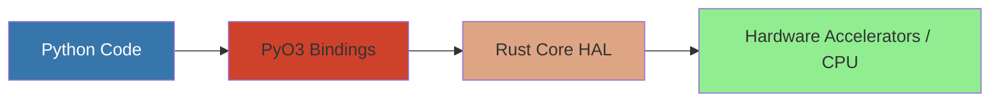

# EdgeFirst Hardware Abstraction Layer - Architecture

**Version:** 2.1
**Last Updated:** February 17, 2026
**Status:** Production
**Audience:** Developers contributing to EdgeFirst HAL or integrating it into applications

---

## Overview

The EdgeFirst Hardware Abstraction Layer (HAL) is a Rust-based system that provides hardware-accelerated abstractions for computer vision and machine learning tasks on embedded Linux platforms. The HAL consists of multiple specialized crates that work together to provide high-performance image processing, tensor operations, model inference decoding, and object tracking.

## System Architecture


## Core Components

### 1. Tensor HAL (`edgefirst_tensor`)

**Purpose**: Provides zero-copy memory buffers optimized for hardware accelerators.

**Architecture**:


**Key Features**:
- Generic over numeric types (u8, i8, u16, i16, u32, i32, u64, i64, f32, f64)
- Automatic memory type selection with fallback chain: DMA → Shared Memory → Heap
- Memory mapping with `TensorMap<T>` for safe access
- File descriptor sharing for zero-copy IPC
- Cross-platform support (Linux optimized, macOS/Windows via heap memory)

**Memory Type Selection Logic**:


### 2. Image HAL (`edgefirst_image`)

**Purpose**: Hardware-accelerated image format conversion and resizing.

**Architecture**:


**Supported Operations**:
- Format conversion (YUYV, NV12, RGB, RGBA, GREY, Planar RGB)
- Resize with various interpolation methods
- Rotation (0°, 90°, 180°, 270°)
- Flip (horizontal, vertical)
- Crop and region-of-interest
- Normalization (signed, unsigned, raw)

**Planar RGB Format**:
Planar RGB (FourCC: 8BPS) stores color channels in separate planes rather than interleaved. This format is particularly useful for:
- Neural network preprocessing where planar layout is required
- Hardware accelerators that prefer planar data
- Efficient SIMD operations on individual color channels
- GPU texture operations via OpenGL with swizzled grayscale textures

**TensorImage Flow**:


### 3. Decoder HAL (`edgefirst_decoder`)

**Purpose**: Post-processing for object detection and segmentation model outputs.

**Supported Decoders**:
- **YOLO** (YOLOv5, YOLOv8, YOLOv11)
  - Object detection
  - Instance segmentation
  - Split output format support
  - Mixed data type support (different types per input tensor)
- **ModelPack** (Au-Zone proprietary format)
  - Detection with anchor-based decoding

**Architecture**:


**Detection Pipeline**:


### 4. Tracker HAL (`edgefirst_tracker`)

**Purpose**: Multi-object tracking across video frames.

**Implementation**: ByteTrack algorithm with Kalman filtering

**Architecture**:


**Tracking Flow**:


### 5. Python Bindings (`edgefirst-hal`)

**Purpose**: Expose HAL functionality to Python via PyO3.

**Exposed Classes**:
- `PyTensor`: Generic tensor with numpy buffer protocol
- `PyTensorImage`: Image container with format metadata
- `PyImageProcessor`: Image processing operations
- `PyDecoder`: Model output decoding
- `FourCC`, `Normalization`, `PyRect`, `PyRotation`, `PyFlip`: Configuration enums

**Python Integration**:


### 6. G2D FFI (`g2d-sys`)

**Purpose**: Foreign Function Interface to NXP i.MX G2D library.

**Architecture**:
- Raw FFI bindings via bindgen
- Safe Rust wrapper types
- IOCTL interface for DMA buffer operations
- Version detection and capability queries

## Common API Usage Patterns

### Pattern 1: Basic Image Conversion

```rust
use edgefirst_hal::image::{TensorImage, ImageProcessor, RGBA, RGB};
use edgefirst_hal::tensor::TensorMemory;

// Load image from JPEG
let input = TensorImage::load("testdata/zidane.jpg", Some(RGB), None)?;

// Create converter (auto-selects G2D or CPU)
let mut converter = ImageProcessor::new()?;

// Create output buffer
let mut output = TensorImage::new(640, 640, RGB, Some(TensorMemory::Dma))?;

// Convert and resize
converter.convert(&input, &mut output, Default::default())?;
```

### Pattern 2: Detection Decoding

```rust
use edgefirst_hal::decoder::Decoder;
use std::collections::HashMap;

// Build decoder from configuration dictionary/JSON
let config: HashMap<String, serde_json::Value> = 
    serde_json::from_str(&config_json)?;

let decoder = Decoder::new(config, 0.5, 0.45)?;  // score_thresh, iou_thresh

// Decode model outputs (supports mixed types per tensor)
let outputs = vec![boxes_tensor, scores_tensor];
let (bboxes, scores, classes) = decoder.decode_detection(&outputs)?;
```

**Python Example**:
```python
import edgefirst_hal
import numpy as np

# Create decoder from config dict or YAML
decoder = edgefirst_hal.Decoder(config_dict, 0.5, 0.45)

# Decode outputs (automatically handles quantization)
boxes, scores, classes = decoder.decode([output0, output1])
```

### Pattern 3: Multi-Frame Tracking

```rust
use edgefirst_hal::tracker::{ByteTrack, Tracker, DetectionBox};

let mut tracker = ByteTrack::default();

for frame in video_frames {
    let detections = run_detection(frame)?;
    let track_infos = tracker.update(&detections, frame.timestamp);
    
    for track_info in track_infos {
        println!("Object {}: {:?}", track_info.uuid, track_info.tracked_location);
    }
}
```

### Pattern 4: Zero-Copy Tensor Sharing

```rust
use edgefirst_hal::tensor::{Tensor, TensorTrait};

// Create tensor in process A
let tensor = Tensor::<u8>::new(&[1920, 1080, 3], None, Some("frame1"))?;
let fd = tensor.clone_fd()?;

// Send fd to process B (via Unix domain socket, etc.)
// ...

// Process B recreates tensor from fd
let shared_tensor = Tensor::<u8>::from_fd(fd, &[1920, 1080, 3], None)?;
```

### Pattern 5: Python API Usage

```python
import edgefirst_hal as ef
import numpy as np

# Load image from file
tensor_img = ef.TensorImage.load("testdata/zidane.jpg", ef.FourCC.RGB)

# Create converter
converter = ef.ImageProcessor()

# Create output image
output = ef.TensorImage(640, 640)

# Resize with hardware acceleration
converter.convert(tensor_img, output)

# Convert to numpy for processing
output_array = np.zeros((640, 640, 3), dtype=np.uint8)
output.normalize_to_numpy(output_array)
```

## Design Patterns

### 1. Trait-Based Polymorphism

The HAL uses Rust traits extensively to provide polymorphic behavior:
- `TensorTrait<T>`: Common interface for all tensor types
- `ImageProcessorTrait`: Common interface for all image converters
- `DetectionBox`: Trait for objects with bounding boxes

### 2. Enum Dispatch

Uses `enum_dispatch` crate for zero-cost polymorphism without dynamic dispatch overhead.

### 3. Builder Pattern

Complex objects use the builder pattern (e.g., `DecoderBuilder`) for flexible construction.

### 4. Zero-Copy Operations

Extensive use of:
- Memory-mapped file descriptors
- Slice views into tensors
- ndarray views for array operations

### 5. Hardware Fallback Chain

Operations try hardware accelerators first, falling back to CPU implementations gracefully.

### 6. Type-Safe Foreign Interfaces

Raw FFI bindings are wrapped in safe Rust types that enforce correct usage at compile time.

### 7. Python Wrapper Naming Convention

Python wrapper types use a `Py` prefix (e.g., `PyTensor`, `PyTensorImage`) to clearly distinguish them from their Rust counterparts (`Tensor`, `TensorImage`). This convention makes it explicit which types are Python-facing and which are internal Rust types.

## EGL/GL Resource Cleanup at Process Shutdown

### Problem

The OpenGL headless renderer (`crates/image/src/opengl_headless.rs`) uses EGL and
OpenGL ES via dynamically loaded shared libraries (`libEGL.so.1`, `libGLESv2.so`).
When the process exits — particularly from a Python interpreter running PyO3
extensions — EGL resource cleanup can crash with heap corruption, segfaults, or
panics. This is a well-documented, industry-wide problem with no clean solution.

The crash occurs due to a fundamental conflict between four systems during
process shutdown:

1. **Python finalization order is non-deterministic.** During `Py_FinalizeEx()`,
   Python destroys modules and objects in random order. A PyO3 `#[pyclass]`
   wrapping `GlContext` may have its Rust `Drop` invoked after dependent state
   has already been torn down.

2. **Linux `atexit` handler ordering is unreliable.** The glibc `__cxa_finalize`
   mechanism interacts with `dlclose` in ways that produce non-deterministic
   ordering between atexit handlers registered by different shared libraries.
   A known glibc bug ([glibc #21032](https://sourceware.org/bugzilla/show_bug.cgi?id=21032))
   prevents proper cleanup of TLS destructors from unloaded libraries.

3. **Mesa's `_eglAtExit` use-after-free.** Mesa registers an atexit handler
   that frees per-thread EGL state (`_EGLThreadInfo`). If our `Drop` calls
   `eglReleaseThread()` after this handler has already run, it dereferences
   freed memory ([Ubuntu Bug #1946621](https://bugs.launchpad.net/ubuntu/+source/mesa/+bug/1946621)).

4. **Vendor EGL driver bugs.** NXP Vivante drivers cause a double-free in
   `gcoOS_FreeMemo` when both `eglDestroyContext` and `eglTerminate` are called.
   Similar bugs exist in Qualcomm Adreno and NVIDIA drivers.

### Solution

The implementation uses a defense-in-depth strategy with four layers, each
addressing a different failure mode:

```
┌─────────────────────────────────────────────────────────┐
│ Layer 1: Box::leak — EGL library handle                 │
│   Prevents dlclose from unmapping shared library code   │
├─────────────────────────────────────────────────────────┤
│ Layer 2: ManuallyDrop<Rc<Egl>> — EGL instance           │
│   Prevents khronos-egl Drop from calling                │
│   eglReleaseThread() into freed Mesa state              │
├─────────────────────────────────────────────────────────┤
│ Layer 3: catch_unwind — EGL cleanup calls               │
│   Catches panics from eglDestroyContext/eglMakeCurrent  │
│   if function pointers are invalidated                  │
├─────────────────────────────────────────────────────────┤
│ Layer 4: Omit eglTerminate                              │
│   Avoids double-free on Vivante/ARM drivers             │
└─────────────────────────────────────────────────────────┘
```

The `GlContext::drop` implementation performs explicit EGL resource cleanup
(destroy context, destroy surface) inside `catch_unwind`, then intentionally
skips dropping the `Rc<Egl>` wrapper. The EGL library handle is leaked via
`Box::leak` at load time so it is never `dlclose`'d. The OS reclaims all
resources when the process exits.

### Industry Precedent

This approach is consistent with how other major graphics projects handle the
same problem:

- **Chromium/ANGLE** skips full EGL teardown on GPU process exit, treating
  cleanup as more dangerous than no cleanup during shutdown.

- **wgpu** (the Rust WebGPU implementation used by Firefox) wraps its
  `glow::Context` in `ManuallyDrop` and loads EGL with `RTLD_NODELETE` to
  prevent library unloading. The `khronos-egl` crate itself adopted
  `RTLD_NOW | RTLD_NODELETE` on Linux after
  [khronos-egl #14](https://github.com/timothee-haudebourg/khronos-egl/issues/14),
  referencing the same glibc root cause.

- **Smithay** (Wayland compositor toolkit) supports skipping `eglTerminate`
  via a feature flag for the same class of driver bugs.

### Limitations

`catch_unwind` catches Rust panics but cannot catch fatal signals (`SIGABRT`,
`SIGSEGV`, `SIGBUS`) that originate from heap corruption inside the C driver.
The `Box::leak` and `ManuallyDrop` layers mitigate this by avoiding the code
paths that trigger corruption in the first place.

### References

- Mesa atexit use-after-free: [Ubuntu Bug #1946621](https://bugs.launchpad.net/ubuntu/+source/mesa/+bug/1946621)
- glibc TLS destructor bug: [glibc #21032](https://sourceware.org/bugzilla/show_bug.cgi?id=21032)
- khronos-egl RTLD_NODELETE fix: [khronos-egl #14](https://github.com/timothee-haudebourg/khronos-egl/issues/14)
- wgpu SIGSEGV on library unload: [wgpu #246](https://github.com/gfx-rs/wgpu/issues/246)
- PyO3 Drop after finalization: [PyO3 #4632](https://github.com/PyO3/pyo3/issues/4632)
- Python finalization order: [CPython docs — Py_FinalizeEx](https://docs.python.org/3/c-api/init.html)

## Performance Considerations

### Memory Allocation Strategy

The choice of memory type significantly impacts performance depending on the workload:

1. **Heap Memory** (`MemTensor<T>`): Fastest for pure CPU algorithms (image resizing, filtering, format conversion). Standard heap allocation has minimal overhead and is optimized by the OS. Recommended when no hardware acceleration is required.

2. **DMA Memory** (`DmaTensor<T>`): Introduces CPU-level overhead for allocation and memory mapping, but provides substantial benefits when interfacing with hardware accelerators:
   - Zero-copy access from G2D (NXP i.MX graphics processor)
   - Zero-copy access from OpenGL/GPU
   - Zero-copy access from V4L2 video capture and codec engines
   - Hardware DMA operations benefit from DMA-capable memory alignment and page locking
   - Best for workloads that combine CPU processing with hardware acceleration

3. **Shared Memory** (`ShmTensor<T>`): Slowest option with CPU overhead from POSIX shared memory operations. Does not support hardware DMA operations. Use only for cross-process buffer sharing when dma-buf is unavailable due to insufficient permissions, non-Linux platforms, or when persistent memory that survives process termination is required.

**Memory Selection Guidance**:
- Pure CPU workloads (algorithms only): Use `MemTensor` (Heap)
- Hardware-accelerated operations (G2D, OpenGL, V4L2, codec): Use `DmaTensor`
- Cross-process buffer sharing: Use `ShmTensor` (when dma memory cannot be used)

### Image Processing Strategy

The HAL supports multiple image processing backends that are selected automatically based on hardware availability:
- **G2D**: NXP i.MX graphics processor acceleration
- **OpenGL**: GPU-accelerated image processing
- **CPU**: Fallback using vectorized operations and parallelization with Rayon

### Decoder Optimization

Decoder implementations use:
- Quantized integer math where applicable
- Vectorized operations via ndarray
- Parallel processing with Rayon
- Early termination in NMS loops

## Thread Safety

All major types implement `Send + Sync`:
- `Tensor<T>`: Safe to share across threads
- `TensorImage`: Thread-safe
- `ImageProcessor`: Thread-local (create per thread)
- `Decoder`: Thread-safe for read operations

## Error Handling

Consistent error handling throughout:
- Custom `Result<T, Error>` types per crate following the standard Rust pattern
- Each crate defines its own `Error` enum (e.g., `tensor::Error`, `image::Error`, `decoder::Error`)
- Errors are enums with context
- Conversion to PyErr for Python bindings
- All public APIs return `Result<T, Error>` for fallible operations

## Platform Support

| Feature | Linux (i.MX) | Linux (Generic) | macOS | Windows |
|---------|--------------|-----------------|-------|---------|
| DMA Tensors | ✅ | ✅ | ❌ | ❌ |
| Shared Memory Tensors | ✅ | ✅ | ✅ | ✅ |
| Heap Tensors | ✅ | ✅ | ✅ | ✅ |
| G2D Acceleration | ✅ | ❌ | ❌ | ❌ |
| OpenGL Acceleration | ✅ (optional) | ✅ (optional) | ❌ | ❌ |
| CPU Fallback | ✅ | ✅ | ✅ | ✅ |

## Dependencies

### Key External Dependencies

- **PyO3**: Python bindings
- **ndarray**: N-dimensional arrays
- **rayon**: Data parallelism
- **fast_image_resize**: CPU image operations
- **zune-jpeg/zune-png**: Image decoding
- **dma-heap**: Linux DMA allocation
- **nix**: Unix system calls
- **four-char-code**: FourCC format codes

### Internal Dependency Graph


## Source Code Organization

### Repository Structure
```
hal/
├── .github/
│   └── workflows/          # CI/CD automation
│       ├── test.yml        # Rust + Python testing
│       ├── release.yml     # PyPI publishing
│       └── nightly.yml     # Nightly builds
├── crates/
│   ├── edgefirst/          # Top-level re-export crate
│   ├── tensor/             # Zero-copy tensor abstraction
│   ├── image/              # Image processing HAL
│   ├── decoder/            # Model output decoding
│   ├── tracker/            # Object tracking
│   ├── g2d-sys/            # NXP G2D FFI
│   └── python/             # PyO3 Python bindings
├── tests/                  # Python integration tests
├── testdata/               # Test data (Git LFS)
├── README.md               # Project overview
├── ARCHITECTURE.md         # This document
├── CONTRIBUTING.md         # Contribution guidelines
├── SECURITY.md             # Security policy
├── CODE_OF_CONDUCT.md      # Community standards
├── CHANGELOG.md            # Release history
├── LICENSE                 # Apache-2.0 license
└── NOTICE                  # Third-party attributions
```

### Crate Dependency Graph
```
python (edgefirst-hal) → edgefirst → tensor, image, decoder, tracker
image → tensor, g2d-sys
decoder → (standalone)
tracker → (standalone)
```

---

## Contributing

See [CONTRIBUTING.md](CONTRIBUTING.md) for:
- Development environment setup
- Build instructions
- Testing guidelines
- Code style standards
- Pull request process

## Support

For questions, issues, or contributions:
- **Documentation**: https://doc.edgefirst.ai
- **GitHub Issues**: https://github.com/EdgeFirstAI/hal/issues
- **Email**: support@au-zone.com
