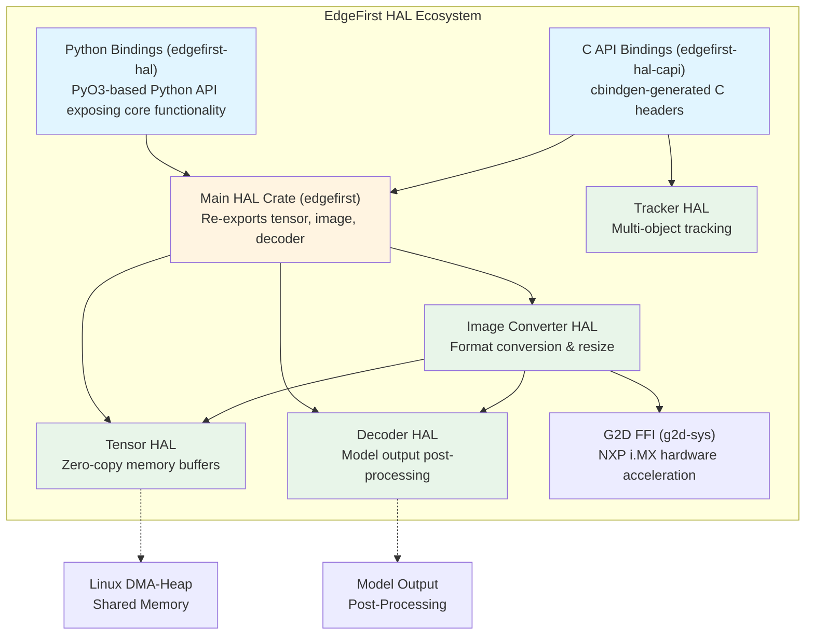
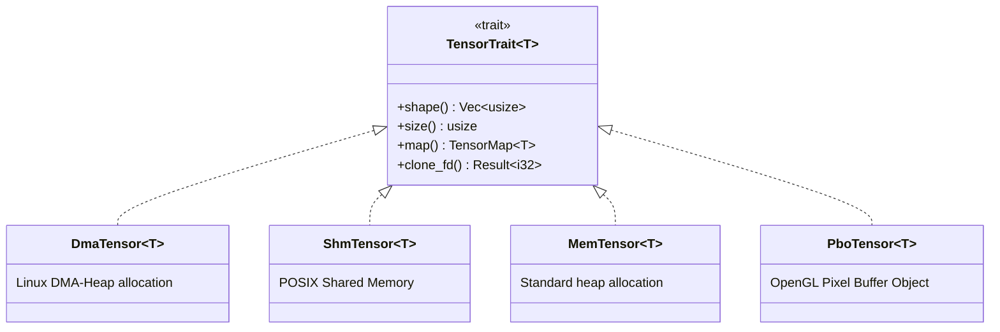
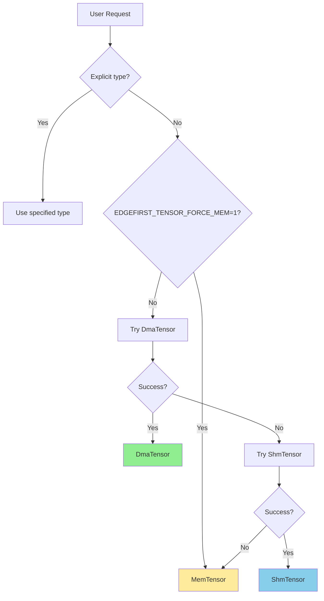
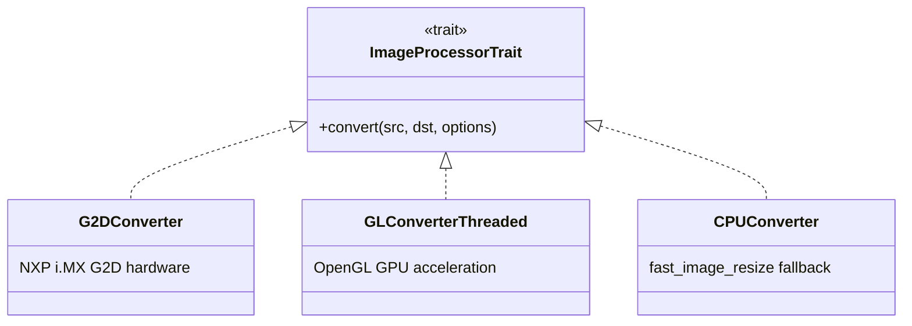
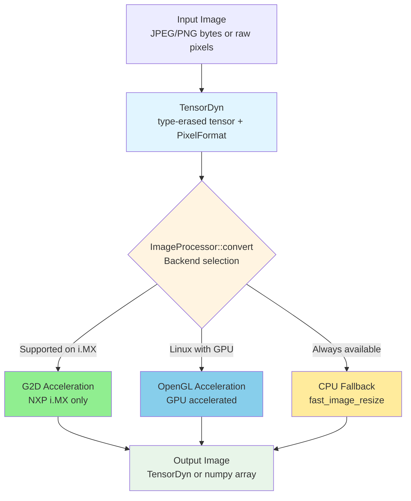
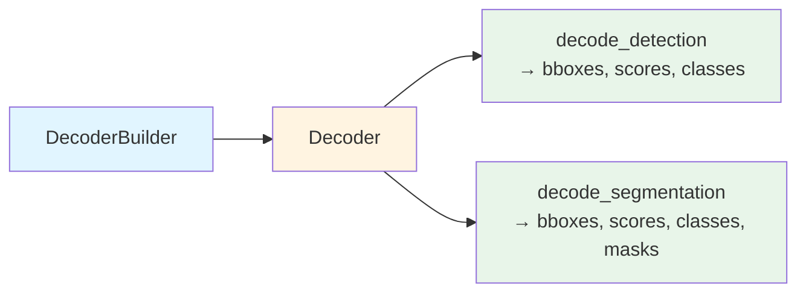
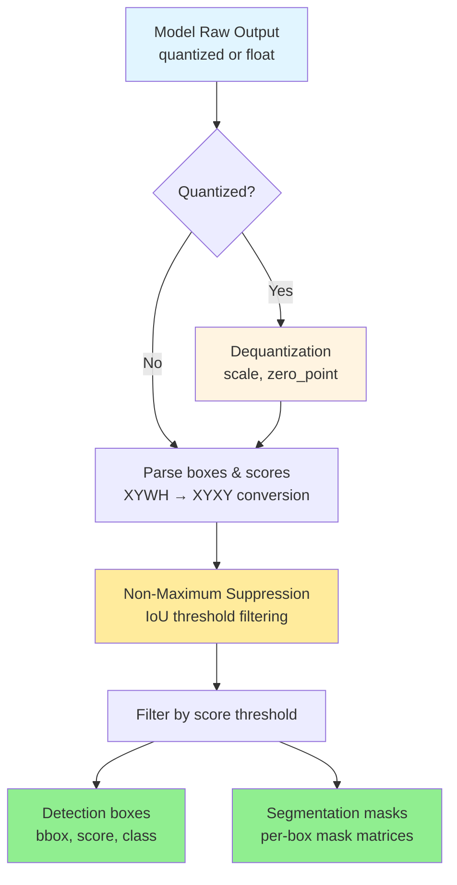
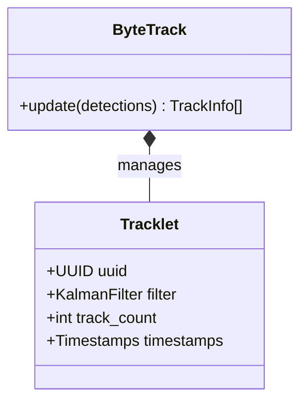
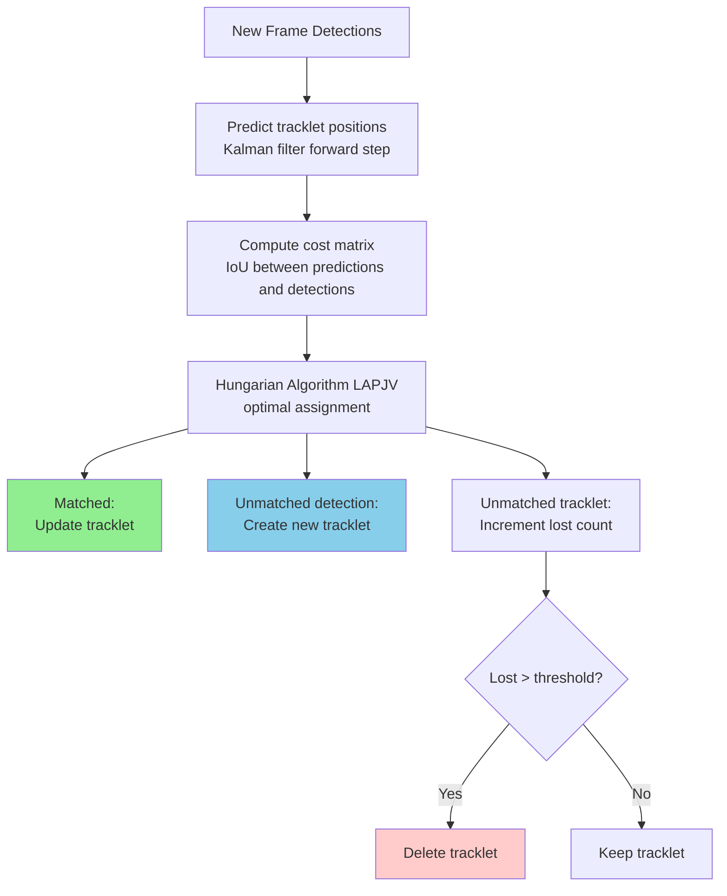
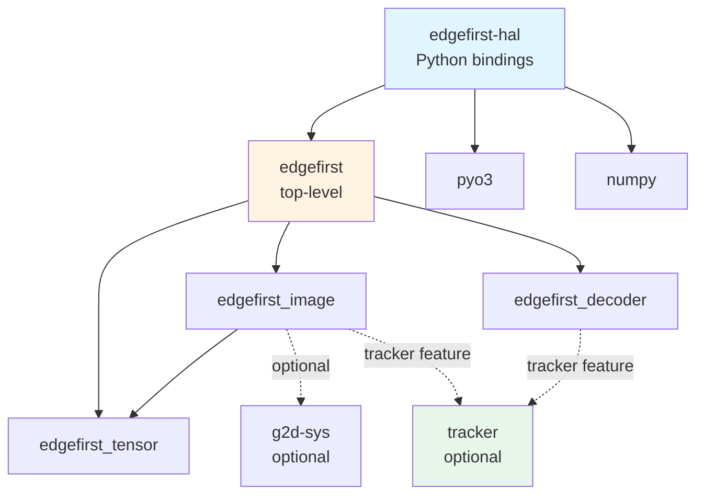

# EdgeFirst Hardware Abstraction Layer

[](https://github.com/EdgeFirstAI/hal/actions)
[](https://opensource.org/licenses/Apache-2.0)
[](https://crates.io/crates/edgefirst-hal)
[](https://pypi.org/project/edgefirst-hal/)

The EdgeFirst Hardware Abstraction Layer (HAL) is a Rust-based system that provides hardware-accelerated abstractions for computer vision and machine learning tasks on embedded Linux platforms. The HAL consists of multiple specialized crates that work together to provide high-performance image processing, tensor operations, model inference decoding, and object tracking.

## Features

- ✨ **Zero-Copy Memory Management** - DMA-heap optimized tensors with automatic fallback
- 🚀 **Hardware-Accelerated Image Processing** - G2D, OpenGL, and optimized CPU paths
- 🎯 **YOLO Decoder** - YOLOv5/v8/v11/v26 detection and segmentation support (including end-to-end models)
- 🔌 **Python Bindings** - PyO3-based API with numpy integration
- ⚡ **Multi-Object Tracking** - ByteTrack algorithm with Kalman filtering
- 🔧 **Cross-Platform** - Linux (i.MX optimized), macOS, Windows support
- 📊 **Mixed Precision** - Support for quantized and float models
- 🏭 **Production Ready** - The EdgeFirst suite of components for production AI deployments at the edge.
- 🖥️ **Hardware Optimized** - Accelerated on NXP i.MX platforms with NPU/GPU support

## Quick Start

### Installation

#### Python
```bash
pip install edgefirst-hal
```

#### Rust
```toml
[dependencies]
edgefirst-hal = "0.18"
```

### Basic Usage

#### Python
```python
import edgefirst_hal as ef

# Load and process image
img = ef.Tensor.load("image.jpg", ef.PixelFormat.Rgb)
converter = ef.ImageProcessor()
output = converter.create_image(640, 640, ef.PixelFormat.Rgb)
converter.convert(img, output)

# Decode YOLO outputs (outputs are ef.Tensor objects, not np.ndarray)
decoder = ef.Decoder(config, 0.5, 0.45)
boxes, scores, classes, masks = decoder.decode([output0, output1])

# Draw segmentation masks directly onto the destination image
result = converter.create_image(640, 640, ef.PixelFormat.Rgb)
converter.draw_masks(decoder, [output0, output1], result)
```

#### Rust
```rust
use edgefirst_image::{load_image, ImageProcessor, ImageProcessorTrait, Rotation, Flip, Crop};
use edgefirst_tensor::{PixelFormat, DType, TensorDyn};

// Load and process image
let bytes = std::fs::read("image.jpg")?;
let input = load_image(&bytes, Some(PixelFormat::Rgb), None)?;
let mut converter = ImageProcessor::new()?;
let mut output = converter.create_image(640, 640, PixelFormat::Rgb, DType::U8, None)?;
converter.convert(&input, &mut output, Rotation::None, Flip::None, Crop::default())?;
```

#### C
```c
#include <edgefirst/hal.h>

struct hal_image_processor *proc = hal_image_processor_new();
struct hal_tensor *dst = hal_image_processor_create_image(proc, 640, 640, HAL_PIXEL_FORMAT_RGB, HAL_DTYPE_U8);
hal_image_processor_convert(proc, src, dst, HAL_ROTATION_NONE, HAL_FLIP_NONE, NULL);
```

## System Architecture


```mermaid
graph TB
    subgraph "EdgeFirst HAL Ecosystem"
        Python["Python Bindings (edgefirst-hal)<br/>PyO3-based Python API exposing core functionality"]
        CAPI["C API Bindings (edgefirst-hal-capi)<br/>cbindgen-generated C headers"]
        Main["Main HAL Crate (edgefirst)<br/>Re-exports tensor, image, decoder"]

        Python --> Main
        CAPI --> Main

        Tensor["Tensor HAL<br/>Zero-copy memory buffers"]
        Image["Image Converter HAL<br/>Format conversion & resize"]
        Decoder["Decoder HAL<br/>Model output post-processing"]
        Tracker["Tracker HAL<br/>Multi-object tracking"]

        Main --> Tensor
        Main --> Image
        Main --> Decoder
        CAPI --> Tracker

        Image --> Tensor
        Image --> Decoder
        Image --> G2D["G2D FFI (g2d-sys)<br/>NXP i.MX hardware acceleration"]
    end

    Tensor -.-> DMA["Linux DMA-Heap<br/>Shared Memory"]
    Decoder -.-> PostProc["Model Output<br/>Post-Processing"]

    style Python fill:#e1f5ff
    style CAPI fill:#e1f5ff
    style Main fill:#fff4e1
    style Tensor fill:#e8f5e9
    style Image fill:#e8f5e9
    style Decoder fill:#e8f5e9
    style Tracker fill:#e8f5e9
```

## Core Components

### 1. Tensor HAL (`edgefirst_tensor`)

**Purpose**: Provides zero-copy memory buffers optimized for hardware accelerators.

**Architecture**:

```mermaid
classDiagram
    class TensorTrait~T~ {
        <<trait>>
        +shape() Vec~usize~
        +size() usize
        +map() TensorMap~T~
        +clone_fd() Result~i32~
    }
    
    class DmaTensor~T~ {
        Linux DMA-Heap allocation
    }
    
    class ShmTensor~T~ {
        POSIX Shared Memory
    }
    
    class MemTensor~T~ {
        Standard heap allocation
    }
    
    class PboTensor~T~ {
        OpenGL Pixel Buffer Object
    }

    TensorTrait <|.. DmaTensor
    TensorTrait <|.. ShmTensor
    TensorTrait <|.. MemTensor
    TensorTrait <|.. PboTensor
```

**Key Features**:
- Generic over numeric types (u8, i8, u16, i16, u32, i32, u64, i64, f32, f64)
- Automatic memory type selection with fallback chain: DMA → Shared Memory → Heap
- Memory mapping with `TensorMap<T>` for safe access
- File descriptor sharing for zero-copy IPC
- Cross-platform support (Linux optimized, macOS/Windows via heap memory)

**Memory Type Selection Logic**:

```mermaid
flowchart TD
    Start[User Request] --> Explicit{Explicit type?}
    Explicit -->|Yes| UseSpec[Use specified type]
    Explicit -->|No| CheckEnv{EDGEFIRST_TENSOR_FORCE_MEM=1?}
    CheckEnv -->|Yes| UseMem[MemTensor]
    CheckEnv -->|No| TryDMA[Try DmaTensor]
    TryDMA --> DMASuccess{Success?}
    DMASuccess -->|Yes| UseDMA[DmaTensor]
    DMASuccess -->|No| TryShm[Try ShmTensor]
    TryShm --> ShmSuccess{Success?}
    ShmSuccess -->|Yes| UseShm[ShmTensor]
    ShmSuccess -->|No| UseMem
    
    style UseDMA fill:#90ee90
    style UseShm fill:#87ceeb
    style UseMem fill:#ffeb9c
```

### 2. Image HAL (`edgefirst_image`)

**Purpose**: Hardware-accelerated image format conversion and resizing.

**Architecture**:

```mermaid
classDiagram
    class ImageProcessorTrait {
        <<trait>>
        +convert(src, dst, options)
    }
    
    class G2DConverter {
        NXP i.MX G2D hardware
    }
    
    class GLConverterThreaded {
        OpenGL GPU acceleration
    }
    
    class CPUConverter {
        fast_image_resize fallback
    }
    
    ImageProcessorTrait <|.. G2DConverter
    ImageProcessorTrait <|.. GLConverterThreaded
    ImageProcessorTrait <|.. CPUConverter
```

**Supported Operations**:
- Format conversion (YUYV, VYUY, NV12, NV16, RGB, RGBA, BGRA, GREY, Planar RGB, Planar RGBA, RGB int8, Planar RGB int8)
- Resize with various interpolation methods
- Rotation (0°, 90°, 180°, 270°)
- Flip (horizontal, vertical)
- Crop and region-of-interest
- Normalization (signed, unsigned, raw)

**Planar RGB Format**:
Planar RGB (`PixelFormat::PlanarRgb`) stores color channels in separate planes rather than interleaved. This format is particularly useful for:
- Neural network preprocessing where planar layout is required
- Hardware accelerators that prefer planar data
- Efficient SIMD operations on individual color channels
- GPU texture operations via OpenGL with swizzled grayscale textures

**Image Processing Flow**:

```mermaid
flowchart TD
    Input[Input Image<br/>JPEG/PNG bytes or raw pixels]
    TI[TensorDyn<br/>type-erased tensor + PixelFormat]
    Conv{ImageProcessor::convert<br/>Backend selection}
    G2D[G2D Acceleration<br/>NXP i.MX only]
    GL[OpenGL Acceleration<br/>GPU accelerated]
    CPU[CPU Fallback<br/>fast_image_resize]
    Output[Output Image<br/>TensorDyn or numpy array]

    Input --> TI
    TI --> Conv
    Conv -->|Supported on i.MX| G2D
    Conv -->|Linux with GPU| GL
    Conv -->|Always available| CPU
    G2D --> Output
    GL --> Output
    CPU --> Output

    style TI fill:#e1f5ff
    style Conv fill:#fff4e1
    style G2D fill:#90ee90
    style GL fill:#87ceeb
    style CPU fill:#ffeb9c
    style Output fill:#e8f5e9
```

### 3. Decoder HAL (`edgefirst_decoder`)

**Purpose**: Post-processing for object detection and segmentation model outputs.

**Supported Decoders**:
- **YOLO** (YOLOv5, YOLOv8, YOLOv11, YOLOv26)
  - Object detection
  - Instance segmentation
  - Split output format support
  - End-to-end models (embedded NMS)
  - Mixed data type support (different types per input tensor)
- **ModelPack** (Au-Zone proprietary format)
  - Detection with anchor-based decoding

**Architecture**:

```mermaid
flowchart LR
    Builder[DecoderBuilder]
    Decoder[Decoder]
    Det[decode_detection<br/>→ bboxes, scores, classes]
    Seg[decode_segmentation<br/>→ bboxes, scores, classes, masks]
    
    Builder --> Decoder
    Decoder --> Det
    Decoder --> Seg
    
    style Builder fill:#e1f5ff
    style Decoder fill:#fff4e1
    style Det fill:#e8f5e9
    style Seg fill:#e8f5e9
```

**Detection Pipeline**:

```mermaid
flowchart TD
    Raw[Model Raw Output<br/>quantized or float]
    
    Quant{Quantized?}
    Dequant[Dequantization<br/>scale, zero_point]
    
    Parse[Parse boxes & scores<br/>XYWH → XYXY conversion]
    NMS[Non-Maximum Suppression<br/>IoU threshold filtering]
    Filter[Filter by score threshold]
    
    Det[Detection boxes<br/>bbox, score, class]
    Seg[Segmentation masks<br/>per-box mask matrices]
    
    Raw --> Quant
    Quant -->|Yes| Dequant
    Quant -->|No| Parse
    Dequant --> Parse
    Parse --> NMS
    NMS --> Filter
    Filter --> Det
    Filter --> Seg
    
    style Raw fill:#e1f5ff
    style Dequant fill:#fff4e1
    style NMS fill:#ffeb9c
    style Det fill:#90ee90
    style Seg fill:#90ee90
```

### 4. Tracker HAL (`edgefirst_tracker`)

**Purpose**: Multi-object tracking across video frames.

**Implementation**: ByteTrack algorithm with Kalman filtering

**Architecture**:

```mermaid
classDiagram
    class ByteTrack {
        +update(detections) TrackInfo[]
    }
    
    class Tracklet {
        +UUID uuid
        +KalmanFilter filter
        +int track_count
        +Timestamps timestamps
    }
    
    ByteTrack *-- Tracklet : manages
```

**Tracking Flow**:

```mermaid
flowchart TD
    NewFrame[New Frame Detections]
    Predict[Predict tracklet positions<br/>Kalman filter forward step]
    Cost[Compute cost matrix<br/>IoU between predictions and detections]
    Hungarian[Hungarian Algorithm LAPJV<br/>optimal assignment]
    
    Matched[Matched:<br/>Update tracklet]
    UnmatchedDet[Unmatched detection:<br/>Create new tracklet]
    UnmatchedTrack[Unmatched tracklet:<br/>Increment lost count]
    
    CheckLost{Lost > threshold?}
    Delete[Delete tracklet]
    Keep[Keep tracklet]
    
    NewFrame --> Predict
    Predict --> Cost
    Cost --> Hungarian
    Hungarian --> Matched
    Hungarian --> UnmatchedDet
    Hungarian --> UnmatchedTrack
    UnmatchedTrack --> CheckLost
    CheckLost -->|Yes| Delete
    CheckLost -->|No| Keep
    
    style Matched fill:#90ee90
    style UnmatchedDet fill:#87ceeb
    style Delete fill:#ffcccb
```

### 5. Python Bindings (`edgefirst-hal`)

**Purpose**: Expose HAL functionality to Python via PyO3.

**Exposed Classes**:
- `Tensor`: Unified tensor with image support and numpy buffer protocol
- `ImageProcessor`: Image processing operations
- `Decoder`: Model output decoding
- `PixelFormat`, `Normalization`, `Rect`, `Rotation`, `Flip`: Configuration types

**Python Integration**:

```mermaid
flowchart LR
    Py[Python Code]
    PyO3[PyO3 Bindings]
    Rust[Rust Core HAL]
    HW[Hardware Accelerators / CPU]
    
    Py --> PyO3
    PyO3 --> Rust
    Rust --> HW
    
    style Py fill:#3776ab,color:#fff
    style PyO3 fill:#ce422b
    style Rust fill:#dea584
    style HW fill:#90ee90
```

### 6. G2D FFI (`g2d-sys`)

**Purpose**: Foreign Function Interface to NXP i.MX G2D library.

**Architecture**:
- Raw FFI bindings via bindgen
- Safe Rust wrapper types
- IOCTL interface for DMA buffer operations
- Version detection and capability queries

## Optimization Guide

This section establishes the core rules for getting the best performance from
the HAL. Each rule below has a measurable cost when broken; see [BENCHMARKS.md]
for the empirical penalty on each platform, [ARCHITECTURE.md] for *why* the
rule exists, and [TESTING.md] for how to verify your integration follows it.

| Rule | Why it matters | Measured penalty when broken |
|------|----------------|------------------------------|
| Reuse tensors across frames | Each new tensor mints a fresh `BufferIdentity`; the EGL image cache misses on every frame | 1.7–3.3× slower preprocessing on Vivante / Mali |
| Allocate output tensors via `ImageProcessor::create_image()` | Auto-selects DMA-buf / PBO / heap based on the active GPU; bypassing this forces a slow transfer path | Forced `glTexSubImage2D` upload or full CPU readback |
| Cache imported camera tensors by **inode**, not by fd | v4l2 / libcamera recycle fd numbers across a small buffer pool; an fd-keyed cache misses on every frame even when the physical buffer is the same | Full EGL re-import per frame (≈0.5–1.5 ms on Vivante, multiplied by source + chroma planes) |
| Build `Decoder` once, decode many | Decoder construction parses model metadata and allocates working buffers | Parse + alloc cost per frame |
| Construct one `ImageProcessor` per pipeline | Each instance owns its own GL context and EGL display | Multiple GL contexts contend on `GL_MUTEX`; see ARCHITECTURE.md |
| Pass numpy arrays straight to `Tensor.from_numpy()` — do not pre-`ascontiguousarray()` | HAL detects strided sources and materialises via numpy's vectorized C strided→contig pass; a manual workaround above HAL adds a redundant copy | A redundant `np.ascontiguousarray` pre-copy on every call (size-dependent; e.g. ≈1.5 ms per call on a `(1, 116, 8400)` f32 view on rpi5-hailo) |
| For COCO/IoU evaluation use `MaskResolution::Scaled(orig_w, orig_h)`, not `Proto` | `Scaled` upsamples the continuous-sigmoid proto plane *before* thresholding (clean edges); `Proto` returns continuous values but most callers threshold-then-resize, which produces blocky binary edges and lossy mAP | Mask mAP regression of up to 0.04–0.05 absolute (model- and dataset-dependent) when `Proto` is thresholded then nearest-upsampled |

> [!IMPORTANT]
> The single most common performance bug is calling
> `Tensor::from_fd()` (or `import_image()`) on every frame from a v4l2 /
> libcamera buffer pool. The HAL's internal EGL image cache cannot rescue
> you here — the cache key includes a per-tensor monotonic ID that is fresh
> on every import. The fix lives in the **calling code**, not in HAL.

### Rule 1 — Reuse Tensors Across Frames

Allocate input and output tensors once at pipeline startup; reuse the same
objects on every frame. The DMA memory backing a tensor is live: when an
upstream producer (V4L2 DQBUF, codec output, ISP) writes new pixels into it,
the existing tensor and its cached EGLImage remain valid. No re-import, no
re-allocation.

```rust
use edgefirst_image::{ImageProcessor, ImageProcessorTrait, Rotation, Flip, Crop};
use edgefirst_tensor::{PixelFormat, DType};

let mut proc = ImageProcessor::new()?;
let mut dst = proc.create_image(640, 640, PixelFormat::Rgb, DType::U8, None)?;

for frame in camera_frames {
    proc.convert(&frame, &mut dst, Rotation::None, Flip::None, Crop::default())?;
    run_inference(&dst)?;  // run_inference() is a stand-in — replace with your model call
}
```

```python
import edgefirst_hal as ef

proc = ef.ImageProcessor()
dst = proc.create_image(640, 640, ef.PixelFormat.Rgb)

for frame in camera_frames:
    proc.convert(frame, dst)
    run_inference(dst)  # run_inference() is a stand-in — replace with your model call
```

### Rule 2 — Allocate via `ImageProcessor::create_image()`

`ImageProcessor::create_image()` is the **preferred** way to allocate images
for use with `convert()`. It automatically selects the fastest memory
backend for the active GPU:

| Priority | Backend | Transfer Method | Platforms |
|----------|---------|-----------------|-----------|
| 1st | **DMA-buf** | Zero-copy EGLImage import | NXP i.MX 8M Plus, i.MX 95 |
| 2nd | **PBO** (Pixel Buffer Object) | Zero-copy GL buffer binding | NVIDIA desktop GPUs |
| 3rd | **Mem** (heap) | CPU memcpy fallback | All platforms |

The backend is selected once at `ImageProcessor::new()` time based on a
runtime GPU capability probe. All subsequent `create_image()` calls use the
same backend.

**Best practice**: Create your output images once and reuse them across your
pipeline loop. Creating images is relatively expensive (GPU buffer allocation,
format negotiation); reusing them amortizes that cost over thousands of frames.

**Rust** (same imports as Rule 1):

```rust
let mut converter = ImageProcessor::new()?;

// Create reusable output buffer — allocated once
let mut output = converter.create_image(640, 640, PixelFormat::Rgb, DType::U8, None)?;

for frame in camera_frames {
    // Reuse output buffer each iteration — no allocation
    converter.convert(&frame, &mut output, Rotation::None, Flip::None, Crop::default())?;
    run_inference(&output)?;  // your model inference call
}
```

**Python:**

```python
converter = ef.ImageProcessor()

# Create reusable output buffer — allocated once
output = converter.create_image(640, 640, ef.PixelFormat.Rgb)

for frame in camera_frames:
    # Reuse output buffer each iteration — no allocation
    converter.convert(frame, output)
    run_inference(output)  # your model inference call
```

**C:**

```c
struct hal_image_processor *proc = hal_image_processor_new();

/* Create reusable output buffer — allocated once */
struct hal_tensor *output = hal_image_processor_create_image(
    proc, 640, 640, HAL_PIXEL_FORMAT_RGB, HAL_DTYPE_U8);

for (;;) {
    /* Reuse output buffer each iteration — no allocation */
    hal_image_processor_convert(proc, frame, output,
        HAL_ROTATION_NONE, HAL_FLIP_NONE, NULL);
    run_inference(output);  /* your model inference call */
}

hal_tensor_free(output);
hal_image_processor_free(proc);
```

#### DMA-buf Permissions

For the DMA-buf backend to be selected, the process needs access to
`/dev/dma_heap/linux,cma` (or `/dev/dma_heap/system` on some kernels) and a
DRM render node (`/dev/dri/renderD128`). On embedded Linux systems, this
typically requires one of:

- Running as root
- Adding the user to the `video` and `render` groups:
  ```bash
  sudo usermod -aG video,render $USER
  ```
- Setting appropriate udev rules for the DMA heap and DRI devices

If DMA-buf allocation fails (insufficient permissions, no CMA region, or the
GPU driver cannot import the resulting buffers), `create_image()` transparently
falls back to PBO or heap memory with no API change required.

#### Platform GPU Support

| Platform | GPU | `create_image()` backend | Notes |
|----------|-----|--------------------------|-------|
| NXP i.MX 8M Plus | Vivante GC7000UL | DMA-buf | Full zero-copy via EGLImage + G2D |
| NXP i.MX 95 | Mali G310 (Panfrost) | DMA-buf | Full zero-copy via EGLImage |
| NVIDIA Desktop | GeForce (proprietary) | PBO | DMA-buf alloc works but EGL import fails; PBO provides GPU-native buffers |
| Generic x86_64 | Mesa (llvmpipe/iris) | DMA-buf or PBO | Depends on driver DMA-buf support |
| No GPU / macOS | N/A | Mem | CPU fallback, still functional |

### Rule 3 — Cache Imported Camera Tensors by Inode, Not by fd

V4L2, libcamera, and codec output all surface frames as DMA-BUF file
descriptors drawn from a small fixed pool (typically 4–16 buffers). The fd
*number* is recycled: the same fd value can refer to a different physical
buffer between frames, and the same physical buffer can be exported with a
different fd value over time. **A cache keyed by fd will produce false hits
or false misses.**

The kernel assigns each `dma_buf` object a unique inode in the anonymous
inode filesystem. The inode is constant for the lifetime of the buffer
regardless of how many times it is exported. Cache imported HAL tensors by
`(inode, plane_offset)`.

In C, retrieve the inode via [`fstat(2)`][fstat] on the dma_buf fd; the
`st_ino` field is the stable identifier. The pattern below shows the
lookup-or-import flow on every dequeued frame:

[fstat]: https://man7.org/linux/man-pages/man2/fstat.2.html

```c
#include <sys/stat.h>

typedef struct {
    ino_t inode;
    size_t offset;   /* per-plane offset within the dma_buf (NV12 etc.) */
} BufferKey;

/* On each input frame: */
struct stat st;
fstat(fd, &st);
BufferKey key = { .inode = st.st_ino, .offset = plane_offset };

struct hal_tensor *tensor = lookup_tensor(cache, &key);
if (!tensor) {
    /* First time seeing this physical buffer — import once. */
    struct hal_plane_descriptor *pd = hal_plane_descriptor_new(fd);
    tensor = hal_import_image(proc, pd, NULL, w, h,
                              HAL_PIXEL_FORMAT_NV12, HAL_DTYPE_U8);
    insert_tensor(cache, &key, tensor);
}
/* Reuse `tensor` for this frame; do NOT free it between frames. */
hal_image_processor_convert(proc, tensor, dst, /* ... */);
```

```python
import os

# (inode, offset) -> ef.Tensor
buffer_cache: dict[tuple[int, int], ef.Tensor] = {}

def get_or_import(proc, fd, offset, width, height, fmt):
    key = (os.fstat(fd).st_ino, offset)
    tensor = buffer_cache.get(key)
    if tensor is None:
        tensor = proc.import_image(fd, width, height, fmt, "uint8",
                                   offset=offset)
        buffer_cache[key] = tensor
    return tensor
```

The cache is invalidated on resolution / format change and on pipeline
teardown — never per frame. Pool sizes are bounded so the cache reaches
steady state after the first N frames and never grows.

> [!NOTE]
> EdgeFirst's GStreamer elements implement this inode-keyed cache as a
> reference. If you are integrating the HAL into a different pipeline
> (libcamera direct, custom V4L2 capture, RTSP decoder), you are
> responsible for adding the equivalent cache layer above HAL.

The HAL's *internal* EGL image cache is keyed by a per-tensor
`BufferIdentity.id` and is correctly invalidated when a tensor is dropped.
The internal cache only hits when you hand it the *same* tensor object on
each call — which is what the inode-keyed application cache guarantees.
See [ARCHITECTURE.md] Appendix C for the full cache hierarchy.

### Rule 4 — Build the Decoder Once

`Decoder` parses the model's output schema, resolves quantization parameters,
and allocates working buffers at construction time. Build it once outside
the inference loop:

```rust
use edgefirst_hal::decoder::{DecoderBuilder, DetectBox, Segmentation};
use edgefirst_hal::tensor::TensorDyn;

// Build once, outside the inference loop. The builder parses the model's
// output schema and allocates internal working buffers at .build() time.
let decoder = DecoderBuilder::default()
    .with_config_yaml_str(config_yaml)
    .with_score_threshold(0.5)
    .with_iou_threshold(0.45)
    .build()?;

// Reusable output buffers — decoder.decode() clears them on each call.
let mut boxes: Vec<DetectBox> = Vec::new();
let mut masks: Vec<Segmentation> = Vec::new();

for frame in frames {
    let outputs: Vec<TensorDyn> = run_inference(frame)?;
    let output_refs: Vec<&TensorDyn> = outputs.iter().collect();
    decoder.decode(&output_refs, &mut boxes, &mut masks)?;
    // Use `boxes` (and `masks`, if the model emits segmentation) here.
}
```

```python
decoder = ef.Decoder(config, 0.5, 0.45)  # construct once

for frame in frames:
    outputs = run_inference(frame)  # your model call, returns list[ef.Tensor]
    boxes, scores, classes, masks = decoder.decode(outputs)
```

The same applies to `ByteTrack`: construct once, call `update()` per frame.

### Rule 5 — One `ImageProcessor` per Pipeline Thread

`ImageProcessor` owns its EGL display, OpenGL context, GL thread, and EGL
image cache. Two instances do not share caches and serialize on a global
GL mutex. Construct one per pipeline (or one per worker thread for parallel
pipelines) and share it across all `convert()`, `draw_*()`, and
`create_image()` calls.

`ImageProcessor` is `Send` but **not** `Sync`: you can move it between
threads but you cannot call it concurrently from multiple threads. For
parallel inference workers, give each worker its own `ImageProcessor` and
its own output tensor.

### Rule 6 — Local fp16 / AVX build overrides

The default HAL binary is built to the target triple's guaranteed
baseline ISA so that a single distributed binary runs on every CPU
within that triple. Richer ISAs (ARMv8.2-FP16, x86_64 F16C/FMA/AVX2)
are **not** enabled by default; until the HAL gains runtime
CPU-feature detection with dynamic dispatch, baking them in would
SIGILL on older CPUs.

Developers benchmarking on hosts that do support these features can
enable them ad-hoc via `RUSTFLAGS`. Example incantations:

```bash
# Orin Nano (Cortex-A78AE — ARMv8.2-FP16 + dotprod + lse):
RUSTFLAGS="-C target-cpu=cortex-a78ae" cargo build --release \
    --target aarch64-unknown-linux-gnu --workspace

# Generic aarch64 with FEAT_FP16 (do NOT use on Cortex-A53 / imx8mp):
RUSTFLAGS="-C target-feature=+fp16" cargo build --release \
    --target aarch64-unknown-linux-gnu -p edgefirst-image

# x86_64 Haswell+ (F16C + FMA + AVX2):
RUSTFLAGS="-C target-feature=+f16c,+fma,+avx2" cargo build --release \
    -p edgefirst-image
```

When these flags are active, the f16 mask kernel at
`crates/image/src/cpu/masks.rs` compiles to native widening
instructions (`fcvt` on aarch64, `vcvtph2ps` on x86_64) and — on
x86_64 with `+f16c,+fma` — an explicit 8-lane `_mm256_cvtph_ps +
_mm256_fmadd_ps` intrinsic path is also enabled via cfg gate. The
helper `scripts/audit_f16_codegen.sh` disassembles a release build
of the kernel and confirms native instructions are emitted.

### Rule 7 — NumPy interop: pass arrays straight to `from_numpy()`

`Tensor.from_numpy()` (and the implicit copy from numpy arrays passed
to `Decoder.decode_proto()` etc.) handles strided / non-contiguous
sources internally. Callers should **not** maintain a manual
`np.ascontiguousarray()` workaround — it wastes a copy.

The Python binding's `copy_numpy_to_tensor_dyn` selects one of three
paths based on the source array's layout:

| Source layout | Path | Cost |
|---|---|---|
| **Fully contiguous** | Single `copy_from_slice` (memcpy), rayon-parallel ≥ 256 KiB | Lower bound |
| **Strided with contiguous inner rows** (e.g. column slice, sub-volume, negative stride) | Per-row memcpy iterating outer dimensions | ≈ same as fully contiguous |
| **Fully strided** (e.g. transposed view, every-other-element) | Internal `np.ascontiguousarray()` materialisation, then Path 1 memcpy | ≈ 4× the contiguous cost |

The fully-strided case is the one that bites users in practice — it
matches the layout HailoRT returns natively (a `(1, channels, anchors)`
f32 view obtained by `arr.transpose(0, 2, 1)` over a `(1, anchors,
channels)` backing buffer). On `rpi5-hailo` with `(1, 116, 8400)` f32,
the legacy element-wise iteration ran ≈ 27 ms / call; the current
fast path runs ≈ 6.5 ms / call — close to the manual
`np.ascontiguousarray + from_numpy(contig)` workaround that callers
used to maintain.

```python
# Wrong (post-PR #58): adds an extra copy above HAL.
arr_contig = np.ascontiguousarray(arr_strided)
tensor.from_numpy(arr_contig)

# Right: HAL detects the strided layout and materialises internally.
tensor.from_numpy(arr_strided)
```

**Narrow case where pre-materialising still helps:** if the same
strided view is fed into HAL many times in a tight loop (e.g. reusing
a transposed numpy intermediary across frames), pre-`ascontiguousarray`
*once outside the loop* amortises the strided→contig cost. Inside the
loop, just call `from_numpy()` on the cached contiguous array. This
is rare in practice.

This was previously a footgun because the legacy Path 3 iterated
element-by-element over the strided view, which broke vectorisation
and incurred stride arithmetic per load. The fix landed in PR #58.
The regression tests in `tests/test_tensor.py` (`test_from_numpy_hailort_shape`,
`test_from_numpy_hailort_shape_perf_sanity`) pin the behaviour and
the perf bound (≤ 1.5× slower than the manual workaround).

### Rule 8 — Choose the correct `MaskResolution` for your evaluation

`ImageProcessor.materialize_masks()` accepts a `MaskResolution`
parameter that controls **where the sigmoid threshold is applied**
along the materialisation pipeline. The choice changes both the
output dtype and the achievable mask-mAP:

| Mode | Output | Sigmoid → threshold pipeline | When to use |
|---|---|---|---|
| `MaskResolution::Proto` (default) | `(roi_h, roi_w, 1)` u8 — **continuous sigmoid** [0, 255] at 160×160 proto resolution | dot → sigmoid → emit (no threshold) | Real-time visualisation where downstream code already does its own scale-aware thresholding, or when you specifically want continuous confidence values |
| `MaskResolution::Scaled { width, height }` | `(roi_h, roi_w, 1)` u8 — **binary** {0, 255} at the requested resolution | dot → sigmoid → upsample to `(width, height)` → threshold (`>127`) | All COCO / IoU / mAP evaluation. Upsample-then-threshold preserves sub-proto-cell precision; the alternative (threshold-at-160 then upsample the binary mask) produces blocky 4-pixel-aligned edges and a measurable mAP regression |

```python
# Wrong: threshold then upsample → lossy edges, mAP regression.
tiles_proto = proc.materialize_masks(boxes, scores, classes, proto_data,
                                     letterbox=letterbox_norm)  # default = Proto
for tile, box in zip(tiles_proto, boxes):
    binary_proto = (tile[:, :, 0] > 127).astype(np.uint8)         # threshold first
    canvas[y:y+h, x:x+w] = cv2.resize(binary_proto, (W, H),
                                       interpolation=cv2.INTER_NEAREST)  # upsample binary

# Right: HAL upsamples-then-thresholds inside its batched-GEMM kernel.
tiles_scaled = proc.materialize_masks(boxes, scores, classes, proto_data,
                                       letterbox=letterbox_norm,
                                       resolution=hal.MaskResolution.Scaled(W, H))
for tile, box in zip(tiles_scaled, boxes):
    canvas[y:y+h, x:x+w] = (tile[:, :, 0] > 127).astype(np.uint8)  # already at orig res
```

The `Scaled` path goes through the batched-GEMM materialiser added in
0.18.0 (PR #54). At N ≥ 16 detections it amortises a single GEMM at
proto resolution across all detections, then upsamples per-detection
in rayon-parallel — so it is *both* more accurate than threshold-then-
resize and faster than per-detection scalar work in caller code.

> [!TIP]
> If you are seeing a mask-mAP gap between your HAL-based validator
> and a reference (ONNX / numpy) implementation, this rule is almost
> always the first thing to check.

### Where to Go Next

| Document | Level | Use it for |
|----------|-------|-----------|
| [ARCHITECTURE.md] § Performance Considerations | Architecture | Why the rules exist: `BufferIdentity`, EGL image cache, fd ownership, GL serialization, fd-vs-inode lifecycle |
| [ARCHITECTURE.md] § Appendix C — DMA-BUF Identity and Tensor Caching | Architecture | The full v4l2 / GStreamer fd-recycling story and the inode-keyed cache pattern |
| [TESTING.md] § Validating Optimizations | Testing | Confirming your integration follows the rules: cache hit logs, allocation counters, backend isolation |
| [BENCHMARKS.md] § Optimization Performance Reference | Benchmarks | Empirical cost of breaking each rule, per platform |

[ARCHITECTURE.md]: ARCHITECTURE.md
[TESTING.md]: TESTING.md
[BENCHMARKS.md]: BENCHMARKS.md

## Advanced Examples

> [!NOTE]
> The snippets below use stand-in helpers (`run_inference()`, `run_detection()`,
> `config_yaml`, `config_dict`, etc.) to keep each example focused on the HAL
> API. Replace these with your own model invocation, configuration loader, or
> data-source code.

<details>
<summary><b>Rust Examples</b></summary>

### Image Conversion

```rust
use edgefirst_image::{load_image, ImageProcessor, ImageProcessorTrait, Rotation, Flip, Crop};
use edgefirst_tensor::{PixelFormat, DType, TensorDyn};

// Load image from JPEG
let bytes = std::fs::read("testdata/zidane.jpg")?;
let input = load_image(&bytes, Some(PixelFormat::Rgb), None)?;

// Create converter (auto-selects best backend: OpenGL, G2D, CPU)
let mut converter = ImageProcessor::new()?;

// Create output buffer with optimal GPU memory (DMA > PBO > Mem)
let mut output = converter.create_image(640, 640, PixelFormat::Rgb, DType::U8, None)?;

// Convert and resize
converter.convert(&input, &mut output, Rotation::None, Flip::None, Crop::default())?;
```

### Detection Decoding

```rust
use edgefirst_hal::decoder::{DecoderBuilder, DetectBox, Segmentation};
use edgefirst_hal::tensor::TensorDyn;

// Build decoder from a YAML config string (or use other with_config_*
// methods to build from a parsed schema).
let decoder = DecoderBuilder::default()
    .with_config_yaml_str(config_yaml)
    .with_score_threshold(0.5)
    .with_iou_threshold(0.45)
    .build()?;

// Decode model outputs (supports mixed types per tensor). The decoder
// uses out-parameters: `boxes` and `masks` are cleared on each call.
let outputs: Vec<&TensorDyn> = vec![&boxes_tensor, &scores_tensor];
let mut boxes: Vec<DetectBox> = Vec::new();
let mut masks: Vec<Segmentation> = Vec::new();
decoder.decode(&outputs, &mut boxes, &mut masks)?;
```

### Multi-Frame Tracking

```rust
// Requires: edgefirst-hal = { version = "0.18", features = ["tracker"] }
use edgefirst_hal::tracker::{ByteTrack, Tracker, DetectionBox};

let mut tracker = ByteTrack::default();

for frame in video_frames {
    let detections = run_detection(frame)?;
    // update() returns Vec<Option<TrackInfo>> — one slot per input detection;
    // None means the detection was not associated with an existing track this
    // frame (e.g., low-confidence track in the matching cascade).
    let track_infos = tracker.update(&detections, frame.timestamp);

    for track_info in track_infos.into_iter().flatten() {
        println!("Object {}: {:?}", track_info.uuid, track_info.tracked_location);
    }
}
```

### Zero-Copy Tensor Sharing

```rust
use edgefirst_hal::tensor::{Tensor, TensorTrait};

// Create tensor in process A
let tensor = Tensor::<u8>::new(&[1920, 1080, 3], None, Some("frame1"))?;
let fd = tensor.clone_fd()?;

// Send fd to process B (via Unix domain socket, etc.)
// ...

// Process B recreates tensor from fd
let shared_tensor = Tensor::<u8>::from_fd(fd, &[1920, 1080, 3], None)?;
```

### Zero-Copy Import of External DMA-BUF

```rust
use edgefirst_image::{ImageProcessor, ImageProcessorTrait, Rotation, Flip, Crop};
use edgefirst_tensor::{PixelFormat, DType, PlaneDescriptor};

// Render directly into a DMA-BUF buffer owned by the NPU delegate.
// No memcpy between HAL output and the delegate's input buffer.
let mut processor = ImageProcessor::new()?;
let pd = PlaneDescriptor::new(vx_fd.as_fd())?;  // dups fd — caller keeps ownership
let mut dst = processor.import_image(pd, None, 640, 640, PixelFormat::Rgb, DType::U8)?;
processor.convert(&src, &mut dst, Rotation::None, Flip::None, Crop::default())?;
// dst's backing memory IS vx_fd — no memcpy needed
```

</details>

<details>
<summary><b>Python Examples</b></summary>

### Image Processing

```python
import edgefirst_hal as ef
import numpy as np

# Load image from file
tensor_img = ef.Tensor.load("testdata/zidane.jpg", ef.PixelFormat.Rgb)

# Create converter
converter = ef.ImageProcessor()

# Create output image with optimal GPU memory (DMA > PBO > Mem)
output = converter.create_image(640, 640, ef.PixelFormat.Rgb)

# Resize with hardware acceleration
converter.convert(tensor_img, output)

# Convert to numpy for processing
output_array = np.zeros((640, 640, 3), dtype=np.uint8)
output.normalize_to_numpy(output_array)
```

### Object Detection

```python
import edgefirst_hal

# Create decoder from config dict or YAML
decoder = edgefirst_hal.Decoder(config_dict, 0.5, 0.45)

# Decode outputs (accepts List[Tensor]; automatically handles quantization)
boxes, scores, classes, masks = decoder.decode([output0, output1])
```

### Tracked Segmentation

```python
import time
import edgefirst_hal as ef

converter = ef.ImageProcessor()
decoder = ef.Decoder(config_dict, 0.5, 0.45)
tracker = ef.ByteTrack()

dst = converter.create_image(640, 640, ef.PixelFormat.Rgb)

for frame in video_frames:
    converter.convert(frame, dst)
    outputs = run_inference(dst)

    # Draw segmentation masks with stable per-track colours.
    # timestamp must be monotonic nanoseconds for correct track expiry.
    converter.draw_masks(
        decoder, outputs, dst,
        tracker=tracker, timestamp=time.monotonic_ns()
    )
```

</details>

## Design Patterns

### 1. Trait-Based Polymorphism

The HAL uses Rust traits extensively to provide polymorphic behavior:
- `TensorTrait<T>`: Common interface for all tensor types
- `ImageProcessorTrait`: Common interface for all image converters
- `DetectionBox`: Trait for objects with bounding boxes

### 2. Enum Dispatch

Uses `enum_dispatch` crate for zero-cost polymorphism without dynamic dispatch overhead.

### 3. Builder Pattern

Complex objects use the builder pattern (e.g., `DecoderBuilder`) for flexible construction.

### 4. Zero-Copy Operations

Extensive use of:
- Memory-mapped file descriptors
- Slice views into tensors
- ndarray views for array operations

### 5. Hardware Fallback Chain

Operations try hardware accelerators first, falling back to CPU implementations gracefully.

### 6. Type-Safe Foreign Interfaces

Raw FFI bindings are wrapped in safe Rust types that enforce correct usage at compile time.

### 7. Python Wrapper Naming Convention

Python wrapper types use a `Py` prefix (e.g., `PyTensor`, `PyPixelFormat`) to clearly distinguish them from their Rust counterparts. The Python `Tensor` class wraps `TensorDyn` internally. This convention makes it explicit which types are Python-facing and which are internal Rust types.

## Performance Considerations

The rules for getting the best performance are summarized in the
[Optimization Guide](#optimization-guide) above. The architectural
rationale (memory backends, image processing strategy, decoder internals)
is documented in [ARCHITECTURE.md] § Performance Considerations.

## Thread Safety

Thread safety of major types:
- `Tensor<T>`: `Send + Sync` — safe to share across threads
- `TensorDyn`: `Send + Sync` — thread-safe
- `ImageProcessor`: `Send` but **not** `Sync` — create one per thread (GPU contexts are thread-local)
- `Decoder`: `Send + Sync` — thread-safe for read operations

## Error Handling

Consistent error handling throughout:
- Custom `Result<T, Error>` types per crate following the standard Rust pattern
- Each crate defines its own `Error` enum (e.g., `tensor::Error`, `image::Error`, `decoder::Error`)
- Errors are enums with context
- Conversion to PyErr for Python bindings
- All public APIs return `Result<T, Error>` for fallible operations

## Platform Support

| Feature | Linux (i.MX) | Linux (Generic) | macOS | Windows |
|---------|--------------|-----------------|-------|---------|
| DMA Tensors | ✅ | ✅ | ❌ | ❌ |
| PBO Tensors (GPU) | ✅ | ✅ | ❌ | ❌ |
| Shared Memory Tensors | ✅ | ✅ | ✅ | ✅ |
| Heap Tensors | ✅ | ✅ | ✅ | ✅ |
| G2D Acceleration | ✅ | ❌ | ❌ | ❌ |
| OpenGL Acceleration | ✅ (optional) | ✅ (optional) | ❌ | ❌ |
| CPU Fallback | ✅ | ✅ | ✅ | ✅ |

## Build System

- **Workspace**: Cargo workspace with 9 crates (tensor, image, decoder, tracker, hal, capi, python, bench, gpu-probe)
- **Build Scripts**: Custom build.rs for PyO3 configuration
- **Features**: Conditional compilation for hardware features
- **Profiles**: Release, profiling, and debug profiles

### Building Python Bindings

The Python bindings are built using `maturin`, which is the standard build tool for PyO3-based Python packages:

```bash
# Development build (editable install)
maturin develop -m crates/python/Cargo.toml

# Production build
maturin build -m crates/python/Cargo.toml --release

# Install from wheel
pip install target/wheels/edgefirst_hal-*.whl
```

**Note**: `maturin` is the recommended and standard way to build PyO3 Python extensions. It handles the complex linking requirements between Python and Rust automatically.

## Environment Variables

The HAL respects the following environment variables at runtime:

| Variable | Description |
|----------|-------------|
| `EDGEFIRST_TENSOR_FORCE_MEM` | Set to `1` to force heap memory (disables DMA/SHM) |
| `EDGEFIRST_DISABLE_G2D` | Disable G2D backend |
| `EDGEFIRST_DISABLE_GL` | Disable OpenGL backend |
| `EDGEFIRST_DISABLE_CPU` | Disable CPU backend |
| `EDGEFIRST_FORCE_BACKEND` | Force a single backend: `cpu`, `g2d`, or `opengl`. Disables fallback chain. |
| `EDGEFIRST_FORCE_TRANSFER` | Force GPU transfer method: `pbo`, `dmabuf`, or `sync` (`sync` falls back to `glTexImage2D` / `glReadnPixels` memcpy — useful for measuring the non-zero-copy baseline) |
| `EDGEFIRST_OPENGL_RENDERSURFACE` | Set to `1` to enable EGL renderbuffer path for non-dma_heap DMA-BUF buffers (i.MX 95 Neutron NPU) |
| `EDGEFIRST_PROTO_COMPUTE` | Set to `1` to enable GLES 3.1 compute shader for HWC-to-CHW proto repack |

## Testing

The HAL includes comprehensive test coverage across Rust and Python:

### Rust Tests
```bash
# Run all Rust tests
cargo test --workspace

# Run tests for specific crate
cargo test -p edgefirst_image
cargo test -p edgefirst_decoder
cargo test -p edgefirst_tensor
```

### Python Tests
Python tests are located in the `tests/` directory and use the pytest framework:

```bash
# First, build the Python bindings
maturin develop -m crates/python/Cargo.toml

# Run all Python tests
python -m pytest tests/

# Run specific test modules
python -m pytest tests/image/
python -m pytest tests/decoder/
python -m pytest tests/test_tensor.py
```

Python tests require the `pytest-benchmark` plugin for benchmarks, and the Pillow library for the image tests, these can be installed using:
```bash
python -m pip install pytest-benchmark
python -m pip install pillow
```

**Note**: Python tests require the Python bindings to be built via `maturin develop` first, as they test the PyO3 interface.

## Benchmarking

The HAL includes dedicated benchmark binaries for measuring performance across platforms and compute backends.

### Benchmark Binaries

| Binary | Crate | What It Measures |
|--------|-------|-----------------|
| `tensor_benchmark` | `edgefirst-tensor` | Tensor allocation and map/unmap latency across buffer types (Heap, SHM, DMA) |
| `image_benchmark` | `edgefirst-image` | Low-level image operations: crop, flip, rotate, resize, draw |
| `pipeline_benchmark` | `edgefirst-image` | Letterbox pipeline and format conversion (camera→model input) |
| `mask_benchmark` | `edgefirst-image` | Mask rendering: draw_decoded_masks, draw_proto_masks, hybrid path |
| `opencv_benchmark` | `edgefirst-image` | OpenCV baseline comparison for same operations |
| `decoder_benchmark` | `edgefirst-decoder` | YOLO detection/segmentation post-processing, NMS, dequantization |

### Running Locally

```bash
# Auto backend selection (default)
cargo bench -p edgefirst-image --bench pipeline_benchmark -- --bench

# Force a specific compute backend
EDGEFIRST_FORCE_BACKEND=cpu cargo bench -p edgefirst-image --bench pipeline_benchmark -- --bench
EDGEFIRST_FORCE_BACKEND=opengl cargo bench -p edgefirst-image --bench pipeline_benchmark -- --bench
EDGEFIRST_FORCE_BACKEND=g2d cargo bench -p edgefirst-image --bench pipeline_benchmark -- --bench

# Force PBO buffer transfer strategy (even when DMA-buf is available)
EDGEFIRST_FORCE_TRANSFER=pbo cargo bench -p edgefirst-image --bench pipeline_benchmark -- --bench
```

### Cross-Compiling for aarch64

```bash
cargo-zigbuild build --target aarch64-unknown-linux-gnu --release \
    -p edgefirst-image --features opengl --bench pipeline_benchmark

cargo-zigbuild build --target aarch64-unknown-linux-gnu --release \
    -p edgefirst-tensor --bench tensor_benchmark

cargo-zigbuild build --target aarch64-unknown-linux-gnu --release \
    -p edgefirst-decoder --bench decoder_benchmark
```

### Deploying to Targets

SSH hostnames are configured in `~/.ssh/config`: `imx8mp-frdm`, `imx95-frdm`, `rpi5-hailo`, `jetson-orin-nano`, `maivin`

```bash
# Copy benchmark binary to target
scp target/aarch64-unknown-linux-gnu/release/deps/pipeline_benchmark-* imx8mp-frdm:/tmp/

# Run on target with JSON output
ssh imx8mp-frdm '/tmp/pipeline_benchmark-* --bench --json /tmp/pipeline-cpu.json'
```

### JSON Output Convention

All benchmarks accept `--bench --json <path>` to write structured JSON results. Store results in `benchmarks/<platform>/<name>.json`:
- `benchmarks/imx8mp-frdm/mask-opengl.json`
- `benchmarks/x86-desktop/pipeline-cpu.json`

### Updating BENCHMARKS.md

```bash
python3 .github/scripts/generate_benchmark_tables.py --data-dir benchmarks/
```

This prints markdown tables to stdout. Copy the relevant sections into [BENCHMARKS.md](BENCHMARKS.md), which contains the full results and analysis.

## Dependencies

### Key External Dependencies

- **PyO3**: Python bindings
- **ndarray**: N-dimensional arrays
- **rayon**: Data parallelism
- **fast_image_resize**: CPU image operations
- **zune-jpeg/zune-png**: Image decoding
- **dma-heap**: Linux DMA allocation
- **nix**: Unix system calls

### Internal Dependency Graph


```mermaid
graph TD
    EF[edgefirst<br/>top-level]
    Tensor[edgefirst_tensor]
    Image[edgefirst_image]
    Decoder[edgefirst_decoder]
    G2D[g2d-sys<br/>optional]
    
    EF --> Tensor
    EF --> Image
    EF --> Decoder
    Image --> Tensor
    Image -.optional.-> G2D
    
    Python[edgefirst-hal<br/>Python bindings]
    PyO3[pyo3]
    Numpy[numpy]
    
    Python --> EF
    Python --> PyO3
    Python --> Numpy
    
    Tracker[tracker<br/>optional]

    Image -.->|tracker feature| Tracker
    Decoder -.->|tracker feature| Tracker

    style EF fill:#fff4e1
    style Python fill:#e1f5ff
    style Tracker fill:#e8f5e9
```

## Future Considerations

1. **Model HAL**: Planned abstraction for inference engines (ONNX, TFLite, Kinara)
2. **VPI Integration**: Support for NVIDIA Vision Programming Interface
3. **Additional Trackers**: SORT, Deep SORT implementations
4. **Async I/O**: Non-blocking image loading and processing
5. **GPU Compute**: Vulkan/CUDA backends for custom operations

## Support

### Community Resources

- 📚 [Documentation](docs/) - Comprehensive guides and tutorials
- 💬 [GitHub Discussions](https://github.com/EdgeFirstAI/hal/discussions) - Ask questions and share ideas
- 🐛 [Issue Tracker](https://github.com/EdgeFirstAI/hal/issues) - Report bugs and request features

### EdgeFirst Ecosystem

This project is part of the EdgeFirst Perception stack:

- **[EdgeFirst Studio](https://edgefirst.studio?utm_source=github&utm_medium=readme&utm_campaign=hal)** - Complete MLOps Platform
  - Deploy and manage edge AI models at scale
  - Real-time performance monitoring and analytics
  - Model optimization for edge devices
  - Free tier available for development

- **[EdgeFirst Hardware Platforms](https://au-zone.com/hardware?utm_source=github&utm_medium=readme&utm_campaign=hal)** - Optimized Platforms
  - NPU/GPU acceleration support on NXP i.MX platforms
  - Reference designs available
  - Custom hardware development services

### Professional Services

Au-Zone Technologies offers comprehensive support for production deployments:

- **Training & Workshops** - Get your team up to speed quickly with expert-led sessions
- **Custom Development** - Extend HAL capabilities for your specific use case
- **Integration Services** - Seamless integration with your existing systems and workflows
- **Enterprise Support** - SLAs, priority fixes, and dedicated engineering support
- **Hardware Platforms** - Reference designs, customization, and production services

📧 Contact: support@au-zone.com | 🌐 Learn more: [au-zone.com](https://au-zone.com?utm_source=github&utm_medium=readme&utm_campaign=hal)

## Contributing

We welcome contributions! Please see [CONTRIBUTING.md](CONTRIBUTING.md) for development setup and guidelines.

This project follows our [Code of Conduct](CODE_OF_CONDUCT.md).

## Security

For security vulnerabilities, please see [SECURITY.md](SECURITY.md) or email support@au-zone.com with subject "Security Vulnerability".

## Documentation

- [User Guide](docs/) - Comprehensive usage documentation
- [API Reference](docs/api/) - Detailed API documentation
- [Examples](examples/) - Sample code and tutorials
- [CHANGELOG.md](CHANGELOG.md) - Version history and release notes

## License

Apache License 2.0 - see [LICENSE](LICENSE) for details.

Copyright 2025-2026 Au-Zone Technologies
