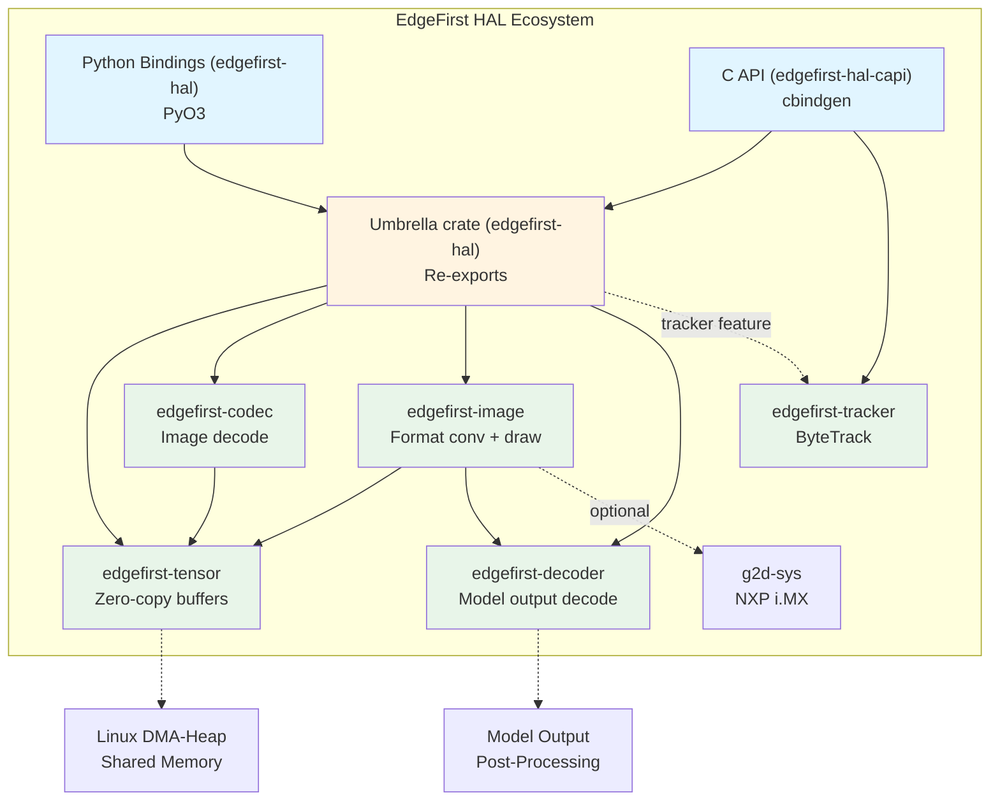
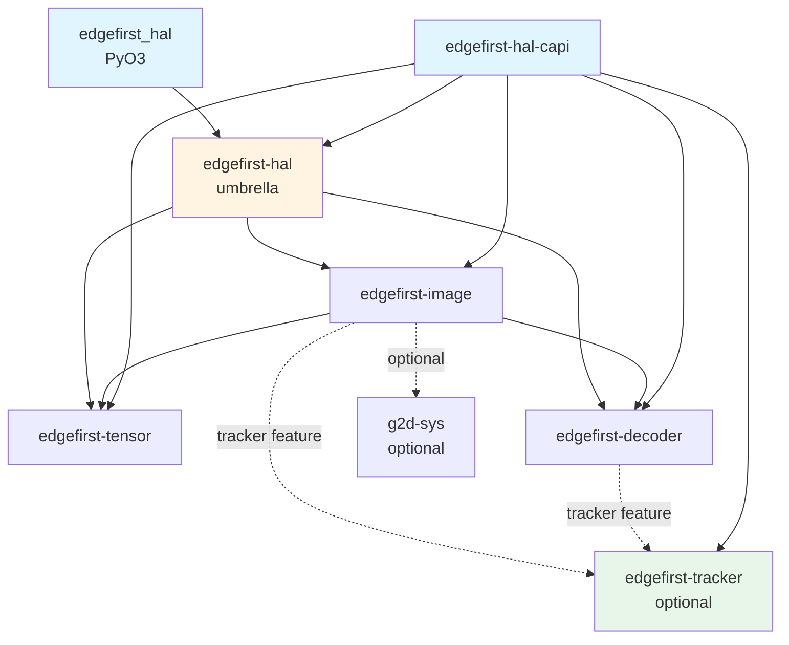

# EdgeFirst Hardware Abstraction Layer

[](https://github.com/EdgeFirstAI/hal/actions)
[](https://opensource.org/licenses/Apache-2.0)
[](https://crates.io/crates/edgefirst-hal)
[](https://pypi.org/project/edgefirst-hal/)

The EdgeFirst Hardware Abstraction Layer (HAL) is a Rust workspace that
provides hardware-accelerated tensor management, image processing, ML model
output decoding, and multi-object tracking for edge AI inference pipelines.
It ships as a Rust crate, a Python package, and a C library — same code,
three language surfaces — with Linux DMA-BUF, OpenGL ES, and NXP G2D
acceleration where the platform supports them, and a portable CPU fallback
everywhere else.

## Features

- **Zero-copy memory management** — DMA-BUF, POSIX shared memory, OpenGL PBO, and heap with automatic backend selection
- **Zero-copy CUDA tensor mapping** — `convert()` PBO output mapped directly to a CUDA device pointer for TensorRT and other CUDA consumers; no host round-trip on Jetson (Orin-series). See [Zero-copy CUDA (TensorRT) input](#zero-copy-cuda-tensorrt-input).
- **Hardware-accelerated image processing** — OpenGL → G2D → CPU dispatch with shared cache infrastructure
- **YOLO + ModelPack decoding** — YOLOv5 / v8 / v11 / v26 (incl. end-to-end) and ModelPack post-processing
- **Multi-object tracking** — ByteTrack with Kalman filtering and stable per-track UUIDs
- **Cross-platform** — Linux (i.MX 8M Plus / i.MX 95 / desktop), macOS, with three CPU/GPU/DMA tiers
- **Production-ready** — used in the Au-Zone EdgeFirst suite for edge AI deployments

## Quick Start

### Installation

Python:

```bash
pip install edgefirst-hal
```

Rust:

```toml
[dependencies]
edgefirst-hal = "0.25"
```

C: download a release archive from
[GitHub Releases](https://github.com/EdgeFirstAI/hal/releases) and link
against `libedgefirst_hal.so` (or `.a`); see
[`crates/capi/README.md`](https://github.com/EdgeFirstAI/hal/blob/main/crates/capi/README.md)
for full instructions.

### Basic usage

**Python:**

```python
import edgefirst_hal as ef

img = ef.Tensor.load("image.jpg", ef.PixelFormat.Rgb)
processor = ef.ImageProcessor()
output = processor.create_image(640, 640, ef.PixelFormat.Rgb)
processor.convert(img, output)

decoder = ef.Decoder(config, 0.5, 0.45)
boxes, scores, classes, masks = decoder.decode([output0, output1])

# Fused decode + draw — masks never leave Rust
processor.draw_masks(decoder, [output0, output1], output)
```

**Rust:**

The umbrella `edgefirst-hal` crate re-exports its sub-crates as modules,
so a single `edgefirst-hal = "0.25"` dependency is enough — no need to
list `edgefirst-image` / `edgefirst-tensor` separately in `Cargo.toml`.

```rust
use edgefirst_hal::image::{ImageProcessor, ImageProcessorTrait, Rotation, Flip, Crop};
use edgefirst_hal::image::codec::{ImageDecoder, ImageLoad};
use edgefirst_hal::tensor::{PixelFormat, DType};

let bytes = std::fs::read("image.jpg")?;
let mut processor = ImageProcessor::new()?;
let mut decoder = ImageDecoder::new();

// JPEG decodes to its native NV12 (colour); decode into an NV12 source tensor.
let mut input =
    processor.create_image(1920, 1080, PixelFormat::Nv12, DType::U8, None, CpuAccess::ReadWrite)?;
let info = input.load_image(&mut decoder, &bytes)?;

// convert() handles NV12 -> RGB, resize, and any EXIF rotation the decode reported.
let mut output =
    processor.create_image(640, 640, PixelFormat::Rgb, DType::U8, None, CpuAccess::ReadWrite)?;
processor.convert(&input, &mut output, Rotation::None, Flip::None,
    Crop::new(0, 0, info.width, info.height))?;
```

If you prefer to depend on the sub-crates directly (e.g. to opt out of
features or to track them at independent versions), add the relevant
`edgefirst-image`, `edgefirst-tensor`, `edgefirst-decoder`, and
`edgefirst-tracker` entries to your `Cargo.toml` and use the
unprefixed `edgefirst_image::*` / `edgefirst_tensor::*` paths above.

**C:**

```c
#include <edgefirst/hal.h>

struct hal_image_processor *proc = hal_image_processor_new();
/* `src` is loaded from disk or imported from a DMA-BUF fd —
 * see the C API README for hal_tensor_load_file / hal_import_image. */
struct hal_tensor *src = /* ... */;
struct hal_tensor *dst = hal_image_processor_create_image(
    proc, 640, 640, HAL_PIXEL_FORMAT_RGB, HAL_DTYPE_U8, HAL_CPU_ACCESS_READ_WRITE);
hal_image_processor_convert(proc, src, dst, HAL_ROTATION_NONE, HAL_FLIP_NONE, NULL);
```

### Zero-copy CUDA (TensorRT) input

On CUDA-capable devices (e.g. Jetson Orin-series) the float PBO produced
by `convert()` can be mapped directly to a CUDA device pointer with no
host round-trip. The recommended pattern is to try `cuda_map()` first and
fall back to the host `map()` when CUDA is unavailable:

**Rust:**

```rust
use edgefirst_hal::tensor::{Tensor, TensorTrait, is_cuda_available};

// At pipeline startup — check once
if is_cuda_available() {
    println!("CUDA present; will use zero-copy PBO→CUDA path");
}

// Per frame — try CUDA, fall back to host
if let Some(cuda) = dst.cuda_map() {
    // cuda.device_ptr() is a raw device pointer valid until `cuda` is dropped.
    // Drop `cuda` before the next convert() so the PBO is free to be reused.
    trt_enqueue(cuda.device_ptr(), cuda.len());
    // `cuda` drops here → PBO released
} else {
    let host = dst.map()?;
    trt_enqueue_host(host.as_slice());
}
```

**Python:**

```python
import edgefirst_hal as ef

proc = ef.ImageProcessor()
dst = proc.create_image(640, 640, ef.PixelFormat.PlanarRgb, "float16")

for frame in camera_frames:
    proc.convert(frame, dst)
    cuda = dst.cuda_map()          # CudaMap | None
    if cuda is not None:
        with cuda:
            # cuda.device_ptr is a CUDA device pointer (int)
            trt_context.execute(cuda.device_ptr)
    else:
        host = dst.map()
        trt_context.execute_host(bytes(host))
```

`cuda_map()` fast-fails to `None` when `libcudart` is not present at
runtime — no compile-time feature gate, no link-time dependency. CUDA
register/map runs on the GL worker thread; the returned device pointer
is usable from any thread. Drop the `CudaMap` guard before the next
`convert()` call to release the PBO back to the GL pipeline.

For the full mechanism, aliasing rules, DMA-BUF import path, and
per-language API reference, see
[crates/tensor/README.md § CUDA tensor mapping](https://github.com/EdgeFirstAI/hal/blob/main/crates/tensor/README.md#cuda-tensor-mapping)
and
[crates/tensor/ARCHITECTURE.md § Zero-copy CUDA tensor mapping](https://github.com/EdgeFirstAI/hal/blob/main/crates/tensor/ARCHITECTURE.md#zero-copy-cuda-tensor-mapping).

Per-language quick-starts and richer examples live in each crate's README:
[Rust (`edgefirst-hal`)](https://github.com/EdgeFirstAI/hal/blob/main/crates/hal/README.md),
[C API](https://github.com/EdgeFirstAI/hal/blob/main/crates/capi/README.md),
[Python](https://github.com/EdgeFirstAI/hal/blob/main/crates/python/README.md).

## System Architecture


```mermaid
graph TB
    subgraph "EdgeFirst HAL Ecosystem"
        Python["Python Bindings (edgefirst-hal)<br/>PyO3"]
        CAPI["C API (edgefirst-hal-capi)<br/>cbindgen"]
        Main["Umbrella crate (edgefirst-hal)<br/>Re-exports"]

        Python --> Main
        CAPI --> Main

        Tensor["edgefirst-tensor<br/>Zero-copy buffers"]
        Codec["edgefirst-codec<br/>Image decode"]
        Image["edgefirst-image<br/>Format conv + draw"]
        Decoder["edgefirst-decoder<br/>Model output decode"]
        Tracker["edgefirst-tracker<br/>ByteTrack"]

        Main --> Tensor
        Main --> Codec
        Main --> Image
        Main --> Decoder
        Main -.->|tracker feature| Tracker
        CAPI --> Tracker

        Codec --> Tensor
        Image --> Tensor
        Image --> Decoder
        Image -.optional.-> G2D["g2d-sys<br/>NXP i.MX"]
    end

    Tensor -.-> DMA["Linux DMA-Heap<br/>Shared Memory"]
    Decoder -.-> PostProc["Model Output<br/>Post-Processing"]

    style Python fill:#e1f5ff
    style CAPI fill:#e1f5ff
    style Main fill:#fff4e1
    style Tensor fill:#e8f5e9
    style Codec fill:#e8f5e9
    style Image fill:#e8f5e9
    style Decoder fill:#e8f5e9
    style Tracker fill:#e8f5e9
```

## Core Components

| Crate | Role | Architecture | Testing |
|-------|------|--------------|---------|
| [`edgefirst-tensor`](https://github.com/EdgeFirstAI/hal/blob/main/crates/tensor/) | Zero-copy multi-dim buffers (DMA / SHM / Mem / PBO) | [ARCH](https://github.com/EdgeFirstAI/hal/blob/main/crates/tensor/ARCHITECTURE.md) | [TEST](https://github.com/EdgeFirstAI/hal/blob/main/crates/tensor/TESTING.md) |
| [`edgefirst-codec`](https://github.com/EdgeFirstAI/hal/blob/main/crates/codec/) | JPEG/PNG decode into pre-allocated tensors (strided, multi-dtype) | [ARCH](https://github.com/EdgeFirstAI/hal/blob/main/crates/codec/ARCHITECTURE.md) | [TEST](https://github.com/EdgeFirstAI/hal/blob/main/crates/codec/TESTING.md) |
| [`edgefirst-image`](https://github.com/EdgeFirstAI/hal/blob/main/crates/image/) | OpenGL / G2D / CPU image processor + mask rendering | [ARCH](https://github.com/EdgeFirstAI/hal/blob/main/crates/image/ARCHITECTURE.md) | [TEST](https://github.com/EdgeFirstAI/hal/blob/main/crates/image/TESTING.md) |
| [`edgefirst-decoder`](https://github.com/EdgeFirstAI/hal/blob/main/crates/decoder/) | YOLO + ModelPack post-processing, NMS, proto-mask APIs | [ARCH](https://github.com/EdgeFirstAI/hal/blob/main/crates/decoder/ARCHITECTURE.md) | [TEST](https://github.com/EdgeFirstAI/hal/blob/main/crates/decoder/TESTING.md) |
| [`edgefirst-tracker`](https://github.com/EdgeFirstAI/hal/blob/main/crates/tracker/) | ByteTrack multi-object tracking | [ARCH](https://github.com/EdgeFirstAI/hal/blob/main/crates/tracker/ARCHITECTURE.md) | [TEST](https://github.com/EdgeFirstAI/hal/blob/main/crates/tracker/TESTING.md) |
| [`edgefirst-hal`](https://github.com/EdgeFirstAI/hal/blob/main/crates/hal/) | Umbrella + tracing subscriber | [ARCH](https://github.com/EdgeFirstAI/hal/blob/main/crates/hal/ARCHITECTURE.md) | [TEST](https://github.com/EdgeFirstAI/hal/blob/main/crates/hal/TESTING.md) |
| [`edgefirst-hal-capi`](https://github.com/EdgeFirstAI/hal/blob/main/crates/capi/) | C ABI + Delegate DMA-BUF framework | [ARCH](https://github.com/EdgeFirstAI/hal/blob/main/crates/capi/ARCHITECTURE.md) | [TEST](https://github.com/EdgeFirstAI/hal/blob/main/crates/capi/TESTING.md) |
| `crates/python/` (PyPI: `edgefirst-hal`) | PyO3 bindings, numpy buffer protocol | [ARCH](https://github.com/EdgeFirstAI/hal/blob/main/crates/python/ARCHITECTURE.md) | [TEST](https://github.com/EdgeFirstAI/hal/blob/main/crates/python/TESTING.md) |

The deep dive on each component (class diagrams, supported operations,
backend dispatch, performance considerations) lives in the per-crate
`ARCHITECTURE.md`. The cross-cutting story (DMA-BUF identity, performance
tracing internals, design patterns) lives in the project
[ARCHITECTURE.md](https://github.com/EdgeFirstAI/hal/blob/main/ARCHITECTURE.md).

## Optimization Guide

This section is the **rules** part of the cross-language performance
contract. Each rule has a measurable cost when broken; see
[BENCHMARKS.md](https://github.com/EdgeFirstAI/hal/blob/main/BENCHMARKS.md)
for empirical penalties per platform,
[ARCHITECTURE.md](https://github.com/EdgeFirstAI/hal/blob/main/ARCHITECTURE.md)
for *why* the rule exists, and
[TESTING.md](https://github.com/EdgeFirstAI/hal/blob/main/TESTING.md#validating-optimizations)
for how to verify your integration follows it.

| Rule | Why it matters | Measured penalty when broken |
|------|----------------|------------------------------|
| Reuse tensors across frames | Each new tensor mints a fresh `BufferIdentity`; the EGL image cache misses every frame | 1.7–3.3× slower preprocessing on Vivante / Mali |
| Allocate via `ImageProcessor::create_image()` | Auto-selects DMA-buf / PBO / heap based on the active GPU; bypassing forces a slow transfer path | Forced `glTexSubImage2D` upload or full CPU readback |
| Cache imported camera tensors by **inode**, not by fd | V4L2 / libcamera recycle fd numbers across a small buffer pool; an fd-keyed cache misses on every frame even when the physical buffer is the same | Full EGL re-import per frame (≈0.5–1.5 ms on Vivante, doubled with chroma planes) |
| Build `Decoder` once, decode many | Decoder construction parses model metadata and allocates working buffers | Parse + alloc cost per frame |
| One `ImageProcessor` per pipeline | Each instance owns its own GL context, EGL display, and per-thread caches | On Vivante / paravirtual GPUs multiple contexts serialize on the global `GL_MUTEX`; on Mali / V3D / Tegra / Apple they run concurrently (one per thread is the portable rule) |
| Use native fp16 / AVX build overrides only on supporting CPUs | These flags unlock native widening / vector paths for local perf testing | Unsupported targets may SIGILL or fail to build; portability loss |
| Pass numpy arrays straight to `Tensor.from_numpy()` — do not pre-`ascontiguousarray()` | HAL detects strided sources and materializes via numpy's vectorized C strided→contig pass; a manual workaround above HAL adds a redundant copy | Redundant pre-copy on every call (≈ 1.5 ms on a `(1, 116, 8400)` f32 view, rpi5-hailo) |
| For COCO/IoU evaluation use `MaskResolution::Scaled(orig_w, orig_h)`, not `Proto` | `Scaled` upsamples the proto plane *before* thresholding (clean sub-pixel edges); `Proto` thresholds at proto resolution and callers typically nearest-upsample (blocky) | Mask mAP regression of up to 0.04–0.05 absolute when `Proto` is nearest-upsampled |

> [!IMPORTANT]
> The single most common performance bug is calling `Tensor::from_fd()`
> (or `import_image()`) on every frame from a V4L2 / libcamera buffer
> pool. The HAL's internal EGL image cache cannot rescue you — the cache
> key includes a per-tensor monotonic ID that is fresh on every import.
> The fix lives in the **calling code**, not in HAL.

### Rule 1 — Reuse tensors across frames

Allocate input and output tensors once at pipeline startup; reuse the same
objects on every frame. The DMA memory backing a tensor is live: when an
upstream producer (V4L2 DQBUF, codec output, ISP) writes new pixels into
it, the existing tensor and its cached EGLImage remain valid. No
re-import, no re-allocation.

```rust
let mut proc = ImageProcessor::new()?;
let mut dst = proc.create_image(640, 640, PixelFormat::Rgb, DType::U8, None, CpuAccess::ReadWrite)?;

for frame in camera_frames {
    proc.convert(&frame, &mut dst, Rotation::None, Flip::None, Crop::default())?;
    run_inference(&dst)?;
}
```

```python
proc = ef.ImageProcessor()
dst = proc.create_image(640, 640, ef.PixelFormat.Rgb)
for frame in camera_frames:
    proc.convert(frame, dst)
    run_inference(dst)
```

### Rule 2 — Allocate via `ImageProcessor::create_image()`

`create_image()` selects the fastest memory backend for the active GPU at
construction time:

| Priority | Backend | Transfer | Platforms |
|----------|---------|----------|-----------|
| 1st | **DMA-buf** | Zero-copy EGLImage import | NXP i.MX 8M Plus, i.MX 95 |
| 2nd | **PBO** | Zero-copy GL buffer binding | NVIDIA desktop |
| 3rd | **Mem** (heap) | CPU memcpy fallback | All platforms |

The probe runs once at `ImageProcessor::new()` time. All subsequent
`create_image()` calls reuse the same backend. Use `create_image()` for
every destination passed to `convert()`; direct `Tensor::new(memory=...)`
bypasses the probe.

For DMA-buf access, the process needs `/dev/dma_heap/{linux,cma|system}`
and a DRM render/card node — the GL backend probes
`/dev/dri/renderD128`, then `/dev/dri/card0`, then `/dev/dri/card1` and
uses the first one that opens. On embedded Linux, add the user to
`video` and `render` groups, or set udev rules. If DMA-buf fails,
`create_image()` transparently falls back to PBO or heap.

### Rule 3 — Cache imported camera tensors by inode, not by fd

V4L2, libcamera, and codec output all surface frames as DMA-BUF file
descriptors drawn from a small fixed pool (typically 4–16 buffers). The fd
**number** is recycled: the same fd can refer to a different physical
buffer between frames, and the same physical buffer can be exported with a
different fd over time. **A cache keyed by fd will produce false hits or
false misses.**

The kernel assigns each `dma_buf` object a unique inode in the anonymous
inode filesystem. The inode is constant for the buffer's lifetime
regardless of how many times it is exported. Cache imported HAL tensors
by `(inode, plane_offset)`:

```c
#include <sys/stat.h>

typedef struct { ino_t inode; size_t offset; } BufferKey;

struct stat st;
if (fstat(fd, &st) != 0) continue;
BufferKey key = { .inode = st.st_ino, .offset = plane_offset };

struct hal_tensor *tensor = lookup_tensor(cache, &key);
if (!tensor) {
    struct hal_plane_descriptor *pd = hal_plane_descriptor_new(fd);
    if (!pd) { perror("hal_plane_descriptor_new"); continue; }
    tensor = hal_import_image(proc, pd, NULL, w, h,
                              HAL_PIXEL_FORMAT_NV12, HAL_DTYPE_U8);
    // pd is consumed by hal_import_image (success or failure)
    if (!tensor) { perror("hal_import_image"); continue; }
    insert_tensor(cache, &key, tensor);
}
hal_image_processor_convert(proc, tensor, dst, /* ... */);
```

```python
import os
buffer_cache: dict[tuple[int, int], ef.Tensor] = {}

def get_or_import(proc, fd, offset, width, height, fmt):
    key = (os.fstat(fd).st_ino, offset)
    t = buffer_cache.get(key)
    if t is None:
        t = proc.import_image(fd, width, height, fmt, "uint8", offset=offset)
        buffer_cache[key] = t
    return t
```

EdgeFirst's GStreamer elements implement this as a reference. For other
pipelines (libcamera direct, custom V4L2, RTSP decoder) you are
responsible for the equivalent layer above HAL. See
[ARCHITECTURE.md § Appendix C](https://github.com/EdgeFirstAI/hal/blob/main/ARCHITECTURE.md#appendix-c-dma-buf-identity-and-tensor-caching)
for the full identity-and-caching story.

### Rule 4 — Build the decoder once

`Decoder` parses the model output schema, resolves quantization, and
allocates working buffers at construction time. Build it once outside the
loop; the decoder clears its output vectors per call:

```rust
let decoder = DecoderBuilder::default()
    .with_config_yaml_str(config_yaml)
    .with_score_threshold(0.5)
    .with_iou_threshold(0.45)
    .build()?;

for frame in frames {
    let outputs = run_inference(frame)?;
    let refs: Vec<&TensorDyn> = outputs.iter().collect();
    decoder.decode(&refs, &mut boxes, &mut masks)?;
}
```

The same applies to `ByteTrack`: construct once, call `update()` per
frame.

### Rule 5 — One `ImageProcessor` per pipeline

`ImageProcessor` owns its OpenGL context, dedicated GL thread, and EGL
image cache. The EGL **display** itself is process-global (a shared
`SharedEglDisplay` initialized once and never terminated), so additional
processors don't pay the display-creation cost — but each one still
creates a fresh context and per-instance caches. Whether GL operations
across processors run in parallel is a per-driver policy: on Vivante
(i.MX 8M Plus) and virtualized/paravirtual GPUs every command serializes
on a global `GL_MUTEX`; on Mali, V3D, Tegra, llvmpipe, and real Apple
GPUs they execute concurrently (override with `EDGEFIRST_GL_SERIALIZE`).
Construct one per pipeline (or one per worker thread for parallel
pipelines) and share it across all `convert()`, `draw_*()`, and
`create_image()` calls.

`ImageProcessor` is `Send + Sync`, so it can be moved or shared across
threads. On serializing drivers, concurrent use of a single shared
instance funnels through `GL_MUTEX`; per-worker ownership runs in
parallel wherever the driver allows and gives more predictable cache
behavior everywhere.

### Rule 6 — Local fp16 / AVX build overrides

The default HAL binary is built to the target triple's guaranteed
baseline ISA so a single distributed binary runs on every CPU within that
triple. Richer ISAs (ARMv8.2-FP16, x86_64 F16C / FMA / AVX2) are **not**
enabled by default; until HAL gains runtime CPU-feature detection with
dynamic dispatch, baking them in would SIGILL on older CPUs.

For local benchmarking on supporting hosts, enable them via `RUSTFLAGS`:

```bash
# Orin Nano (Cortex-A78AE) — exclude the PyO3 binding (cross-Python toolchain not configured)
RUSTFLAGS="-C target-cpu=cortex-a78ae" cargo build --release \
  --target aarch64-unknown-linux-gnu --workspace --exclude edgefirst_hal

# Generic aarch64 with FEAT_FP16 (do NOT use on Cortex-A53 / imx8mp)
RUSTFLAGS="-C target-feature=+fp16" cargo build --release \
  --target aarch64-unknown-linux-gnu -p edgefirst-image

# x86_64 Haswell+ (F16C + FMA + AVX2)
RUSTFLAGS="-C target-feature=+f16c,+fma,+avx2" cargo build --release \
  -p edgefirst-image
```

When active, the f16 mask kernel at
[`crates/image/src/cpu/masks.rs`](https://github.com/EdgeFirstAI/hal/blob/main/crates/image/src/cpu/masks.rs)
compiles to native widening (`fcvt` on aarch64, `vcvtph2ps` on x86_64),
and on x86_64 with `+f16c,+fma` an explicit 8-lane `_mm256_cvtph_ps +
_mm256_fmadd_ps` intrinsic path is enabled via cfg gate. Verify with
[`scripts/audit_f16_codegen.sh`](https://github.com/EdgeFirstAI/hal/blob/main/scripts/audit_f16_codegen.sh).

### Rule 7 — NumPy interop: pass arrays straight to `from_numpy()`

`Tensor.from_numpy()` (and the implicit copy from numpy arrays passed to
`Decoder.decode_proto()`) handles strided / non-contiguous sources
internally. Do **not** maintain a manual `np.ascontiguousarray()`
workaround — it wastes a copy.

The Python binding's `copy_numpy_to_tensor_dyn` selects one of three
paths based on the source array's layout:

| Source layout | Path | Cost |
|---|---|---|
| Fully contiguous | Single `copy_from_slice` (memcpy), rayon-parallel ≥ 256 KiB | Lower bound |
| Strided with contiguous inner rows (column slice, sub-volume, negative stride) | Per-row memcpy iterating outer dimensions | ≈ same as contiguous |
| Fully strided (transposed view, every-other-element) | Internal `np.ascontiguousarray()` materialisation, then Path 1 memcpy | ≈ 4× contiguous |

The fully-strided case is the one that bites users in practice: HailoRT's
natural output is `arr.transpose(0, 2, 1)` over a `(1, anchors,
channels)` buffer. PR #58 replaced the legacy element-wise loop with
internal `np.ascontiguousarray` materialization (≈ 4× faster than the
legacy loop, within ≈ 1.5× of the manual workaround).

```python
# Wrong (post-PR #58): adds an extra copy above HAL.
tensor.from_numpy(np.ascontiguousarray(arr_strided))

# Right: HAL detects the strided layout and materializes internally.
tensor.from_numpy(arr_strided)
```

The regression tests in
[`tests/test_tensor.py`](https://github.com/EdgeFirstAI/hal/blob/main/tests/test_tensor.py)
(`test_from_numpy_hailort_shape`,
`test_from_numpy_hailort_shape_perf_sanity`) pin the behaviour and the
≤ 1.5× perf bound.

### Rule 8 — Choose the correct `MaskResolution`

`ImageProcessor.materialize_masks()` accepts a `MaskResolution`
parameter:

| Mode | Output | Pipeline | When to use |
|------|--------|----------|-------------|
| `MaskResolution::Proto` (default) | `(roi_h, roi_w, 1)` u8 binary at 160×160 proto resolution | dot → sign threshold → emit | Real-time visualisation, when proto-resolution binary suffices |
| `MaskResolution::Scaled { width, height }` | `(roi_h, roi_w, 1)` u8 binary at requested resolution | dot → sigmoid → upsample to `(W, H)` → threshold (`>127`) | All COCO / IoU / mAP evaluation |

```python
import edgefirst_hal as hal

# Wrong: threshold then upsample → blocky edges, mAP regression.
tiles = proc.materialize_masks(boxes, scores, classes, proto_data, letterbox=lb)
for tile, box in zip(tiles, boxes):
    binary = (tile[:, :, 0] > 127).astype(np.uint8)
    canvas[y:y+h, x:x+w] = cv2.resize(binary, (W, H), cv2.INTER_NEAREST)

# Right: HAL upsamples-then-thresholds inside its batched-GEMM kernel.
tiles = proc.materialize_masks(boxes, scores, classes, proto_data,
                               letterbox=lb,
                               resolution=hal.MaskResolution.Scaled(W, H))
for tile, box in zip(tiles, boxes):
    canvas[y:y+h, x:x+w] = (tile[:, :, 0] > 127).astype(np.uint8)
```

The `Scaled` path uses the batched-GEMM materializer (PR #54). At N ≥ 16
detections it amortizes a single GEMM at proto resolution and upsamples
per-detection in rayon-parallel — both more accurate than
threshold-then-resize *and* faster than per-detection scalar work in
caller code.

> [!TIP]
> If you see a mask-mAP gap between your HAL validator and a reference
> (ONNX / numpy) implementation, this rule is almost always the first
> thing to check.

### Where to go next

| Document | Level | Use it for |
|----------|-------|------------|
| [ARCHITECTURE.md § Appendix C: DMA-BUF Identity and Tensor Caching](https://github.com/EdgeFirstAI/hal/blob/main/ARCHITECTURE.md#appendix-c-dma-buf-identity-and-tensor-caching) | Architecture | Why the rules exist: `BufferIdentity`, EGL image cache, the v4l2 / GStreamer fd-recycling story, and the inode-keyed downstream cache pattern |
| [image/ARCHITECTURE.md § Performance Considerations](https://github.com/EdgeFirstAI/hal/blob/main/crates/image/ARCHITECTURE.md#performance-considerations) | Architecture | Backend dispatch and per-instance caches; see also [§ GL Concurrency Model](https://github.com/EdgeFirstAI/hal/blob/main/crates/image/ARCHITECTURE.md#gl-concurrency-model-serialization-policy) for the per-driver `GL_MUTEX` policy |
| [TESTING.md § Validating Optimizations](https://github.com/EdgeFirstAI/hal/blob/main/TESTING.md#validating-optimizations) | Testing | Confirming your integration follows the rules |
| [BENCHMARKS.md](https://github.com/EdgeFirstAI/hal/blob/main/BENCHMARKS.md) | Benchmarks | Empirical cost of breaking each rule, per platform |

## Platform Support

| Feature | Linux (i.MX) | Linux (other) | macOS | iOS | Android | Windows |
|---------|--------------|---------------|-------|-----|---------|---------|
| DMA tensors | Yes | Yes | No | No | No | No |
| PBO tensors (GPU) | Yes | Yes | No | No | No | No |
| IOSurface tensors (zero-copy) | No | No | Yes (with ANGLE) | Yes (with ANGLE) | No | No |
| AHardwareBuffer tensors (zero-copy) | No | No | No | No | Yes | No |
| Shared memory tensors | Yes | Yes | Yes | Yes | Import-only¹ | No |
| Heap tensors | Yes | Yes | Yes | Yes | Yes | Yes |
| G2D acceleration | Yes | No | No | No | No | No |
| OpenGL acceleration | Yes (optional) | Yes (optional) | Yes (with ANGLE) | Yes (with ANGLE) | Yes (native EGL) | No |
| CPU fallback | Yes | Yes | Yes | Yes | Yes | Yes |

¹ Android's bionic libc has no POSIX `shm_open`, so shared-memory tensor
*allocation* reports `NotImplemented`; *importing* an existing segment
received as a file descriptor (`from_fd`) works.

On macOS the OpenGL backend is enabled when [ANGLE](https://github.com/google/angle)
is installed — see [macOS GPU Acceleration](#macos-gpu-acceleration) below
for setup. If ANGLE is not present the HAL falls back to the CPU backend.
On iOS the OpenGL backend uses the same ANGLE-over-Metal path — see
[iOS](#ios) below. On Android the OpenGL backend uses the platform's
native GLES driver directly (no translation layer) — see
[Android](#android) below.

## macOS GPU Acceleration

The HAL uses [Google's ANGLE](https://github.com/google/angle) to translate
the same OpenGL ES 3.0 calls used on Linux to Metal, and Apple's
[IOSurface](https://developer.apple.com/documentation/iosurface) for
zero-copy buffer interchange (the role DMA-BUF plays on Linux). ANGLE is
not part of macOS and must be installed separately. If it is not present
at runtime the HAL logs a warning and falls back to the CPU backend.

> **ANGLE access:** ANGLE itself is an open-source Google project, and our
> pre-built, signed + notarized xcframework integration is published from
> the **public** repository
> ([`EdgeFirstAI/angle-package`](https://github.com/EdgeFirstAI/angle-package)).
> Anyone can fetch it — no credentials or organization membership required.
> Two ways to get ANGLE:
>
> - **Recommended (macOS + iOS)** — fetch the pre-built release with
>   `scripts/fetch-angle.sh` (see
>   [Option A](#option-a--edgefirst-pre-built-release-recommended) below).
>   This is exactly what CI uses.
> - **macOS alternative** — install ANGLE via the public Homebrew tap:
>   `brew install startergo/angle/angle` (then re-sign the dylibs — see
>   [Option B — Homebrew tap](#option-b--homebrew-tap-macos-alternative)
>   below). The HAL finds it automatically.
> - **Build without macOS/iOS GL** — the HAL's default features include
>   `opengl`, but you can disable it (`--no-default-features --features
>   ndarray,tracing`) to build the CPU-only path, which needs no ANGLE at
>   all.

### Installing ANGLE (macOS)

The HAL looks for `libEGL.dylib` / `libGLESv2.dylib` via the `EDGEFIRST_ANGLE_PATH`
env var, then standard search paths (Homebrew, `@loader_path`,
`@executable_path`). There are two ways to satisfy this:

#### Option A — EdgeFirst pre-built release (recommended)

Our pre-built, **signed + notarized** xcframeworks (built from a pinned
ANGLE revision) are published in the
[`EdgeFirstAI/angle-package`](https://github.com/EdgeFirstAI/angle-package/releases)
releases. This repo is **public** — anyone can fetch the release with no
credentials. A single helper downloads, sha256-verifies, and extracts them
(into both the xcframework layout for iOS app embedding and a flat-lib
layout for the macOS runtime `dlopen` path):

```bash
scripts/fetch-angle.sh                       # → target/angle/ (default tag v2.1.28252)
EDGEFIRST_ANGLE_PATH=target/angle/macos-flat-lib \
  cargo run --release --example pipeline_demo
```

Because the release is public, `scripts/fetch-angle.sh` needs **no
authentication** — it works out of the box both locally and in CI. (It
still honors `gh auth login` / `GH_TOKEN` / `GITHUB_TOKEN` if present,
which raises GitHub's API rate limit, but none are required.)

> **Why a flat-lib dir for macOS?** ANGLE's `libEGL` internally `dlopen`s
> `libGLESv2.dylib` from its own directory (located via `dladdr`) to
> resolve GL entry points, so the two must be flat siblings. The signed
> framework bundles do not satisfy this, so the helper stages
> `libEGL.dylib` + `libGLESv2.dylib` siblings copied out of the framework
> binaries. Pulling a binary out of its framework invalidates the
> Developer-ID signature (it is scoped to the bundle's `Info.plist`, so
> `dlopen` then fails with *"code signature invalid"*), so
> `scripts/fetch-angle.sh` **ad-hoc re-signs the two flat dylibs for you** —
> you never re-sign manually (unlike the Homebrew path below).

#### Option B — Homebrew tap (macOS alternative)

ANGLE is also available via a public third-party Homebrew tap — an
alternative to Option A if you prefer a package manager on macOS.
Homebrew's `install_name_tool` step invalidates the bundled code signatures
and macOS 26 (Tahoe) refuses to load dylibs with broken signatures at
`dlopen` time (immediate `SIGKILL (Code Signature Invalid)` with no
stdout), so an ad-hoc re-sign is mandatory after each install/upgrade:

```bash
brew install startergo/angle/angle
codesign --force --sign - $(brew --prefix)/opt/angle/lib/libEGL.dylib
codesign --force --sign - $(brew --prefix)/opt/angle/lib/libGLESv2.dylib
```

See [Homebrew/brew#19144](https://github.com/Homebrew/brew/issues/19144)
for the upstream tracking issue. The release path above avoids this
problem entirely.

### Verifying the GPU backend is active

```bash
RUST_LOG=edgefirst_image=debug cargo run --release --example pipeline_demo
```

Look for `ANGLE (Apple, ANGLE Metal Renderer: ...)` in the bring-up log.
If ANGLE is missing or signatures are still broken you will see a
warning and the CPU backend is selected.

### Custom ANGLE locations

If your ANGLE install is not on the default search path, set
`EDGEFIRST_ANGLE_PATH` to the directory containing `libEGL.dylib` and
`libGLESv2.dylib` (flat siblings — see the note above):

```bash
EDGEFIRST_ANGLE_PATH=/path/to/angle/lib cargo run --release ...
```

The lookup order is: `EDGEFIRST_ANGLE_PATH` → Homebrew → `@loader_path`
(alongside the binary) → `@executable_path` → unqualified `libEGL.dylib`
on the dyld search path. For bundled distributions, drop the re-signed
ANGLE dylibs next to the executable (or into `<App>.app/Contents/Frameworks/`)
and no env var is needed.

### When you don't need this setup

- **`pip install edgefirst-hal`** — the macOS wheel ships ANGLE bundled
  alongside the Python extension; no separate install required.
- **EdgeFirst-signed binary distribution** — official binary releases
  bundle ANGLE re-signed under the EdgeFirst Apple Developer ID. Install
  and run with no additional setup.

These channels exist precisely so end users do not need to deal with the
Homebrew install or re-signing step.

## iOS

The HAL Rust library closure builds for iOS (arm64 device +
arm64 simulator) with the default features (including `opengl`), reusing
the same ANGLE-over-Metal GL backend as macOS. The supported targets are:

- `aarch64-apple-ios` — iOS devices (arm64)
- `aarch64-apple-ios-sim` — iOS Simulator on Apple-Silicon Macs (arm64)

> **ANGLE note:** iOS GL requires ANGLE xcframeworks. There is **no
> public Homebrew equivalent for iOS** (unlike macOS), so fetch them from
> the **public**
> [`angle-package`](https://github.com/EdgeFirstAI/angle-package) release
> with `scripts/fetch-angle.sh` (no credentials needed). If you would
> rather not fetch ANGLE at all, you can still build the Rust library
> for iOS with the `opengl` feature disabled:
> `cargo build --target aarch64-apple-ios --no-default-features --features ndarray,tracing`.
> The Rust `cargo build` itself (with `opengl`) succeeds without ANGLE
> present — see [How the GL backend resolves ANGLE on iOS](#how-the-gl-backend-resolves-angle-on-ios).

> Intel-simulator (`x86_64-apple-ios`) is **not** supported — the
> `angle-package` distribution ships arm64-only slices (see below).

### Prerequisites

Xcode + the iOS SDKs (`xcode-select --install` or a full Xcode), plus the
Rust iOS targets:

```bash
rustup target add aarch64-apple-ios aarch64-apple-ios-sim
```

### Build

The one-command entry point builds for both targets and validates the link
closure against the ANGLE xcframeworks:

```bash
scripts/build-ios.sh                 # device + sim, build + link-validate
scripts/build-ios.sh device          # device only
scripts/build-ios.sh --no-validate   # build only, skip link validation
```

Or build the library closure directly:

```bash
cargo build --target aarch64-apple-ios     --release -p edgefirst-hal
cargo build --target aarch64-apple-ios-sim --release -p edgefirst-hal
```

### How the GL backend resolves ANGLE on iOS

ANGLE's EGL/GLES symbols are resolved at **runtime** via `libloading`, not
at link time. On macOS the HAL `dlopen`s `libEGL.dylib` from the release
flat-lib (or Homebrew); on iOS the symbols are already in the process image
(the ANGLE xcframeworks are embedded in the app bundle), so the loader
resolves them via `Library::this()` (equivalent to `dlopen(NULL)`).

Consequence: a standalone `cargo build` for an iOS target succeeds
**without** the ANGLE frameworks present — the Rust staticlib has no
link-time references to `eglInitialize` etc. The frameworks are only
needed at app-link/runtime. The `.cargo/config.toml` iOS entries therefore
carry no rustflags or linker overrides.

### The ANGLE xcframeworks

iOS GL requires shipping [ANGLE](https://github.com/google/angle) as
embedded dynamic frameworks in the app bundle. Our integration uses the
**signed + notarized** xcframeworks from the public
[`EdgeFirstAI/angle-package`](https://github.com/EdgeFirstAI/angle-package/releases)
release (`EGL.xcframework` + `GLESv2.xcframework`, each with `ios-arm64`,
`ios-arm64-simulator`, `macos-arm64`). `scripts/fetch-angle.sh` downloads
and verifies them (default tag `v2.1.28252`, matching the ANGLE
`GL_VERSION` string):

```bash
scripts/fetch-angle.sh       # → target/angle/{EGL,GLESv2}.xcframework
```

A consuming iOS app target embeds them (Xcode "Embed & Sign", or XcodeGen
`embed: true`):

```yaml
dependencies:
  - { framework: ../hal/target/angle/EGL.xcframework,   embed: true }
  - { framework: ../hal/target/angle/GLESv2.xcframework, embed: true }
```

### What is validated vs. deferred

`scripts/validate-ios-link.sh` builds the `edgefirst-ios-validation`
staticlib (the full HAL closure archived into one `.a`) and links it
against the ANGLE xcframeworks + the Apple system frameworks the HAL
references via `#[link(kind = "framework")]` (`IOSurface`,
`CoreFoundation`, `Metal`). It also runs `nm` on the ANGLE binaries to
confirm the EGL entry-point names the runtime loader will look up are
exported. This proves the native symbol closure is complete.

What is **not** covered by this effort (future work):

- **Swift bindings** — a C/Swift API surface and a ship-able HAL
  `.xcframework`. The Rust staticlib is the deliverable here.
- **Runtime validation** — actual EGL initialization on a device or
  simulator requires the app shell (a future effort). The internal
  `hal-mobile` assessment already proved the ANGLE-over-Metal + IOSurface
  path works on iPhone 17 Pro (`GL_EXT_color_buffer_half_float` present).

### fp16 / target features

Unlike `aarch64-apple-darwin` (where `+fp16,+dotprod,+i8mm` are baked in
— every M-series chip is ARMv8.6-A+), the iOS targets carry **no**
target-feature rustflags. The iOS 16 deployment floor still includes A11
(iPhone 8, ARMv8.1-A, no fp16/dotprod/i8mm), so enabling them would
SIGILL on older devices. The deployment target matches the
`angle-package` build (`IPHONEOS_DEPLOYMENT_TARGET = 16.0`).

## Android

The HAL builds for Android with the default features (including
`opengl`), using the platform's **native OpenGL ES driver** directly —
unlike macOS/iOS there is no ANGLE translation layer to install, because
Android ships a first-class GLES implementation (Adreno, Mali, etc.).
Zero-copy buffer interchange uses
[AHardwareBuffer](https://developer.android.com/ndk/reference/group/a-hardware-buffer)
(the role DMA-BUF plays on Linux and IOSurface on Apple platforms),
imported into GL via `EGL_ANDROID_image_native_buffer`. The supported
targets are:

- `aarch64-linux-android` — Android devices (arm64-v8a)
- `x86_64-linux-android` — the Android emulator on x86_64 hosts

The minimum supported API level is **26** (Android 8.0) — the floor of
the stable AHardwareBuffer NDK ABI.

### Prerequisites

```bash
rustup target add aarch64-linux-android x86_64-linux-android
cargo install cargo-ndk
# Android NDK r26+ (r27c LTS recommended); set ANDROID_NDK_HOME or let
# cargo-ndk auto-detect it under your Android SDK.
```

### Building

```bash
# HAL + C API (the future JNI library) for both ABIs at API 26:
scripts/build-android.sh
# or directly:
cargo ndk -t arm64-v8a -t x86_64 -P 26 build --release -p edgefirst-hal
```

### Link validation

`scripts/validate-android-link.sh [arm64|x86_64]` builds the
`edgefirst-android-validation` staticlib (the full HAL closure), verifies
with `llvm-nm` that the archive carries the AHardwareBuffer references
and that the NDK's API-26 stubs export every EGL/GLES entry point the
runtime resolves dynamically, then links a test executable against the
NDK system libraries. CI runs this for both ABIs on every PR
(`build-android` lane).

What is **not** covered by this effort (future work):

- **Kotlin bindings** — a JNI/Kotlin API surface, like the Swift API on
  iOS. The `edgefirst-hal-capi` cdylib (`libedgefirst_hal.so`) is the
  deliverable here.
- **Runtime validation** — on-device GL correctness and performance run
  via the internal `hal-mobile` AWS Device Farm harness calling the
  `edgefirst-android-validation` C-ABI entry points (`_verify`, `_bench`);
  the Phase-1 assessment already proved the native-GLES + AHardwareBuffer
  path on a Galaxy S26 Ultra (`GL_EXT_color_buffer_half_float` present,
  letterbox 720p→640×640 F16 in 741 µs).
- **Deferred zero-copy paths** — YUV camera buffers (external-OES
  sampling) and single-channel Grey/NV imports (`R8_UNORM` needs
  API 29); these fall back to CPU conversion today.

### NPU-direct output (zero CPU readback)

The convert destination is a real AHardwareBuffer, so an NPU runtime can
consume it directly — no `map()`, no CPU readback:

```c
// Allocate once, reuse every frame (Rule 1). F16 NCHW model input;
// auto-select yields an AHardwareBuffer when the GL backend is active —
// assert hal_tensor_memory_type(dst) == HAL_TENSOR_DMA at startup.
HalTensor* dst = hal_image_processor_create_image(
    proc, 640, 640, HAL_PIXEL_FORMAT_PLANAR_RGB, HAL_DTYPE_F16, HAL_CPU_ACCESS_NONE);

// One-time: hand the SAME buffer to the NPU runtime.
AHardwareBuffer* ahb = hal_tensor_hardware_buffer_ptr(dst);
ANeuralNetworksMemory* mem;
ANeuralNetworksMemory_createFromAHardwareBuffer(ahb, &mem);   // NNAPI
// (LiteRT: wrap `ahb` via TfLiteAHardwareBufferAttachment instead.)

// Per frame: when convert() returns, the GPU has finished writing and
// the handle contents are safe to execute against.
hal_image_processor_convert(proc, src, dst, HAL_ROTATION_NONE,
                            HAL_FLIP_NONE, &letterbox);
// ... ANeuralNetworksExecution_setInputFromMemory(exec, 0, NULL, mem, 0, bytes);
```

For a pipelined handoff that skips the blocking GPU sync entirely, use
`hal_image_processor_convert_fence()`: it returns a sync-fence fd
(`EGL_ANDROID_native_fence_sync`) the NPU runtime waits on instead
(`ANeuralNetworksExecution_startComputeWithDependencies`), or `-1` with
the work already synced on drivers without fence support.

**Flatness**: gralloc chooses the row pitch and may pad it (observed on
the S26 Ultra: 640-px planar F16 → 1536-byte rows, natural 1280). Check
`hal_tensor_recorded_row_stride(dst)`:

- `0` — the buffer IS the flat `[1, C, H, W]` stream; hand it off as-is.
- nonzero — describe the pitch to the runtime, pick a width whose pitch
  the device does not pad, or fall back to
  `hal_tensor_copy_to_flat(dst, buf, len)` (~0.3 ms at 2.4 MB — still
  cheaper than a full CPU convert, but no longer zero-copy; profile).

**INT8 NPUs**: allocate the destination as `HAL_PIXEL_FORMAT_RGB` /
`HAL_PIXEL_FORMAT_RGBA` with `HAL_DTYPE_U8` or `HAL_DTYPE_I8` (NHWC,
zero-copy on Android via the RGBA8888 texel packing) and attach the
model's quantization so consumers agree on the scale:

```c
hal_tensor_set_quantization(dst, /*scale=*/1.0f / 255.0f, /*zero_point=*/0);
```

The I8 path applies the `^0x80` bias in-shader during the convert — the
buffer bytes are already signed model input.

**macOS parity**: the same pattern works with
`hal_tensor_iosurface_ref()` — wrap the IOSurface in a `CVPixelBuffer`
(`CVPixelBufferCreateWithIOSurface`) for CoreML/ANE input; `convert()`
returning likewise guarantees GPU completion.

### fp16 / target features

Like iOS, the Android targets carry **no** target-feature rustflags: the
API-26 device floor spans ARMv8.0-A cores (Cortex-A53 class, no
fp16/dotprod/i8mm), so baking those features in would SIGILL on real
older hardware (see `.cargo/config.toml`).

## Build System

The workspace builds with standard `cargo`. The
[`Makefile`](https://github.com/EdgeFirstAI/hal/blob/main/Makefile) wraps
the common workflows (`make test`, `make bench`, `make build`,
`make format lint check`) with the right flags and gates.

For Python wheels, see
[`crates/python/README.md`](https://github.com/EdgeFirstAI/hal/blob/main/crates/python/README.md)
and
[`crates/python/TESTING.md`](https://github.com/EdgeFirstAI/hal/blob/main/crates/python/TESTING.md).
For the C library and consumer linking, see
[`crates/capi/README.md`](https://github.com/EdgeFirstAI/hal/blob/main/crates/capi/README.md).

## Environment Variables

| Variable | Description |
|----------|-------------|
| `EDGEFIRST_TENSOR_FORCE_MEM` | `1` forces heap memory (disables DMA / SHM) |
| `EDGEFIRST_DISABLE_G2D` | Disable G2D backend |
| `EDGEFIRST_DISABLE_GL` | Disable OpenGL backend |
| `EDGEFIRST_DISABLE_CPU` | Disable CPU backend |
| `EDGEFIRST_FORCE_BACKEND` | Force one backend: `cpu`, `g2d`, or `opengl` (disables fallback) |
| `EDGEFIRST_FORCE_TRANSFER` | Force GL transfer: `pbo`, `dmabuf`, or `sync` |
| `EDGEFIRST_NV_CONVERT_PATH` | NV12/16/24 GPU conversion path: `sampler`, `shader`, or `auto` (default). `auto` prefers the portable, colorimetry-exact in-shader `ShaderR8`, except BT.601-limited single-plane NV12 on Vivante (hardware sampler is ~12× faster and correct). `sampler`/`shader` force a path for benchmarking/bring-up |
| `EDGEFIRST_EGL_CACHE_CAPACITY` | Override the per-cache EGLImage capacity (default 64) for high-cardinality varied-geometry streams |
| `EDGEFIRST_ALLOW_SOFTWARE_GL` | `1` opts in to running the GL backend on a software renderer (otherwise rejected); for CI / headless bring-up |
| `EDGEFIRST_OPENGL_RENDERSURFACE` | `1` enables EGL renderbuffer path for non-`dma_heap` DMA-BUF (i.MX 95 Neutron NPU) |
| `EDGEFIRST_PROTO_COMPUTE` | `1` enables GLES 3.1 compute shader for HWC→CHW proto repack |
| `EDGEFIRST_DISABLE_V4L2` | `1` forces the software JPEG decoder, bypassing the V4L2 hardware JPEG backend (Linux) |
| `EDGEFIRST_CODEC_V4L2_DEVICE` | Probe a specific V4L2 device node for hardware JPEG decode instead of auto-discovery |
| `EDGEFIRST_ANGLE_PATH` | macOS only: directory containing `libEGL.dylib` / `libGLESv2.dylib`. Overrides the default search (Homebrew → `@loader_path` → `@executable_path` → `libEGL.dylib` on dyld). Set this when deploying a bundled or custom-signed ANGLE alongside the binary. |
| `EDGEFIRST_TESTDATA_DIR` | Override testdata location (used by benches and CI) |
| `RUST_LOG` | Standard `env_logger` filter — `RUST_LOG=edgefirst_image=debug` for backend dispatch + cache stats |

Per-crate variables and additional detail live in each crate's README.

## Testing

See [TESTING.md](https://github.com/EdgeFirstAI/hal/blob/main/TESTING.md)
for the cross-cutting testing guide (single-threaded rule, on-target
gating, cross-compilation, CI matrix, optimization validation). Per-crate
testing detail lives in each crate's `TESTING.md` — links in the
[Core Components](#core-components) table.

## Benchmarking

| Binary | Crate | What it measures |
|--------|-------|------------------|
| `tensor_benchmark` | `edgefirst-tensor` | Tensor allocation and map/unmap latency across buffer types |
| `image_benchmark` | `edgefirst-image` | Crop, flip, rotate, resize, draw |
| `pipeline_benchmark` | `edgefirst-image` | Letterbox pipeline + format conversion |
| `decode_pipeline_benchmark` | `edgefirst-image` | JPEG decode → letterbox convert (strided, HWC/CHW) |
| `mask_benchmark` | `edgefirst-image` | `draw_decoded_masks`, `draw_proto_masks`, hybrid path |
| `opencv_benchmark` | `edgefirst-image` | OpenCV baseline comparison |
| `decoder_benchmark` | `edgefirst-decoder` | YOLO post-processing, NMS, dequant |
| `tracker_benchmark` | `edgefirst-tracker` | ByteTrack throughput vs. simultaneous tracks |

Run on host:

```bash
cargo bench -p edgefirst-image --bench pipeline_benchmark -- --bench

# Force a backend
EDGEFIRST_FORCE_BACKEND=cpu cargo bench -p edgefirst-image --bench pipeline_benchmark -- --bench
```

Cross-compile + deploy to a target (SSH hostnames in `~/.ssh/config`:
`imx8mp-frdm`, `imx95-frdm`, `rpi5-hailo`, `jetson-orin-nano`,
`maivin`):

```bash
cargo-zigbuild zigbuild --target aarch64-unknown-linux-gnu --release \
  -p edgefirst-image --features opengl --bench pipeline_benchmark

scp target/aarch64-unknown-linux-gnu/release/deps/pipeline_benchmark-* imx8mp-frdm:/tmp/
ssh imx8mp-frdm '/tmp/pipeline_benchmark-* --bench --json /tmp/pipeline.json'
```

All benchmarks accept `--bench --json <path>` for structured output.
Store results under `benchmarks/<platform>/<name>.json`. Update
[BENCHMARKS.md](https://github.com/EdgeFirstAI/hal/blob/main/BENCHMARKS.md)
via:

```bash
python3 .github/scripts/generate_benchmark_tables.py --data-dir benchmarks/
```

## Performance Tracing

The HAL ships with built-in tracing for capturing detailed performance
traces across all processing stages. Traces use the Chrome JSON format
and view in [Perfetto UI](https://ui.perfetto.dev/).

### How it works

Every HAL library crate emits `tracing` spans on hot paths. These spans
have **near-zero overhead** when no subscriber is active — each site
compiles to a single relaxed atomic load. No heap allocations, no string
formatting, no function calls on the hot path.

When a session is started via the API, a Chrome JSON subscriber records
all span enter/exit events with high-resolution timestamps and structured
metadata (detection counts, proto dimensions, format conversions, memory
types, etc.) to a file.

### Span coverage

The tracing surface covers decode, image conversion, GL multi-pass, mask
materialization, tensor lifecycle, tracker association, and the Python
entry points. Each span carries structured fields — see the per-crate
ARCHITECTURE.md files for the authoritative list of spans and fields per
component.

### Enabling tracing

Python:

```python
import edgefirst_hal as hal
with hal.Tracing("/tmp/trace.json"):
    # ... run inference pipeline ...
    pass
```

Rust:

```rust
use edgefirst_hal::trace::{start_tracing, stop_tracing};

start_tracing("/tmp/trace.json").expect("start tracing");
// ... inference pipeline ...
stop_tracing(); // flushes and closes the trace file
```

C:

```c
#include <edgefirst/hal.h>
hal_start_tracing("/tmp/trace.json");
/* ... inference pipeline ... */
hal_stop_tracing();
```

### Viewing traces

1. Open <https://ui.perfetto.dev/>
2. Drag the generated `.json` file onto the page
3. Click slices to see structured fields in the *Current Selection* panel

### Using traces for optimization

The tracing infrastructure complements the rules in the
[Optimization Guide](#optimization-guide) and the data in
[BENCHMARKS.md](https://github.com/EdgeFirstAI/hal/blob/main/BENCHMARKS.md):

1. **Identify bottlenecks** — common findings:
   - `extract_proto > 3 ms` → model emits NCHW protos but HAL is transposing (check the `layout` field)
   - `cpu_format_convert` appearing twice → intermediate format conversion (consider matching src/dst formats)
   - `tensor_alloc` per-frame → tensors not being reused (Rule 1)
2. **Validate rules** — re-run with tracing after applying a rule to confirm the expected spans disappear or shrink.
3. **Cross-reference with `perf`** — for CPU-bound spans, combine trace data with `perf record` for instruction-level hotspots.

### Limitations

- Only one trace session per process lifetime (Rust global subscriber model).
- Rayon worker spans are not automatically parented to the calling span.
- The `log::*` output (via `env_logger` / C callback logger) operates independently from trace capture; both can be active simultaneously.

## Dependencies

### Key external dependencies

- [PyO3](https://pyo3.rs) — Python bindings
- [ndarray](https://docs.rs/ndarray) — N-dimensional arrays
- [rayon](https://docs.rs/rayon) — Data parallelism
- [fast_image_resize](https://docs.rs/fast_image_resize) — CPU image operations
- [zune-png](https://docs.rs/zune-png) — PNG image decoding (JPEG uses custom decoder)
- [dma-heap](https://docs.rs/dma-heap) — Linux DMA allocation
- [nix](https://docs.rs/nix) — Unix system calls

### Internal dependency graph


```mermaid
graph TD
    EF[edgefirst-hal<br/>umbrella]
    Tensor[edgefirst-tensor]
    Image[edgefirst-image]
    Decoder[edgefirst-decoder]
    Tracker[edgefirst-tracker<br/>optional]
    G2D[g2d-sys<br/>optional]

    EF --> Tensor
    EF --> Image
    EF --> Decoder
    Image --> Tensor
    Image --> Decoder
    Image -.optional.-> G2D
    Image -.->|tracker feature| Tracker
    Decoder -.->|tracker feature| Tracker

    Python[edgefirst_hal<br/>PyO3]
    CAPI[edgefirst-hal-capi]

    Python --> EF
    CAPI --> EF
    CAPI --> Tensor
    CAPI --> Image
    CAPI --> Decoder
    CAPI --> Tracker

    style EF fill:#fff4e1
    style Python fill:#e1f5ff
    style CAPI fill:#e1f5ff
    style Tracker fill:#e8f5e9
```

## Future Considerations

1. **Model HAL** — planned abstraction for inference engines (ONNX, TFLite, Kinara)
2. **VPI integration** — support for NVIDIA Vision Programming Interface
3. **Additional trackers** — SORT, Deep SORT
4. **Async I/O** — non-blocking image loading and processing

## Support

### Community resources

- [GitHub Discussions](https://github.com/EdgeFirstAI/hal/discussions) — questions and ideas
- [Issue Tracker](https://github.com/EdgeFirstAI/hal/issues) — bug reports and feature requests

### EdgeFirst ecosystem

This project is part of the EdgeFirst Perception stack:

- [**EdgeFirst Studio**](https://edgefirst.studio?utm_source=github&utm_medium=readme&utm_campaign=hal) — complete MLOps platform
- [**EdgeFirst Hardware Platforms**](https://au-zone.com/hardware?utm_source=github&utm_medium=readme&utm_campaign=hal) — NPU/GPU acceleration on NXP i.MX

### Professional services

Au-Zone Technologies offers comprehensive support for production
deployments: training & workshops, custom development, integration
services, enterprise SLAs, and hardware reference designs.

Contact: <support@au-zone.com> · [au-zone.com](https://au-zone.com?utm_source=github&utm_medium=readme&utm_campaign=hal)

## Contributing

We welcome contributions! Please see
[CONTRIBUTING.md](https://github.com/EdgeFirstAI/hal/blob/main/CONTRIBUTING.md)
for development setup and guidelines. This project follows our
[Code of Conduct](https://github.com/EdgeFirstAI/hal/blob/main/CODE_OF_CONDUCT.md).

## Security

For security vulnerabilities, see
[SECURITY.md](https://github.com/EdgeFirstAI/hal/blob/main/SECURITY.md)
or email <support@au-zone.com> with subject "Security Vulnerability".

## Documentation

- [ARCHITECTURE.md](https://github.com/EdgeFirstAI/hal/blob/main/ARCHITECTURE.md) — cross-crate architecture story
- [TESTING.md](https://github.com/EdgeFirstAI/hal/blob/main/TESTING.md) — workspace testing rules and CI matrix
- [BENCHMARKS.md](https://github.com/EdgeFirstAI/hal/blob/main/BENCHMARKS.md) — empirical performance reference
- [CHANGELOG.md](https://github.com/EdgeFirstAI/hal/blob/main/CHANGELOG.md) — release history
- Per-crate docs (README + ARCHITECTURE + TESTING) — see [Core Components](#core-components) table

## License

Apache License 2.0 — see [LICENSE](https://github.com/EdgeFirstAI/hal/blob/main/LICENSE) for details.

Copyright 2025-2026 Au-Zone Technologies
