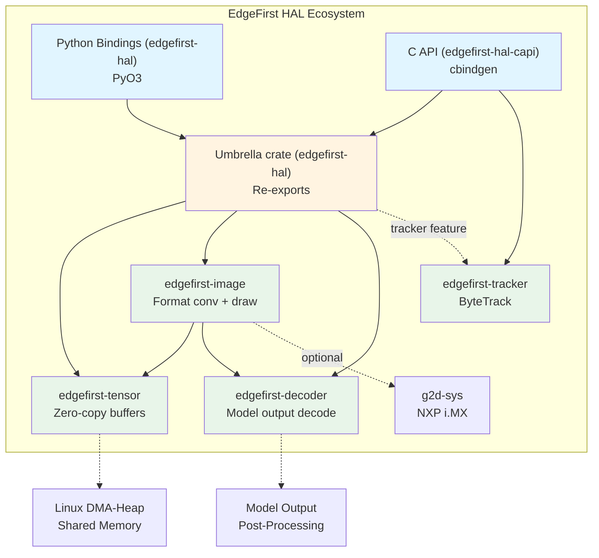
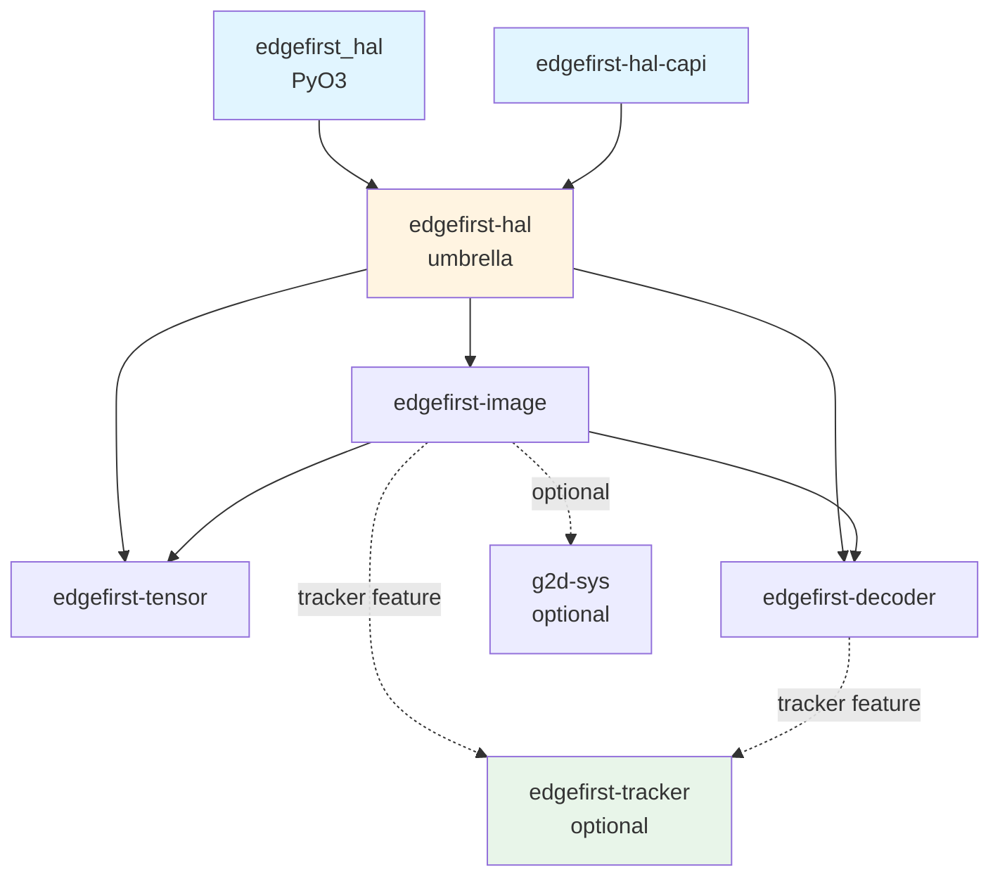

# EdgeFirst Hardware Abstraction Layer

[](https://github.com/EdgeFirstAI/hal/actions)
[](https://opensource.org/licenses/Apache-2.0)
[](https://crates.io/crates/edgefirst-hal)
[](https://pypi.org/project/edgefirst-hal/)

The EdgeFirst Hardware Abstraction Layer (HAL) is a Rust workspace that
provides hardware-accelerated tensor management, image processing, ML model
output decoding, and multi-object tracking for edge AI inference pipelines.
It ships as a Rust crate, a Python package, and a C library — same code,
three language surfaces — with Linux DMA-BUF, OpenGL ES, and NXP G2D
acceleration where the platform supports them, and a portable CPU fallback
everywhere else.

## Features

- **Zero-copy memory management** — DMA-BUF, POSIX shared memory, OpenGL PBO, and heap with automatic backend selection
- **Hardware-accelerated image processing** — OpenGL → G2D → CPU dispatch with shared cache infrastructure
- **YOLO + ModelPack decoding** — YOLOv5 / v8 / v11 / v26 (incl. end-to-end) and ModelPack post-processing
- **Multi-object tracking** — ByteTrack with Kalman filtering and stable per-track UUIDs
- **Cross-platform** — Linux (i.MX 8M Plus / i.MX 95 / desktop), macOS, with three CPU/GPU/DMA tiers
- **Production-ready** — used in the Au-Zone EdgeFirst suite for edge AI deployments

## Quick Start

### Installation

Python:

```bash
pip install edgefirst-hal
```

Rust:

```toml
[dependencies]
edgefirst-hal = "0.22"
```

C: download a release archive from
[GitHub Releases](https://github.com/EdgeFirstAI/hal/releases) and link
against `libedgefirst_hal.so` (or `.a`); see
[`crates/capi/README.md`](https://github.com/EdgeFirstAI/hal/blob/main/crates/capi/README.md)
for full instructions.

### Basic usage

**Python:**

```python
import edgefirst_hal as ef

img = ef.Tensor.load("image.jpg", ef.PixelFormat.Rgb)
processor = ef.ImageProcessor()
output = processor.create_image(640, 640, ef.PixelFormat.Rgb)
processor.convert(img, output)

decoder = ef.Decoder(config, 0.5, 0.45)
boxes, scores, classes, masks = decoder.decode([output0, output1])

# Fused decode + draw — masks never leave Rust
processor.draw_masks(decoder, [output0, output1], output)
```

**Rust:**

```rust
use edgefirst_image::{load_image, ImageProcessor, ImageProcessorTrait, Rotation, Flip, Crop};
use edgefirst_tensor::{PixelFormat, DType};

let bytes = std::fs::read("image.jpg")?;
let input = load_image(&bytes, Some(PixelFormat::Rgb), None)?;
let mut processor = ImageProcessor::new()?;
let mut output = processor.create_image(640, 640, PixelFormat::Rgb, DType::U8, None)?;
processor.convert(&input, &mut output, Rotation::None, Flip::None, Crop::default())?;
```

**C:**

```c
#include <edgefirst/hal.h>

struct hal_image_processor *proc = hal_image_processor_new();
struct hal_tensor *dst = hal_image_processor_create_image(
    proc, 640, 640, HAL_PIXEL_FORMAT_RGB, HAL_DTYPE_U8);
hal_image_processor_convert(proc, src, dst, HAL_ROTATION_NONE, HAL_FLIP_NONE, NULL);
```

Per-language quick-starts and richer examples live in each crate's README:
[Rust (`edgefirst-hal`)](https://github.com/EdgeFirstAI/hal/blob/main/crates/hal/README.md),
[C API](https://github.com/EdgeFirstAI/hal/blob/main/crates/capi/README.md),
[Python](https://github.com/EdgeFirstAI/hal/blob/main/crates/python/README.md).

## System Architecture


```mermaid
graph TB
    subgraph "EdgeFirst HAL Ecosystem"
        Python["Python Bindings (edgefirst-hal)<br/>PyO3"]
        CAPI["C API (edgefirst-hal-capi)<br/>cbindgen"]
        Main["Umbrella crate (edgefirst-hal)<br/>Re-exports"]

        Python --> Main
        CAPI --> Main

        Tensor["edgefirst-tensor<br/>Zero-copy buffers"]
        Image["edgefirst-image<br/>Format conv + draw"]
        Decoder["edgefirst-decoder<br/>Model output decode"]
        Tracker["edgefirst-tracker<br/>ByteTrack"]

        Main --> Tensor
        Main --> Image
        Main --> Decoder
        Main -.->|tracker feature| Tracker
        CAPI --> Tracker

        Image --> Tensor
        Image --> Decoder
        Image -.optional.-> G2D["g2d-sys<br/>NXP i.MX"]
    end

    Tensor -.-> DMA["Linux DMA-Heap<br/>Shared Memory"]
    Decoder -.-> PostProc["Model Output<br/>Post-Processing"]

    style Python fill:#e1f5ff
    style CAPI fill:#e1f5ff
    style Main fill:#fff4e1
    style Tensor fill:#e8f5e9
    style Image fill:#e8f5e9
    style Decoder fill:#e8f5e9
    style Tracker fill:#e8f5e9
```

## Core Components

| Crate | Role | Architecture | Testing |
|-------|------|--------------|---------|
| [`edgefirst-tensor`](https://github.com/EdgeFirstAI/hal/blob/main/crates/tensor/) | Zero-copy multi-dim buffers (DMA / SHM / Mem / PBO) | [ARCH](https://github.com/EdgeFirstAI/hal/blob/main/crates/tensor/ARCHITECTURE.md) | [TEST](https://github.com/EdgeFirstAI/hal/blob/main/crates/tensor/TESTING.md) |
| [`edgefirst-image`](https://github.com/EdgeFirstAI/hal/blob/main/crates/image/) | OpenGL / G2D / CPU image processor + mask rendering | [ARCH](https://github.com/EdgeFirstAI/hal/blob/main/crates/image/ARCHITECTURE.md) | [TEST](https://github.com/EdgeFirstAI/hal/blob/main/crates/image/TESTING.md) |
| [`edgefirst-decoder`](https://github.com/EdgeFirstAI/hal/blob/main/crates/decoder/) | YOLO + ModelPack post-processing, NMS, proto-mask APIs | [ARCH](https://github.com/EdgeFirstAI/hal/blob/main/crates/decoder/ARCHITECTURE.md) | [TEST](https://github.com/EdgeFirstAI/hal/blob/main/crates/decoder/TESTING.md) |
| [`edgefirst-tracker`](https://github.com/EdgeFirstAI/hal/blob/main/crates/tracker/) | ByteTrack multi-object tracking | [ARCH](https://github.com/EdgeFirstAI/hal/blob/main/crates/tracker/ARCHITECTURE.md) | [TEST](https://github.com/EdgeFirstAI/hal/blob/main/crates/tracker/TESTING.md) |
| [`edgefirst-hal`](https://github.com/EdgeFirstAI/hal/blob/main/crates/hal/) | Umbrella + tracing subscriber | [ARCH](https://github.com/EdgeFirstAI/hal/blob/main/crates/hal/ARCHITECTURE.md) | [TEST](https://github.com/EdgeFirstAI/hal/blob/main/crates/hal/TESTING.md) |
| [`edgefirst-hal-capi`](https://github.com/EdgeFirstAI/hal/blob/main/crates/capi/) | C ABI + Delegate DMA-BUF framework | [ARCH](https://github.com/EdgeFirstAI/hal/blob/main/crates/capi/ARCHITECTURE.md) | [TEST](https://github.com/EdgeFirstAI/hal/blob/main/crates/capi/TESTING.md) |
| `crates/python/` (PyPI: `edgefirst-hal`) | PyO3 bindings, numpy buffer protocol | [ARCH](https://github.com/EdgeFirstAI/hal/blob/main/crates/python/ARCHITECTURE.md) | [TEST](https://github.com/EdgeFirstAI/hal/blob/main/crates/python/TESTING.md) |

The deep dive on each component (class diagrams, supported operations,
backend dispatch, performance considerations) lives in the per-crate
`ARCHITECTURE.md`. The cross-cutting story (DMA-BUF identity, performance
tracing internals, design patterns) lives in the project
[ARCHITECTURE.md](https://github.com/EdgeFirstAI/hal/blob/main/ARCHITECTURE.md).

## Optimization Guide

This section is the **rules** part of the cross-language performance
contract. Each rule has a measurable cost when broken; see
[BENCHMARKS.md](https://github.com/EdgeFirstAI/hal/blob/main/BENCHMARKS.md)
for empirical penalties per platform,
[ARCHITECTURE.md](https://github.com/EdgeFirstAI/hal/blob/main/ARCHITECTURE.md)
for *why* the rule exists, and
[TESTING.md](https://github.com/EdgeFirstAI/hal/blob/main/TESTING.md#validating-optimizations)
for how to verify your integration follows it.

| Rule | Why it matters | Measured penalty when broken |
|------|----------------|------------------------------|
| Reuse tensors across frames | Each new tensor mints a fresh `BufferIdentity`; the EGL image cache misses every frame | 1.7–3.3× slower preprocessing on Vivante / Mali |
| Allocate via `ImageProcessor::create_image()` | Auto-selects DMA-buf / PBO / heap based on the active GPU; bypassing forces a slow transfer path | Forced `glTexSubImage2D` upload or full CPU readback |
| Cache imported camera tensors by **inode**, not by fd | V4L2 / libcamera recycle fd numbers across a small buffer pool; an fd-keyed cache misses on every frame even when the physical buffer is the same | Full EGL re-import per frame (≈0.5–1.5 ms on Vivante, doubled with chroma planes) |
| Build `Decoder` once, decode many | Decoder construction parses model metadata and allocates working buffers | Parse + alloc cost per frame |
| One `ImageProcessor` per pipeline | Each instance owns its own GL context, EGL display, and per-thread caches | Multiple GL contexts contend on the global `GL_MUTEX` |
| Use native fp16 / AVX build overrides only on supporting CPUs | These flags unlock native widening / vector paths for local perf testing | Unsupported targets may SIGILL or fail to build; portability loss |
| Pass numpy arrays straight to `Tensor.from_numpy()` — do not pre-`ascontiguousarray()` | HAL detects strided sources and materializes via numpy's vectorized C strided→contig pass; a manual workaround above HAL adds a redundant copy | Redundant pre-copy on every call (≈ 1.5 ms on a `(1, 116, 8400)` f32 view, rpi5-hailo) |
| For COCO/IoU evaluation use `MaskResolution::Scaled(orig_w, orig_h)`, not `Proto` | `Scaled` upsamples the proto plane *before* thresholding (clean sub-pixel edges); `Proto` thresholds at proto resolution and callers typically nearest-upsample (blocky) | Mask mAP regression of up to 0.04–0.05 absolute when `Proto` is nearest-upsampled |

> [!IMPORTANT]
> The single most common performance bug is calling `Tensor::from_fd()`
> (or `import_image()`) on every frame from a V4L2 / libcamera buffer
> pool. The HAL's internal EGL image cache cannot rescue you — the cache
> key includes a per-tensor monotonic ID that is fresh on every import.
> The fix lives in the **calling code**, not in HAL.

### Rule 1 — Reuse tensors across frames

Allocate input and output tensors once at pipeline startup; reuse the same
objects on every frame. The DMA memory backing a tensor is live: when an
upstream producer (V4L2 DQBUF, codec output, ISP) writes new pixels into
it, the existing tensor and its cached EGLImage remain valid. No
re-import, no re-allocation.

```rust
let mut proc = ImageProcessor::new()?;
let mut dst = proc.create_image(640, 640, PixelFormat::Rgb, DType::U8, None)?;

for frame in camera_frames {
    proc.convert(&frame, &mut dst, Rotation::None, Flip::None, Crop::default())?;
    run_inference(&dst)?;
}
```

```python
proc = ef.ImageProcessor()
dst = proc.create_image(640, 640, ef.PixelFormat.Rgb)
for frame in camera_frames:
    proc.convert(frame, dst)
    run_inference(dst)
```

### Rule 2 — Allocate via `ImageProcessor::create_image()`

`create_image()` selects the fastest memory backend for the active GPU at
construction time:

| Priority | Backend | Transfer | Platforms |
|----------|---------|----------|-----------|
| 1st | **DMA-buf** | Zero-copy EGLImage import | NXP i.MX 8M Plus, i.MX 95 |
| 2nd | **PBO** | Zero-copy GL buffer binding | NVIDIA desktop |
| 3rd | **Mem** (heap) | CPU memcpy fallback | All platforms |

The probe runs once at `ImageProcessor::new()` time. All subsequent
`create_image()` calls reuse the same backend. Use `create_image()` for
every destination passed to `convert()`; direct `Tensor::new(memory=...)`
bypasses the probe.

For DMA-buf access, the process needs `/dev/dma_heap/{linux,cma|system}`
and `/dev/dri/renderD128`. On embedded Linux, add the user to `video` and
`render` groups, or set udev rules. If DMA-buf fails, `create_image()`
transparently falls back to PBO or heap.

### Rule 3 — Cache imported camera tensors by inode, not by fd

V4L2, libcamera, and codec output all surface frames as DMA-BUF file
descriptors drawn from a small fixed pool (typically 4–16 buffers). The fd
**number** is recycled: the same fd can refer to a different physical
buffer between frames, and the same physical buffer can be exported with a
different fd over time. **A cache keyed by fd will produce false hits or
false misses.**

The kernel assigns each `dma_buf` object a unique inode in the anonymous
inode filesystem. The inode is constant for the buffer's lifetime
regardless of how many times it is exported. Cache imported HAL tensors
by `(inode, plane_offset)`:

```c
#include <sys/stat.h>

typedef struct { ino_t inode; size_t offset; } BufferKey;

struct stat st;
if (fstat(fd, &st) != 0) continue;
BufferKey key = { .inode = st.st_ino, .offset = plane_offset };

struct hal_tensor *tensor = lookup_tensor(cache, &key);
if (!tensor) {
    struct hal_plane_descriptor *pd = hal_plane_descriptor_new(fd);
    tensor = hal_import_image(proc, pd, NULL, w, h,
                              HAL_PIXEL_FORMAT_NV12, HAL_DTYPE_U8);
    insert_tensor(cache, &key, tensor);  // pd is consumed
}
hal_image_processor_convert(proc, tensor, dst, /* ... */);
```

```python
import os
buffer_cache: dict[tuple[int, int], ef.Tensor] = {}

def get_or_import(proc, fd, offset, width, height, fmt):
    key = (os.fstat(fd).st_ino, offset)
    t = buffer_cache.get(key)
    if t is None:
        t = proc.import_image(fd, width, height, fmt, "uint8", offset=offset)
        buffer_cache[key] = t
    return t
```

EdgeFirst's GStreamer elements implement this as a reference. For other
pipelines (libcamera direct, custom V4L2, RTSP decoder) you are
responsible for the equivalent layer above HAL. See
[ARCHITECTURE.md § Appendix C](https://github.com/EdgeFirstAI/hal/blob/main/ARCHITECTURE.md#appendix-c-dma-buf-identity-and-tensor-caching)
for the full identity-and-caching story.

### Rule 4 — Build the decoder once

`Decoder` parses the model output schema, resolves quantization, and
allocates working buffers at construction time. Build it once outside the
loop; the decoder clears its output vectors per call:

```rust
let decoder = DecoderBuilder::default()
    .with_config_yaml_str(config_yaml)
    .with_score_threshold(0.5)
    .with_iou_threshold(0.45)
    .build()?;

for frame in frames {
    let outputs = run_inference(frame)?;
    let refs: Vec<&TensorDyn> = outputs.iter().collect();
    decoder.decode(&refs, &mut boxes, &mut masks)?;
}
```

The same applies to `ByteTrack`: construct once, call `update()` per
frame.

### Rule 5 — One `ImageProcessor` per pipeline

`ImageProcessor` owns its EGL display, OpenGL context, GL thread, and EGL
image cache. Two instances do not share caches and serialize on a global
`GL_MUTEX`. Construct one per pipeline (or one per worker thread for
parallel pipelines) and share it across all `convert()`, `draw_*()`, and
`create_image()` calls.

`ImageProcessor` is `Send + Sync`, so it can be moved or shared across
threads. Concurrent use of a single shared instance still serializes on
`GL_MUTEX`; per-worker ownership gives more predictable cache behavior.

### Rule 6 — Local fp16 / AVX build overrides

The default HAL binary is built to the target triple's guaranteed
baseline ISA so a single distributed binary runs on every CPU within that
triple. Richer ISAs (ARMv8.2-FP16, x86_64 F16C / FMA / AVX2) are **not**
enabled by default; until HAL gains runtime CPU-feature detection with
dynamic dispatch, baking them in would SIGILL on older CPUs.

For local benchmarking on supporting hosts, enable them via `RUSTFLAGS`:

```bash
# Orin Nano (Cortex-A78AE)
RUSTFLAGS="-C target-cpu=cortex-a78ae" cargo build --release \
  --target aarch64-unknown-linux-gnu --workspace

# Generic aarch64 with FEAT_FP16 (do NOT use on Cortex-A53 / imx8mp)
RUSTFLAGS="-C target-feature=+fp16" cargo build --release \
  --target aarch64-unknown-linux-gnu -p edgefirst-image

# x86_64 Haswell+ (F16C + FMA + AVX2)
RUSTFLAGS="-C target-feature=+f16c,+fma,+avx2" cargo build --release \
  -p edgefirst-image
```

When active, the f16 mask kernel at
[`crates/image/src/cpu/masks.rs`](https://github.com/EdgeFirstAI/hal/blob/main/crates/image/src/cpu/masks.rs)
compiles to native widening (`fcvt` on aarch64, `vcvtph2ps` on x86_64),
and on x86_64 with `+f16c,+fma` an explicit 8-lane `_mm256_cvtph_ps +
_mm256_fmadd_ps` intrinsic path is enabled via cfg gate. Verify with
[`scripts/audit_f16_codegen.sh`](https://github.com/EdgeFirstAI/hal/blob/main/scripts/audit_f16_codegen.sh).

### Rule 7 — NumPy interop: pass arrays straight to `from_numpy()`

`Tensor.from_numpy()` (and the implicit copy from numpy arrays passed to
`Decoder.decode_proto()`) handles strided / non-contiguous sources
internally. Do **not** maintain a manual `np.ascontiguousarray()`
workaround — it wastes a copy.

The Python binding's `copy_numpy_to_tensor_dyn` selects one of three
paths based on the source array's layout:

| Source layout | Path | Cost |
|---|---|---|
| Fully contiguous | Single `copy_from_slice` (memcpy), rayon-parallel ≥ 256 KiB | Lower bound |
| Strided with contiguous inner rows (column slice, sub-volume, negative stride) | Per-row memcpy iterating outer dimensions | ≈ same as contiguous |
| Fully strided (transposed view, every-other-element) | Internal `np.ascontiguousarray()` materialisation, then Path 1 memcpy | ≈ 4× contiguous |

The fully-strided case is the one that bites users in practice: HailoRT's
natural output is `arr.transpose(0, 2, 1)` over a `(1, anchors,
channels)` buffer. PR #58 replaced the legacy element-wise loop with
internal `np.ascontiguousarray` materialization (≈ 4× faster than the
legacy loop, within ≈ 1.5× of the manual workaround).

```python
# Wrong (post-PR #58): adds an extra copy above HAL.
tensor.from_numpy(np.ascontiguousarray(arr_strided))

# Right: HAL detects the strided layout and materializes internally.
tensor.from_numpy(arr_strided)
```

The regression tests in
[`tests/test_tensor.py`](https://github.com/EdgeFirstAI/hal/blob/main/tests/test_tensor.py)
(`test_from_numpy_hailort_shape`,
`test_from_numpy_hailort_shape_perf_sanity`) pin the behaviour and the
≤ 1.5× perf bound.

### Rule 8 — Choose the correct `MaskResolution`

`ImageProcessor.materialize_masks()` accepts a `MaskResolution`
parameter:

| Mode | Output | Pipeline | When to use |
|------|--------|----------|-------------|
| `MaskResolution::Proto` (default) | `(roi_h, roi_w, 1)` u8 binary at 160×160 proto resolution | dot → sign threshold → emit | Real-time visualisation, when proto-resolution binary suffices |
| `MaskResolution::Scaled { width, height }` | `(roi_h, roi_w, 1)` u8 binary at requested resolution | dot → sigmoid → upsample to `(W, H)` → threshold (`>127`) | All COCO / IoU / mAP evaluation |

```python
# Wrong: threshold then upsample → blocky edges, mAP regression.
tiles = proc.materialize_masks(boxes, scores, classes, proto_data, letterbox=lb)
for tile, box in zip(tiles, boxes):
    binary = (tile[:, :, 0] > 127).astype(np.uint8)
    canvas[y:y+h, x:x+w] = cv2.resize(binary, (W, H), cv2.INTER_NEAREST)

# Right: HAL upsamples-then-thresholds inside its batched-GEMM kernel.
tiles = proc.materialize_masks(boxes, scores, classes, proto_data,
                               letterbox=lb,
                               resolution=hal.MaskResolution.Scaled(W, H))
for tile, box in zip(tiles, boxes):
    canvas[y:y+h, x:x+w] = (tile[:, :, 0] > 127).astype(np.uint8)
```

The `Scaled` path uses the batched-GEMM materializer (PR #54). At N ≥ 16
detections it amortizes a single GEMM at proto resolution and upsamples
per-detection in rayon-parallel — both more accurate than
threshold-then-resize *and* faster than per-detection scalar work in
caller code.

> [!TIP]
> If you see a mask-mAP gap between your HAL validator and a reference
> (ONNX / numpy) implementation, this rule is almost always the first
> thing to check.

### Where to go next

| Document | Level | Use it for |
|----------|-------|------------|
| [ARCHITECTURE.md § Performance Considerations](https://github.com/EdgeFirstAI/hal/blob/main/ARCHITECTURE.md#performance-considerations) | Architecture | Why the rules exist: `BufferIdentity`, EGL image cache, GL serialization |
| [ARCHITECTURE.md § Appendix C](https://github.com/EdgeFirstAI/hal/blob/main/ARCHITECTURE.md#appendix-c-dma-buf-identity-and-tensor-caching) | Architecture | The full v4l2 / GStreamer fd-recycling story and the inode-keyed cache pattern |
| [TESTING.md § Validating Optimizations](https://github.com/EdgeFirstAI/hal/blob/main/TESTING.md#validating-optimizations) | Testing | Confirming your integration follows the rules |
| [BENCHMARKS.md](https://github.com/EdgeFirstAI/hal/blob/main/BENCHMARKS.md) | Benchmarks | Empirical cost of breaking each rule, per platform |

## Platform Support

| Feature | Linux (i.MX) | Linux (other) | macOS | Windows |
|---------|--------------|---------------|-------|---------|
| DMA tensors | Yes | Yes | No | No |
| PBO tensors (GPU) | Yes | Yes | No | No |
| Shared memory tensors | Yes | Yes | Yes | Yes |
| Heap tensors | Yes | Yes | Yes | Yes |
| G2D acceleration | Yes | No | No | No |
| OpenGL acceleration | Yes (optional) | Yes (optional) | No | No |
| CPU fallback | Yes | Yes | Yes | Yes |

## Build System

The workspace builds with standard `cargo`. The
[`Makefile`](https://github.com/EdgeFirstAI/hal/blob/main/Makefile) wraps
the common workflows (`make test`, `make bench`, `make build`,
`make format lint check`) with the right flags and gates.

For Python wheels, see
[`crates/python/README.md`](https://github.com/EdgeFirstAI/hal/blob/main/crates/python/README.md)
and
[`crates/python/TESTING.md`](https://github.com/EdgeFirstAI/hal/blob/main/crates/python/TESTING.md).
For the C library and consumer linking, see
[`crates/capi/README.md`](https://github.com/EdgeFirstAI/hal/blob/main/crates/capi/README.md).

## Environment Variables

| Variable | Description |
|----------|-------------|
| `EDGEFIRST_TENSOR_FORCE_MEM` | `1` forces heap memory (disables DMA / SHM) |
| `EDGEFIRST_DISABLE_G2D` | Disable G2D backend |
| `EDGEFIRST_DISABLE_GL` | Disable OpenGL backend |
| `EDGEFIRST_DISABLE_CPU` | Disable CPU backend |
| `EDGEFIRST_FORCE_BACKEND` | Force one backend: `cpu`, `g2d`, or `opengl` (disables fallback) |
| `EDGEFIRST_FORCE_TRANSFER` | Force GL transfer: `pbo`, `dmabuf`, or `sync` |
| `EDGEFIRST_OPENGL_RENDERSURFACE` | `1` enables EGL renderbuffer path for non-`dma_heap` DMA-BUF (i.MX 95 Neutron NPU) |
| `EDGEFIRST_PROTO_COMPUTE` | `1` enables GLES 3.1 compute shader for HWC→CHW proto repack |
| `EDGEFIRST_TESTDATA_DIR` | Override testdata location (used by benches and CI) |
| `RUST_LOG` | Standard `env_logger` filter — `RUST_LOG=edgefirst_image=debug` for backend dispatch + cache stats |

Per-crate variables and additional detail live in each crate's README.

## Testing

See [TESTING.md](https://github.com/EdgeFirstAI/hal/blob/main/TESTING.md)
for the cross-cutting testing guide (single-threaded rule, on-target
gating, cross-compilation, CI matrix, optimization validation). Per-crate
testing detail lives in each crate's `TESTING.md` — links in the
[Core Components](#core-components) table.

## Benchmarking

| Binary | Crate | What it measures |
|--------|-------|------------------|
| `tensor_benchmark` | `edgefirst-tensor` | Tensor allocation and map/unmap latency across buffer types |
| `image_benchmark` | `edgefirst-image` | Crop, flip, rotate, resize, draw |
| `pipeline_benchmark` | `edgefirst-image` | Letterbox pipeline + format conversion |
| `mask_benchmark` | `edgefirst-image` | `draw_decoded_masks`, `draw_proto_masks`, hybrid path |
| `opencv_benchmark` | `edgefirst-image` | OpenCV baseline comparison |
| `decoder_benchmark` | `edgefirst-decoder` | YOLO post-processing, NMS, dequant |
| `tracker_benchmark` | `edgefirst-tracker` | ByteTrack throughput vs. simultaneous tracks |

Run on host:

```bash
cargo bench -p edgefirst-image --bench pipeline_benchmark -- --bench

# Force a backend
EDGEFIRST_FORCE_BACKEND=cpu cargo bench -p edgefirst-image --bench pipeline_benchmark -- --bench
```

Cross-compile + deploy to a target (SSH hostnames in `~/.ssh/config`:
`imx8mp-frdm`, `imx95-frdm`, `rpi5-hailo`, `jetson-orin-nano`,
`maivin`):

```bash
cargo-zigbuild build --target aarch64-unknown-linux-gnu --release \
  -p edgefirst-image --features opengl --bench pipeline_benchmark

scp target/aarch64-unknown-linux-gnu/release/deps/pipeline_benchmark-* imx8mp-frdm:/tmp/
ssh imx8mp-frdm '/tmp/pipeline_benchmark-* --bench --json /tmp/pipeline.json'
```

All benchmarks accept `--bench --json <path>` for structured output.
Store results under `benchmarks/<platform>/<name>.json`. Update
[BENCHMARKS.md](https://github.com/EdgeFirstAI/hal/blob/main/BENCHMARKS.md)
via:

```bash
python3 .github/scripts/generate_benchmark_tables.py --data-dir benchmarks/
```

## Performance Tracing

The HAL ships with built-in tracing for capturing detailed performance
traces across all processing stages. Traces use the Chrome JSON format
and view in [Perfetto UI](https://ui.perfetto.dev/).

### How it works

Every HAL library crate emits `tracing` spans on hot paths. These spans
have **near-zero overhead** when no subscriber is active — each site
compiles to a single relaxed atomic load. No heap allocations, no string
formatting, no function calls on the hot path.

When a session is started via the API, a Chrome JSON subscriber records
all span enter/exit events with high-resolution timestamps and structured
metadata (detection counts, proto dimensions, format conversions, memory
types, etc.) to a file.

### Span coverage

The tracing surface covers decode, image conversion, GL multi-pass, mask
materialization, tensor lifecycle, tracker association, and the Python
entry points. Each span carries structured fields — see the per-crate
ARCHITECTURE.md files for the authoritative list of spans and fields per
component.

### Enabling tracing

Python:

```python
import edgefirst_hal as hal
with hal.Tracing("/tmp/trace.json"):
    # ... run inference pipeline ...
    pass
```

Rust:

```rust
use edgefirst_hal::trace::{start_tracing, stop_tracing};

start_tracing("/tmp/trace.json").expect("start tracing");
// ... inference pipeline ...
stop_tracing(); // flushes and closes the trace file
```

C:

```c
#include <edgefirst/hal.h>
hal_start_tracing("/tmp/trace.json");
/* ... inference pipeline ... */
hal_stop_tracing();
```

### Viewing traces

1. Open <https://ui.perfetto.dev/>
2. Drag the generated `.json` file onto the page
3. Click slices to see structured fields in the *Current Selection* panel

### Using traces for optimization

The tracing infrastructure complements the rules in the
[Optimization Guide](#optimization-guide) and the data in
[BENCHMARKS.md](https://github.com/EdgeFirstAI/hal/blob/main/BENCHMARKS.md):

1. **Identify bottlenecks** — common findings:
   - `extract_proto > 3 ms` → model emits NCHW protos but HAL is transposing (check the `layout` field)
   - `cpu_format_convert` appearing twice → intermediate format conversion (consider matching src/dst formats)
   - `tensor_alloc` per-frame → tensors not being reused (Rule 1)
2. **Validate rules** — re-run with tracing after applying a rule to confirm the expected spans disappear or shrink.
3. **Cross-reference with `perf`** — for CPU-bound spans, combine trace data with `perf record` for instruction-level hotspots.

### Limitations

- Only one trace session per process lifetime (Rust global subscriber model).
- Rayon worker spans are not automatically parented to the calling span.
- The `log::*` output (via `env_logger` / C callback logger) operates independently from trace capture; both can be active simultaneously.

## Dependencies

### Key external dependencies

- [PyO3](https://pyo3.rs) — Python bindings
- [ndarray](https://docs.rs/ndarray) — N-dimensional arrays
- [rayon](https://docs.rs/rayon) — Data parallelism
- [fast_image_resize](https://docs.rs/fast_image_resize) — CPU image operations
- [zune-jpeg](https://docs.rs/zune-jpeg) / [zune-png](https://docs.rs/zune-png) — Image decoding
- [dma-heap](https://docs.rs/dma-heap) — Linux DMA allocation
- [nix](https://docs.rs/nix) — Unix system calls

### Internal dependency graph


```mermaid
graph TD
    EF[edgefirst-hal<br/>umbrella]
    Tensor[edgefirst-tensor]
    Image[edgefirst-image]
    Decoder[edgefirst-decoder]
    Tracker[edgefirst-tracker<br/>optional]
    G2D[g2d-sys<br/>optional]

    EF --> Tensor
    EF --> Image
    EF --> Decoder
    Image --> Tensor
    Image --> Decoder
    Image -.optional.-> G2D
    Image -.->|tracker feature| Tracker
    Decoder -.->|tracker feature| Tracker

    Python[edgefirst_hal<br/>PyO3]
    CAPI[edgefirst-hal-capi]

    Python --> EF
    CAPI --> EF

    style EF fill:#fff4e1
    style Python fill:#e1f5ff
    style CAPI fill:#e1f5ff
    style Tracker fill:#e8f5e9
```

## Future Considerations

1. **Model HAL** — planned abstraction for inference engines (ONNX, TFLite, Kinara)
2. **VPI integration** — support for NVIDIA Vision Programming Interface
3. **Additional trackers** — SORT, Deep SORT
4. **Async I/O** — non-blocking image loading and processing
5. **GPU compute** — Vulkan / CUDA backends for custom operations

## Support

### Community resources

- [GitHub Discussions](https://github.com/EdgeFirstAI/hal/discussions) — questions and ideas
- [Issue Tracker](https://github.com/EdgeFirstAI/hal/issues) — bug reports and feature requests

### EdgeFirst ecosystem

This project is part of the EdgeFirst Perception stack:

- [**EdgeFirst Studio**](https://edgefirst.studio?utm_source=github&utm_medium=readme&utm_campaign=hal) — complete MLOps platform
- [**EdgeFirst Hardware Platforms**](https://au-zone.com/hardware?utm_source=github&utm_medium=readme&utm_campaign=hal) — NPU/GPU acceleration on NXP i.MX

### Professional services

Au-Zone Technologies offers comprehensive support for production
deployments: training & workshops, custom development, integration
services, enterprise SLAs, and hardware reference designs.

Contact: <support@au-zone.com> · [au-zone.com](https://au-zone.com?utm_source=github&utm_medium=readme&utm_campaign=hal)

## Contributing

We welcome contributions! Please see
[CONTRIBUTING.md](https://github.com/EdgeFirstAI/hal/blob/main/CONTRIBUTING.md)
for development setup and guidelines. This project follows our
[Code of Conduct](https://github.com/EdgeFirstAI/hal/blob/main/CODE_OF_CONDUCT.md).

## Security

For security vulnerabilities, see
[SECURITY.md](https://github.com/EdgeFirstAI/hal/blob/main/SECURITY.md)
or email <support@au-zone.com> with subject "Security Vulnerability".

## Documentation

- [ARCHITECTURE.md](https://github.com/EdgeFirstAI/hal/blob/main/ARCHITECTURE.md) — cross-crate architecture story
- [TESTING.md](https://github.com/EdgeFirstAI/hal/blob/main/TESTING.md) — workspace testing rules and CI matrix
- [BENCHMARKS.md](https://github.com/EdgeFirstAI/hal/blob/main/BENCHMARKS.md) — empirical performance reference
- [CHANGELOG.md](https://github.com/EdgeFirstAI/hal/blob/main/CHANGELOG.md) — release history
- Per-crate docs (README + ARCHITECTURE + TESTING) — see [Core Components](#core-components) table

## License

Apache License 2.0 — see [LICENSE](https://github.com/EdgeFirstAI/hal/blob/main/LICENSE) for details.

Copyright 2025-2026 Au-Zone Technologies
