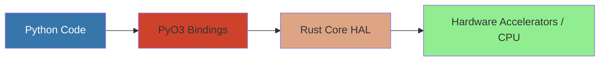

# EdgeFirst Hardware Abstraction Layer

[](https://github.com/EdgeFirstAI/hal/actions)
[](https://opensource.org/licenses/Apache-2.0)
[](https://crates.io/crates/edgefirst)
[](https://pypi.org/project/edgefirst-hal/)

The EdgeFirst Hardware Abstraction Layer (HAL) is a Rust-based system that provides hardware-accelerated abstractions for computer vision and machine learning tasks on embedded Linux platforms. The HAL consists of multiple specialized crates that work together to provide high-performance image processing, tensor operations, model inference decoding, and object tracking.

## Features

- ✨ **Zero-Copy Memory Management** - DMA-heap optimized tensors with automatic fallback
- 🚀 **Hardware-Accelerated Image Processing** - G2D, OpenGL, and optimized CPU paths
- 🎯 **YOLO Decoder** - YOLOv5/v8/v11 detection and segmentation support
- 🔌 **Python Bindings** - PyO3-based API with numpy integration
- ⚡ **Multi-Object Tracking** - ByteTrack algorithm with Kalman filtering
- 🔧 **Cross-Platform** - Linux (i.MX optimized), macOS, Windows support
- 📊 **Mixed Precision** - Support for quantized and float models
- 🏭 **Production Ready** - The EdgeFirst suite of components for production AI deployments at the edge.
- 🖥️ **Hardware Optimized** - Accelerated on NXP i.MX platforms with NPU/GPU support

## Quick Start

### Installation

#### Python
```bash
pip install edgefirst-hal
```

#### Rust
```toml
[dependencies]
edgefirst = "0.1.0"
```

### Basic Usage

#### Python
```python
import edgefirst_hal as ef

# Load and process image
img = ef.TensorImage.load("image.jpg", ef.FourCC.RGB)
converter = ef.ImageProcessor()
output = ef.TensorImage(640, 640)
converter.convert(img, output)

# Decode YOLO outputs
decoder = ef.Decoder(config, 0.5, 0.45)
boxes, scores, classes = decoder.decode([output0, output1])
```

#### Rust
```rust
use edgefirst::image::{TensorImage, ImageProcessor};
use edgefirst::decoder::Decoder;

// Load and process image
let input = TensorImage::load("image.jpg", Some(RGB), None)?;
let mut converter = ImageProcessor::new()?;
let mut output = TensorImage::new(640, 640, RGB, None)?;
converter.convert(&input, &mut output, Default::default())?;

// Decode model outputs
let decoder = Decoder::new(config, 0.5, 0.45)?;
let (boxes, scores, classes) = decoder.decode_detection(&outputs)?;
```

## System Architecture


## Core Components

### 1. Tensor HAL (`edgefirst_tensor`)

**Purpose**: Provides zero-copy memory buffers optimized for hardware accelerators.

**Architecture**:


**Key Features**:
- Generic over numeric types (u8, i8, u16, i16, u32, i32, u64, i64, f32, f64)
- Automatic memory type selection with fallback chain: DMA → Shared Memory → Heap
- Memory mapping with `TensorMap<T>` for safe access
- File descriptor sharing for zero-copy IPC
- Cross-platform support (Linux optimized, macOS/Windows via heap memory)

**Memory Type Selection Logic**:


### 2. Image HAL (`edgefirst_image`)

**Purpose**: Hardware-accelerated image format conversion and resizing.

**Architecture**:


**Supported Operations**:
- Format conversion (YUYV, NV12, RGB, RGBA, GREY, Planar RGB)
- Resize with various interpolation methods
- Rotation (0°, 90°, 180°, 270°)
- Flip (horizontal, vertical)
- Crop and region-of-interest
- Normalization (signed, unsigned, raw)

**Planar RGB Format**:
Planar RGB (FourCC: 8BPS) stores color channels in separate planes rather than interleaved. This format is particularly useful for:
- Neural network preprocessing where planar layout is required
- Hardware accelerators that prefer planar data
- Efficient SIMD operations on individual color channels
- GPU texture operations via OpenGL with swizzled grayscale textures

**TensorImage Flow**:


### 3. Decoder HAL (`edgefirst_decoder`)

**Purpose**: Post-processing for object detection and segmentation model outputs.

**Supported Decoders**:
- **YOLO** (YOLOv5, YOLOv8, YOLOv11)
  - Object detection
  - Instance segmentation
  - Split output format support
  - Mixed data type support (different types per input tensor)
- **ModelPack** (Au-Zone proprietary format)
  - Detection with anchor-based decoding

**Architecture**:


```mermaid
flowchart LR
    Builder[DecoderBuilder]
    Decoder[Decoder]
    Det[decode_detection<br/>→ bboxes, scores, classes]
    Seg[decode_segmentation<br/>→ bboxes, scores, classes, masks]
    
    Builder --> Decoder
    Decoder --> Det
    Decoder --> Seg
    
    style Builder fill:#e1f5ff
    style Decoder fill:#fff4e1
    style Det fill:#e8f5e9
    style Seg fill:#e8f5e9
```

**Detection Pipeline**:

```mermaid
flowchart TD
    Raw[Model Raw Output<br/>quantized or float]
    
    Quant{Quantized?}
    Dequant[Dequantization<br/>scale, zero_point]
    
    Parse[Parse boxes & scores<br/>XYWH → XYXY conversion]
    NMS[Non-Maximum Suppression<br/>IoU threshold filtering]
    Filter[Filter by score threshold]
    
    Det[Detection boxes<br/>bbox, score, class]
    Seg[Segmentation masks<br/>per-box mask matrices]
    
    Raw --> Quant
    Quant -->|Yes| Dequant
    Quant -->|No| Parse
    Dequant --> Parse
    Parse --> NMS
    NMS --> Filter
    Filter --> Det
    Filter --> Seg
    
    style Raw fill:#e1f5ff
    style Dequant fill:#fff4e1
    style NMS fill:#ffeb9c
    style Det fill:#90ee90
    style Seg fill:#90ee90
```


### 4. Tracker HAL (`edgefirst_tracker`)

**Purpose**: Multi-object tracking across video frames.

**Implementation**: ByteTrack algorithm with Kalman filtering

**Architecture**:


**Tracking Flow**:


### 5. Python Bindings (`edgefirst-hal`)

**Purpose**: Expose HAL functionality to Python via PyO3.

**Exposed Classes**:
- `PyTensor`: Generic tensor with numpy buffer protocol
- `PyTensorImage`: Image container with format metadata
- `PyImageProcessor`: Image processing operations
- `PyDecoder`: Model output decoding
- `FourCC`, `Normalization`, `PyRect`, `PyRotation`, `PyFlip`: Configuration enums

**Python Integration**:


### 6. G2D FFI (`g2d-sys`)

**Purpose**: Foreign Function Interface to NXP i.MX G2D library.

**Architecture**:
- Raw FFI bindings via bindgen
- Safe Rust wrapper types
- IOCTL interface for DMA buffer operations
- Version detection and capability queries

## Advanced Examples

<details>
<summary><b>Rust Examples</b></summary>

### Image Conversion

```rust
use edgefirst::image::{TensorImage, ImageProcessor, RGBA, RGB};
use edgefirst::tensor::TensorMemory;

// Load image from JPEG
let input = TensorImage::load("testdata/zidane.jpg", Some(RGB), None)?;

// Create converter (auto-selects G2D or CPU)
let mut converter = ImageProcessor::new()?;

// Create output buffer
let mut output = TensorImage::new(640, 640, RGB, Some(TensorMemory::Dma))?;

// Convert and resize
converter.convert(&input, &mut output, Default::default())?;
```

### Detection Decoding

```rust
use edgefirst::decoder::Decoder;
use std::collections::HashMap;

// Build decoder from configuration dictionary/JSON
let config: HashMap<String, serde_json::Value> = 
    serde_json::from_str(&config_json)?;

let decoder = Decoder::new(config, 0.5, 0.45)?;  // score_thresh, iou_thresh

// Decode model outputs (supports mixed types per tensor)
let outputs = vec![boxes_tensor, scores_tensor];
let (bboxes, scores, classes) = decoder.decode_detection(&outputs)?;
```

### Multi-Frame Tracking

```rust
use edgefirst::tracker::{ByteTrack, Tracker, DetectionBox};

let mut tracker = ByteTrack::default();

for frame in video_frames {
    let detections = run_detection(frame)?;
    let track_infos = tracker.update(&detections, frame.timestamp);
    
    for track_info in track_infos {
        println!("Object {}: {:?}", track_info.uuid, track_info.tracked_location);
    }
}
```

### Zero-Copy Tensor Sharing

```rust
use edgefirst::tensor::{Tensor, TensorTrait};

// Create tensor in process A
let tensor = Tensor::<u8>::new(&[1920, 1080, 3], None, Some("frame1"))?;
let fd = tensor.clone_fd()?;

// Send fd to process B (via Unix domain socket, etc.)
// ...

// Process B recreates tensor from fd
let shared_tensor = Tensor::<u8>::from_fd(fd, &[1920, 1080, 3], None)?;
```

</details>

<details>
<summary><b>Python Examples</b></summary>

### Image Processing

```python
import edgefirst_hal as ef
import numpy as np

# Load image from file
tensor_img = ef.TensorImage.load("testdata/zidane.jpg", ef.FourCC.RGB)

# Create converter
converter = ef.ImageProcessor()

# Create output image
output = ef.TensorImage(640, 640)

# Resize with hardware acceleration
converter.convert(tensor_img, output)

# Convert to numpy for processing
output_array = np.zeros((640, 640, 3), dtype=np.uint8)
output.normalize_to_numpy(output_array)
```

### Object Detection

```python
import edgefirst_hal
import numpy as np

# Create decoder from config dict or YAML
decoder = edgefirst_hal.Decoder(config_dict, 0.5, 0.45)

# Decode outputs (automatically handles quantization)
boxes, scores, classes = decoder.decode([output0, output1])
```

</details>

## Design Patterns

### 1. Trait-Based Polymorphism

The HAL uses Rust traits extensively to provide polymorphic behavior:
- `TensorTrait<T>`: Common interface for all tensor types
- `ImageProcessorTrait`: Common interface for all image converters
- `DetectionBox`: Trait for objects with bounding boxes

### 2. Enum Dispatch

Uses `enum_dispatch` crate for zero-cost polymorphism without dynamic dispatch overhead.

### 3. Builder Pattern

Complex objects use the builder pattern (e.g., `DecoderBuilder`) for flexible construction.

### 4. Zero-Copy Operations

Extensive use of:
- Memory-mapped file descriptors
- Slice views into tensors
- ndarray views for array operations

### 5. Hardware Fallback Chain

Operations try hardware accelerators first, falling back to CPU implementations gracefully.

### 6. Type-Safe Foreign Interfaces

Raw FFI bindings are wrapped in safe Rust types that enforce correct usage at compile time.

### 7. Python Wrapper Naming Convention

Python wrapper types use a `Py` prefix (e.g., `PyTensor`, `PyTensorImage`) to clearly distinguish them from their Rust counterparts (`Tensor`, `TensorImage`). This convention makes it explicit which types are Python-facing and which are internal Rust types.

## Performance Considerations

### Memory Allocation Strategy

1. **DMA Heap**: Fastest for hardware accelerators, zero-copy to GPU/NPU
2. **Shared Memory**: Fast for IPC, works across processes
3. **Heap Memory**: Fallback for compatibility, still performant with SIMD

### Image Processing Strategy

1. **G2D**: ~10-50x faster than CPU for format conversion and resize on i.MX
2. **OpenGL**: GPU-accelerated, good for complex pipelines
3. **CPU (SIMD)**: Fallback with Rayon parallelization

### Decoder Optimization

- Quantized integer math where possible
- Vectorized operations via ndarray
- Parallel processing with Rayon
- Early termination in NMS loops

## Thread Safety

All major types implement `Send + Sync`:
- `Tensor<T>`: Safe to share across threads
- `TensorImage`: Thread-safe
- `ImageProcessor`: Thread-local (create per thread)
- `Decoder`: Thread-safe for read operations

## Error Handling

Consistent error handling throughout:
- Custom `Result<T, Error>` types per crate following the standard Rust pattern
- Each crate defines its own `Error` enum (e.g., `tensor::Error`, `image::Error`, `decoder::Error`)
- Errors are enums with context
- Conversion to PyErr for Python bindings
- All public APIs return `Result<T, Error>` for fallible operations

## Platform Support

| Feature | Linux (i.MX) | Linux (Generic) | macOS | Windows |
|---------|--------------|-----------------|-------|---------|
| DMA Tensors | ✅ | ✅ | ❌ | ❌ |
| Shared Memory Tensors | ✅ | ✅ | ✅ | ✅ |
| Heap Tensors | ✅ | ✅ | ✅ | ✅ |
| G2D Acceleration | ✅ | ❌ | ❌ | ❌ |
| OpenGL Acceleration | ✅ (optional) | ✅ (optional) | ❌ | ❌ |
| CPU Fallback | ✅ | ✅ | ✅ | ✅ |

## Build System

- **Workspace**: Cargo workspace with 7 crates
- **Build Scripts**: Custom build.rs for PyO3 configuration
- **Features**: Conditional compilation for hardware features
- **Profiles**: Release, profiling, and debug profiles

### Building Python Bindings

The Python bindings are built using `maturin`, which is the standard build tool for PyO3-based Python packages:

```bash
# Development build (editable install)
maturin develop -m crates/python/Cargo.toml

# Production build
maturin build -m crates/python/Cargo.toml --release

# Install from wheel
pip install target/wheels/edgefirst_hal-*.whl
```

**Note**: `maturin` is the recommended and standard way to build PyO3 Python extensions. It handles the complex linking requirements between Python and Rust automatically.

## Testing

The HAL includes comprehensive test coverage across Rust and Python:

### Rust Tests
```bash
# Run all Rust tests
cargo test --workspace

# Run tests for specific crate
cargo test -p edgefirst_image
cargo test -p edgefirst_decoder
cargo test -p edgefirst_tensor
```

### Python Tests
Python tests are located in the `tests/` directory and use the pytest framework:

```bash
# First, build the Python bindings
maturin develop -m crates/python/Cargo.toml

# Run all Python tests
python -m pytest tests/

# Run specific test modules
python -m pytest tests/image/
python -m pytest tests/decoder/
python -m pytest tests/test_tensor.py
```

Python tests require the Pillow library for the image tests, which can be installed using:
```bash
python -m pip install pillow
```

**Note**: Python tests require the Python bindings to be built via `maturin develop` first, as they test the PyO3 interface.

## Dependencies

### Key External Dependencies

- **PyO3**: Python bindings
- **ndarray**: N-dimensional arrays
- **rayon**: Data parallelism
- **fast_image_resize**: CPU image operations
- **zune-jpeg/zune-png**: Image decoding
- **dma-heap**: Linux DMA allocation
- **nix**: Unix system calls
- **four-char-code**: FourCC format codes

### Internal Dependency Graph


## Future Considerations

1. **Model HAL**: Planned abstraction for inference engines (ONNX, TFLite, Kinara)
2. **VPI Integration**: Support for NVIDIA Vision Programming Interface
3. **Additional Trackers**: SORT, Deep SORT implementations
4. **Async I/O**: Non-blocking image loading and processing
5. **GPU Compute**: Vulkan/CUDA backends for custom operations

## Support

### Community Resources

- 📚 [Documentation](docs/) - Comprehensive guides and tutorials
- 💬 [GitHub Discussions](https://github.com/EdgeFirstAI/hal/discussions) - Ask questions and share ideas
- 🐛 [Issue Tracker](https://github.com/EdgeFirstAI/hal/issues) - Report bugs and request features

### EdgeFirst Ecosystem

This project is part of the EdgeFirst Perception stack:

- **[EdgeFirst Studio](https://edgefirst.studio?utm_source=github&utm_medium=readme&utm_campaign=hal)** - Complete MLOps Platform
  - Deploy and manage edge AI models at scale
  - Real-time performance monitoring and analytics
  - Model optimization for edge devices
  - Free tier available for development

- **[EdgeFirst Hardware Platforms](https://au-zone.com/hardware?utm_source=github&utm_medium=readme&utm_campaign=hal)** - Optimized Platforms
  - NPU/GPU acceleration support on NXP i.MX platforms
  - Reference designs available
  - Custom hardware development services

### Professional Services

Au-Zone Technologies offers comprehensive support for production deployments:

- **Training & Workshops** - Get your team up to speed quickly with expert-led sessions
- **Custom Development** - Extend HAL capabilities for your specific use case
- **Integration Services** - Seamless integration with your existing systems and workflows
- **Enterprise Support** - SLAs, priority fixes, and dedicated engineering support
- **Hardware Platforms** - Reference designs, customization, and production services

📧 Contact: support@au-zone.com | 🌐 Learn more: [au-zone.com](https://au-zone.com?utm_source=github&utm_medium=readme&utm_campaign=hal)

## Contributing

We welcome contributions! Please see [CONTRIBUTING.md](CONTRIBUTING.md) for development setup and guidelines.

This project follows our [Code of Conduct](CODE_OF_CONDUCT.md).

## Security

For security vulnerabilities, please see [SECURITY.md](SECURITY.md) or email support@au-zone.com with subject "Security Vulnerability".

## Documentation

- [User Guide](docs/) - Comprehensive usage documentation
- [API Reference](docs/api/) - Detailed API documentation
- [Examples](examples/) - Sample code and tutorials
- [CHANGELOG.md](CHANGELOG.md) - Version history and release notes

## License

Apache License 2.0 - see [LICENSE](LICENSE) for details.

Copyright 2025 Au-Zone Technologies
