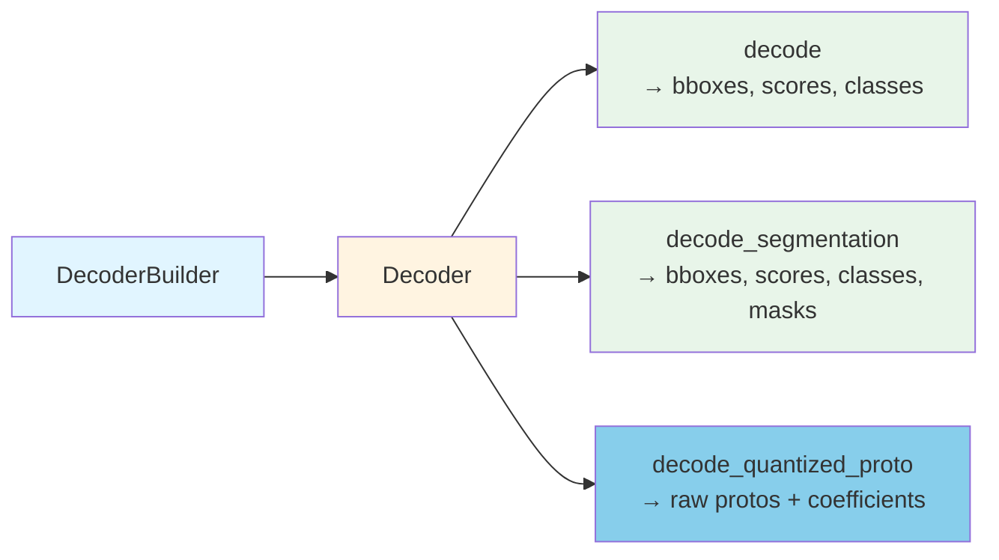
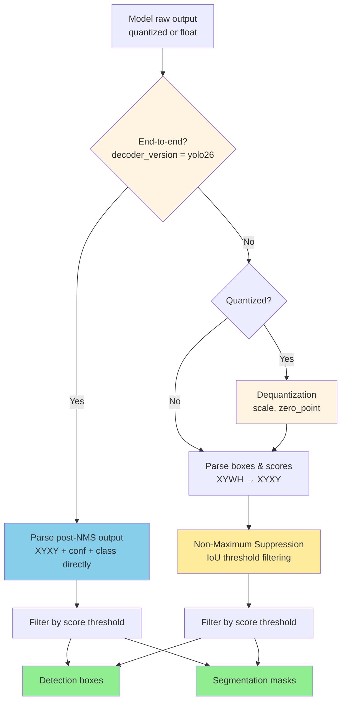

# edgefirst-decoder Architecture

## Overview

`edgefirst-decoder` is the post-processing layer that turns raw inference
outputs from object-detection and segmentation models into typed
`DetectBox` and `Segmentation` values. It supports both floating-point and
quantized (int8 / uint8) inputs without an intermediate dequantization
buffer, configurable NMS modes, end-to-end YOLOv26 models with embedded NMS,
and a fused proto-mask GPU rendering path that bypasses CPU mask
materialization. The crate is configured through a single
[`DecoderBuilder`](https://docs.rs/edgefirst-decoder/latest/edgefirst_decoder/struct.DecoderBuilder.html)
that ingests JSON or YAML model metadata and selects the right code path
based on the output tensor layout.

## Module Map

| Module | Source | Responsibility |
|--------|--------|----------------|
| [`lib.rs`](https://github.com/EdgeFirstAI/hal/blob/main/crates/decoder/src/lib.rs) | local | Public surface: `Decoder`, `DetectBox`, `Segmentation`, `Quantization`, `BoundingBox`, dequantize utilities |
| [`decoder/`](https://github.com/EdgeFirstAI/hal/blob/main/crates/decoder/src/decoder/) | local | `DecoderBuilder`, `ConfigOutputs`, model-type selection, per-scale bridge, post-processing |
| [`yolo.rs`](https://github.com/EdgeFirstAI/hal/blob/main/crates/decoder/src/yolo.rs) | local | YOLOv5/8/11 detection + segmentation kernels |
| [`modelpack.rs`](https://github.com/EdgeFirstAI/hal/blob/main/crates/decoder/src/modelpack.rs) | local | Au-Zone ModelPack format kernels |
| [`per_scale/`](https://github.com/EdgeFirstAI/hal/blob/main/crates/decoder/src/per_scale/) | local | Per-scale split-tensor decoder framework (NEON-optimized hot path) |
| [`schema.rs`](https://github.com/EdgeFirstAI/hal/blob/main/crates/decoder/src/schema.rs) | local | `SchemaV2` parser — model metadata document used by EdgeFirst Studio |
| [`float.rs`](https://github.com/EdgeFirstAI/hal/blob/main/crates/decoder/src/float.rs) / [`byte.rs`](https://github.com/EdgeFirstAI/hal/blob/main/crates/decoder/src/byte.rs) | local | NMS implementations (float and byte-quantized); `float.rs` also holds the IoU/IoS metric helpers reused by tiled merge |
| [`tiling.rs`](https://github.com/EdgeFirstAI/hal/blob/main/crates/decoder/src/tiling.rs) | local | SAHI output side: shared `TilePlacement` contract, `MatchMetric`/`MergeConfig`, `lift_tile_boxes`, GREEDYNMM `merge_tiled_detections`, and the streaming `TiledFrameAccumulator` (fan-in fence) |
| [`error.rs`](https://github.com/EdgeFirstAI/hal/blob/main/crates/decoder/src/error.rs) | local | `DecoderError`, `DecoderResult` |

## Key Types and Traits

- [`Decoder`](https://docs.rs/edgefirst-decoder/latest/edgefirst_decoder/struct.Decoder.html) — built once, then called per inference frame.
- [`DecoderBuilder`](https://docs.rs/edgefirst-decoder/latest/edgefirst_decoder/struct.DecoderBuilder.html) — fluent configuration with sensible defaults; consumes JSON/YAML or programmatic `ConfigOutputs`.
- [`DetectBox`](https://docs.rs/edgefirst-decoder/latest/edgefirst_decoder/struct.DetectBox.html) — output bounding box + score + class label.
- [`Segmentation`](https://docs.rs/edgefirst-decoder/latest/edgefirst_decoder/struct.Segmentation.html) — per-detection mask matrix.
- [`Quantization`](https://docs.rs/edgefirst-decoder/latest/edgefirst_decoder/struct.Quantization.html) — `(scale, zero_point)` for int8/uint8 outputs.
- [`Nms`](https://docs.rs/edgefirst-decoder/latest/edgefirst_decoder/configs/enum.Nms.html) — `Auto` / `ClassAgnostic` / `ClassAware`. Bypass is expressed as `Option<Nms>::None` on the decoder configuration, not a variant of the enum.
- [`SchemaV2`](https://docs.rs/edgefirst-decoder/latest/edgefirst_decoder/schema/struct.SchemaV2.html) — model metadata document (current schema version).

## Internal Architecture

### Builder → Decoder



### Detection pipeline



### Model-type selection

The builder classifies a model's output topology by **shape alone**, not by
output count. The result is one of:

| Variant | Tensors | Format |
|---------|---------|--------|
| `YoloDet` | 1 (detection) | Standard YOLO detection |
| `YoloSegDet` | 2 (detection + protos) | YOLO detection + segmentation |
| `YoloSegDet2Way` | 3 (detection + mask_coefs + protos) | INT8 segmentation with separate mask-coef quant scale |
| `YoloSplitDet` | 2 (boxes + scores) | Split-output detection |
| `YoloSplitSegDet` | 4 (boxes + scores + mask_coefs + protos) | Split-output segmentation |
| `YoloEndToEndDet` | 1 | Post-NMS `[B, N, 6+]` |
| `YoloEndToEndSegDet` | 2 | Post-NMS + protos |
| `YoloSplitEndToEndDet` | 3 | Split post-NMS (boxes + scores + classes) |
| `YoloSplitEndToEndSegDet` | 5 | Split post-NMS + mask_coefs + protos |
| `ModelPackDet` | 2 (boxes + scores) | ModelPack detection |
| `ModelPackSegDet` | 3 (boxes + scores + segmentation) | ModelPack segmentation |
| `ModelPackDetSplit` | N (detection layers) | ModelPack split detection |
| `ModelPackSegDetSplit` | N+1 (detection layers + segmentation) | ModelPack split segmentation |
| `ModelPackSeg` | 1 (segmentation) | ModelPack semantic segmentation |

#### `YoloSegDet2Way` shape-based classification

INT8 TFLite segmentation models split mask coefficients off the combined
detection tensor because the unbounded linear projection that produces them
needs a separate quantization scale from the (bounded, similarly-ranged)
boxes and class scores. The builder identifies the three outputs by shape:

| Output | Shape | Identification rule |
|--------|-------|---------------------|
| `detection` | `[1, nc+4, N]` | 3D, feature_dim ≠ 32 |
| `mask_coefs` | `[1, 32, N]` | 3D, feature_dim == 32 |
| `protos` | `[1, H/4, W/4, 32]` | 4D |

The feature dimension is the smaller of the two non-batch dimensions
(channels-first: `shape[1]`; channels-last: `shape[2]`).

**Edge case (nc=28):** when `num_classes + 4 == 32`, detection and
`mask_coefs` collide on feature dim. In this case the model emits 2 outputs
(unsplit detection + protos) and is decoded as `YoloSegDet`.

#### YOLOv26 end-to-end selection

`decoder_version: "yolo26"` triggers `DecoderVersion::is_end_to_end() == true`
and selects one of the `YoloEndToEnd*` variants. NMS is bypassed entirely;
the model emits post-NMS `[B, N, 6+]` rows of `(x1, y1, x2, y2, conf,
class, ...)`.

For non-end-to-end YOLO26 exports (`end2end=false`), use
`decoder_version: "yolov8"` with an explicit `nms` configuration.

### Output tensor physical-order contract

Every output declared to the decoder — whether programmatically via
`hal_decoder_params_add_output` / `DecoderBuilder`, or through YAML/JSON
config — must list `shape` and `dshape` fields in **physical memory order,
outermost axis first, innermost axis last**. The decoder derives C-contiguous
strides from `shape` and wraps the raw buffer bytes with those strides; it
never reorders bytes. When `dshape` is also supplied, HAL uses it to permute
the stride tuple into the decoder's canonical logical order for the role
(e.g. `[batch, height, width, num_protos]` for protos); only stride indices
change, not bytes.

When `dshape` is omitted, HAL assumes `shape` is already in the canonical
order for the role. This is appropriate for producers like Ultralytics
ONNX/TFLite flat-detection.

`DecoderBuilder::build` validates each output at construction time:

- `dshape.len()` must equal `shape.len()` when `dshape` is present.
- Each `dshape[i].size` must equal `shape[i]` — catches the common mistake
  of declaring `dshape` in a different order than `shape`.
- No axis name may appear twice within a single output's `dshape`.

Mis-declaring physical order causes every element access to index the wrong
byte. This was the root cause of two production bugs: a vertical-stripe mask
artifact on i.MX 8M Plus TFLite segmentation, and a coordinate mis-decode
with Ara-2 anchor-first split-tensor boxes. HAL cannot detect the mismatch
at runtime — it has no visibility into how the inference engine laid out
bytes. **Producer ownership:** the entity emitting the model metadata is
responsible for matching the physical layout it produced.

Common physical layouts by framework:

| Framework | Typical proto layout | Declaration |
|-----------|---------------------|-------------|
| TFLite (NNStreamer) | `[1, H, W, C]` NHWC | `shape=[1,H,W,C]`, `dshape=[batch,height,width,num_protos]` |
| ONNX / PyTorch | `[1, C, H, W]` NCHW | `shape=[1,C,H,W]`, `dshape=[batch,num_protos,height,width]` |
| Ara-2 DVM | `[1, N, 1, 4]` anchor-first | `shape=[1,N,1,4]`, `dshape=[batch,num_boxes,padding,box_coords]` |
| Ultralytics flat | already canonical | `shape=[1,C,N]`, `dshape` may be omitted |

### Quantization on output tensors

The per-scale decode path reads quantization parameters **from the
output `Tensor`** (`tensor.quantization()`), not from the schema
metadata. The integrator is responsible for propagating each output
tensor's `(scale, zero_point)` onto the HAL `Tensor` before calling
`decode_*` / `decode_*_proto`:

```rust
if dtype != DType::F32 {
    let q = edgefirst_decoder::Quantization::from((scale, zero_point));
    tensor.set_quantization(q)?;
}
```

Failure modes when this step is skipped on quantized outputs:

- **Per-scale path:** returns `DecoderError::QuantMissing` for split
  tensors that have no per-scale quantization in the schema, or
  silently identity-dequantizes (scale = 1.0, zero = 0) for the flat
  variants — scores stay in raw int8 / uint8 units and never cross
  thresholds, producing zero detections.
- **Flat-detection path:** reads quantization from the schema if
  present and falls back to identity otherwise; same silent-zero
  failure mode for models whose quantization is only carried on the
  runtime tensor.

A producer that allocates the HAL output tensors should attach
quantization at allocation time. A producer that receives output
tensors from another layer (e.g. a TFLite delegate's output binding)
must read the runtime's quantization metadata and call
`set_quantization` before the first decode of that tensor.

### Per-scale split-tensor framework

The [`per_scale`](https://github.com/EdgeFirstAI/hal/blob/main/crates/decoder/src/per_scale/)
module is the high-performance hot path used for split-tensor models
(Ara-2 DVM, certain TFLite exports). Detection headers come pre-split into
per-scale tensors (e.g. 80×80, 40×40, 20×20). The pipeline:

1. **Plan** ([`per_scale/plan.rs`](https://github.com/EdgeFirstAI/hal/blob/main/crates/decoder/src/per_scale/plan.rs)) — walks the schema once, validating shapes and producing a stride-typed `Plan` that captures every per-scale tensor's role.
2. **Pipeline** ([`per_scale/pipeline.rs`](https://github.com/EdgeFirstAI/hal/blob/main/crates/decoder/src/per_scale/pipeline.rs)) — drives the per-frame decode using the `Plan`. Hot inner loops are NEON-vectorized on aarch64 (see `kernels/`).
3. **Helper** ([`per_scale/helper.rs`](https://github.com/EdgeFirstAI/hal/blob/main/crates/decoder/src/per_scale/helper.rs)) — small math primitives (sigmoid, dequant) shared between the planner and the pipeline.

The per-scale path achieved 17–45× mask-materialize speedup on i.MX 8M Plus
in the v0.18 → v0.20 cycle through batched GEMM, NEON FP16 fused-multiply,
and tile-transpose layout changes. See
[`BENCHMARKS.md`](https://github.com/EdgeFirstAI/hal/blob/main/BENCHMARKS.md)
for the empirical numbers and
[`CHANGELOG.md`](https://github.com/EdgeFirstAI/hal/blob/main/CHANGELOG.md)
for the release-by-release history.

### Mask rendering APIs

YOLO segmentation models produce **proto masks** (shared basis at reduced
resolution, typically 160×160) and **mask coefficients** (per-detection
linear combination weights):

```
mask_raw[i] = coefficients[i] @ protos       # (proto_h, proto_w)
```

The decoder exposes three mask APIs that pair with image-side rendering:

| Workflow | Decoder API (public) | Image-side render | Use case |
|----------|----------------------|-------------------|----------|
| Materialized masks | [`Decoder::decode()`](https://docs.rs/edgefirst-decoder/latest/edgefirst_decoder/struct.Decoder.html#method.decode) | `processor.draw_decoded_masks()` | When you need mask matrices on the CPU side |
| Proto data (preferred for GPU) | [`Decoder::decode_proto()`](https://docs.rs/edgefirst-decoder/latest/edgefirst_decoder/struct.Decoder.html#method.decode_proto) | `processor.draw_proto_masks()` | Fused proto→pixel GPU path; never materializes full-res masks on CPU |
| Tracked materialized | [`Decoder::decode_tracked()`](https://docs.rs/edgefirst-decoder/latest/edgefirst_decoder/struct.Decoder.html#method.decode_tracked) | `processor.draw_masks_tracked()` | Single-call decode + track + render |
| Tracked proto | [`Decoder::decode_proto_tracked()`](https://docs.rs/edgefirst-decoder/latest/edgefirst_decoder/struct.Decoder.html#method.decode_proto_tracked) | `processor.draw_proto_masks()` (with track-augmented detections) | Tracked GPU-fused path |

`decode()` and `decode_proto()` dispatch internally to crate-private
`decode_quantized` / `decode_float` / `decode_quantized_proto` /
`decode_float_proto` based on the model's output dtype; external
callers never invoke those helpers directly.

The proto-data path is the recommended GPU path. It avoids the CPU cost of
materializing full-resolution masks; the GPU evaluates `sigmoid(coeffs @
upsampled_protos)` per output pixel using a fragment shader. See
[`../image/ARCHITECTURE.md`](https://github.com/EdgeFirstAI/hal/blob/main/crates/image/ARCHITECTURE.md)
for the GPU-side fused algorithm.

## Tracing Spans

Every public decode entry point emits a [`tracing::trace_span!`] tree. The
spans are recorded as Chrome JSON when [`edgefirst_hal::trace::start_tracing`](https://github.com/EdgeFirstAI/hal/blob/main/crates/hal/src/trace.rs)
is active and have near-zero overhead otherwise (a single relaxed atomic
load per call site).

### Naming convention

Span names follow `<crate>.<function>[.<operation>[.<sub-operation>]]`:

- **`<crate>.<function>`** — top-level span: the public function the user
  invoked (e.g. `decoder.decode`, `decoder.decode_proto`). For this crate
  those are the entry points on [`Decoder`](https://docs.rs/edgefirst-decoder/latest/edgefirst_decoder/struct.Decoder.html).
- **`<crate>.<function>.<operation>`** — meaningful internal work done as
  part of that function (e.g. `decoder.decode.yolo_quant_flat`,
  `decoder.decode.process_masks`).
- **`<crate>.<function>.<operation>.<sub-operation>`** — further
  decomposition where it aids optimisation (e.g.
  `decoder.decode.per_scale_to_masks.process_masks`).
- **`<crate>.<shared_op>[.<sub-operation>]`** — shared building blocks
  reached from *multiple* user-facing functions; the function prefix is
  omitted because a single source location can only carry one static name
  (e.g. `decoder.nms_get_boxes.suppress` and `decoder.per_scale_run.level`
  are both invoked from `decoder.decode` and `decoder.decode_proto`). The
  parent span in the recorded trace identifies the actual caller.

A span is worth adding when the work inside it is **meaningful for
optimisation and has enough complexity to justify the overhead** — roughly
500 µs on Cortex-A53 as a guideline.

### Span tree

```text
decoder.decode                                          [user-facing fn]
│ fields: path = "yolo_seg_det" | "yolo_split_seg_det" | "modelpack" | …
│         n_outputs
│
├── decoder.decode.yolo_quant_flat                      [flat-tensor kernels]
├── decoder.decode.yolo_float_flat
├── decoder.decode.yolo_quant_split
├── decoder.decode.yolo_float_split
│
├── decoder.decode.process_masks                        [coeff @ protos → per-detect mask, materialised path]
│   fields: n, mode = "float" | "quant"
│
└── decoder.decode.per_scale_to_masks                   [per-scale → materialised masks bridge]
    ├── decoder.decode.per_scale_to_masks.get_boxes     ← wraps decoder.nms_get_boxes
    │   └── decoder.nms_get_boxes
    └── decoder.decode.per_scale_to_masks.process_masks ← wraps decoder.decode.process_masks
        └── decoder.decode.process_masks

decoder.decode_proto                                    [user-facing fn]
│ fields: path, n_outputs
│
├── decoder.decode_proto.extract_proto_data             [build ProtoData; no mask materialisation]
│   fields: n, num_protos, layout, mode = "float" | "quant"
│
└── decoder.decode_proto.per_scale_to_proto_data        [per-scale → ProtoData bridge]
    ├── decoder.decode_proto.per_scale_to_proto_data.get_boxes
    │   └── decoder.nms_get_boxes
    └── decoder.decode_proto.per_scale_to_proto_data.extract
        └── decoder.decode_proto.extract_proto_data

# Shared building blocks (reached from both decode and decode_proto;
# parent in the trace tells you which one)

decoder.per_scale_run                                   [the per-scale NEON hot path]
│ fields: n_levels, encoding, nc, nm
├── decoder.per_scale_run.resolve_bindings
├── decoder.per_scale_run.level                         ← per FPN scale (80×80, 40×40, 20×20)
│   │ fields: li, stride, h, w, anchors, layout
│   ├── decoder.per_scale_run.level.boxes               ← DFL or LTRB box decode
│   │   field: encoding
│   ├── decoder.per_scale_run.level.scores              ← class-score dequant + sigmoid
│   │   field: activation
│   └── decoder.per_scale_run.level.mask_coefs          ← mask coefficient dequant (32-D)
├── decoder.per_scale_run.protos                        ← proto-mask dequant (160×160×32)
└── decoder.per_scale_run.widen_f32                     ← f16 → f32 widen or zero-copy borrow
    field: kind = "f32_borrow" | "f16_widen"

decoder.nms_get_boxes                                   [post-NMS candidate selection]
│ fields: n_candidates, n_after_topk, n_after_nms, n_detections
├── decoder.nms_get_boxes.score_filter                  ← max-class score threshold filter
├── decoder.nms_get_boxes.top_k                         ← partial sort, retain pre_nms_top_k
│   field: k
├── decoder.nms_get_boxes.suppress                      ← class-agnostic / class-aware IoU NMS
└── decoder.nms_get_boxes.dequant_boxes                 ← int8 → f32 on survivors only (quant path)
    field: n
```

### What each span measures (mapped to reference YOLO post-processing)

| Span                                            | Reference equivalent (Ultralytics)                      | What it does |
|-------------------------------------------------|---------------------------------------------------------|--------------|
| `decoder.decode`                                | `non_max_suppression(...)` + segmentation `process_mask`| Top-level decode entry. The `path` field tells you which model topology was selected at builder time. |
| `decoder.decode_proto`                          | `decode` + skip `process_mask` (returns coeffs/protos)  | Returns proto data instead of materialised masks; pair with `image.materialize_masks` or the fused GPU shader. |
| `decoder.decode.yolo_{quant,float}_{flat,split}`| `preds.transpose(-1, -2)` + `xywh2xyxy` + per-row filter| Flat-tensor and legacy split-tensor YOLO post-processing (pre-per-scale). Each kernel walks `(4 + nc, anchors)` once. |
| `decoder.decode.process_masks`                  | `process_mask` / `process_mask_native`                  | `sigmoid(coefficients @ protos)` + crop to detection bbox. The `mode` field is the input dtype (float kernel vs. fused i8/i16 path). |
| `decoder.decode_proto.extract_proto_data`       | n/a (HAL-specific)                                      | Pack per-detection coefficient rows + protos into a `ProtoData` for the GPU fused shader. The `n == 0` early-exit avoids a ~819 KB proto copy. |
| `decoder.decode.per_scale_to_masks`             | n/a (HAL-specific bridge)                               | Plumbing between the per-scale outputs and the materialised-mask post-processing. |
| `decoder.decode_proto.per_scale_to_proto_data`  | n/a (HAL-specific bridge)                               | Same bridge into the proto-extraction post-processing. |
| `decoder.per_scale_run`                         | Anchor-free `dist2bbox` over multi-scale FPN heads      | The NEON-vectorised hot path for Ara-2 DVM and certain TFLite exports where the head is pre-split per FPN scale. Shared across `decode` and `decode_proto`. |
| `decoder.per_scale_run.resolve_bindings`        | Plan-time tensor → role mapping                         | Walks the schema-derived `Plan` once to match input tensors to box / score / mc / protos roles. |
| `decoder.per_scale_run.level`                   | One FPN scale (e.g. 80×80, 40×40, 20×20)                | All per-anchor work for one scale. Use the `li` and `anchors` fields to attribute cost to the dominant scale (level 0 has ~16× more anchors than level 2). |
| `decoder.per_scale_run.level.boxes`             | `dist2bbox(dfl(x[:4*reg_max]))` or `ltrb2bbox`          | Box decode; DFL is the per-anchor bottleneck on Cortex-A53. |
| `decoder.per_scale_run.level.scores`            | `sigmoid(class_logits)` per anchor                      | ~32% of decode time on imx95-evk per the per-stage estimate. The `activation` field distinguishes `sigmoid` from `none`. |
| `decoder.per_scale_run.level.mask_coefs`        | Mask-coefficient dequant (no sigmoid)                   | 32-D coefficient stream per anchor. |
| `decoder.per_scale_run.protos`                  | `protos` head dequant (NHWC or NCHW → NHWC)             | One-time per-frame proto-mask dequant; the GPU shader consumes the resulting f32/f16 array as a texture. |
| `decoder.per_scale_run.widen_f32`               | n/a (HAL-specific)                                      | If the per-scale path produced f16 buffers, widen to f32 for the legacy NMS kernels. `kind = "f32_borrow"` means zero allocation. |
| `decoder.nms_get_boxes`                         | `non_max_suppression`                                   | Composite span over score_filter + top_k + suppress + dequant_boxes. The `n_candidates → n_after_topk → n_after_nms → n_detections` fields tell you where candidates were dropped. Shared across detection paths. |
| `decoder.nms_get_boxes.score_filter`            | `xc = candidates.amax(1) > conf`                        | Per-row max-class score threshold filter. |
| `decoder.nms_get_boxes.top_k`                   | `x[x[:, 4].argsort(descending=True)[:max_nms]]`         | Partial sort to `pre_nms_top_k` candidates (default 300; raise to anchor count for COCO mAP at `conf=0.001`). |
| `decoder.nms_get_boxes.suppress`                | `torchvision.ops.nms` or `batched_nms`                  | IoU-based suppression. Class-agnostic or class-aware per the decoder's `Nms` setting. |
| `decoder.nms_get_boxes.dequant_boxes`           | (quant path only)                                       | Int8 → f32 dequant applied only to survivors of NMS — avoids dequantising filtered candidates. |

[`tracing::trace_span!`]: https://docs.rs/tracing/latest/tracing/macro.trace_span.html

## Performance Considerations

- **Quantized integer math** — `decode_quantized` and `decode_quantized_proto` operate directly on int8/uint8 buffers, avoiding the cost of producing an intermediate dequantized `f32` tensor.
- **Vectorized operations via ndarray** — bulk box and score arithmetic uses ndarray's iterator-fused operations.
- **Parallel processing with Rayon** — per-detection mask matmul is parallelized when the candidate pool is large enough to amortize the rayon overhead.
- **Early termination in NMS loops** — once the partial score-sort top-K is reached, NMS exits without examining lower-confidence anchors.
- **NEON FP16 hot paths on aarch64** — see [`per_scale/kernels/`](https://github.com/EdgeFirstAI/hal/blob/main/crates/decoder/src/per_scale/kernels/). Stable Rust lacks f16 intrinsics, so the kernels use inline `.arch_extension fp16` assembly. Tile-transpose plus 2^k injection (k ∈ [-14, 15]) keeps the GEMM in F16 throughout the inner loop.
- **Tracing spans** — emitted via `tracing::trace_span!` at every public decode entry point. Near-zero cost when no subscriber is active. See [`README.md#performance-tracing`](https://github.com/EdgeFirstAI/hal/blob/main/README.md#performance-tracing).

### `pre_nms_top_k` for deployment vs. mAP evaluation

The default `pre_nms_top_k = 300` is tuned for deployment workloads where
`score_threshold ≥ 0.25` already filters most candidates. For COCO-style mAP
evaluation at `score_threshold = 0.001`, **raise this cap** (typically to the
full anchor count, e.g. 8400 for 640×640 YOLO) or set it to `0` (no limit).
The default silently truncates ~74% of valid candidates at validation
thresholds, costing ~9 pp box mAP — a measurement artifact, not a model
quality issue. The decoder math is correct in both cases.

## Inter-Crate Interfaces

| Direction | Crate | Interface |
|-----------|-------|-----------|
| Depends on | [`edgefirst-tensor`](https://github.com/EdgeFirstAI/hal/blob/main/crates/tensor/) | `TensorDyn`, `Tensor<T>`, `TensorMap` for reading model output buffers |
| Optional dep | [`edgefirst-tracker`](https://github.com/EdgeFirstAI/hal/blob/main/crates/tracker/) (feature `tracker`) | `Tracker<DetectBox>` for `decode_tracked()` |
| Consumed by | [`edgefirst-image`](https://github.com/EdgeFirstAI/hal/blob/main/crates/image/) | `DetectBox`, `Segmentation`, proto data for `draw_*` rendering APIs |
| Consumed by | [`edgefirst-hal`](https://github.com/EdgeFirstAI/hal/blob/main/crates/hal/) | re-export as `edgefirst_hal::decoder` |
| Consumed by | [`edgefirst-hal-capi`](https://github.com/EdgeFirstAI/hal/blob/main/crates/capi/) | C-API bindings for `Decoder`, `DetectBox`, `Segmentation` |

## Cross-References

- Project architecture: [../../ARCHITECTURE.md](https://github.com/EdgeFirstAI/hal/blob/main/ARCHITECTURE.md)
- Batched output consumption (`N > 1`): the decoder maps the whole output tensor once and indexes each batch element via an ndarray slice — no tensor sub-view. The batched output must be tight (or honor its declared strides) so element *n* is a plain stride offset. See [project `ARCHITECTURE.md` § Batched Preprocessing](https://github.com/EdgeFirstAI/hal/blob/main/ARCHITECTURE.md#batched-preprocessing).
- Image-side mask rendering: [../image/ARCHITECTURE.md](https://github.com/EdgeFirstAI/hal/blob/main/crates/image/ARCHITECTURE.md)
- Tracker integration: [../tracker/ARCHITECTURE.md](https://github.com/EdgeFirstAI/hal/blob/main/crates/tracker/ARCHITECTURE.md)
- Performance tracing usage: [README.md#performance-tracing](https://github.com/EdgeFirstAI/hal/blob/main/README.md#performance-tracing)
- Optimization guide (cross-crate user rules): [README.md#optimization-guide](https://github.com/EdgeFirstAI/hal/blob/main/README.md#optimization-guide)
