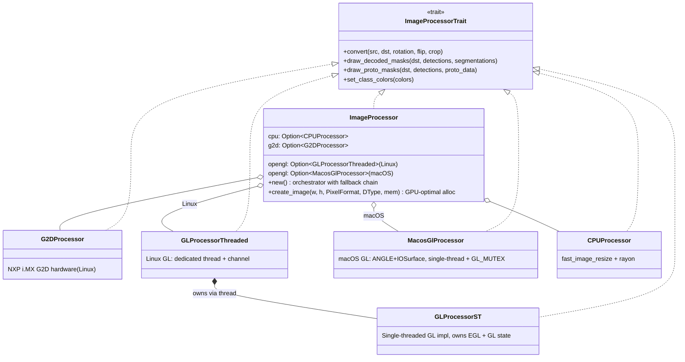
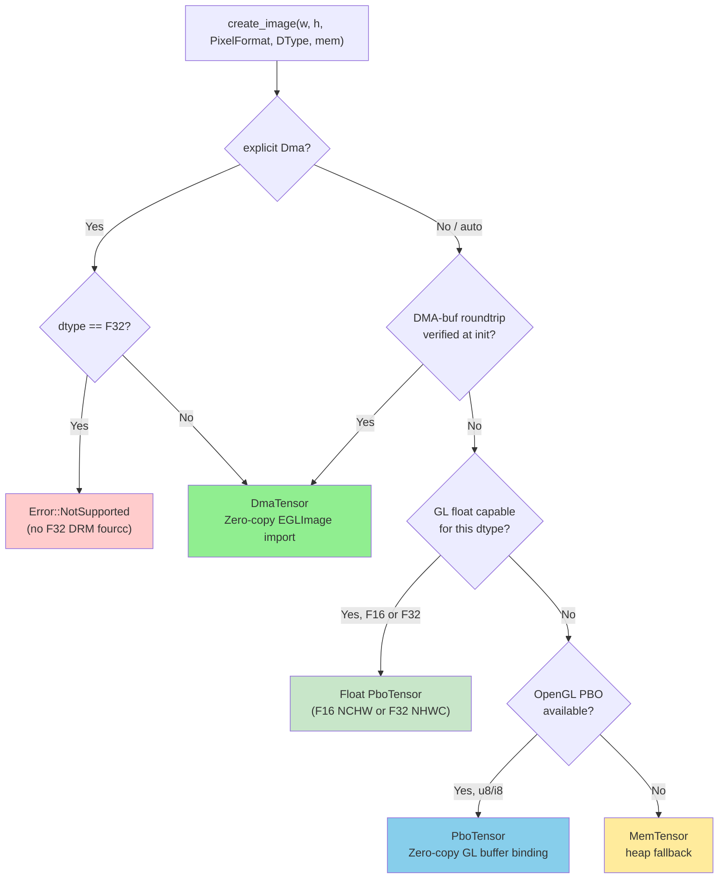
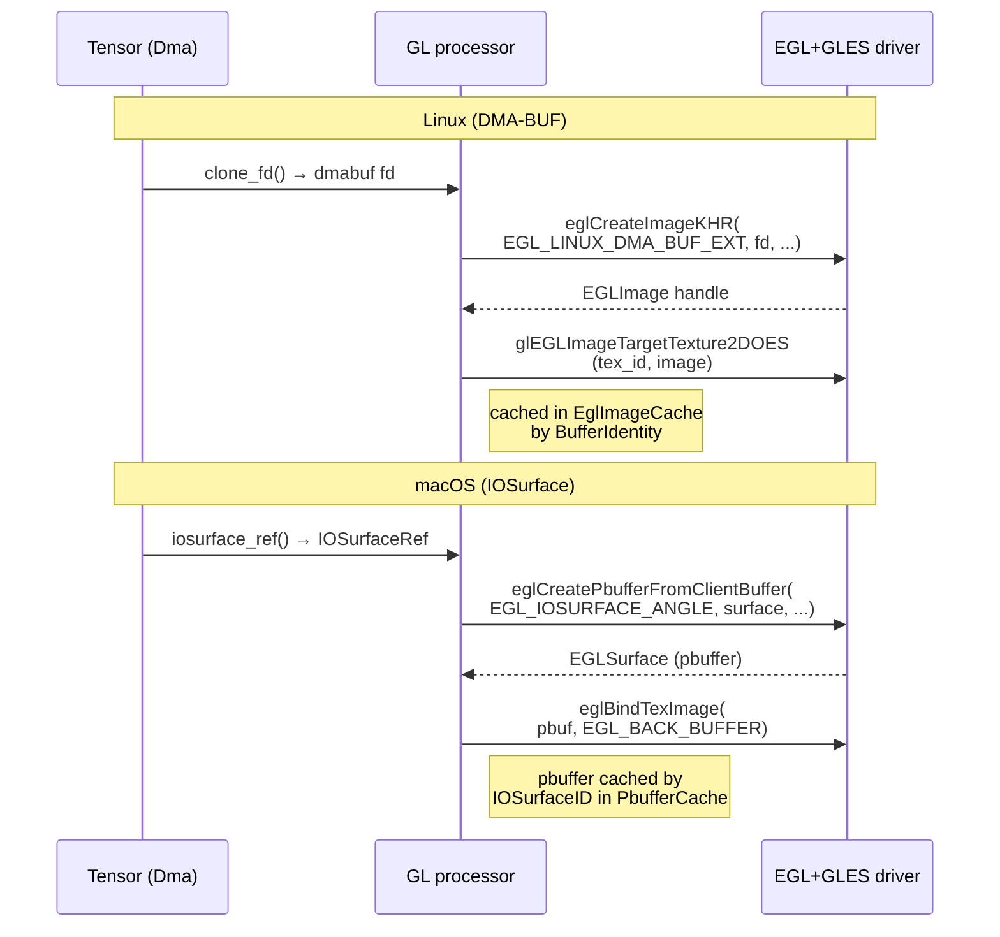

# edgefirst-image Architecture

## Overview

`edgefirst-image` provides hardware-accelerated image format conversion,
resizing, rotation, cropping, and segmentation-mask rendering for EdgeFirst
inference pipelines. The crate's central type is
[`ImageProcessor`](https://docs.rs/edgefirst-image/latest/edgefirst_image/struct.ImageProcessor.html),
an orchestrator that probes available hardware once at construction time and
then dispatches per-call to the most efficient backend in the chain
**OpenGL → G2D → CPU**. The processor owns the lifecycle of the GL thread,
the EGL/PBO caches, and the GPU shader programs that implement the visual
operations.

This crate carries the largest body of platform-specific code in the
EdgeFirst HAL. Most of the architectural surface area is concerned with
keeping zero-copy paths working across i.MX 8M Plus (Vivante), i.MX 95
(Mali/Panfrost), and desktop Mesa, while respecting the lifecycle and
shutdown quirks of each driver stack.

## Module Map

| Module | Source | Responsibility |
|--------|--------|----------------|
| [`lib.rs`](https://github.com/EdgeFirstAI/hal/blob/main/crates/image/src/lib.rs) | local | Public surface: `ImageProcessor`, `ImageProcessorTrait`, `Rotation`, `Flip`, `Crop`, `MaskOverlay`, `save_jpeg`, and the re-exported `codec` decode API (`codec::{ImageDecoder, ImageLoad, peek_info}`) |
| [`cpu/`](https://github.com/EdgeFirstAI/hal/tree/main/crates/image/src/cpu) | local | `CPUProcessor` — fast_image_resize + rayon, plus the f16 mask kernels |
| [`g2d.rs`](https://github.com/EdgeFirstAI/hal/blob/main/crates/image/src/g2d.rs) | local | `G2DProcessor` — NXP i.MX G2D 2D-engine bindings |
| [`gl/`](https://github.com/EdgeFirstAI/hal/tree/main/crates/image/src/gl) | local | OpenGL backend: threaded wrapper, context, EGL+PBO caches, shaders, DMA-BUF import |
| [`gl/platform/macos.rs`](https://github.com/EdgeFirstAI/hal/blob/main/crates/image/src/gl/platform/macos.rs) | local | `MacosPlatform::{load_egl_lib, create_display}` — two associated functions, the only macOS-specific helpers the GL backend needs. No trait, no enum dispatch. Linux helpers live directly in `gl/context.rs`. |
| [`gl/iosurface_import.rs`](https://github.com/EdgeFirstAI/hal/blob/main/crates/image/src/gl/iosurface_import.rs) | local | macOS-only: builds the `EGL_ANGLE_iosurface_client_buffer` attribute list and converts a tensor's IOSurface into an EGL pbuffer. |
| [`gl/macos_processor.rs`](https://github.com/EdgeFirstAI/hal/blob/main/crates/image/src/gl/macos_processor.rs) | local | macOS-only single-threaded GL pipeline (ANGLE → Metal). Parallel to `gl/processor.rs` rather than a refactor — the Linux processor stays untouched. |
| [`error.rs`](https://github.com/EdgeFirstAI/hal/blob/main/crates/image/src/error.rs) | local | `Error` (with `From<std::io::Error>` for ergonomic `?` propagation in user code) |

## Key Types and Traits

- [`ImageProcessor`](https://docs.rs/edgefirst-image/latest/edgefirst_image/struct.ImageProcessor.html) — the orchestrator. Owns CPU + G2D + GL backends and dispatches per call.
- [`ImageProcessorTrait`](https://docs.rs/edgefirst-image/latest/edgefirst_image/trait.ImageProcessorTrait.html) — the convert/draw API common to every backend.
- [`Rotation`](https://docs.rs/edgefirst-image/latest/edgefirst_image/enum.Rotation.html), [`Flip`](https://docs.rs/edgefirst-image/latest/edgefirst_image/enum.Flip.html), [`Crop`](https://docs.rs/edgefirst-image/latest/edgefirst_image/struct.Crop.html) — geometric parameters; `Crop::letterbox()` preserves aspect ratio.
- [`MaskOverlay`](https://docs.rs/edgefirst-image/latest/edgefirst_image/struct.MaskOverlay.html) — composite control for mask-rendering APIs (`background`, `opacity`).
- [`codec::ImageLoad`](https://docs.rs/edgefirst-codec/latest/edgefirst_codec/trait.ImageLoad.html) + [`codec::ImageDecoder`](https://docs.rs/edgefirst-codec/latest/edgefirst_codec/struct.ImageDecoder.html) — decode JPEG/PNG into a pre-allocated tensor at its native format (JPEG → `Nv12`/`Grey`, PNG → `Rgb`/`Rgba`/`Grey`); EXIF orientation is reported in `ImageInfo`, never applied (apply it via `convert()`). [`save_jpeg`](https://docs.rs/edgefirst-image/latest/edgefirst_image/fn.save_jpeg.html) — encode a `u8` tensor to JPEG.

## Internal Architecture

### Backend dispatch



The macOS GL backend (`MacosGlProcessor`) is a parallel implementation
of `ImageProcessorTrait` rather than a wrapper over `GLProcessorThreaded`
— see "macOS GL backend" below for why. The `opengl` field on
`ImageProcessor` is cfg'd to the right type per OS so the public API
shape stays uniform.

`ImageProcessor` dispatch priority is **OpenGL (GPU) → G2D (where supported)
→ CPU (always available)**. Environment variables `EDGEFIRST_DISABLE_GL`,
`EDGEFIRST_DISABLE_G2D`, `EDGEFIRST_DISABLE_CPU` and `EDGEFIRST_FORCE_BACKEND`
override this chain at runtime; see [`README.md` Environment
Variables](https://github.com/EdgeFirstAI/hal/blob/main/crates/image/README.md#environment-variables).

### TensorDyn as the image type

The image-side type system reuses [`edgefirst_tensor::TensorDyn`](https://docs.rs/edgefirst-tensor/latest/edgefirst_tensor/struct.TensorDyn.html)
as the dtype-erased image carrier. `TensorDyn` wraps a `Tensor<T>` and a
`PixelFormat`; the format describes the spatial layout, the `DType` describes
element storage. Width / height / channels are **not stored** — they
are computed from shape + format on every access. Row stride is **optional
metadata** (`Tensor::row_stride()` / `set_row_stride()` /
`effective_row_stride()`); it is left unset for tightly packed buffers and
is required for padded DMA-BUF imports where the producer's stride differs
from `width * bytes_per_pixel`.

| Format | Tensor shape | Notes |
|--------|--------------|-------|
| `Rgb`, `Rgba`, `Bgra`, `Grey`, `Yuyv`, `Vyuy` | `[H, W, C]` | Interleaved (channels-last) |
| `PlanarRgb`, `PlanarRgba` | `[C, H, W]` | Channels-first |
| `Nv12` | `[H*3/2, W]` | 2D — Y plane (H rows) + UV (H/2 rows) |
| `Nv16` | `[H*2, W]` | 2D — Y plane (H rows) + UV (H rows) |

For multi-plane DMA-BUF NV12/NV16 (V4L2 `NV12M` from VPU/NeoISP), Y and UV
live in separate allocations. `Tensor::from_planes(luma, chroma,
PixelFormat::Nv12)` keeps each plane's fd independent for zero-copy GPU
import via per-plane EGL attributes (`DMA_BUF_PLANE0_FD` / `DMA_BUF_PLANE1_FD`).

### `create_image()` and zero-copy memory selection

`ImageProcessor::create_image()` is the preferred way to allocate destination
tensors for `convert()`. It selects the optimal backend based on a probe done
at `ImageProcessor::new()` time:



| Backend | When selected | GPU transfer | Platforms |
|---------|---------------|--------------|-----------|
| DMA-buf | GPU supports `EGL_EXT_image_dma_buf_import`; dtype != F32 | Zero-copy: GPU reads/writes the DMA buffer directly | NXP i.MX 95 (Mali/Panfrost), RPi 5 (V3D) |
| Float PBO | `supported_render_dtypes().f16/f32` true; dtype F16 or F32 | `GL_PIXEL_PACK_BUFFER` readback | V3D, Mali, Tegra; macOS F16 via IOSurface |
| u8/i8 PBO | GLES 3.0 available, DMA-buf roundtrip fails; dtype U8/I8 | Zero-copy GL: `GL_PIXEL_UNPACK_BUFFER` / `GL_PIXEL_PACK_BUFFER` | NVIDIA desktop, hosts without DMA-heap permissions |
| Mem | No GPU or GL unavailable; float GPU cap absent | CPU `memcpy` via `glTexImage2D` / `glReadnPixels` | Universal fallback; `convert()` uses CPU path |

**Note:** when `memory: None` is passed with a float dtype and GPU float
support is absent, allocation falls through to `Mem` without error.
[`convert`](https://docs.rs/edgefirst-image/latest/edgefirst_image/trait.ImageProcessorTrait.html#tymethod.convert)
then uses the CPU path — it never returns an error due to float
capability.

**Why PBO matters:** on desktop Linux with NVIDIA GPUs, DMA-buf allocation
succeeds (`/dev/dma_heap/system`) but the NVIDIA EGL driver cannot import
those buffers — the `verify_dma_buf_roundtrip()` check catches this at init.
Without PBO, every `convert()` would fall back to CPU `memcpy` for upload and
readback. PBO keeps the data in GPU-accessible memory, enabling the same
zero-copy shader pipeline used on DMA platforms.

### GL transfer backend selection

| Backend | Detection | GPU upload | GPU readback |
|---------|-----------|------------|--------------|
| `DmaBuf` | `verify_dma_buf_roundtrip()` passes (Linux) | `EGL_EXT_image_dma_buf_import` (zero-copy) | EGLImage export (zero-copy) |
| `IOSurface` | macOS + `EGL_ANGLE_iosurface_client_buffer` present | `eglCreatePbufferFromClientBuffer(EGL_IOSURFACE_ANGLE)` + `eglBindTexImage` (zero-copy) | Same pbuffer is the FBO color attachment; CPU readback via `IOSurfaceLock` |
| `Pbo` | GLES 3.0 available, DMA-buf fails | `GL_PIXEL_UNPACK_BUFFER` | `GL_PIXEL_PACK_BUFFER` |
| `Sync` | Final fallback | `glTexImage2D` (host pointer) | `glReadnPixels` (host pointer) |

`DmaBuf` and `IOSurface` are both zero-copy paths, just with different
EGL extensions backing them — the choice is platform-bound and the
processor doesn't need a runtime predicate to tell them apart.

### GL platform seam

The GL backend lives in two parallel processors today:

- `GLProcessorThreaded` (in `gl/processor.rs`) — Linux, threaded, owns
  the EGLImage cache and PBO machinery.
- `MacosGlProcessor` (in `gl/macos_processor.rs`) — macOS, single-
  threaded, mutex-protected, ANGLE-driven.

Each processor calls into its own platform-specific bring-up code. The
only macOS-specific helpers the rest of the backend needs are:

| Function | Purpose |
|----------|---------|
| [`MacosPlatform::load_egl_lib`](https://github.com/EdgeFirstAI/hal/blob/main/crates/image/src/gl/platform/macos.rs) | Locate and dlopen ANGLE's `libEGL.dylib` (search order: `EDGEFIRST_ANGLE_PATH` → Homebrew → `@loader_path` → `@executable_path` → dyld). |
| [`MacosPlatform::create_display`](https://github.com/EdgeFirstAI/hal/blob/main/crates/image/src/gl/platform/macos.rs) | Bring up an ANGLE Metal display via `eglGetPlatformDisplayEXT(EGL_PLATFORM_ANGLE_TYPE_METAL_ANGLE)`. |

The pbuffer import, texture binding, FBO setup, and shader compilation
are inline inside [`MacosGlProcessor`](https://github.com/EdgeFirstAI/hal/blob/main/crates/image/src/gl/macos_processor.rs) — there is no shared cross-platform
trait. An earlier draft of this branch defined a `GlPlatform` trait
that the macOS processor was meant to route through, but the trait was
never wired up and was removed before merge. If and when Linux and
macOS share a processor implementation (e.g. as part of a Windows
backend bringup), the seam can be reintroduced; until then it would be
fiction.

The EGL flow itself differs by platform:



The destination handling mirrors the source: on Linux the same
`EGLImage` can back an FBO color attachment via
`glFramebufferTexture2D`. On macOS the same pbuffer is sampled *and*
serves as the render target — `eglBindTexImage` makes it texture-
addressable while `glFramebufferTexture2D` makes it framebuffer-
addressable. Both bindings are valid simultaneously because ANGLE's
Metal backend reference-counts the underlying Metal texture.

### macOS GL backend (`gl/macos_processor.rs`)

The macOS implementation is a parallel single-threaded GL processor
rather than a refactor of the threaded Linux pipeline. Two reasons:

1. **Metal is thread-safe enough** — ANGLE's Metal backend handles
   the cross-thread coordination internally, so the Linux galcore
   workaround (a dedicated GL thread serializing every call) buys
   nothing on macOS. A `Mutex<()>` guarding GL calls is sufficient.

2. **Scope** — the threaded `processor.rs` is ~5500 lines tightly
   coupled to DMA-BUF caching, PBO tensors, and the Linux EGL image
   cache. Rewriting it cross-platform would have been a refactor
   larger than the macOS port itself. Parallel `MacosGlProcessor`
   keeps the Linux code untouched.

The macOS backend ships with a single fragment shader today (BT.709
limited-range YUYV → RGBA). Other convert pairs return
`NotSupported` and `ImageProcessor::convert` falls back to CPU. Each
new shader needs:

- A GLSL ES 3.0 source in `macos_processor.rs`.
- A FourCC entry for the destination layout in
  `tensor::iosurface::image_fourcc_and_bpe`. (For RGBA the FourCC is
  `'RGBA'` — not `'BGRA'` — so the CPU readback sees the bytes in the
  same order the tensor's logical `PixelFormat` reports. Mapping
  Rgba to `'BGRA'` looks correct under the GL pipeline but produces a
  silent channel swap on CPU readback; the existing similarity test
  catches it.)
- A matching `EGL_TEXTURE_INTERNAL_FORMAT_ANGLE` entry in
  `gl/iosurface_import.rs::ImageLayout::gl_internal_format` (the GL
  texture format must agree with the IOSurface FourCC — ANGLE
  validates this at `eglCreatePbufferFromClientBuffer` time).

### ANGLE constant gotchas

The `EGL_ANGLE_iosurface_client_buffer` extension uses these
constants (lifted from `ANGLE/include/EGL/eglext_angle.h`):

| Constant | Value | Purpose |
|----------|-------|---------|
| `EGL_IOSURFACE_ANGLE` | `0x3454` | Client buffer type passed to `eglCreatePbufferFromClientBuffer`. |
| `EGL_IOSURFACE_PLANE_ANGLE` | `0x345A` | Which IOSurface plane to bind (0 for single-plane, separate calls for NV12 Y/UV). |
| `EGL_TEXTURE_RECTANGLE_ANGLE` | `0x345B` | Texture target for the pbuffer — but **most callers want 2D, not rectangle**. |
| `EGL_TEXTURE_TYPE_ANGLE` | `0x345C` | GL type token for shader sampling (`GL_UNSIGNED_BYTE` etc). **Easy to confuse with 0x345B.** |
| `EGL_TEXTURE_INTERNAL_FORMAT_ANGLE` | `0x345D` | GL internal format the IOSurface bytes are interpreted as (`GL_RG`, `GL_RGBA`, `GL_BGRA_EXT`). |
| `EGL_BIND_TO_TEXTURE_TARGET_ANGLE` | `0x348D` | Required EGL config attribute: must equal `EGL_TEXTURE_2D` for the pbuffer to be `eglBindTexImage`-able. |

The 0x345B vs 0x345C swap is the kind of bug that survives review and
only manifests at runtime as a vague `EGL_BAD_ATTRIBUTE` — worth
calling out.

### GL thread architecture

`GLProcessorThreaded` is the public, thread-safe wrapper. It spawns a
dedicated OS thread that owns the EGL context and all GL state
(`GLProcessorST`). All operations are sent as `GLProcessorMessage` enum
variants through a channel and block on a oneshot reply. This design is
required because EGL contexts are thread-local — every GL call must happen
on the thread that created the context.

The [`PboOps`](https://docs.rs/edgefirst-tensor/latest/edgefirst_tensor/trait.PboOps.html)
trait bridges the tensor crate and the GL thread. `PboTensor` (defined in
the tensor crate) holds an `Arc<dyn PboOps>`; the image crate's
`GlPboOps` implementation of that trait is what owns the `WeakSender` to
the GL-thread channel. When the tensor needs to map / unmap / delete the
PBO, it calls into the `PboOps` impl, which sends a message through the
channel. The weak sender ensures PBO tensors don't prevent GL thread
shutdown — see
[`crates/tensor/ARCHITECTURE.md#pbo-tensors-and-the-weaksender-pattern`](https://github.com/EdgeFirstAI/hal/blob/main/crates/tensor/ARCHITECTURE.md#pbo-tensors-and-the-weaksender-pattern).

### GLES 3.1 context and the optional compute path

At context creation time, the GL thread attempts a GLES 3.1 context first;
on failure it falls back to GLES 3.0 (no compute shaders).

When GLES 3.1 is available, an opt-in compute shader path can perform the
HWC→CHW proto-tensor repack on the GPU. Enable it with
`EDGEFIRST_PROTO_COMPUTE=1`. If compilation fails at runtime, the
implementation logs a warning and falls back to CPU repack transparently —
no API changes.

### PBO convert dispatch

When `convert()` is called with PBO-backed images, the GL thread must not
call `tensor.map()` on those images — that would send a message back to
itself and deadlock. The convert path dispatches to specialized methods:

| Source → Destination | Method |
|---------------------|--------|
| DMA → DMA | `convert_dest_dma` (EGLImage on both sides) |
| PBO → PBO | `convert_pbo_to_pbo` (UNPACK + PACK) |
| Mem/DMA → PBO | `convert_any_to_pbo` (texture + PACK) |
| PBO → Mem | `convert_pbo_to_mem` (UNPACK + ReadnPixels) |
| Mem/DMA → Mem/DMA | `convert_dest_non_dma` (texture + memcpy) |

**PBO destination renderbuffer setup:** When the destination is a PBO tensor
and the shader needs a pre-initialized renderbuffer (e.g., for letterbox
padding), the code must use `setup_renderbuffer_from_pbo()` — **never**
`setup_renderbuffer_non_dma()`. The latter calls `dst.map()`, which sends a
`PboMap` message to the GL thread via the channel. Since we are already
executing on the GL thread (processing an `ImageConvert` message), this
deadlocks. `setup_renderbuffer_from_pbo()` avoids this by binding the PBO as
`GL_PIXEL_UNPACK_BUFFER` and loading data with `glTexImage2D(NULL)`, which
reads directly from the PBO without any channel round-trip.

`convert_pbo_to_mem()` is not affected because its destination is a Mem
tensor, so `dst.map()` is a direct memory operation with no GL thread
message.

### EGL image cache

The OpenGL backend maintains two independent LRU caches of EGLImages —
`src_egl_cache` for source tensors and `dst_egl_cache` for destination
tensors. Each entry is keyed by `(BufferIdentity.id, chroma_id)`.

`BufferIdentity` is defined in
[`crates/tensor/src/lib.rs`](https://github.com/EdgeFirstAI/hal/blob/main/crates/tensor/src/lib.rs)
and pairs a globally unique monotonic ID with an `Arc<()>` liveness guard:

```text
BufferIdentity {
    id:    u64,     // unique per allocation; new value from each from_fd() call
    guard: Arc<()>, // cache entries hold Weak<()>; when tensor drops, weak dies
}
```

When a tensor is freed, its `Arc<()>` guard drops. The cache holds only a
`Weak<()>` reference, so `sweep()` detects dead entries without an explicit
removal call.

| Pattern | Cache behavior | Performance |
|---------|----------------|-------------|
| Same tensor object reused across frames | Hit on every frame | Fast — no EGLImage re-import |
| New tensor wrapping the same fd each frame | Miss on every frame | Slow — re-imports each call |
| `dst` of call N reused as `src` of call N+1 | Hit in both caches | Two separate entries, no collision |

Key implications:

- `hal_tensor_from_fd()` and `hal_import_image()` always allocate a new
  `BufferIdentity`. Callers that re-wrap the same fd each frame will see a
  cache miss every `convert()`. **Hold the tensor alive across frames.**
- Content written into a DMA-BUF between calls (e.g. by a V4L2 decoder) is
  visible on the next call. EGLImage is a handle to live physical memory,
  not a snapshot.
- The `last_bound_src_egl` optimization skips
  `glEGLImageTargetTexture2DOES` when the source EGLImage has not changed
  between consecutive calls. Safe — the texture already points at the
  correct DMA-BUF memory.
- A `glFinish()` is issued at the end of every `convert()`. This guarantees
  GPU reads of source and writes to destination are complete before return,
  making it safe to chain calls.

See [Appendix C: DMA-BUF Identity and Tensor Caching](https://github.com/EdgeFirstAI/hal/blob/main/ARCHITECTURE.md#appendix-c-dma-buf-identity-and-tensor-caching)
in the project ARCHITECTURE.md for the cross-crate cache story (V4L2
fd recycling, inode-keyed cache, GStreamer adaptor integration).

### Vivante NV12 → PlanarRgb two-pass workaround

A single-pass NV12 → PlanarRgb shader causes a GPU hang on the Vivante
GC7000UL (NXP i.MX 8M Plus). The workaround splits the conversion:

```text
Pass 1:  NV12 → RGBA (intermediate)
         All geometry: resize, crop, rotation, flip, letterbox
Pass 2:  RGBA → PlanarRgb (at destination resolution)
         Deinterleaves RGBA to three planes via sampler2D variants
```

Pass 1 reuses the existing `packed_rgb_intermediate_tex` texture — no new
GPU resources allocated. Pass 2 uses the same shader infrastructure as
direct RGBA → PlanarRgb. The two-pass path is selected automatically when
`is_vivante && src_fmt == Nv12 && dst_fmt.layout() == Planar`. No API
changes required from callers.

## Mask Rendering

YOLO segmentation models produce **proto masks** (shared basis at reduced
resolution, typically 160×160) and per-detection **mask coefficients**:

```text
mask_raw[i] = coefficients[i] @ protos       # (proto_h, proto_w)
```

The image crate exposes three rendering pipelines paired with the decoder's
mask APIs:

| Workflow | Decoder source (public API) | Image-side render | Best for |
|----------|-----------------------------|-------------------|----------|
| Materialized | [`Decoder::decode()`](https://docs.rs/edgefirst-decoder/latest/edgefirst_decoder/struct.Decoder.html#method.decode) | `draw_decoded_masks` | Already have mask matrices |
| Fused proto path | [`Decoder::decode_proto()`](https://docs.rs/edgefirst-decoder/latest/edgefirst_decoder/struct.Decoder.html#method.decode_proto) | `draw_proto_masks` | Real-time GPU overlay (preferred) |
| Tracked materialized | [`Decoder::decode_tracked()`](https://docs.rs/edgefirst-decoder/latest/edgefirst_decoder/struct.Decoder.html#method.decode_tracked) (via [`edgefirst-tracker`](https://github.com/EdgeFirstAI/hal/blob/main/crates/tracker/)) | `draw_masks_tracked` | Single-call decode + track + render |
| Tracked proto | [`Decoder::decode_proto_tracked()`](https://docs.rs/edgefirst-decoder/latest/edgefirst_decoder/struct.Decoder.html#method.decode_proto_tracked) | `draw_proto_masks` (with track-augmented detections) | Tracked GPU-fused path |

### MaskOverlay

```rust,ignore
pub struct MaskOverlay<'a> {
    pub background: Option<&'a TensorDyn>, // blit before drawing masks
    pub opacity: f32,                       // 0.0 invisible, 1.0 opaque
    pub letterbox: Option<[f32; 4]>,       // [xmin, ymin, xmax, ymax] in
                                            // model-input normalized space;
                                            // maps decoder output back to
                                            // original image coords when set
    pub color_mode: ColorMode,             // Class | Instance | Track
                                            // (Track currently behaves
                                            //  like Instance — see below)
}
```

### Fused proto→pixel algorithm (`draw_proto_masks`)

Instead of computing the matmul at proto resolution and upsampling the
result, the fused path upsamples the proto field itself and evaluates the
dot product at every output pixel:

```text
For each output pixel (x, y) inside detection bbox at 640×640:
    bilinear_sample(protos, proto_coords(x, y))  → 32 interpolated values
    dot(coefficients, interpolated_protos)        → raw logit
    sigmoid(raw)                                  → mask value [0, 1]
    threshold at 0.5 → blend color onto pixel
```

Algebraically equivalent to bilinear-after-matmul (both bilinear
interpolation and the dot product are linear), but avoids materializing the
intermediate tensors. Key design choices:

- **No proto-resolution crop** — the full 160×160 proto field is sampled,
  avoiding the boundary erosion artifact of crop-before-upsample approaches.
- **Sigmoid after interpolation** — sigmoid is nonlinear, so applying it
  after spatial operations preserves dynamic range through interpolation.
- The draw path uses the sigmoid value directly for alpha-blend weighting.

This is mathematically equivalent to Ultralytics' `retina_masks=True`
(`process_mask_native`) for binary mask output. Empirical validation across
26 matched detections on COCO val2017 confirms **0.993 mean mask IoU**
between the two methods.

### GPU implementation (OpenGL)

Draw path (`draw_proto_masks`) — sigmoid shaders with alpha blending:

The fragment shader computes `sigmoid(logit)` and blends the detection color
onto the framebuffer using `GL_SRC_ALPHA / GL_ONE_MINUS_SRC_ALPHA`. The GPU
renders one quad per detection; the fragment shader evaluates the mask at
every output pixel.

#### Shader variants

| Variant | Proto storage | Interpolation |
|---------|---------------|---------------|
| int8-nearest | `R8I` quantized | Nearest neighbor |
| int8-bilinear | `R8I` quantized | Manual 4-tap bilinear |
| f32 | `R32F` float | Hardware `GL_LINEAR` |
| f16 | `R16F` half | Hardware `GL_LINEAR` |

Control quantized proto interpolation via
`processor.set_int8_interpolation_mode(...)`.

> **G2D limitation:** the NXP G2D hardware accelerator does not support
> mask rendering. On platforms where G2D is the primary backend (e.g.
> i.MX 8M Plus without EGL), all `draw_*` methods return
> `NotImplemented`. Use an OpenGL-capable processor (pass an
> `egl_display`) or fall back to CPU rendering.

#### Vivante shader performance cliff and the eager-materialize workaround

The fused `draw_proto_masks` path is the preferred GPU pipeline on
Mali / Panfrost (i.MX 95) and on desktop GPUs, where the per-pixel
sigmoid + dot product runs comfortably under real-time even at large
detection counts. **On Vivante GC7000UL (i.MX 8M Plus)** the same
shader can fall off a cliff for models with many detections or large
proto fields, reaching multi-second per-frame latency. The driver's
fragment-shader scheduling on this part does not amortise the
per-quad-per-pixel work the way mainline GPUs do.

The safe pattern on Vivante (and as a defensive choice for any
deployment that may run on it) is to **materialise masks once on the
CPU** via `materialize_masks` immediately after decode, free the proto
data, and then render with the cheap `draw_decoded_masks` blit:

```rust
// On the decode thread:
let masks = processor.materialize_masks(
    &boxes, &scores, &classes, &proto_data,
    letterbox_norm,
    MaskResolution::Scaled { width: dst_w, height: dst_h },
)?;
drop(proto_data); // free the proto tensor immediately

// On the render thread (or the same thread, just later):
processor.draw_decoded_masks(&mut frame, &boxes, &masks, overlay)?;
```

`materialize_masks` runs the same batched-GEMM kernel exercised by
`mask_benchmark` (see [`TESTING.md`](https://github.com/EdgeFirstAI/hal/blob/main/crates/image/TESTING.md#benchmarks)),
which is well-amortised across detections; `draw_decoded_masks`
becomes a cheap RGBA blit. The combined CPU + GPU cost on i.MX 8M
Plus is comfortably real-time at typical COCO detection counts. On
Mali / desktop GPUs, switching back to the fused `draw_proto_masks`
is straightforward — the data flow is the same up to the choice of
render call.

## Process-Shutdown Resource Cleanup

The OpenGL headless renderer
([`crates/image/src/gl/`](https://github.com/EdgeFirstAI/hal/tree/main/crates/image/src/gl))
loads EGL and OpenGL ES via dynamically loaded shared libraries
(`libEGL.so.1`, `libGLESv2.so`). When the process exits — particularly from
a Python interpreter running PyO3 extensions — EGL resource cleanup can
crash with heap corruption, segfaults, or panics. This is a well-documented
industry-wide problem with no clean solution.

The crash arises from a fundamental conflict between four systems:

1. **Python finalization order is non-deterministic.** During
   `Py_FinalizeEx()`, Python destroys modules and objects in arbitrary
   order. A PyO3 `#[pyclass]` wrapping `GlContext` may have its Rust `Drop`
   invoked after dependent state is gone.
2. **Linux `atexit` handler ordering is unreliable.** glibc's
   `__cxa_finalize` interacts with `dlclose` in non-deterministic ways
   between handlers registered by different shared libraries
   ([glibc #21032](https://sourceware.org/bugzilla/show_bug.cgi?id=21032)).
3. **Mesa's `_eglAtExit` use-after-free.** Mesa's atexit handler frees
   per-thread EGL state (`_EGLThreadInfo`). If `Drop` calls
   `eglReleaseThread()` after this handler runs, it dereferences freed
   memory ([Ubuntu Bug #1946621](https://bugs.launchpad.net/ubuntu/+source/mesa/+bug/1946621)).
4. **Vendor EGL driver bugs.** Some vendor drivers (Qualcomm Adreno, older
   NVIDIA) misbehave during cleanup. The `catch_unwind` guard absorbs
   driver-side panics.

### Defense-in-depth solution

```text
┌─────────────────────────────────────────────────────────┐
│ Layer 1: Box::leak — EGL library handle                 │
│   Prevents dlclose from unmapping shared library code   │
├─────────────────────────────────────────────────────────┤
│ Layer 2: ManuallyDrop<Rc<Egl>> — EGL instance           │
│   Prevents khronos-egl Drop from calling                │
│   eglReleaseThread() into freed Mesa state              │
├─────────────────────────────────────────────────────────┤
│ Layer 3: catch_unwind — EGL cleanup calls               │
│   Catches panics from eglDestroyContext/eglMakeCurrent  │
│   if function pointers are invalidated                  │
├─────────────────────────────────────────────────────────┤
│ Layer 4: Skip eglTerminate entirely                     │
│   Display lives in a process-global OnceLock and is     │
│   intentionally leaked; eglTerminate is never called    │
└─────────────────────────────────────────────────────────┘
```

`GlContext::drop` calls `eglMakeCurrent(EGL_NO_CONTEXT)` and
`eglDestroyContext` inside `catch_unwind`, then intentionally skips
dropping the `Rc<Egl>` wrapper. The EGL library handle is leaked via
`Box::leak` at load time so it is never `dlclose`'d. The EGL display
itself lives in the `SHARED_DISPLAY` `OnceLock` (`SharedEglDisplay`) and
is never terminated — the EGL spec ref-counts `eglTerminate` against
`eglInitialize`, but calling it from `GlContext::drop` would tear the
display down for every other live `GlContext` in the process, so the
HAL leaks it on purpose.

### Industry precedent

- **Chromium/ANGLE** skips full EGL teardown on GPU process exit, treating
  cleanup as more dangerous than no cleanup during shutdown.
- **wgpu** wraps `glow::Context` in `ManuallyDrop` and loads EGL with
  `RTLD_NODELETE` to prevent library unloading. The `khronos-egl` crate
  itself adopted `RTLD_NOW | RTLD_NODELETE` after
  [khronos-egl #14](https://github.com/timothee-haudebourg/khronos-egl/issues/14),
  citing the same glibc root cause.
- **Smithay** supports skipping `eglTerminate` via a feature flag for the
  same class of driver bugs.

### Limitations

`catch_unwind` catches Rust panics but cannot catch fatal signals
(`SIGABRT`, `SIGSEGV`, `SIGBUS`) from heap corruption inside the C driver.
The defense layers prevent the most common failure modes, but a
sufficiently broken driver could still crash the process — none has been
observed on the supported platforms (Vivante, Mali/Panfrost, Mesa x86_64).

### G2D resource cleanup

On NXP i.MX, `libg2d.so.2` and `libEGL.so.1` share kernel state through the
Vivante `galcore` device (`/dev/galcore`). When both libraries are loaded,
calling `dlclose` on either one can trigger heap corruption (`corrupted
double-linked list`) during process exit — the atexit handlers from the
shared `galcore` driver become inconsistent.

For production code, `G2DProcessor` is dropped normally; the EGL
`Box::leak` (Layer 1) keeps shared `galcore` state intact. For benchmark
code (where many G2D processors are created/destroyed in one process), the
`crates/bench` harness wraps G2D processor instances in `ManuallyDrop` to
avoid repeated `g2d_close` + `dlclose` cycles that exhaust driver
resources.

### Resource cleanup policy

- **EGL displays** — never terminated. The process-global
  `SharedEglDisplay` is created once via `OnceLock` and leaked on
  process exit. `eglTerminate` is the *EGL way* to release a display
  but in practice causes driver crashes (see the defense-in-depth
  section above), so the HAL never calls it.
- **EGL contexts** — `eglDestroyContext` in `GlContext::drop`, inside
  `catch_unwind`. No EGL surfaces are created — the HAL uses
  surfaceless contexts (`EGL_KHR_surfaceless_context` +
  `EGL_KHR_no_config_context`) and renders exclusively through FBOs
  backed by EGLImages.
- **DMA buffers** — fd `close()` in `Drop`.
- **G2D contexts** — `g2d_close` in `G2DProcessor::drop`.

Intentional leaks: the EGL library handle (`Box::leak`), the `Rc<Egl>`
wrapper (`ManuallyDrop`), and the shared EGL display
(`SHARED_DISPLAY: OnceLock`). All three are process-lifetime objects;
the OS reclaims them at exit. GPU contexts, DMA buffers, and G2D
contexts are released eagerly by their `Drop` impls.

## GL Command Serialization (GL_MUTEX)

Multiple `ImageProcessor` instances can coexist in the same process. EGL
and OpenGL ES specify that independent contexts on separate threads should
not interfere, but several embedded GPU drivers violate this:

- **Vivante `galcore` (i.MX 8M Plus)** — concurrent `eglInitialize`,
  `eglCreateContext`, DMA-BUF import ioctls, and `eglTerminate` from
  multiple threads corrupt driver-internal state. Causes SIGSEGV (null
  pointer at offset `0x18` in `galcore` ioctl) and futex deadlocks.
- **Broadcom V3D 7.1.10.2 (Raspberry Pi 5)** — concurrent `eglTerminate`
  breaks ref-counting, causing `EGL(NotInitialized)` on surviving
  contexts; subsequent GL operations fail with `GL_INVALID_OPERATION`.
- **ARM Mali-G310 (i.MX 95)** — Panfrost handles concurrent EGL/GL
  correctly. No issues observed.

### Solution

A global `GL_MUTEX` (`std::sync::Mutex<()>` in
[`crates/image/src/gl/context.rs`](https://github.com/EdgeFirstAI/hal/blob/main/crates/image/src/gl/context.rs))
serializes **all** EGL and GL operations across every `GLProcessorST`
instance. Acquired in three places:

1. **Initialization** — wraps `GLProcessorST::new()` (display creation,
   context setup, shader compilation, DMA-BUF roundtrip verification).
2. **Message dispatch** — wraps every incoming GL-thread message
   (convert, draw masks, PBO create/download, etc.) so only one GL thread
   executes driver calls at a time.
3. **Teardown** — wraps `GLProcessorST::drop()` → `GlContext::drop()`
   so `eglDestroyContext` (and `eglMakeCurrent(EGL_NO_CONTEXT)`) are
   serialized. The shared display is never terminated, so teardown
   does not race against display state.

The mutex uses `unwrap_or_else(|e| e.into_inner())` to recover from
poisoning: if a prior GL operation panicked, subsequent operations on
other instances can still proceed rather than propagating a poison error.

### Performance implications

All GL operations are serialized — no concurrent GPU execution across
`ImageProcessor` instances. Acceptable because:

- The primary use case (edge AI inference pipelines) typically uses a
  single processor per pipeline. Multiple instances exist mainly in test
  scenarios.
- GPU operations are I/O-bound on embedded targets; mutex overhead
  (microseconds) is negligible compared to DMA transfers and shader
  execution (milliseconds).
- The alternative (concurrent GPU access) crashes on Vivante.

Future work could relax to init/teardown-only serialization on drivers
known to be safe for concurrent runtime ops (e.g. Mali), but the current
approach prioritizes correctness across all targets.

## Tracing Spans

`ImageProcessor::convert()`, `materialize_masks()`, and `draw_decoded_masks()`
emit a [`tracing::trace_span!`] tree describing the backend-dispatch decision
and every internal pass. Spans are captured by
[`edgefirst_hal::trace::start_tracing`](https://github.com/EdgeFirstAI/hal/blob/main/crates/hal/src/trace.rs)
into Chrome JSON for Perfetto and cost a single relaxed atomic load per call
site when no subscriber is active.

### Naming convention

Span names follow `<crate>.<function>[.<operation>[.<sub-operation>]]`:

- **`<crate>.<function>`** — top-level span: the public function the user
  invoked (`image.convert`, `image.materialize_masks`, `image.draw_decoded_masks`).
- **`<crate>.<function>.<operation>`** — meaningful internal work; backend
  dispatch within `convert()` lives at this level
  (`image.convert.gl`, `image.convert.g2d`, `image.convert.cpu`).
- **`<crate>.<function>.<operation>.<sub-operation>`** — further
  decomposition where it aids optimisation (`image.convert.gl.pack_rgb.pass1_rgba`,
  `image.convert.cpu.format_convert`).

A span is worth adding when the work inside it is meaningful for
optimisation and has enough complexity to justify the overhead — roughly
500 µs on Cortex-A53 as a guideline.

### Span tree

```text
image.convert                                           [user-facing fn, orchestrator]
│ fields: src_fmt, dst_fmt, src_memory, dst_memory, rotation, flip
│
├── image.convert.gl                                    [OpenGL backend, picked first]
│   │ fields: src_fmt, dst_fmt, is_int8, src_memory, dst_memory
│   ├── image.convert.gl.pack_rgb.pass1_rgba            ← NV12 → intermediate RGBA (resize + crop + flip)
│   ├── image.convert.gl.pack_rgb.pass2_pack            ← intermediate RGBA → packed RGB (3:4 width ratio)
│   ├── image.convert.gl.nv12_to_planar.pass1_rgba      ← Vivante 2-pass: NV12 → intermediate RGBA
│   └── image.convert.gl.nv12_to_planar.pass2_deinterleave ← Vivante 2-pass: RGBA → PlanarRgb planes
│
├── image.convert.g2d                                   [NXP i.MX G2D backend, picked second]
│   fields: src_fmt, dst_fmt
│
└── image.convert.cpu                                   [universal fallback, parent implicit]
    ├── image.convert.cpu.format_convert                ← per-pixel format conversion
    │   fields: from, to, pass = "pre_resize" | "direct" | "post_resize"
    └── image.convert.cpu.resize_flip_rotate            ← fast_image_resize + rayon

image.draw_decoded_masks                                [user-facing fn]
fields: n_detections, n_segmentations

image.materialize_masks                                 [user-facing fn]
│ fields: n_detections, mode = "proto" | "scaled", width?, height?
├── image.materialize_masks.kernel_i8                   ← i8 coeff × i8 proto, proto-resolution
├── image.materialize_masks.kernel_i16xi8               ← i16 coeff × i8 proto, proto-resolution
├── image.materialize_masks.kernel_i8_scaled            ← i8 coeff × i8 proto, scaled to dst W×H
└── image.materialize_masks.kernel_i16xi8_scaled        ← i16 coeff × i8 proto, scaled to dst W×H
    fields: n, proto_h, proto_w, num_protos, layout, (width, height for *_scaled)
```

> The CPU backend has no top-level `image.convert.cpu` span of its own; the
> CPU dispatch enters via `image.convert.cpu.format_convert` and/or
> `image.convert.cpu.resize_flip_rotate` directly. Parent in the trace is
> `image.convert`.

### What each span measures (mapped to the `convert()` inner workings)

| Span                                                   | What is happening inside | Key observations |
|--------------------------------------------------------|--------------------------|------------------|
| `image.convert`                                        | Orchestration: probe backends, pick OpenGL → G2D → CPU, dispatch. | The `src_memory` and `dst_memory` fields reveal whether you're on a zero-copy DMA-buf path, the PBO path, or the heap fallback. Cache-miss EGLImage imports show up as outliers here when callers reuse fds without reusing tensors. |
| `image.convert.gl`                                     | The chosen GL backend's full shader pipeline: bind/import source, set up FBO/renderbuffer, run conversion shader, optional `glFinish`. | First call at a new (src_fmt, dst_fmt, dims) tuple includes shader compile/link cost. Steady-state cost is dominated by the GPU draw and any `glFinish` at the end. |
| `image.convert.gl.pack_rgb.pass1_rgba`                 | NV12 → intermediate RGBA texture (full geometry: resize, crop, rotation, flip, letterbox). | Reused for the "packed RGB" output path (DMA destination with 3-byte-per-pixel width × 3 / 4 render geometry). |
| `image.convert.gl.pack_rgb.pass2_pack`                 | Intermediate RGBA → RGB DMA destination via the packed shader. | Only the second pass touches the DMA buffer; the first pass renders into the cached intermediate texture. |
| `image.convert.gl.nv12_to_planar.pass1_rgba`           | NV12 → intermediate RGBA (the Vivante GC7000UL workaround for the GPU hang on single-pass NV12 → PlanarRgb). | Selected automatically when `is_vivante && src == Nv12 && dst.layout == Planar`. |
| `image.convert.gl.nv12_to_planar.pass2_deinterleave`   | RGBA → PlanarRgb / PlanarRgba via `sampler2D` deinterleave shader. | Includes the optional `XOR 0x80` int8-bias step when the destination is `DType::I8`. |
| `image.convert.g2d`                                    | NXP 2D hardware engine doing format conversion + resize + rotation + flip + letterbox in one DMA-DMA blit. | Only available on i.MX 8M Plus / 8M Mini. Synchronous on the G2D driver; the span includes the driver's blocking wait. |
| `image.convert.cpu.format_convert`                     | Per-pixel format conversion (e.g. NV12 → RGB, RGBA → BGRA). The `pass` field tells you whether this ran before, after, or instead of resize. | `pre_resize` indicates the source needed conversion to RGB/RGBA/GREY before `fast_image_resize` could run; `direct` indicates no resize was needed; `post_resize` indicates the destination format differed from the intermediate. |
| `image.convert.cpu.resize_flip_rotate`                 | `fast_image_resize::Resizer` + rayon parallel slice, with composed flip/rotate/letterbox geometry. | The bulk of CPU `convert()` cost. The CPU backend is selected only when neither GL nor G2D accepts the (src, dst) format pair. |
| `image.draw_decoded_masks`                             | Per-detection alpha-blend of `Segmentation` mask onto the destination image (CPU or GL depending on backend). | When backend == GL, this dispatches to the shader-based mask blit. |
| `image.materialize_masks`                              | Wrapper around the four `kernel_*` spans, paired with letterbox inversion and bbox-clipped row iteration. `mode = "proto"` returns proto-resolution masks; `mode = "scaled"` resamples to `(width, height)`. | Use the proto-resolution mode when you only need IoU computation against ground truth at the proto grid (the default Ultralytics evaluation mode). |
| `image.materialize_masks.kernel_i8`                    | Fused i8 dequant + i8 × i8 → i32 matmul + sigmoid at proto resolution. NEON FP16 on aarch64. | The fastest path; avoids producing an intermediate f32 protos buffer. |
| `image.materialize_masks.kernel_i16xi8`                | i16 coeff dequant + i16 × i8 → i32 matmul. Used when mask coefficients are stored at i16. | Preserves the i16 dynamic range that an i8 coeff dequant would lose. |
| `image.materialize_masks.kernel_i8_scaled`             | Same fused i8 path, but per-output-pixel bilinear sample of the proto field (no intermediate proto-resolution mask). | Algebraically equivalent to `process_mask_native` from Ultralytics (`retina_masks=True`); empirical mask IoU 0.993 vs. Ultralytics on COCO val2017. |
| `image.materialize_masks.kernel_i16xi8_scaled`         | i16 variant of the above scaled kernel. | Same shape and algorithm; different coefficient dtype. |

[`tracing::trace_span!`]: https://docs.rs/tracing/latest/tracing/macro.trace_span.html

## Performance Considerations

| Optimization | Why it matters |
|--------------|----------------|
| Reuse tensors across frames | Each new tensor allocates a fresh `BufferIdentity`. EGL image cache is keyed by `(BufferIdentity.id, chroma_id)`. New ID → cache miss → full `eglCreateImageKHR` import (~100–300 µs). Hold tensors alive. |
| Allocate via `create_image()` | The processor selects DMA-buf, PBO, or heap based on the runtime GPU probe at `new()` time. Bypassing with `Tensor::new(memory=...)` forces a slow transfer path on every `convert()`. |
| One `ImageProcessor` per pipeline | Each instance owns its OpenGL context, GL thread, and per-thread caches (the EGL display is process-global and shared). Multiple instances still serialize on `GL_MUTEX`, so concurrent use across instances buys nothing. |
| Native CPU feature builds (Rule 6) | A build-time concern. `RUSTFLAGS` controls whether the f16 mask kernel at [`crates/image/src/cpu/masks.rs`](https://github.com/EdgeFirstAI/hal/blob/main/crates/image/src/cpu/masks.rs) compiles to native widening instructions or to the soft-float `__extendhfsf2` helper. Distributed binaries stay on triple baseline ISA; benchmark hosts opt in via `RUSTFLAGS` overrides. |

See the [Optimization Guide](https://github.com/EdgeFirstAI/hal/blob/main/README.md#optimization-guide)
in the project README for the user-facing rules and validation patterns.

## Inter-Crate Interfaces

| Direction | Crate | Interface |
|-----------|-------|-----------|
| Depends on | [`edgefirst-tensor`](https://github.com/EdgeFirstAI/hal/blob/main/crates/tensor/) | `TensorDyn`, `Tensor<T>`, `BufferIdentity`, `PboOps` impl |
| Depends on (unconditional) | [`edgefirst-decoder`](https://github.com/EdgeFirstAI/hal/blob/main/crates/decoder/) | `DetectBox`, `Segmentation`, proto data for `draw_*` |
| Depends on (feature `tracker`) | [`edgefirst-tracker`](https://github.com/EdgeFirstAI/hal/blob/main/crates/tracker/) | `Tracker<DetectBox>` for `draw_masks_tracked` |
| Consumed by | [`edgefirst-hal`](https://github.com/EdgeFirstAI/hal/blob/main/crates/hal/) | re-export as `edgefirst_hal::image` |
| Consumed by | [`edgefirst-hal-capi`](https://github.com/EdgeFirstAI/hal/blob/main/crates/capi/) | C bindings for `ImageProcessor` and rendering APIs (does **not** bridge to Python) |
| Consumed by | [`crates/python`](https://github.com/EdgeFirstAI/hal/blob/main/crates/python/) | PyO3 binding over the Rust umbrella crate (does not go through the C API) |

## Platform-Specific Notes

| Platform | Backends available | Float preprocessing | Notes |
|----------|--------------------|---------------------|-------|
| Linux NXP i.MX 8M Plus (Vivante GC7000UL) | OpenGL, G2D, CPU | CPU only (float disabled) | NV12 → PlanarRgb requires the two-pass workaround; GPU float disabled (170–320 ms readback) |
| Linux NXP i.MX 95 (Mali-G310 / Panfrost) | OpenGL, CPU | F16 PBO + DMA-BUF; F32 PBO | Concurrent GL works; `EDGEFIRST_OPENGL_RENDERSURFACE=1` required for Neutron NPU DMA-BUF destinations |
| Linux RPi 5 (V3D / Broadcom) | OpenGL, CPU | F16 PBO + DMA-BUF; F32 PBO | |
| Linux Tegra Orin / NVIDIA (orin-nano) | OpenGL (PBO path), CPU | F16 PBO; F32 PBO (host buffers; CUDA–GL interop Phase 2) | DMA-buf import unsupported; PBO path provides zero-copy |
| Linux desktop / Mesa x86_64 | OpenGL, CPU | GPU-dependent | DMA-heap permission required for DMA path |
| macOS (Apple Silicon, ANGLE installed) | OpenGL (ANGLE → Metal), CPU | F16 `PlanarRgb` IOSurface zero-copy; F32 not supported | YUYV → RGBA and RGBA → PlanarRgb F16 implemented; other convert pairs fall back to CPU. IOSurface zero-copy via `EGL_ANGLE_iosurface_client_buffer`. |
| macOS (no ANGLE) | CPU | CPU only | `MacosGlProcessor::new()` fails at `ImageProcessor::new()` time; the GPU dispatch is never attempted. |
| Other Unix | CPU | CPU only | No GPU/G2D |

## Cross-References

- Project architecture: [../../ARCHITECTURE.md](https://github.com/EdgeFirstAI/hal/blob/main/ARCHITECTURE.md)
- Tensor architecture (DMA-BUF, BufferIdentity, PboOps): [../tensor/ARCHITECTURE.md](https://github.com/EdgeFirstAI/hal/blob/main/crates/tensor/ARCHITECTURE.md)
- Decoder architecture (proto mask APIs): [../decoder/ARCHITECTURE.md](https://github.com/EdgeFirstAI/hal/blob/main/crates/decoder/ARCHITECTURE.md)
- DMA-BUF identity story: [ARCHITECTURE.md#appendix-c-dma-buf-identity-and-tensor-caching](https://github.com/EdgeFirstAI/hal/blob/main/ARCHITECTURE.md#appendix-c-dma-buf-identity-and-tensor-caching)
- Optimization guide: [README.md#optimization-guide](https://github.com/EdgeFirstAI/hal/blob/main/README.md#optimization-guide)
- Performance tracing usage: [README.md#performance-tracing](https://github.com/EdgeFirstAI/hal/blob/main/README.md#performance-tracing)
