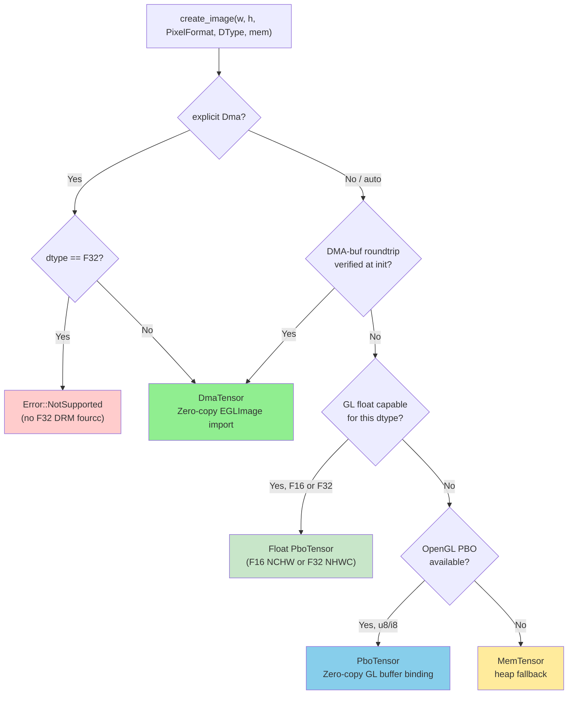
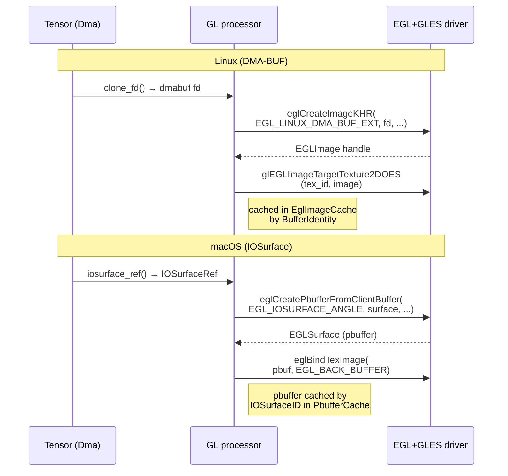

# edgefirst-image Architecture

## Overview

`edgefirst-image` provides hardware-accelerated image format conversion,
resizing, rotation, cropping, and segmentation-mask rendering for EdgeFirst
inference pipelines. The crate's central type is
[`ImageProcessor`](https://docs.rs/edgefirst-image/latest/edgefirst_image/struct.ImageProcessor.html),
an orchestrator that probes available hardware once at construction time and
then dispatches per-call to the most efficient backend in the chain
**OpenGL → G2D → CPU**. The processor owns the lifecycle of the GL thread,
the EGL/PBO caches, and the GPU shader programs that implement the visual
operations.

This crate carries the largest body of platform-specific code in the
EdgeFirst HAL. Most of the architectural surface area is concerned with
keeping zero-copy paths working across i.MX 8M Plus (Vivante), i.MX 95
(Mali/Panfrost), and desktop Mesa, while respecting the lifecycle and
shutdown quirks of each driver stack.

## Module Map

| Module | Source | Responsibility |
|--------|--------|----------------|
| [`lib.rs`](https://github.com/EdgeFirstAI/hal/blob/main/crates/image/src/lib.rs) | local | Public surface: `ImageProcessor`, `ImageProcessorTrait`, `Rotation`, `Flip`, `Crop`, `MaskOverlay`, `save_jpeg`, and the re-exported `codec` decode API (`codec::{ImageDecoder, ImageLoad, peek_info}`) |
| [`cpu/`](https://github.com/EdgeFirstAI/hal/tree/main/crates/image/src/cpu) | local | `CPUProcessor` — fast_image_resize + rayon, plus the f16 mask kernels |
| [`g2d.rs`](https://github.com/EdgeFirstAI/hal/blob/main/crates/image/src/g2d.rs) | local | `G2DProcessor` — NXP i.MX G2D 2D-engine bindings |
| [`gl/`](https://github.com/EdgeFirstAI/hal/tree/main/crates/image/src/gl) | local | OpenGL backend: threaded wrapper, context, EGL+PBO caches, shaders, DMA-BUF import |
| [`gl/shaders_common.rs`](https://github.com/EdgeFirstAI/hal/blob/main/crates/image/src/gl/shaders_common.rs) | local | **Portable** GLSL shared by both backends (compiled on every OS): the shared fullscreen `VERTEX_SHADER`, the PlanarRgb F16 packer, and the NV→RGBA shader (`NV_RGBA_FRAGMENT`, one divide-free body shared by both backends). Its bytes are byte-frozen by golden-file tests that run on every platform. |
| [`gl/core.rs`](https://github.com/EdgeFirstAI/hal/blob/main/crates/image/src/gl/core.rs) | local | **Portable** renderer helpers shared by both backends (no gbm/IOSurface types): `float_crop_uniforms` and its unit tests. |
| [`gl/fourcc.rs`](https://github.com/EdgeFirstAI/hal/blob/main/crates/image/src/gl/fourcc.rs) | local | `PixelFormat`→`DrmFourcc` mapping via the portable `drm_fourcc` crate (NOT `gbm`), so shader/format code carries no `gbm` coupling. |
| [`gl/platform/macos.rs`](https://github.com/EdgeFirstAI/hal/blob/main/crates/image/src/gl/platform/macos.rs) | local | `MacosPlatform::{load_egl_lib, create_display}` — two associated functions, the only macOS-specific helpers the GL backend needs. No trait, no enum dispatch. Linux helpers live directly in `gl/context.rs`. |
| [`gl/iosurface_import.rs`](https://github.com/EdgeFirstAI/hal/blob/main/crates/image/src/gl/iosurface_import.rs) | local | macOS-only: builds the `EGL_ANGLE_iosurface_client_buffer` attribute list and converts a tensor's IOSurface into an EGL pbuffer. |
| [`gl/macos_processor.rs`](https://github.com/EdgeFirstAI/hal/blob/main/crates/image/src/gl/macos_processor.rs) | local | macOS-only single-threaded GL pipeline (ANGLE → Metal). Parallel to `gl/processor.rs` rather than a refactor — the Linux processor stays untouched. |
| [`error.rs`](https://github.com/EdgeFirstAI/hal/blob/main/crates/image/src/error.rs) | local | `Error` (with `From<std::io::Error>` for ergonomic `?` propagation in user code) |

## Key Types and Traits

- [`ImageProcessor`](https://docs.rs/edgefirst-image/latest/edgefirst_image/struct.ImageProcessor.html) — the orchestrator. Owns CPU + G2D + GL backends and dispatches per call.
- [`ImageProcessorTrait`](https://docs.rs/edgefirst-image/latest/edgefirst_image/trait.ImageProcessorTrait.html) — the convert/draw API common to every backend.
- [`Rotation`](https://docs.rs/edgefirst-image/latest/edgefirst_image/enum.Rotation.html), [`Flip`](https://docs.rs/edgefirst-image/latest/edgefirst_image/enum.Flip.html), [`Crop`](https://docs.rs/edgefirst-image/latest/edgefirst_image/struct.Crop.html) — **source-side** geometry: `Crop { source: Option<Region>, fit: Fit }` selects the sampled source sub-rectangle and the fit mode. `Fit = Stretch | Letterbox`; **letterbox** preserves the *source* aspect ratio while filling the requested *destination* shape (padding the remainder). Destination placement is the destination itself (a tensor or a `view`/`batch` of one), never a `Crop` field.
- **Destination / source regions** (`dst.view(rect)` / `dst.batch(n)`, `src.view(rect)`) — a sub-region of a tensor used to target a batch tile or select a sampling window in `convert()`. The `view`/`batch` primitive is a **raw tensor** concept (it shares the parent's `BufferIdentity` and carries the sub-region — defined in [`crates/tensor/ARCHITECTURE.md` § Views and sub-regions](https://github.com/EdgeFirstAI/hal/blob/main/crates/tensor/ARCHITECTURE.md#views-and-sub-regions)); the *mechanics* of consuming one live here. A region lowers to `glViewport`/`glScissor` (GL dst), the destination crop (G2D dst), an offset+stride (CPU dst), or `Crop.source` sampling (src). It is render state, not a buffer attribute, so it never re-keys the EGLImage. See [Batched preprocessing](#batched-preprocessing-building-a-batch-via-convert).
- [`MaskOverlay`](https://docs.rs/edgefirst-image/latest/edgefirst_image/struct.MaskOverlay.html) — composite control for mask-rendering APIs (`background`, `opacity`).
- [`codec::ImageLoad`](https://docs.rs/edgefirst-codec/latest/edgefirst_codec/trait.ImageLoad.html) + [`codec::ImageDecoder`](https://docs.rs/edgefirst-codec/latest/edgefirst_codec/struct.ImageDecoder.html) — decode JPEG/PNG into a pre-allocated tensor at its native format (JPEG → `Nv12`/`Nv16`/`Nv24` by subsampling, or `Grey`; PNG → `Rgb`/`Rgba`/`Grey`); EXIF orientation is reported in `ImageInfo`, never applied (apply it via `convert()`). [`save_jpeg`](https://docs.rs/edgefirst-image/latest/edgefirst_image/fn.save_jpeg.html) — encode a `u8` tensor to JPEG.

## Internal Architecture

### Backend dispatch


The macOS GL backend (`MacosGlProcessor`) is a parallel implementation
of `ImageProcessorTrait` rather than a wrapper over `GLProcessorThreaded`
— see "macOS GL backend" below for why. The `opengl` field on
`ImageProcessor` is cfg'd to the right type per OS so the public API
shape stays uniform.

`ImageProcessor` dispatch priority is **OpenGL (GPU) → G2D (where supported)
→ CPU (always available)**. Environment variables `EDGEFIRST_DISABLE_GL`,
`EDGEFIRST_DISABLE_G2D`, `EDGEFIRST_DISABLE_CPU` and `EDGEFIRST_FORCE_BACKEND`
override this chain at runtime; see [`README.md` Environment
Variables](https://github.com/EdgeFirstAI/hal/blob/main/crates/image/README.md#environment-variables).

### TensorDyn as the image type

The image-side type system reuses [`edgefirst_tensor::TensorDyn`](https://docs.rs/edgefirst-tensor/latest/edgefirst_tensor/struct.TensorDyn.html)
as the dtype-erased image carrier. `TensorDyn` wraps a `Tensor<T>` and a
`PixelFormat`; the format describes the spatial layout, the `DType` describes
element storage. Width / height / channels are **not stored** — they
are computed from shape + format on every access. Row stride is set whenever the physical pitch differs from the logical minimum:
always for semi-planar (NV12/NV16/NV24) tensors, which carry a 64-byte-aligned
`row_stride` from `configure_image`/`image()`; and for packed formats whose
natural pitch is not 64-byte-aligned (e.g. odd-width RGBA on macOS IOSurface).
The canonical accessor is `effective_row_stride()` — it returns the stored stride
when set, or the tight minimum otherwise.  Several callers name the same concept
differently: `grid_row_stride`, `row_stride`, `bytes_per_row`, `tex_width`, and
`pitch_width` all refer to this single physical row pitch value.

The byte size of the backing allocation is `total_combined_height * row_stride`,
**not** the element-count product of the shape.  `total_combined_height` is the
combined luma + chroma row count (`PixelFormat::combined_plane_height()`), e.g.
`H + ceil(H/2)` for NV12, `2H` for NV16, `3H` for NV24.

`row_stride` is required for padded DMA-BUF imports where the producer's stride
differs from `width * bytes_per_pixel`.

| Format | Tensor shape | Notes |
|--------|--------------|-------|
| `Rgb`, `Rgba`, `Bgra`, `Grey`, `Yuyv`, `Vyuy` | `[H, W, C]` | Interleaved (channels-last) |
| `PlanarRgb`, `PlanarRgba` | `[C, H, W]` | Channels-first |
| `Nv12` | `[H + ceil(H/2), W]` | 4:2:0 — Y plane (H rows) + UV (ceil(H/2) rows); `3H/2` for even H, exact for odd H |
| `Nv16` | `[H*2, W]` | 4:2:2 — Y plane (H rows) + UV (H rows) |
| `Nv24` | `[H*3, W]` | 4:4:4 — Y plane (H rows) + full-res CbCr (2H rows; each chroma row is 2W bytes wide spanning two stride-rows, i.e. `uv_rows_per_luma=2`). IOSurface width must be the 64-aligned pitch to avoid ANGLE addressing past the declared width. |

> **NV24 multiplane** (`from_planes`) is **not yet supported** — use a
> contiguous NV24 tensor (combined single allocation). Only NV12 and NV16
> have multiplane paths.

For multi-plane DMA-BUF NV12/NV16 (V4L2 `NV12M` from VPU/NeoISP), Y and UV
live in separate allocations. `Tensor::from_planes(luma, chroma,
PixelFormat::Nv12)` keeps each plane's fd independent for zero-copy GPU
import via per-plane EGL attributes (`DMA_BUF_PLANE0_FD` / `DMA_BUF_PLANE1_FD`).

### `create_image()` and zero-copy memory selection

`ImageProcessor::create_image()` is the preferred way to allocate destination
tensors for `convert()`. It selects the optimal backend based on a probe done
at `ImageProcessor::new()` time:



| Backend | When selected | GPU transfer | Platforms |
|---------|---------------|--------------|-----------|
| DMA-buf | GPU supports `EGL_EXT_image_dma_buf_import`; dtype != F32 | Zero-copy: GPU reads/writes the DMA buffer directly | NXP i.MX 95 (Mali/Panfrost), RPi 5 (V3D) |
| Float PBO | `supported_render_dtypes().f16/f32` true; dtype F16 or F32 | `GL_PIXEL_PACK_BUFFER` readback | V3D, Mali, Tegra; macOS F16 via IOSurface |
| u8/i8 PBO | GLES 3.0 available, DMA-buf roundtrip fails; dtype U8/I8 | Zero-copy GL: `GL_PIXEL_UNPACK_BUFFER` / `GL_PIXEL_PACK_BUFFER` | NVIDIA desktop, hosts without DMA-heap permissions |
| Mem | No GPU or GL unavailable; float GPU cap absent | CPU `memcpy` via `glTexImage2D` / `glReadnPixels` | Universal fallback; `convert()` uses CPU path |

**Note:** when `memory: None` is passed with a float dtype and GPU float
support is absent, allocation falls through to `Mem` without error.
[`convert`](https://docs.rs/edgefirst-image/latest/edgefirst_image/trait.ImageProcessorTrait.html#tymethod.convert)
then uses the CPU path — it never returns an error due to float
capability.

**Why PBO matters:** on desktop Linux with NVIDIA GPUs, DMA-buf allocation
succeeds (`/dev/dma_heap/system`) but the NVIDIA EGL driver cannot import
those buffers — the `verify_dma_buf_roundtrip()` check catches this at init.
Without PBO, every `convert()` would fall back to CPU `memcpy` for upload and
readback. PBO keeps the data in GPU-accessible memory, enabling the same
zero-copy shader pipeline used on DMA platforms.

### GL transfer backend selection

| Backend | Detection | GPU upload | GPU readback |
|---------|-----------|------------|--------------|
| `DmaBuf` | `verify_dma_buf_roundtrip()` passes (Linux) | `EGL_EXT_image_dma_buf_import` (zero-copy) | EGLImage export (zero-copy) |
| `IOSurface` | macOS + `EGL_ANGLE_iosurface_client_buffer` present | `eglCreatePbufferFromClientBuffer(EGL_IOSURFACE_ANGLE)` + `eglBindTexImage` (zero-copy) | Same pbuffer is the FBO color attachment; CPU readback via `IOSurfaceLock` |
| `Pbo` | GLES 3.0 available, DMA-buf fails | `GL_PIXEL_UNPACK_BUFFER` | `GL_PIXEL_PACK_BUFFER` |
| `Sync` | Final fallback | `glTexImage2D` (host pointer) | `glReadnPixels` (host pointer) |

`DmaBuf` and `IOSurface` are both zero-copy paths, just with different
EGL extensions backing them — the choice is platform-bound and the
processor doesn't need a runtime predicate to tell them apart.

### GL platform seam

The GL backend lives in two parallel processors today:

- `GLProcessorThreaded` (in `gl/processor.rs`) — Linux, threaded, owns
  the EGLImage cache and PBO machinery.
- `MacosGlProcessor` (in `gl/macos_processor.rs`) — macOS, single-
  threaded, mutex-protected, ANGLE-driven.

Each processor calls into its own platform-specific bring-up code. The
only macOS-specific helpers the rest of the backend needs are:

| Function | Purpose |
|----------|---------|
| [`MacosPlatform::load_egl_lib`](https://github.com/EdgeFirstAI/hal/blob/main/crates/image/src/gl/platform/macos.rs) | Locate and dlopen ANGLE's `libEGL.dylib` (search order: `EDGEFIRST_ANGLE_PATH` → Homebrew → `@loader_path` → `@executable_path` → dyld). |
| [`MacosPlatform::create_display`](https://github.com/EdgeFirstAI/hal/blob/main/crates/image/src/gl/platform/macos.rs) | Bring up an ANGLE Metal display via `eglGetPlatformDisplayEXT(EGL_PLATFORM_ANGLE_TYPE_METAL_ANGLE)`. |

The pbuffer import, texture binding, FBO setup, and shader compilation
are inline inside [`MacosGlProcessor`](https://github.com/EdgeFirstAI/hal/blob/main/crates/image/src/gl/macos_processor.rs); the two processors are parallel,
with no shared cross-platform trait. An earlier draft introduced a bare
`GlPlatform` trait with no consumer and removed it as fiction — a
platform trait is only real once a shared renderer actually routes
through it.

The platform-independent pieces that *are* shared live in modules
compiled on every OS: `gl::shaders_common` (the GLSL sources, including
one NV→RGBA body for both backends, byte-frozen by a golden test),
`gl::core` (`float_crop_uniforms`), and `gl::fourcc` (the
`PixelFormat`→`DrmFourcc` map via the portable `drm_fourcc` crate). As a
result `gbm` is referenced only by `gl/context.rs` (the GBM EGL-display
backend) and `error.rs` (two error variants).

The EGL flow itself differs by platform:



The destination handling mirrors the source: on Linux the same
`EGLImage` can back an FBO color attachment via
`glFramebufferTexture2D`. On macOS the same pbuffer is sampled *and*
serves as the render target — `eglBindTexImage` makes it texture-
addressable while `glFramebufferTexture2D` makes it framebuffer-
addressable. Both bindings are valid simultaneously because ANGLE's
Metal backend reference-counts the underlying Metal texture.

### Linux NV12 / NV16 / NV24 → RGB convert (Path A / Path B)

Semi-planar YUV sources reach the GPU on Linux via one of two zero-copy
DMA-BUF import paths, selected by format (`processor/mod.rs::convert_to`):

- **Path A — driver hardware-YUV (`samplerExternalOES`).** The two-plane
  DMA-BUF is imported as an `EGL_LINUX_DMA_BUF_EXT` EGLImage with a YUV DRM
  FourCC and sampled through `samplerExternalOES`; the driver does the
  YUV→RGB. This is the path **NV12** uses on every GPU. It is *not* used for
  NV16/NV24 on the embedded drivers: `samplerExternalOES` either rejects the
  4:2:2/4:4:4 FourCC (Vivante: `EGL(BadMatch)`) or samples it incorrectly
  (Mali/V3D produce wrong pixels). `pixel_format_to_drm` therefore maps only
  NV12 among the semi-planar formats.
- **Path B — hand-written R8 `texelFetch` shader.** The *combined* semi-planar
  buffer is imported as a single-plane **R8** EGLImage (one `texelFetch`-able
  `TEXTURE_2D`; combined height = luma `H` + chroma rows: NV12 `ceil(H/2)`,
  NV16 `H`, NV24 `2H`). A core GL ES 3.0 shader (`generate_nv_to_rgba_*` in
  `gl/shaders.rs`, no `GL_OES_EGL_image_external` extension) does the YUV→RGB
  with direct 2D addressing — uniforms `chroma_shift` and `chroma_lines`, no
  per-pixel integer divide/modulo (the divide/modulo form is ~3.3× slower on
  Vivante GC7000UL, which is texture-fetch-bound for this kernel). This is the
  path **NV16 and NV24** use on all GPUs.

Both paths feed the existing, dtype-appropriate output render unchanged: u8/i8
RGB(A) into a zero-copy DMA target for the quantized NPU targets (imx8mp vx,
imx95 Neutron), or the RGBA8→PlanarRgb-F16 packer for the F16 targets
(Tegra/orin, macOS). `last_nv_convert_path` records which path ran
(`ExternalSampler`/`ShaderR8`/`Cpu`) so tests and the profiler can assert no silent CPU
fallback for a DMA NV* source.

### macOS GL backend (`gl/macos_processor.rs`)

The macOS implementation is a parallel single-threaded GL processor
rather than a refactor of the threaded Linux pipeline. Two reasons:

1. **Metal is thread-safe enough** — ANGLE's Metal backend handles
   the cross-thread coordination internally, so the Linux galcore
   workaround (a dedicated GL thread serializing every call) buys
   nothing on macOS. A `Mutex<()>` guarding GL calls is sufficient.

2. **Scope** — the threaded `processor.rs` is ~5500 lines tightly
   coupled to DMA-BUF caching, PBO tensors, and the Linux EGL image
   cache. Rewriting it cross-platform would have been a refactor
   larger than the macOS port itself. Parallel `MacosGlProcessor`
   keeps the Linux code untouched.

The macOS backend ships several fragment shaders today:

- **YUYV → RGBA** (packed `GL_RG` sampler).
- **GREY → RGBA** (single `GL_RED` plane, identity luma).
- **NV12 / NV16 / NV24 → RGBA** — one `GL_RED` shader that samples the
  contiguous combined-plane buffer with in-shader semi-planar addressing
  (`texelFetch`), parameterised by uniforms so a single program serves all
  three subsamplings and is portable to Linux/embedded GLES.
- **RGBA8 → PlanarRgb F16** — letterbox resize + `/255` normalize + HWC→CHW,
  packed into an RGBA16F IOSurface (NCHW model input).
- **NV12 / NV16 / NV24 → PlanarRgb F16** — the profiler's preprocess, run as a
  two-pass chain (NV*→RGBA8 into a cached intermediate, then RGBA8→PlanarRgb
  F16) under a *single* GL session (one `lock_gl` + `MakeCurrent` across both
  passes, so the process-global ANGLE context is never released mid-operation).

Convert pairs without a shader return `NotSupported` and
`ImageProcessor::convert` falls back to CPU. Each new shader needs:

- A GLSL ES 3.0 source in `macos_processor.rs`.
- A FourCC entry for the destination layout in
  `tensor::iosurface::image_fourcc_and_bpe`. (For RGBA the FourCC is
  `'RGBA'` — not `'BGRA'` — so the CPU readback sees the bytes in the
  same order the tensor's logical `PixelFormat` reports. Mapping
  Rgba to `'BGRA'` looks correct under the GL pipeline but produces a
  silent channel swap on CPU readback; the existing similarity test
  catches it.)
- A matching `EGL_TEXTURE_INTERNAL_FORMAT_ANGLE` entry in
  `gl/iosurface_import.rs::ImageLayout::gl_internal_format` (the GL
  texture format must agree with the IOSurface FourCC — ANGLE
  validates this at `eglCreatePbufferFromClientBuffer` time).

### Colorimetry

YUV→RGB on every backend is driven by the source tensor's per-tensor
[`Colorimetry`](#colorimetry-1) (matrix + range), resolved at use-time:

- **Path B** (Linux R8 `texelFetch`, NV12/NV16/NV24) and the **macOS** NV
  shader compute the matrix *in the fragment shader* from six colorimetry
  uniforms (`y_offset`, `y_scale`, `c_vr`, `c_ug`, `c_vg`, `c_ub`) produced by
  `colorimetry::yuv_to_rgb_coeffs`. Correct on every GPU regardless of driver
  EGL-hint support (verified on Vivante GC7000UL, Mali-G310, V3D).
- **Path A** (`samplerExternalOES`, driver YUV) sets the matching EGL
  `YUV_COLOR_SPACE_HINT` / `SAMPLE_RANGE_HINT` from the resolved colorimetry.
  Hint-ignoring drivers (Vivante) apply a fixed BT.601-limited matrix
  regardless. How `auto` weighs that against Vivante's ~12× Path-B cost is
  the **`ColorimetryMode`** knob (`ImageProcessorConfig::colorimetry`, env
  `EDGEFIRST_COLORIMETRY`; issue #106 policy): the default **`Fast`** keeps
  single-plane 4-aligned NV12 on Path A for every colorimetry (approximate
  matrix for non-BT.601-limited sources), while the **`Exact`** opt-in
  forces non-matching colorimetries to Path B so the exact matrix always
  applies. Multiplane NV12 (which Path B cannot import) stays on Path A in
  both modes, as does every non-Vivante GPU's Path-B preference (exact is
  already the fast path there).
- Packed **YUYV/VYUY**: the **macOS** YUYV shader threads the same six
  colorimetry uniforms as the NV path (`yuv_to_rgb_coeffs`), so an untagged
  720p source resolves to BT.709 limited and matches the camera fixture (~0.997
  on ANGLE). On **Linux** packed YUYV has no in-shader path and relies on the
  Path A EGL hints, falling back to the colorimetry-correct CPU path otherwise.

See the [Colorimetry](#colorimetry-1) section for the full design.

### ANGLE constant gotchas

The `EGL_ANGLE_iosurface_client_buffer` extension uses these
constants (lifted from `ANGLE/include/EGL/eglext_angle.h`):

| Constant | Value | Purpose |
|----------|-------|---------|
| `EGL_IOSURFACE_ANGLE` | `0x3454` | Client buffer type passed to `eglCreatePbufferFromClientBuffer`. |
| `EGL_IOSURFACE_PLANE_ANGLE` | `0x345A` | Which IOSurface plane to bind (0 for single-plane, separate calls for NV12 Y/UV). |
| `EGL_TEXTURE_RECTANGLE_ANGLE` | `0x345B` | Texture target for the pbuffer — but **most callers want 2D, not rectangle**. |
| `EGL_TEXTURE_TYPE_ANGLE` | `0x345C` | GL type token for shader sampling (`GL_UNSIGNED_BYTE` etc). **Easy to confuse with 0x345B.** |
| `EGL_TEXTURE_INTERNAL_FORMAT_ANGLE` | `0x345D` | GL internal format the IOSurface bytes are interpreted as (`GL_RG`, `GL_RGBA`, `GL_BGRA_EXT`). |
| `EGL_BIND_TO_TEXTURE_TARGET_ANGLE` | `0x348D` | Required EGL config attribute: must equal `EGL_TEXTURE_2D` for the pbuffer to be `eglBindTexImage`-able. |

The 0x345B vs 0x345C swap is the kind of bug that survives review and
only manifests at runtime as a vague `EGL_BAD_ATTRIBUTE` — worth
calling out.

### GL thread architecture

`GLProcessorThreaded` is the public, thread-safe wrapper. It spawns a
dedicated OS thread that owns the EGL context and all GL state
(`GLProcessorST`). All operations are sent as `GLProcessorMessage` enum
variants through a channel and block on a oneshot reply. This design is
required because EGL contexts are thread-local — every GL call must happen
on the thread that created the context.

The [`PboOps`](https://docs.rs/edgefirst-tensor/latest/edgefirst_tensor/trait.PboOps.html)
trait bridges the tensor crate and the GL thread. `PboTensor` (defined in
the tensor crate) holds an `Arc<dyn PboOps>`; the image crate's
`GlPboOps` implementation of that trait is what owns the `WeakSender` to
the GL-thread channel. When the tensor needs to map / unmap / delete the
PBO, it calls into the `PboOps` impl, which sends a message through the
channel. The weak sender ensures PBO tensors don't prevent GL thread
shutdown — see
[`crates/tensor/ARCHITECTURE.md#pbo-tensors-and-the-weaksender-pattern`](https://github.com/EdgeFirstAI/hal/blob/main/crates/tensor/ARCHITECTURE.md#pbo-tensors-and-the-weaksender-pattern).

### GLES 3.1 context and the optional compute path

At context creation time, the GL thread attempts a GLES 3.1 context first;
on failure it falls back to GLES 3.0 (no compute shaders).

When GLES 3.1 is available, an opt-in compute shader path can perform the
HWC→CHW proto-tensor repack on the GPU. Enable it with
`EDGEFIRST_PROTO_COMPUTE=1`. If compilation fails at runtime, the
implementation logs a warning and falls back to CPU repack transparently —
no API changes.

### Destination lowering (`bind_dst`)

Every u8/i8 `convert()` lowers its destination through one seam: the pure
classifier `render::lower_dst(zero_copy_import, dst_memory)` picks the
lowering and `bind_dst()` performs the GL work, returning a `DstTarget`
that tells the engine what completes the convert.

| Lowering | Destination | Render target | Completion |
|----------|-------------|---------------|------------|
| `ZeroCopy` | DMA (with EGL dma_buf import) | dst's own EGLImage (renderbuffer on Mali, texture-FBO elsewhere) | none — render writes the buffer |
| `TexturePbo` | PBO | offscreen texture seeded from the PBO via UNPACK | `glReadnPixels` into the PBO PACK binding |
| `TextureMem` | Mem/Shm (or DMA without import) | offscreen texture seeded from the mapped tensor | `glReadnPixels` into the mapped tensor |

One `convert_via_engine` executes every u8/i8 convert: the pure plan table
`render::plan_convert(src_fmt, dst_fmt, lowering)` picks `SinglePass`,
`TwoPassPackedRgb` (zero-copy packed RGB needs an RGBA-reinterpret second
pass), or `TwoPassNvPlanar` (NV→planar through the full `select_nv_path`
machinery; also the Vivante single-pass GPU-hang workaround). Single-pass
converts share the same `bind_dst → render → readback` body for every
src/dst memory combination — the source side independently picks the PBO
UNPACK upload or the CPU texture upload. The two-pass functions survive as
render strategies, not duplicated dispatch. Both decision tables
(`lower_dst`, `plan_convert`) are host-tested in `render.rs` with no GL
dependency, so a new platform changes capability *inputs*, never the
tables.

**Why the PBO lowering never maps:** the GL thread must not call
`tensor.map()` on a PBO image — that sends a `PboMap` message back to the
GL thread itself and deadlocks. `bind_dst` therefore seeds the render
texture by binding the PBO as `GL_PIXEL_UNPACK_BUFFER` and calling
`glTexImage2D(NULL)` (GL reads directly from the PBO), and the readback
targets the PACK binding. Mem tensors map directly — no channel round-trip
— so the `TextureMem` lowering may map freely.

**Int8 letterbox bias is lowering-independent:** the int8 fragment shader
XORs rendered pixels with 0x80 and no readback un-biases, so the letterbox
clear colour is pre-biased (`int8_bias_clear`) on every lowering alike.

### CUDA registration of the float PBO

After `convert()` writes the float output into the PBO via
`glReadnPixels(GL_PIXEL_PACK_BUFFER)`, the same PBO buffer can be
registered with CUDA and accessed as a device pointer — no host copy.

**Registration** happens on the GL worker thread at `create_image()` time
(or lazily on the first `cuda_map()` call, whichever comes first) via
`cudaGraphicsGLRegisterBuffer`. The registration persists for the lifetime
of the `PboTensor` and is shared across all `cuda_map()` calls on that tensor.

**Aliasing rule**: while `CudaMap` is alive, GL must not write into the PBO.
The aliasing rule is a caller convention enforced by the scoped `CudaMap`
guard lifetime: the caller maps per inference and drops the guard before
the next `convert()` call. The guard's `Drop` impl returns the PBO to GL
(via `cudaGraphicsUnmapResources`) so the next `convert()` can write into
it. No runtime check in the GL worker tracks active CUDA maps.

**Thread constraints**: `cudaGraphicsMapResources` (called on each
`cuda_map()`) must run on the GL-context thread. The resulting device
pointer is usable from any thread via the per-device CUDA primary context.
The `CudaGlOps` trait routes the map/unmap calls through the existing GL
thread channel, the same mechanism used by `PboOps` for PBO map/unmap.

**Drop order**: `CudaGraphicsResource` (the registered handle) is owned
inside `PboTensor` in a field declared before the PBO's GL object ID. Rust's
field-drop order guarantees `cudaGraphicsUnregisterResource` runs before
`glDeleteBuffers`, satisfying the CUDA–GL interop spec requirement.

For the full CUDA type model, `CudaHandle` variants (GlBuffer vs
ExternalMem), and DMA-BUF import path, see
[`crates/tensor/ARCHITECTURE.md § Zero-copy CUDA tensor mapping`](https://github.com/EdgeFirstAI/hal/blob/main/crates/tensor/ARCHITECTURE.md#zero-copy-cuda-tensor-mapping).

### CUDA → TensorRT integration contract

The supported zero-copy hand-off to a CUDA/TensorRT client is the **output**
path: allocate the convert destination through `create_image()` (a GPU **PBO**),
`convert()` into it, then `cuda_map()` and bind the device pointer:

```text
decode/import → src → convert(src → dst = create_image(PlanarRgb|Rgb, F16|F32))
             → CudaMap m = dst.cuda_map()
             → trt_context.setInputTensorAddress(name, m.device_ptr())
             → enqueueV3(stream)
```

Contract the client must honour:

- **Lifetime.** The destination tensor *and* the live `CudaMap` guard must
  outlive every `enqueueV3` that reads the pointer. Drop the guard only after
  the inference stream has synchronised (`cudaStreamSynchronize` or the
  set-input-consumed event). Dropping it early returns the PBO to GL.
- **Synchronisation.** `convert()` finishes its GL work before `cuda_map()`
  returns, so the device buffer is ready when bound. The producer (HAL convert)
  and the consumer (TRT) are otherwise on independent streams; the guarantee is
  "convert complete → map → enqueue". Shared-stream / external-semaphore
  pipelining is a future optimisation.
- **Layout / alignment.** The output is tight (no row padding) NCHW planar F16
  (`PlanarRgb`) or NHWC `Rgb` F32 — `CudaMap::len()` equals the logical byte
  size. The device pointer is **256-byte aligned**, satisfying TensorRT's
  `setInputTensorAddress` requirement.

**Jetson (Orin) note.** Orin has no `/dev/dma_heap`, so semi-planar YUV sources
have no GPU convert path (that needs a DMA-BUF EGLImage). The CPU JPEG decoder
emits native **NV12 / NV16 / NV24 / GREY** into an `mmap`'d PBO; `convert()`
runs on the **CPU** (colorimetry-correct) and writes the result into the
CUDA-registered output PBO, which is then `cuda_map`'d — the zero-copy is the
*output* to TensorRT, not the decode. This is exercised end-to-end per format by
`gl::tests::jpeg_{nv12,nv16,nv24,grey}_convert_cuda_devptr` (verified on GTX 1080
and Tegra Orin) and the C-API `cuda_devptr_roundtrip` test.

**DMA-BUF → CUDA import (`cudaImportExternalMemory`, `ExternalMem`)** is a
separate, **experimental** path used only when a tensor is *both* a self-owned
DMA-BUF *and* on a CUDA device. NVIDIA documents `cudaImportExternalMemory` on a
dma-buf/opaque fd as **unsupported on Tegra/Orin** (use the EGLImage interop
instead); it is left in place for discrete-x86 experimentation but is **not** the
Jetson path and is not part of the supported contract above.

### Batched preprocessing: building a batch via convert()

Inference engines that support batching expect a single, fully-assembled
`[N, H, W, C]` (or planar `[N, C, H, W]`) input tensor — not N separate
buffers stitched together at invoke time. The HAL builds that batch
**forward**, calling `convert()` once per source image into a distinct *tile*
of one reused destination tensor, rather than reconstructing it backward from
per-element sub-views.

```text
jpeg/png ─► source ─► convert ─► (batch tile n) ─► invoke ─► output ─► decode
            (codec sets        (glViewport+scissor     (full        (batch-aware:
             shape/stride/      into dst.batch(n);       batched)     whole-map +
             format)            each call imports                     ndarray index)
                                its own offset+id)
```

- **Source.** The codec decodes an arbitrary-resolution JPEG/PNG into a
  pre-allocated source tensor whose buffer may be larger than needed, then sets
  that tensor's `shape`, `row_stride` (GPU-aligned: 64 B embedded, 256 B Nvidia),
  and `PixelFormat` to match what was decoded (`Nv12`/`Nv16`/`Nv24`/`Grey`, or
  `Rgb` for PNG). A distinct (dims, stride, format) source legitimately mints a
  fresh source EGLImage.
- **Convert into a tile.** A batch is assembled by calling `convert(src,
  dst.batch(n), …)` (or `dst.view(region)`) once per source image, or — for one
  import + one sync — `convert_deferred(src, dst.batch(n), …)` in a loop then a
  single `flush()`. A `view`/`batch` sub-view resolves its **parent**
  (`view_origin` = parent dims + the tile's origin), so the GL backend keys the
  destination EGLImage on the **parent** identity+geometry: every sibling tile
  shares **one** import and is a `glViewport`/`glScissor` band into it (the tile
  offset is render state, never a cache key). `convert_deferred` defers the
  per-tile `glFinish`; `flush` issues one `finish_via_fence`. `N` is the leading
  dimension prepended to the base layout (packed `[N,H,W,C]` or planar
  `[N,C,H,W]`), so a tile is element *n*, contiguous in memory either way (a
  row-band in the physical render target).
- **Source sub-rectangle.** `src.view(region)` (equivalently `Crop.source`)
  selects a sampling window, lowering to `src_rect_uv` — it adjusts UV sampling,
  not the imported texture, so it does not re-key the source EGLImage.
- **Letterbox.** Letterbox is a **resize mode** (`Crop { fit: Fit::Letterbox }`),
  not a placement: it preserves the *source* aspect ratio while filling the
  requested *destination* shape (the tile, or the whole tensor for `N==1`),
  padding the remainder. The backend clears the destination region to the
  background, then renders the aspect-preserved content within it — identically
  whether the destination is a view/tile or the whole tensor.

A view is **render state, not a buffer attribute**: it carries the parent tensor
plus a `Region`, shares the parent's `BufferIdentity`, and never enters the
EGLImage cache key. Per backend:

| Backend | Destination tile lowering | Note |
|---------|---------------------------|------|
| OpenGL  | `glViewport`+`glScissor` to the tile rect on the parent FBO/EGLImage | scissor isolates the clear |
| G2D     | the tile is the destination crop rectangle of the blit | the tile's byte offset/stride must meet G2D's dst alignment, else this tile falls back to CPU |
| CPU     | a base `offset` + the **parent's** `row_stride` into the parent buffer | the writer strides by the parent pitch, not a tile-local tight stride |

**`convert()` always outputs an RGB-family color (`Grey` / `Rgb` / `Rgba`),
packed `HWC` or planar `CHW`** — never a YUV/semi-planar layout (chroma is a
*source* concern only; a YUV destination returns `Error::InvalidFormat`). NPUs
require packed/aligned inputs and models are trained to match. The `Rgb` output
uses the "4-into-3" packing trick (four RGB pixels written as three RGBA texels);
`Grey` renders to `GL_RED` or, for throughput, packs into RGBA like `Rgb`.

**Packed vs planar tiles.** Both are contiguous (`N` is outermost), so a tile is
a row-band in the *physical render target* either way:
- **Packed `HWC`** dst: element *n* occupies physical rows `[n·H, (n+1)·H)`; the
  "4-into-3" packing is horizontal and composes with the vertical band.
- **Planar `CHW`** dst (e.g. `PlanarRgb` F16): the packer renders into a packed
  render target (RGBA16F `(W/4, 3H)` per element); element *n*'s slab is the
  row-band `[n·3H, (n+1)·3H)` of that target. The per-tile pack pass writes into
  element *n*'s band — the tile viewport/scissor is computed in
  **packed-render-target** coordinates, not logical `[C,H,W]`.

OpenGL destination-tile obligations:

- **Scissor every clear.** `glViewport` clips the rendered quad but **not**
  `glClear`. When every tile shares the background, clear the **whole** batched
  destination **once** before the loop (a full-surface fast-clear); per-tile
  scissored clears (`glEnable(GL_SCISSOR_TEST)` + `glScissor(tile)`) apply only
  when tiles differ in background. A clear must never wipe a sibling tile.
- **Top-down destination band.** The destination DMA EGLImage is **top-down**:
  GL framebuffer row 0 maps to memory row 0 (verified on-target — a tile rendered
  at GL `y` lands in memory band `y`), because the renderer's texcoords already
  flip the sampled image upright. So tile *n*'s `glViewport`/`glScissor` y is just
  its top-left `region.y` (= `n·H`), **not** a bottom-left `parent_h − (y+H)`
  flip. (`gl/render.rs::region_to_viewport` encodes the bottom-left flip for a
  *bottom-up* surface and is not used by this top-down DMA path.)
- **Sync once per batch.** A plain `convert()` ends with `glFinish()`, so a loop
  of N converts incurs N pipeline syncs. `convert_deferred` defers that finish and
  `flush()` issues a single `finish_via_fence` for the whole batch; the CUDA map
  path auto-flushes a pending batch before handing the device the buffer. First
  engine: single-pass `Rgba`/`Bgra`/`Grey` u8/i8 DMA only — two-pass packed-RGB,
  planar, and macOS GL fall back to an eager per-tile convert.

**Source import churn.** Each distinct source re-imports (~100–300 µs); across a
run that is O(images) unless bounded. Reuse a fixed-capacity ring of source
tensors sized to the codec's decode-ahead depth and re-`configure_image()` them so
the live source EGLImages stay warm and bounded. Reconfiguring a reused buffer
must re-import at the new geometry: because the cache key includes the import
geometry (`width`/`height`/`row_stride`/`format`) alongside `BufferIdentity.id`
and `chroma_id`, a buffer reused at a new size **re-keys to a fresh import**
rather than returning a *stale* image. (A `last_import_reason` field recording
`Reconfigure`/`NewIdentity`/`Hit` is a planned observability addition.)

Edge contracts (testable invariants):

- An out-of-bounds `view(region)` / `batch(n ≥ N)` returns an error, never clamps.
- Two regions sharing one `BufferIdentity` used as **src and dst** of the same
  `convert()` is **undefined** (the GL backend binds the whole EGLImage as both
  texture and FBO), even if their rects are disjoint.
- `batch(0)` on an `N==1` tensor is observably identical to the whole tensor.
- Filling tile *n* never alters tile *m≠n* (scissor isolation); unfilled tiles of
  a partially-assembled batch have undefined contents.
- Master oracle for every tile: a tile equals a standalone full-buffer
  `convert()` of the same source into a fresh single-image destination.

### EGL image cache

The OpenGL backend maintains two independent LRU caches of EGLImages —
`src_egl_cache` for source tensors and `dst_egl_cache` for destination
tensors. The full key (`EglCacheKey`) is the tensor's **`BufferIdentity.id`**
(plus `chroma_id` for multi-plane sources) **and the imported geometry**
(`width`, `height`, `row_stride`, `format`) — the geometry distinguishes a
pooled buffer reused at a new size via `configure_image`. A `view()`/`batch()`
destination keys on its **parent**: it contributes the parent's geometry and
`plane_offset = 0`, so every sibling tile collapses to the parent's single
cached EGLImage and is selected with `glViewport`/`glScissor`, **not** by
importing a new offset-keyed EGLImage (see [Batched preprocessing](#batched-preprocessing-building-a-batch-via-convert)).
A non-zero `plane_offset` participates in the key only for a genuine
offset-distinct *import* — a foreign DMA-BUF whose data starts past the fd
origin, or a multi-plane chroma plane — never as a batch-tiling mechanism.

`BufferIdentity` is defined in
[`crates/tensor/src/lib.rs`](https://github.com/EdgeFirstAI/hal/blob/main/crates/tensor/src/lib.rs)
and pairs a globally unique monotonic ID with an `Arc<()>` liveness guard:

```text
BufferIdentity {
    id:    u64,     // unique per allocation; new value from each from_fd() call
    guard: Arc<()>, // cache entries hold Weak<()>; when tensor drops, weak dies
}
```

When a tensor is freed, its `Arc<()>` guard drops. The cache holds only a
`Weak<()>` reference, so `sweep()` detects dead entries without an explicit
removal call.

| Pattern | Cache behavior | Performance |
|---------|----------------|-------------|
| Same tensor object reused across frames | Hit on every frame | Fast — no EGLImage re-import |
| New tensor wrapping the same fd each frame | Miss on every frame | Slow — re-imports each call |
| `dst` of call N reused as `src` of call N+1 | Hit in both caches | Two separate entries, no collision |

Key implications:

- `hal_tensor_from_fd()` and `hal_import_image()` always allocate a new
  `BufferIdentity`. Callers that re-wrap the same fd each frame will see a
  cache miss every `convert()`. **Hold the tensor alive across frames.**
- Content written into a DMA-BUF between calls (e.g. by a V4L2 decoder) is
  visible on the next call. EGLImage is a handle to live physical memory,
  not a snapshot.
- The `last_bound_src_egl` optimization skips
  `glEGLImageTargetTexture2DOES` when the source EGLImage has not changed
  between consecutive calls. Safe — the texture already points at the
  correct DMA-BUF memory.
- A `glFinish()` is issued at the end of every `convert()`. This guarantees
  GPU reads of source and writes to destination are complete before return,
  making it safe to chain calls and to read the destination immediately after.

See [Appendix C: DMA-BUF Identity and Tensor Caching](https://github.com/EdgeFirstAI/hal/blob/main/ARCHITECTURE.md#appendix-c-dma-buf-identity-and-tensor-caching)
in the project ARCHITECTURE.md for the cross-crate cache story (V4L2
fd recycling, inode-keyed cache, GStreamer adaptor integration).

### Vivante NV12/NV16/NV24 → PlanarRgb two-pass workaround

A single-pass semi-planar-YUV → PlanarRgb shader causes a GPU hang on the
Vivante GC7000UL (NXP i.MX 8M Plus). The workaround splits the conversion:

```text
Pass 1:  NV12/NV16/NV24 → RGBA (intermediate)
         All geometry: resize, crop, rotation, flip, letterbox
Pass 2:  RGBA → PlanarRgb (at destination resolution)
         Deinterleaves RGBA to three planes via sampler2D variants
```

Pass 1 reuses the existing `packed_rgb_intermediate_tex` texture — no new
GPU resources allocated. Pass 2 uses the same shader infrastructure as
direct RGBA → PlanarRgb. The two-pass path is selected automatically when
`is_vivante && matches!(src_fmt, Nv12 | Nv16 | Nv24) && dst_fmt.layout() ==
Planar`; the function is `convert_nv_to_planar_two_pass`. No API changes
required from callers.

## Mask Rendering

YOLO segmentation models produce **proto masks** (shared basis at reduced
resolution, typically 160×160) and per-detection **mask coefficients**:

```text
mask_raw[i] = coefficients[i] @ protos       # (proto_h, proto_w)
```

The image crate exposes three rendering pipelines paired with the decoder's
mask APIs:

| Workflow | Decoder source (public API) | Image-side render | Best for |
|----------|-----------------------------|-------------------|----------|
| Materialized | [`Decoder::decode()`](https://docs.rs/edgefirst-decoder/latest/edgefirst_decoder/struct.Decoder.html#method.decode) | `draw_decoded_masks` | Already have mask matrices |
| Fused proto path | [`Decoder::decode_proto()`](https://docs.rs/edgefirst-decoder/latest/edgefirst_decoder/struct.Decoder.html#method.decode_proto) | `draw_proto_masks` | Real-time GPU overlay (preferred) |
| Tracked materialized | [`Decoder::decode_tracked()`](https://docs.rs/edgefirst-decoder/latest/edgefirst_decoder/struct.Decoder.html#method.decode_tracked) (via [`edgefirst-tracker`](https://github.com/EdgeFirstAI/hal/blob/main/crates/tracker/)) | `draw_masks_tracked` | Single-call decode + track + render |
| Tracked proto | [`Decoder::decode_proto_tracked()`](https://docs.rs/edgefirst-decoder/latest/edgefirst_decoder/struct.Decoder.html#method.decode_proto_tracked) | `draw_proto_masks` (with track-augmented detections) | Tracked GPU-fused path |

### MaskOverlay

```rust,ignore
pub struct MaskOverlay<'a> {
    pub background: Option<&'a TensorDyn>, // blit before drawing masks
    pub opacity: f32,                       // 0.0 invisible, 1.0 opaque
    pub letterbox: Option<[f32; 4]>,       // [xmin, ymin, xmax, ymax] in
                                            // model-input normalized space;
                                            // maps decoder output back to
                                            // original image coords when set
    pub color_mode: ColorMode,             // Class | Instance | Track
                                            // (Track currently behaves
                                            //  like Instance — see below)
}
```

### Fused proto→pixel algorithm (`draw_proto_masks`)

Instead of computing the matmul at proto resolution and upsampling the
result, the fused path upsamples the proto field itself and evaluates the
dot product at every output pixel:

```text
For each output pixel (x, y) inside detection bbox at 640×640:
    bilinear_sample(protos, proto_coords(x, y))  → 32 interpolated values
    dot(coefficients, interpolated_protos)        → raw logit
    sigmoid(raw)                                  → mask value [0, 1]
    threshold at 0.5 → blend color onto pixel
```

Algebraically equivalent to bilinear-after-matmul (both bilinear
interpolation and the dot product are linear), but avoids materializing the
intermediate tensors. Key design choices:

- **No proto-resolution crop** — the full 160×160 proto field is sampled,
  avoiding the boundary erosion artifact of crop-before-upsample approaches.
- **Sigmoid after interpolation** — sigmoid is nonlinear, so applying it
  after spatial operations preserves dynamic range through interpolation.
- The draw path uses the sigmoid value directly for alpha-blend weighting.

This is mathematically equivalent to Ultralytics' `retina_masks=True`
(`process_mask_native`) for binary mask output. Empirical validation across
26 matched detections on COCO val2017 confirms **0.993 mean mask IoU**
between the two methods.

### GPU implementation (OpenGL)

Draw path (`draw_proto_masks`) — sigmoid shaders with alpha blending:

The fragment shader computes `sigmoid(logit)` and blends the detection color
onto the framebuffer using `GL_SRC_ALPHA / GL_ONE_MINUS_SRC_ALPHA`. The GPU
renders one quad per detection; the fragment shader evaluates the mask at
every output pixel.

#### Shader variants

| Variant | Proto storage | Interpolation |
|---------|---------------|---------------|
| int8-nearest | `R8I` quantized | Nearest neighbor |
| int8-bilinear | `R8I` quantized | Manual 4-tap bilinear |
| f32 | `R32F` float | Hardware `GL_LINEAR` |
| f16 | `R16F` half | Hardware `GL_LINEAR` |

Control quantized proto interpolation via
`processor.set_int8_interpolation_mode(...)`.

> **G2D limitation:** the NXP G2D hardware accelerator does not support
> mask rendering. On platforms where G2D is the primary backend (e.g.
> i.MX 8M Plus without EGL), all `draw_*` methods return
> `NotImplemented`. Use an OpenGL-capable processor (pass an
> `egl_display`) or fall back to CPU rendering.

#### Vivante shader performance cliff and the eager-materialize workaround

The fused `draw_proto_masks` path is the preferred GPU pipeline on
Mali / Panfrost (i.MX 95) and on desktop GPUs, where the per-pixel
sigmoid + dot product runs comfortably under real-time even at large
detection counts. **On Vivante GC7000UL (i.MX 8M Plus)** the same
shader can fall off a cliff for models with many detections or large
proto fields, reaching multi-second per-frame latency. The driver's
fragment-shader scheduling on this part does not amortise the
per-quad-per-pixel work the way mainline GPUs do.

The safe pattern on Vivante (and as a defensive choice for any
deployment that may run on it) is to **materialise masks once on the
CPU** via `materialize_masks` immediately after decode, free the proto
data, and then render with the cheap `draw_decoded_masks` blit:

```rust
// On the decode thread:
let masks = processor.materialize_masks(
    &boxes, &scores, &classes, &proto_data,
    letterbox_norm,
    MaskResolution::Scaled { width: dst_w, height: dst_h },
)?;
drop(proto_data); // free the proto tensor immediately

// On the render thread (or the same thread, just later):
processor.draw_decoded_masks(&mut frame, &boxes, &masks, overlay)?;
```

`materialize_masks` runs the same batched-GEMM kernel exercised by
`mask_benchmark` (see [`TESTING.md`](https://github.com/EdgeFirstAI/hal/blob/main/crates/image/TESTING.md#benchmarks)),
which is well-amortised across detections; `draw_decoded_masks`
becomes a cheap RGBA blit. The combined CPU + GPU cost on i.MX 8M
Plus is comfortably real-time at typical COCO detection counts. On
Mali / desktop GPUs, switching back to the fused `draw_proto_masks`
is straightforward — the data flow is the same up to the choice of
render call.

## Process-Shutdown Resource Cleanup

The OpenGL headless renderer
([`crates/image/src/gl/`](https://github.com/EdgeFirstAI/hal/tree/main/crates/image/src/gl))
loads EGL and OpenGL ES via dynamically loaded shared libraries
(`libEGL.so.1`, `libGLESv2.so`). When the process exits — particularly from
a Python interpreter running PyO3 extensions — EGL resource cleanup can
crash with heap corruption, segfaults, or panics. This is a well-documented
industry-wide problem with no clean solution.

The crash arises from a fundamental conflict between four systems:

1. **Python finalization order is non-deterministic.** During
   `Py_FinalizeEx()`, Python destroys modules and objects in arbitrary
   order. A PyO3 `#[pyclass]` wrapping `GlContext` may have its Rust `Drop`
   invoked after dependent state is gone.
2. **Linux `atexit` handler ordering is unreliable.** glibc's
   `__cxa_finalize` interacts with `dlclose` in non-deterministic ways
   between handlers registered by different shared libraries
   ([glibc #21032](https://sourceware.org/bugzilla/show_bug.cgi?id=21032)).
3. **Mesa's `_eglAtExit` use-after-free.** Mesa's atexit handler frees
   per-thread EGL state (`_EGLThreadInfo`). If `Drop` calls
   `eglReleaseThread()` after this handler runs, it dereferences freed
   memory ([Ubuntu Bug #1946621](https://bugs.launchpad.net/ubuntu/+source/mesa/+bug/1946621)).
4. **Vendor EGL driver bugs.** Some vendor drivers (Qualcomm Adreno, older
   NVIDIA) misbehave during cleanup. The `catch_unwind` guard absorbs
   driver-side panics.

### Defense-in-depth solution

```text
┌─────────────────────────────────────────────────────────┐
│ Layer 1: Box::leak — EGL library handle                 │
│   Prevents dlclose from unmapping shared library code   │
├─────────────────────────────────────────────────────────┤
│ Layer 2: ManuallyDrop<Rc<Egl>> — EGL instance           │
│   Prevents khronos-egl Drop from calling                │
│   eglReleaseThread() into freed Mesa state              │
├─────────────────────────────────────────────────────────┤
│ Layer 3: catch_unwind — EGL cleanup calls               │
│   Catches panics from eglDestroyContext/eglMakeCurrent  │
│   if function pointers are invalidated                  │
├─────────────────────────────────────────────────────────┤
│ Layer 4: Skip eglTerminate entirely                     │
│   Display lives in a process-global OnceLock and is     │
│   intentionally leaked; eglTerminate is never called    │
└─────────────────────────────────────────────────────────┘
```

`GlContext::drop` calls `eglMakeCurrent(EGL_NO_CONTEXT)` and
`eglDestroyContext` inside `catch_unwind`, then intentionally skips
dropping the `Rc<Egl>` wrapper. The EGL library handle is leaked via
`Box::leak` at load time so it is never `dlclose`'d. The EGL display
itself lives in the `SHARED_DISPLAY` `OnceLock` (`SharedEglDisplay`) and
is never terminated — the EGL spec ref-counts `eglTerminate` against
`eglInitialize`, but calling it from `GlContext::drop` would tear the
display down for every other live `GlContext` in the process, so the
HAL leaks it on purpose.

### Industry precedent

- **Chromium/ANGLE** skips full EGL teardown on GPU process exit, treating
  cleanup as more dangerous than no cleanup during shutdown.
- **wgpu** wraps `glow::Context` in `ManuallyDrop` and loads EGL with
  `RTLD_NODELETE` to prevent library unloading. The `khronos-egl` crate
  itself adopted `RTLD_NOW | RTLD_NODELETE` after
  [khronos-egl #14](https://github.com/timothee-haudebourg/khronos-egl/issues/14),
  citing the same glibc root cause.
- **Smithay** supports skipping `eglTerminate` via a feature flag for the
  same class of driver bugs.

### Limitations

`catch_unwind` catches Rust panics but cannot catch fatal signals
(`SIGABRT`, `SIGSEGV`, `SIGBUS`) from heap corruption inside the C driver.
The defense layers prevent the most common failure modes, but a
sufficiently broken driver could still crash the process — none has been
observed on the supported platforms (Vivante, Mali/Panfrost, Mesa x86_64).

### G2D resource cleanup

On NXP i.MX, `libg2d.so.2` and `libEGL.so.1` share kernel state through the
Vivante `galcore` device (`/dev/galcore`). When both libraries are loaded,
calling `dlclose` on either one can trigger heap corruption (`corrupted
double-linked list`) during process exit — the atexit handlers from the
shared `galcore` driver become inconsistent.

For production code, `G2DProcessor` is dropped normally; the EGL
`Box::leak` (Layer 1) keeps shared `galcore` state intact. For benchmark
code (where many G2D processors are created/destroyed in one process), the
`crates/bench` harness wraps G2D processor instances in `ManuallyDrop` to
avoid repeated `g2d_close` + `dlclose` cycles that exhaust driver
resources.

### Resource cleanup policy

- **EGL displays** — never terminated. The process-global
  `SharedEglDisplay` is created once via `OnceLock` and leaked on
  process exit. `eglTerminate` is the *EGL way* to release a display
  but in practice causes driver crashes (see the defense-in-depth
  section above), so the HAL never calls it.
- **EGL contexts** — `eglDestroyContext` in `GlContext::drop`, inside
  `catch_unwind`. No EGL surfaces are created — the HAL uses
  surfaceless contexts (`EGL_KHR_surfaceless_context` +
  `EGL_KHR_no_config_context`) and renders exclusively through FBOs
  backed by EGLImages.
- **DMA buffers** — fd `close()` in `Drop`.
- **G2D contexts** — `g2d_close` in `G2DProcessor::drop`.

Intentional leaks: the EGL library handle (`Box::leak`), the `Rc<Egl>`
wrapper (`ManuallyDrop`), and the shared EGL display
(`SHARED_DISPLAY: OnceLock`). All three are process-lifetime objects;
the OS reclaims them at exit. GPU contexts, DMA buffers, and G2D
contexts are released eagerly by their `Drop` impls.

## GL Concurrency Model (serialization policy)

Multiple `ImageProcessor` instances coexist in one process, each owning a
dedicated GL worker thread and its own EGL context (held current for the
thread's life) on the process-global shared display. Whether those
workers execute GPU work **in parallel** is a per-driver policy decided
when the worker starts:

| Driver | Policy | Effect |
|---|---|---|
| Vivante `galcore` (i.MX 8M Plus) | `Full` | Every message acquires the global `GL_MUTEX` — all instances serialize (the pre-2026-06 behavior on every platform). |
| Mali/Panfrost, V3D, Tegra, llvmpipe | `LifecycleOnly` | Messages run unlocked; instances execute GL concurrently on the same GPU. |

Override with `EDGEFIRST_GL_SERIALIZE=full|lifecycle` — `full` is the
escape hatch for unknown-bad drivers (or tiny-convert-heavy
multi-processor workloads on Tegra, below); `lifecycle` forces
parallelism for experiments.

### Why Vivante serializes

EGL/GLES specify that independent contexts on separate threads must not
interfere; Vivante `galcore` violates this — concurrent `eglInitialize`,
`eglCreateContext`, DMA-BUF import ioctls, and runtime GL from multiple
threads corrupt driver-internal state (SIGSEGV at offset `0x18` in
`galcore` ioctl, futex deadlocks). Separately, concurrent multi-processor
*lifecycles* can abort intermittently (`double free or corruption`) even
when fully serialized — the 2026-06 lock-scoping spike reproduced it
under `Full` policy, implicating driver thread-exit TLS destructors that
no userspace lock can order. That known bug keeps the
`EDGEFIRST_SKIP_VIVANTE_KNOWN_BUGS` test skip.

### What stays globally serialized everywhere

1. **Initialization** — `GLProcessorST::new()` (display probe/creation,
   context setup, shader compilation, DMA-BUF roundtrip verification).
   Also makes the once-per-process GL function-pointer load race-free.
2. **Teardown** — `GLProcessorST::drop()` → `GlContext::drop()`
   (`eglDestroyContext` serialization; V3D historically broke display
   ref-counting on concurrent `eglTerminate`, which the HAL additionally
   avoids by never terminating the shared display).
3. **EGLImage create/destroy** — a dedicated short `EGL_IMAGE_MUTEX`
   (display-level EGL ops; a separate mutex because `Full`-policy
   workers already hold `GL_MUTEX` at creation time). Zero steady-state
   cost: imports are cache-miss-only after warmup.

All mutexes recover from poisoning via `unwrap_or_else(into_inner)` so a
panicked instance does not poison the others.

### Measured scaling (parallel_processors_benchmark, 2026-06)

`S(n)` = aggregate throughput with `n` processors ÷ single-processor
baseline, NV12 720p → RGB 640×640 letterbox (DMA):

| Board | S(2) | S(4) | Notes |
|---|---|---|---|
| imx95 (Mali G310) | 2.00 | 2.05 | near-ideal until GPU saturates |
| rpi5 (V3D) | 1.16 | 1.16 | V3D saturates ≈750 conv/s |
| orin (Tegra) | 1.08 | 1.17 | |
| imx8mp (Vivante, `Full`) | 1.03 | 1.04 | flat by design |

Dispatch-dominated 64×64 converts additionally show rpi5 S(4)=2.24 and
imx95 S(4)=1.52 — but **Tegra collapses on that degenerate cell**
(S(2)=0.26): per-convert syncs force GPU context switches between active
contexts and the ~0.45 ms switch cost dwarfs sub-100 µs converts
(corroborated: `EDGEFIRST_GL_SERIALIZE=full` restores the cell to 0.83).
Realistic converts scale positively on the same board; use the `full`
override if a deployment really does hammer tiny converts from many
processors on Tegra.

Correctness under parallelism is pinned by
`test_parallel_processors_unique_outputs` (4 processors × distinct
inputs × barrier × per-processor oracles, run on every lane) and the
ignored on-demand `stress_parallel_processors_oracle` board tool.

## Tracing Spans

`ImageProcessor::convert()`, `materialize_masks()`, and `draw_decoded_masks()`
emit a [`tracing::trace_span!`] tree describing the backend-dispatch decision
and every internal pass. Spans are captured by
[`edgefirst_hal::trace::start_tracing`](https://github.com/EdgeFirstAI/hal/blob/main/crates/hal/src/trace.rs)
into Chrome JSON for Perfetto and cost a single relaxed atomic load per call
site when no subscriber is active.

### Naming convention

Span names follow `<crate>.<function>[.<operation>[.<sub-operation>]]`:

- **`<crate>.<function>`** — top-level span: the public function the user
  invoked (`image.convert`, `image.materialize_masks`, `image.draw_decoded_masks`).
- **`<crate>.<function>.<operation>`** — meaningful internal work; backend
  dispatch within `convert()` lives at this level
  (`image.convert.gl`, `image.convert.g2d`, `image.convert.cpu`).
- **`<crate>.<function>.<operation>.<sub-operation>`** — further
  decomposition where it aids optimisation (`image.convert.gl.pack_rgb.pass1_rgba`,
  `image.convert.cpu.format_convert`).

A span is worth adding when the work inside it is meaningful for
optimisation and has enough complexity to justify the overhead — roughly
500 µs on Cortex-A53 as a guideline.

### Span tree

```text
image.convert                                           [user-facing fn, orchestrator]
│ fields: src_fmt, dst_fmt, src_memory, dst_memory, rotation, flip, dst_tile?
│
├── image.convert.gl                                    [OpenGL backend, picked first]
│   │ fields: src_fmt, dst_fmt, is_int8, src_memory, dst_memory, dst_tile?, last_import_reason?
│   ├── image.convert.gl.engine                         ← plan + destination lowering for the convert ({plan, lowering, src_pbo})
│   ├── image.convert.gl.egl_import                     ← one actual eglCreateImageKHR (cache MISS only; zero in steady state)
│   ├── image.convert.gl.pack_rgb.pass1_rgba            ← NV* → intermediate RGBA (resize + crop + flip)
│   ├── image.convert.gl.pack_rgb.pass2_pack            ← intermediate RGBA → packed RGB (3:4 width ratio)
│   ├── image.convert.gl.nv_to_planar.pass1_rgba        ← Vivante 2-pass: NV12/NV16/NV24 → intermediate RGBA
│   ├── image.convert.gl.nv_to_planar.pass2_deinterleave ← Vivante 2-pass: RGBA → PlanarRgb planes
│   └── image.convert.gl.macos.nv_to_planar             ← macOS two-pass: NV12/NV16/NV24 → PlanarRgb F16 (single GL session)
│
├── image.convert.g2d                                   [NXP i.MX G2D backend, picked second]
│   fields: src_fmt, dst_fmt
│
└── image.convert.cpu                                   [universal fallback, parent implicit]
    ├── image.convert.cpu.format_convert                ← per-pixel format conversion
    │   fields: from, to, pass = "pre_resize" | "direct" | "post_resize"
    └── image.convert.cpu.resize_flip_rotate            ← fast_image_resize + rayon

image.flush                                             [user-facing fn — batch sync]
└── image.flush.gl                                      ← single finish_via_fence for a deferred batch
    fields: pending

image.draw_decoded_masks                                [user-facing fn]
fields: n_detections, n_segmentations

image.materialize_masks                                 [user-facing fn]
│ fields: n_detections, mode = "proto" | "scaled", width?, height?
├── image.materialize_masks.kernel_i8                   ← i8 coeff × i8 proto, proto-resolution
├── image.materialize_masks.kernel_i16xi8               ← i16 coeff × i8 proto, proto-resolution
├── image.materialize_masks.kernel_i8_scaled            ← i8 coeff × i8 proto, scaled to dst W×H
└── image.materialize_masks.kernel_i16xi8_scaled        ← i16 coeff × i8 proto, scaled to dst W×H
    fields: n, proto_h, proto_w, num_protos, layout, (width, height for *_scaled)
```

> The CPU backend has no top-level `image.convert.cpu` span of its own; the
> CPU dispatch enters via `image.convert.cpu.format_convert` and/or
> `image.convert.cpu.resize_flip_rotate` directly. Parent in the trace is
> `image.convert`.

### What each span measures (mapped to the `convert()` inner workings)

| Span                                                   | What is happening inside | Key observations |
|--------------------------------------------------------|--------------------------|------------------|
| `image.convert`                                        | Orchestration: probe backends, pick OpenGL → G2D → CPU, dispatch. | The `src_memory` and `dst_memory` fields reveal whether you're on a zero-copy DMA-buf path, the PBO path, or the heap fallback. Cache-miss EGLImage imports show up as outliers here when callers reuse fds without reusing tensors. `dst_tile` (the batch-tile rect / index) is present when the call renders into a destination region rather than the whole tensor. |
| `image.convert.gl`                                     | The chosen GL backend's full shader pipeline: bind/import source, set up FBO/renderbuffer, run conversion shader, `glFinish`. | First call at a new (src_fmt, dst_fmt, dims) tuple includes shader compile/link cost. Steady-state cost is dominated by the GPU draw and the `glFinish` at the end. `dst_tile` and `last_import_reason` reveal the tile rect/index and whether the source re-imported. |
| `image.convert.gl.engine`                              | The convert engine's decision record: which `ConvertPlan` (`SinglePass` / `TwoPassPackedRgb` / `TwoPassNvPlanar`) and which destination lowering (`ZeroCopy` / `TextureMem` / `TexturePbo`) this convert took, plus whether the source is PBO-backed. | The plan/lowering pair maps 1:1 onto the GL work performed — filter traces by these fields to isolate one lowering's latency. Both decisions are pure host-tested tables in `render.rs` (`plan_convert`, `lower_dst`). |
| `image.convert.gl.egl_import`                          | One actual `eglCreateImageKHR` — every EGLImage creation (DMA-BUF, NV R8, RGB renderbuffer paths) funnels through this single choke point. | The cache-behavior observable: a steady-state frame loop over a fixed buffer pool must emit ZERO of these after warmup. Any per-frame occurrence means the EGLImage cache stopped hitting (key drift, geometry churn, or pool misuse). The `GLProcessorThreaded::egl_cache_stats()` counters (`src`/`dst`/`nv_r8` hits/misses) are the assertable form, pinned by the `dma_pool_steady_state_zero_imports` test. |
| `image.convert.gl.pack_rgb.pass1_rgba`                 | NV12 → intermediate RGBA texture (full geometry: resize, crop, rotation, flip, letterbox). | Reused for the "packed RGB" output path (DMA destination with 3-byte-per-pixel width × 3 / 4 render geometry). |
| `image.convert.gl.pack_rgb.pass2_pack`                 | Intermediate RGBA → RGB DMA destination via the packed shader. | Only the second pass touches the DMA buffer; the first pass renders into the cached intermediate texture. |
| `image.convert.gl.nv_to_planar.pass1_rgba`             | NV12/NV16/NV24 → intermediate RGBA (the Vivante GC7000UL workaround for the GPU hang on single-pass NV* → PlanarRgb). | Selected automatically when `is_vivante && matches!(src_fmt, Nv12 \| Nv16 \| Nv24) && dst.layout == Planar`. |
| `image.convert.gl.nv_to_planar.pass2_deinterleave`     | RGBA → PlanarRgb / PlanarRgba via `sampler2D` deinterleave shader. | Includes the optional `XOR 0x80` int8-bias step when the destination is `DType::I8`. |
| `image.convert.gl.macos.nv_to_planar`                  | macOS two-pass: NV12/NV16/NV24 → RGBA8 intermediate, then RGBA8 → PlanarRgb F16, under a single GL session (`lock_gl` + `MakeCurrent` held across both passes). | Emitted by `MacosGlProcessor::convert_nv_to_planar_float`. |
| `image.convert.g2d`                                    | NXP 2D hardware engine doing format conversion + resize + rotation + flip + letterbox in one DMA-DMA blit. | Only available on i.MX 8M Plus / 8M Mini. Synchronous on the G2D driver; the span includes the driver's blocking wait. |
| `image.convert.cpu.format_convert`                     | Per-pixel format conversion (e.g. NV12 → RGB, RGBA → BGRA). The `pass` field tells you whether this ran before, after, or instead of resize. | `pre_resize` indicates the source needed conversion to RGB/RGBA/GREY before `fast_image_resize` could run; `direct` indicates no resize was needed; `post_resize` indicates the destination format differed from the intermediate. |
| `image.convert.cpu.resize_flip_rotate`                 | `fast_image_resize::Resizer` + rayon parallel slice, with composed flip/rotate/letterbox geometry. | The bulk of CPU `convert()` cost. The CPU backend is selected only when neither GL nor G2D accepts the (src, dst) format pair. |
| `image.draw_decoded_masks`                             | Per-detection alpha-blend of `Segmentation` mask onto the destination image (CPU or GL depending on backend). | When backend == GL, this dispatches to the shader-based mask blit. |
| `image.materialize_masks`                              | Wrapper around the four `kernel_*` spans, paired with letterbox inversion and bbox-clipped row iteration. `mode = "proto"` returns proto-resolution masks; `mode = "scaled"` resamples to `(width, height)`. | Use the proto-resolution mode when you only need IoU computation against ground truth at the proto grid (the default Ultralytics evaluation mode). |
| `image.materialize_masks.kernel_i8`                    | Fused i8 dequant + i8 × i8 → i32 matmul + sigmoid at proto resolution. NEON FP16 on aarch64. | The fastest path; avoids producing an intermediate f32 protos buffer. |
| `image.materialize_masks.kernel_i16xi8`                | i16 coeff dequant + i16 × i8 → i32 matmul. Used when mask coefficients are stored at i16. | Preserves the i16 dynamic range that an i8 coeff dequant would lose. |
| `image.materialize_masks.kernel_i8_scaled`             | Same fused i8 path, but per-output-pixel bilinear sample of the proto field (no intermediate proto-resolution mask). | Algebraically equivalent to `process_mask_native` from Ultralytics (`retina_masks=True`); empirical mask IoU 0.993 vs. Ultralytics on COCO val2017. |
| `image.materialize_masks.kernel_i16xi8_scaled`         | i16 variant of the above scaled kernel. | Same shape and algorithm; different coefficient dtype. |

[`tracing::trace_span!`]: https://docs.rs/tracing/latest/tracing/macro.trace_span.html

## Colorimetry

### The three-axis problem

A YCbCr (YUV) buffer cannot be converted to RGB correctly without knowing three
independent properties, and a mismatch on any of them corrupts the result:

1. **Matrix** — the luma/chroma coefficients: **BT.601** (SD/JPEG), **BT.709**
   (HD), or **BT.2020** (UHD/HDR). A wrong matrix rotates the chroma plane,
   tinting saturated colours (greens↔magentas) while greys stay correct.
2. **Range / quantization** — **full** (a.k.a. JFIF / "PC" / extended, luma
   0–255) vs **limited** (a.k.a. studio / "video", luma 16–235). A wrong range
   crushes blacks and clips/washes highlights and shifts overall contrast.
3. **Transfer function / primaries** — gamma and gamut. These matter for display
   and tone-mapping but are *not* used by the YCbCr→RGB matrix itself, so the HAL
   can ignore them for conversion (they would matter for an HDR pipeline).

So the HAL's conversion correctness reduces to picking the right **(matrix,
range)** pair for each source buffer.

### Per-source findings (what each producer actually emits)

Research across the four target boards (kernel driver source, NXP/NVIDIA/RPi
docs, libcamera, V4L2 colorspace spec — sources below):

| Source | Matrix | Range | Signalling / notes |
|--------|--------|-------|--------------------|
| **JPEG** (all platforms) | **BT.601** | **Full (JFIF)** | Standard-defined; i.MX `mxc-jpeg` hard-codes `ycbcr_enc=601, quantization=FULL`. The codec can always tag its output 601-full with high confidence. |
| **Video decode** (H.264/H.265/AV1) | per-stream | per-stream | **VUI-signalled** (`matrix_coefficients`, `video_full_range_flag`), *not* a silicon constant. HD/4K usually 709-limited, SD 601-limited. **Recurring bug:** decoders/buffers often default/allocate as 601 even when the stream is 709 (Jetson allocates bt601 by default; GStreamer "wants bt709" negotiation). Must read the signalled value, never infer from pixel format. |
| **i.MX camera/ISI** (imx95, imx8mp) | BT.601 | full *or* limited | ISI driver default is 601 **limited**, but real YUV sensors advertise **full** and propagate up as `colorspace:jpeg` (601 full). ISP (NEO on imx95, ISP8000 on imx8mp) output is tuning-dependent. No resolution dependence in the ISI itself. |
| **Pi 5 camera** (RP1 + PiSP, libcamera) | 601 or 709 | full or limited | Chosen by request type + resolution: RGB/stills/preview → `Sycc` (**601 full**); YUV <720 lines → `Smpte170m` (601 limited); YUV ≥720 → `Rec709` (**709 limited**). |
| **Orin Nano** (NVDEC / NVJPG) | baked into format enum | baked into enum | NVIDIA encodes (matrix,range) into `NvBufSurfaceColorFormat`: suffix `_709`=BT.709, `_2020`=BT.2020, `_ER`=full range, none=601-limited. NVJPG (HW JPEG) → 601 full (`_ER`). NVDEC decode-only (no NVENC). |

Cross-cutting truths:
- **JPEG is unambiguous (601 full)** — the safe, immediate win.
- **Video is VUI-driven** — colorimetry must be read from the bitstream and
  carried, not inferred.
- **Camera is BT.601 matrix** (709 only on the Pi5 HD-YUV path); **range varies**
  and is signalled by the producer (V4L2 `quantization` / libcamera `ColorSpace`).
- **Producers signal it** — V4L2 (`ycbcr_enc` + `quantization`), libcamera
  (`ColorSpace`), bitstream VUI, and NvBufSurface all expose matrix+range. NVIDIA
  bakes it into the format enum; V4L2/libcamera keep it in separate fields (the
  model the HAL mirrors).

### Implementation

#### `Colorimetry` type on the tensor

`edgefirst_tensor::Colorimetry` is a four-axis struct — `{ space, transfer,
encoding, range }` — where every axis is `Option<_>` (`None` = unknown/unset).
The enums (`ColorSpace`, `ColorTransfer`, `ColorEncoding`, `ColorRange`) are
videostream-aligned and `#[non_exhaustive]`. Tensors and `TensorDyn` carry an
`Option<Colorimetry>`. `None` means undefined; it is **never auto-filled** by the
tensor layer — that invariant is strict.

Helper constructors:
- `Colorimetry::jfif()` — sRGB primaries + sRGB transfer + BT.601 encoding +
  full range (standard JPEG/JFIF).
- `Colorimetry::from_v4l2(colorspace, xfer, ycbcr_enc, quantization)` — converts
  the four V4L2 kernel constants to the HAL's decoupled enum values. A V4L2
  `DEFAULT` (0) `ycbcr_enc`/`quantization` is resolved from the colorspace
  (e.g. `V4L2_COLORSPACE_JPEG` → BT.601 full-range), matching the kernel's
  `V4L2_MAP_*_DEFAULT` rules, rather than being left undefined.

#### Producers

| Producer | Colorimetry set |
|----------|-----------------|
| Codec JPEG decode (CPU + V4L2 HW) | `Colorimetry::jfif()` — BT.601 full-range, always |
| PNG decode (`Rgb`/`Rgba`) | sRGB primaries + sRGB transfer + full range |
| PNG decode (`Grey`) | full range only |
| `ImageProcessor::import_image(..., colorimetry)` | caller-supplied; client adaptors fill it from the producer's signalling (V4L2 `ycbcr_enc`/`quantization`, libcamera `ColorSpace`, bitstream VUI, NvBufSurface format suffix) |

Native Mac/Windows capture does not yet exist in the HAL; all camera/stream
sources go through `import_image` on client adaptors until those paths land.

#### `convert()` and the `effective_colorimetry` resolver

`convert()` never mutates the source tensor. Instead it calls a pure
`effective_colorimetry()` function at use-time that fills only the axes that are
`None` on the tensor, using a height heuristic:

- **Height ≥ 720 → BT.709, limited range** (HD convention)
- **Height < 720 → BT.601, limited range** (SD convention)

Per-axis: a tensor's explicitly set axes win; only the missing axes get the
heuristic value. The resolved colorimetry is consumed by the backend for that
single call and discarded.

#### Backend colorimetry support

| Backend | Matrix | Range | Notes |
|---------|--------|-------|-------|
| CPU (`cpu/convert.rs`) | BT.601 / BT.709 / BT.2020 | Full / Limited | Fully correct — passes resolved matrix + range to the `yuv` crate |
| GL NV12/NV16/NV24 (Path B, Linux R8 + macOS) | BT.601 / BT.709 / BT.2020 | Full / Limited | Fully correct — YUV→RGB is computed **in the fragment shader** from six per-tensor colorimetry uniforms (`yuv_to_rgb_coeffs`); the combined semi-planar buffer is imported as one R8 `texelFetch` texture. Verified on Vivante GC7000UL, Mali-G310, and V3D. |
| GL Path A / YUYV (driver `samplerExternalOES`) | driver-selected via EGL hints | Full / Limited (driver-honored) | The import sets `YUV_COLOR_SPACE_HINT` / `SAMPLE_RANGE_HINT` from the resolved colorimetry. Hint-honoring drivers (e.g. Tegra) are correct; on hint-ignoring drivers (Vivante) single-plane NV12 with non-default colorimetry is force-routed to Path B, and packed YUYV/VYUY falls back to the colorimetry-correct CPU path. |
| G2D (`g2d.rs`) | BT.601 / BT.709 | — | **Limitation:** `g2d-sys` exposes only `set_bt601_colorspace()` / `set_bt709_colorspace()` (matrix only). Full-range and BT.2020 YUV cannot be expressed. G2D **declines** full-range or BT.2020 YUV conversions; the dispatch falls through to GL or CPU. |

#### C and Python surfaces

| Layer | API |
|-------|-----|
| C | `hal_colorimetry` struct (4 `int` axes, 0 = unknown; values are stable HAL constants, decoupled from V4L2); `hal_tensor_set_colorimetry` / `hal_tensor_colorimetry`; `hal_colorimetry_from_v4l2`; `hal_import_image` colorimetry parameter |
| Python | `Colorimetry` class + enum constants; `tensor.colorimetry` property; `import_image(colorimetry=...)` |

Client adaptors (GStreamer elements, libcamera pipelines, etc.) use the C or
Python surface to supply colorimetry from the producer's signalling into
`import_image`, so `convert()` receives an accurately tagged tensor.

### Sources

- V4L2 colorspaces (JPEG = sRGB+601+full; SMPTE170M = 601 limited; default-mapping
  macros): <https://docs.kernel.org/userspace-api/media/v4l/colorspaces-defs.html>,
  <https://docs.kernel.org/userspace-api/media/v4l/colorspaces-details.html>
- i.MX `mxc-jpeg` (601 full hard-coded) and `imx8-isi` defaults (`MXC_ISI_DEF_*`):
  <https://github.com/torvalds/linux/tree/master/drivers/media/platform/nxp>
- Chips&Media Wave6 VUI→V4L2 mapping (i.MX95 VPU, RFC v5):
  <https://patchwork.kernel.org/project/linux-media/patch/20260415092529.577-5-nas.chung@chipsnmedia.com/>
- Hantro stateless decoder (imx8mp VPU; userspace parses VUI):
  <https://docs.kernel.org/userspace-api/media/v4l/dev-stateless-decoder.html>
- libcamera `ColorSpace` presets (Sycc/Smpte170m/Rec709) and Pi pipeline handler:
  <https://github.com/raspberrypi/libcamera/blob/main/src/libcamera/color_space.cpp>
- Pi 5 BCM2712 codec list (HEVC HW decode only; no H.264/JPEG HW):
  <https://www.raspberrypi.com/documentation/computers/processors.html>
- NVIDIA `NvBufSurfaceColorFormat` (matrix/range baked via `_709`/`_2020`/`_ER`):
  <https://docs.nvidia.com/metropolis/deepstream/dev-guide/sdk-api/nvbufsurface_8h_source.html>

## Performance Considerations

| Optimization | Why it matters |
|--------------|----------------|
| Reuse tensors across frames | Each new tensor allocates a fresh `BufferIdentity`. The EGL image cache is keyed by `BufferIdentity.id`/`chroma_id` plus the import geometry (`width`/`height`/`row_stride`/`format`). New ID → cache miss → full `eglCreateImageKHR` import (~100–300 µs). Hold tensors alive. Batch tiles key on the parent's identity+geometry, so the destination EGLImage is imported once and reused across the tile loop. |
| Allocate via `create_image()` | The processor selects DMA-buf, PBO, or heap based on the runtime GPU probe at `new()` time. Bypassing with `Tensor::new(memory=...)` forces a slow transfer path on every `convert()`. |
| One `ImageProcessor` per pipeline; more pipelines = more processors | Each instance owns its OpenGL context, dedicated GL thread, and per-thread caches (the EGL display is process-global and shared). On Mali, V3D, Tegra, and llvmpipe, instances execute GPU work **in parallel** (see "GL Concurrency Model" — measured up to S(4)=2.05 aggregate scaling on Mali); only Vivante serializes across instances. Within one instance, work is serialized on its own thread — share a processor across threads only behind your own queue. |
| Native CPU feature builds (Rule 6) | A build-time concern. `RUSTFLAGS` controls whether the f16 mask kernel at [`crates/image/src/cpu/masks.rs`](https://github.com/EdgeFirstAI/hal/blob/main/crates/image/src/cpu/masks.rs) compiles to native widening instructions or to the soft-float `__extendhfsf2` helper. Distributed binaries stay on triple baseline ISA; benchmark hosts opt in via `RUSTFLAGS` overrides. |

See the [Optimization Guide](https://github.com/EdgeFirstAI/hal/blob/main/README.md#optimization-guide)
in the project README for the user-facing rules and validation patterns.

## Inter-Crate Interfaces

| Direction | Crate | Interface |
|-----------|-------|-----------|
| Depends on | [`edgefirst-tensor`](https://github.com/EdgeFirstAI/hal/blob/main/crates/tensor/) | `TensorDyn`, `Tensor<T>`, `BufferIdentity`, `PboOps` impl |
| Depends on (unconditional) | [`edgefirst-decoder`](https://github.com/EdgeFirstAI/hal/blob/main/crates/decoder/) | `DetectBox`, `Segmentation`, proto data for `draw_*` |
| Depends on (feature `tracker`) | [`edgefirst-tracker`](https://github.com/EdgeFirstAI/hal/blob/main/crates/tracker/) | `Tracker<DetectBox>` for `draw_masks_tracked` |
| Consumed by | [`edgefirst-hal`](https://github.com/EdgeFirstAI/hal/blob/main/crates/hal/) | re-export as `edgefirst_hal::image` |
| Consumed by | [`edgefirst-hal-capi`](https://github.com/EdgeFirstAI/hal/blob/main/crates/capi/) | C bindings for `ImageProcessor` and rendering APIs (does **not** bridge to Python) |
| Consumed by | [`crates/python`](https://github.com/EdgeFirstAI/hal/blob/main/crates/python/) | PyO3 binding over the Rust umbrella crate (does not go through the C API) |

## Platform-Specific Notes

| Platform | Backends available | Float preprocessing | Notes |
|----------|--------------------|---------------------|-------|
| Linux NXP i.MX 8M Plus (Vivante GC7000UL) | OpenGL, G2D, CPU | CPU only (float disabled) | NV12/NV16/NV24 → PlanarRgb requires the two-pass workaround; NV16/NV24 use the Path B R8 shader (NV12 uses Path A); GPU float disabled (170–320 ms readback) |
| Linux NXP i.MX 95 (Mali-G310 / Panfrost) | OpenGL, CPU | F16 PBO + DMA-BUF; F32 PBO | Concurrent GL works; `EDGEFIRST_OPENGL_RENDERSURFACE=1` required for Neutron NPU DMA-BUF destinations |
| Linux RPi 5 (V3D / Broadcom) | OpenGL, CPU | F16 PBO + DMA-BUF; F32 PBO | |
| Linux Tegra Orin / NVIDIA (orin-nano) | OpenGL (PBO path), CPU | F16 PBO; F32 PBO — **PBO → CUDA zero-copy implemented** (`cuda_map()` maps the PBO to a device pointer on the GL worker thread; TensorRT reads directly from device memory) | DMA-buf import unsupported; PBO path provides zero-copy to CUDA |
| Linux desktop / Mesa x86_64 | OpenGL, CPU | GPU-dependent | DMA-heap permission required for DMA path |
| macOS (Apple Silicon, ANGLE installed) | OpenGL (ANGLE → Metal), CPU | F16 `PlanarRgb` IOSurface zero-copy; F32 not supported | YUYV → RGBA, GREY → RGBA, NV12/NV16/NV24 → RGBA, NV12/NV16/NV24 → PlanarRgb F16 (two-pass), and RGBA → PlanarRgb F16 all run on the GPU. IOSurface `width == 64-aligned pitch` (`semi_planar_surface_dims`) is required so ANGLE does not address texels beyond the declared width — NV24's chroma row is 2W bytes and would otherwise spill into padding columns. Other convert pairs fall back to CPU. |
| macOS (no ANGLE) | CPU | CPU only | `MacosGlProcessor::new()` fails at `ImageProcessor::new()` time; the GPU dispatch is never attempted. |
| Other Unix | CPU | CPU only | No GPU/G2D |

## Cross-References

- Project architecture: [../../ARCHITECTURE.md](https://github.com/EdgeFirstAI/hal/blob/main/ARCHITECTURE.md)
- Tensor architecture (DMA-BUF, BufferIdentity, PboOps): [../tensor/ARCHITECTURE.md](https://github.com/EdgeFirstAI/hal/blob/main/crates/tensor/ARCHITECTURE.md)
- Decoder architecture (proto mask APIs): [../decoder/ARCHITECTURE.md](https://github.com/EdgeFirstAI/hal/blob/main/crates/decoder/ARCHITECTURE.md)
- DMA-BUF identity story: [ARCHITECTURE.md#appendix-c-dma-buf-identity-and-tensor-caching](https://github.com/EdgeFirstAI/hal/blob/main/ARCHITECTURE.md#appendix-c-dma-buf-identity-and-tensor-caching)
- Optimization guide: [README.md#optimization-guide](https://github.com/EdgeFirstAI/hal/blob/main/README.md#optimization-guide)
- Performance tracing usage: [README.md#performance-tracing](https://github.com/EdgeFirstAI/hal/blob/main/README.md#performance-tracing)
