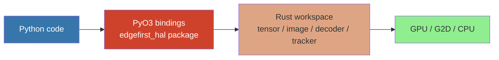

# edgefirst-hal (Python) Architecture

## Overview

The `edgefirst-hal` Python package is a PyO3 binding over the EdgeFirst HAL
Rust workspace. It exposes the same tensor / image / decoder / tracker APIs
that the C and Rust users see, with idiomatic Python types: `np.ndarray` for
buffer access, `pathlib.Path` for file APIs, exceptions for error reporting,
and `.pyi` stubs for IDE autocompletion. The binding uses
[PyO3](https://docs.rs/pyo3) and [maturin](https://maturin.rs) for wheel
building.

The crate is published to PyPI as
[`edgefirst-hal`](https://pypi.org/project/edgefirst-hal/). Pre-built wheels
ship for Linux x86_64 / aarch64 (manylinux2014 + abi3-py38), macOS Apple
Silicon, and Windows.

## Module Map

| Module | Source | Responsibility |
|--------|--------|----------------|
| [`lib.rs`](https://github.com/EdgeFirstAI/hal/blob/main/crates/python/src/lib.rs) | local | `#[pymodule]` registration; module-level docstring |
| [`tensor.rs`](https://github.com/EdgeFirstAI/hal/blob/main/crates/python/src/tensor.rs) | local | `Tensor`, `PixelFormat`, `DType`; numpy buffer protocol; `from_fd` / `dmabuf_clone` |
| [`image.rs`](https://github.com/EdgeFirstAI/hal/blob/main/crates/python/src/image.rs) | local | `ImageProcessor`, `Rect`, `Rotation`, `Flip`; `convert`, `draw_masks`, `draw_decoded_masks`, `import_image` |
| [`decoder.rs`](https://github.com/EdgeFirstAI/hal/blob/main/crates/python/src/decoder.rs) | local | `Decoder`; `decode`, `decode_tracked`, proto-mask APIs |
| [`tracker.rs`](https://github.com/EdgeFirstAI/hal/blob/main/crates/python/src/tracker.rs) | local | `ByteTrack`; `update`, `get_active_tracks` |

## Key Types

| Python class | Wraps | Notes |
|--------------|-------|-------|
| `Tensor` | `edgefirst_tensor::TensorDyn` | Implements the numpy buffer protocol — `np.frombuffer(t.map())` is zero-copy when the backend supports it |
| `ImageProcessor` | `edgefirst_image::ImageProcessor` | One-per-pipeline; owns the GL thread |
| `Decoder` | `edgefirst_decoder::Decoder` | Built once from a metadata dict or YAML/JSON string |
| `ByteTrack` | `edgefirst_tracker::ByteTrack<DetectBox>` | Stable per-track UUIDs |
| `PixelFormat`, `DType`, `Rotation`, `Flip`, `Rect` | corresponding Rust enums | `repr()` matches Rust naming |
| `Tracing` (context manager) | umbrella `trace::start_tracing` / `stop_tracing` | `with hal.Tracing("/tmp/trace.json"): ...` |

## Internal Architecture

### Binding shape



The `lib.rs` `#[pymodule]` registers each `#[pyclass]` from the four
sub-modules. PyO3 generates the necessary `__init__`, `__repr__`, and
property-accessor glue from `#[pymethods]` attributes, so the Python class
shapes track the Rust source automatically.

### Stable ABI / abi3

The wheels are built with `--features pyo3/abi3-py38`, producing a single
binary that runs on Python 3.8 through the latest 3.x. The trade-off is
that Python 3.11+ buffer-protocol features fall back to the 3.8-compatible
path; users on 3.11+ still get full functionality, just without the
zero-overhead 3.11-specific shortcuts. The CI matrix builds both stable-ABI
wheels and per-version wheels where measurement showed the abi3 fallback
materially slower; pip resolves the best wheel per host.

### NumPy → Tensor copy strategy

[`crates/python/src/tensor.rs`](https://github.com/EdgeFirstAI/hal/blob/main/crates/python/src/tensor.rs)
contains `copy_numpy_to_tensor_dyn`, which inspects the source array's
strides and dispatches to one of three paths to balance copy cost against
allocation overhead:

| Path | Source layout | Strategy | Cost |
|------|---------------|----------|------|
| 1 | Fully contiguous | `copy_from_slice` (memcpy), rayon-parallel ≥ 256 KiB | Lower bound — no allocation |
| 2 | Strided with contiguous inner rows (column slice, sub-volume, negative stride) | Per-row memcpy, iterate outer dimensions | Within ≈ 5 % of Path 1 for typical row sizes |
| 3 | Fully strided (transposed view, every-other-element) | Internal `np.ascontiguousarray()` (numpy's vectorised C strided→contig pass), then Path 1 memcpy | ≈ 4× Path 1 — but ≈ 4× faster than the legacy element-wise iteration the binding used to do here |

Path 3 is the case that bit early users: a HailoRT output naturally arrives
as `arr.transpose(0, 2, 1)` over a `(1, anchors, channels)` buffer, which
has no contiguous inner row. The legacy element-wise loop incurred stride
arithmetic and broke vectorisation. PR #58 replaced it with the
`np.ascontiguousarray` materialisation path. Callers therefore no longer
need to maintain a manual `np.ascontiguousarray()` workaround above HAL —
see [README § Rule 7 — Pass arrays straight to from_numpy](https://github.com/EdgeFirstAI/hal/blob/main/README.md#rule-7--numpy-interop-pass-arrays-straight-to-from_numpy)
for the user-facing rule.

### Tensor buffer protocol

`Tensor.map()` returns a `memoryview` over the tensor's mapped memory. For
`Mem` and `Dma` backends this is a zero-copy view; for `Pbo` the GL thread
performs an `glMapBufferRange` round-trip via the message channel. The
`memoryview` carries the right shape, strides, and dtype so
`np.frombuffer(t.map(), dtype=...).reshape(t.shape())` produces a zero-copy
numpy array.

For DMA-backed tensors, `Tensor.dmabuf_clone()` returns the `int` fd
suitable for handing to a TFLite delegate. Non-DMA tensors raise
`NotImplementedError` on this call (matches the C API's `ENOTSUP`).

### Process-shutdown safety with Python finalization

The image crate's GL backend installs a defense-in-depth shutdown strategy
to survive Python's non-deterministic finalization order — see
[`crates/image/ARCHITECTURE.md#process-shutdown-resource-cleanup`](https://github.com/EdgeFirstAI/hal/blob/main/crates/image/ARCHITECTURE.md#process-shutdown-resource-cleanup).
The Python binding inherits this for free: a PyO3 `#[pyclass]` wrapping
`ImageProcessor` whose `Drop` runs after `Py_FinalizeEx()` will not crash
the interpreter. The binding does not add Python-specific finalizers; it
relies on the Rust-side `Drop` chain.

## Performance Considerations

- **`Tensor` buffer protocol is zero-copy when the backend allows.** Use
  `np.frombuffer(t.map(), dtype=...)` instead of `np.array(t.map(), copy=True)`.
- **Pass numpy arrays directly to `from_numpy` and `decode`** — do not
  pre-call `np.ascontiguousarray()`. The binding handles strided inputs
  internally via the three-path dispatch above; pre-materializing
  duplicates that work.
- **Hold tensors alive across frames.** Each new tensor allocates a fresh
  `BufferIdentity`; the EGL image cache keys on it, so re-creating tensors
  defeats the cache. Same rule as the Rust and C APIs.
- **Use `processor.create_image()` for `convert()` destinations.** Direct
  `Tensor.new()` allocations bypass the GPU memory-backend probe.
- **Tracing has near-zero cost when no subscriber is active.** Wrap the
  hot loop in `with hal.Tracing(...)` only when collecting a profile.

See the [Optimization Guide](https://github.com/EdgeFirstAI/hal/blob/main/README.md#optimization-guide)
in the project README for the full cross-crate user rules and validation
patterns.

## Inter-Crate Interfaces

| Direction | Crate | Interface |
|-----------|-------|-----------|
| Wraps | [`edgefirst-tensor`](https://github.com/EdgeFirstAI/hal/blob/main/crates/tensor/) | `Tensor`, `TensorDyn`, `PixelFormat`, `DType` |
| Wraps | [`edgefirst-image`](https://github.com/EdgeFirstAI/hal/blob/main/crates/image/) | `ImageProcessor`, draw / convert APIs |
| Wraps | [`edgefirst-decoder`](https://github.com/EdgeFirstAI/hal/blob/main/crates/decoder/) | `Decoder`, `DetectBox`, `Segmentation` |
| Wraps | [`edgefirst-tracker`](https://github.com/EdgeFirstAI/hal/blob/main/crates/tracker/) | `ByteTrack`, `TrackInfo` |
| Wraps | [`edgefirst-hal`](https://github.com/EdgeFirstAI/hal/blob/main/crates/hal/) (feature `tracing`) | `trace::start_tracing` / `stop_tracing` |

## Build System

Wheels are built with [`maturin`](https://maturin.rs):

```bash
# Local development install (editable)
maturin develop -m crates/python/Cargo.toml --release

# Build a wheel for the current platform
maturin build -m crates/python/Cargo.toml --release

# Cross-compile a manylinux2014 + abi3-py38 wheel
make wheel-arm    # uses zig + cross
```

The release pipeline ([`.github/workflows/release.yml`](https://github.com/EdgeFirstAI/hal/blob/main/.github/workflows/release.yml))
publishes wheels to PyPI on tag push.

## Cross-References

- Project architecture: [../../ARCHITECTURE.md](https://github.com/EdgeFirstAI/hal/blob/main/ARCHITECTURE.md)
- Optimization guide: [README.md#optimization-guide](https://github.com/EdgeFirstAI/hal/blob/main/README.md#optimization-guide)
- Image GL shutdown defense: [../image/ARCHITECTURE.md#process-shutdown-resource-cleanup](https://github.com/EdgeFirstAI/hal/blob/main/crates/image/ARCHITECTURE.md#process-shutdown-resource-cleanup)
- Decoder architecture: [../decoder/ARCHITECTURE.md](https://github.com/EdgeFirstAI/hal/blob/main/crates/decoder/ARCHITECTURE.md)
- Performance tracing usage: [README.md#performance-tracing](https://github.com/EdgeFirstAI/hal/blob/main/README.md#performance-tracing)
