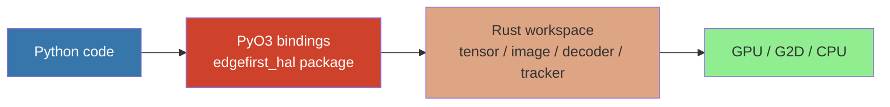

# edgefirst-hal (Python) Architecture

## Overview

The `edgefirst-hal` Python package is a PyO3 binding over the EdgeFirst HAL
Rust workspace. It exposes the same tensor / image / decoder / tracker APIs
that the C and Rust users see, with idiomatic Python types: `np.ndarray` for
buffer access, `pathlib.Path` for file APIs, exceptions for error reporting,
and `.pyi` stubs for IDE autocompletion. The binding uses
[PyO3](https://docs.rs/pyo3) and [maturin](https://maturin.rs) for wheel
building.

The crate is published to PyPI as
[`edgefirst-hal`](https://pypi.org/project/edgefirst-hal/). Pre-built
wheels ship two stable-ABI variants per platform — `abi3-py311`
(preferred; supports buffer-protocol features added in 3.11) and
`abi3-py38` (compatibility fallback for 3.8–3.10). Coverage:
Linux x86_64 / aarch64 (manylinux2014), macOS Apple Silicon, and
Windows. Pip selects the best wheel automatically. The full wheel
build matrix lives in
[`.github/workflows/release.yml`](https://github.com/EdgeFirstAI/hal/blob/main/.github/workflows/release.yml).

## Module Map

| Module | Source | Responsibility |
|--------|--------|----------------|
| [`lib.rs`](https://github.com/EdgeFirstAI/hal/blob/main/crates/python/src/lib.rs) | local | `#[pymodule]` registration; `version`, `build_info`, the `is_*_available` probes, and the `Tracing` context manager |
| [`tensor.rs`](https://github.com/EdgeFirstAI/hal/blob/main/crates/python/src/tensor.rs) | local | `Tensor`, `TensorMemory`, `TensorMap`, `CudaMap`, `Quantization`, `ImageInfo`, `DctMethod`; `view`/`batch` sub-regions; numpy copy dispatch; `from_fd` / `from_iosurface` / `dmabuf_clone`; JPEG decode config (`set_dct_method`, `set_output_format`, `is_v4l2_available`) shared by `Tensor.decode_image` / `decode_image_file` |
| [`image.rs`](https://github.com/EdgeFirstAI/hal/blob/main/crates/python/src/image.rs) | local | `ImageProcessor`, `PixelFormat`, `Region`, `Rotation`, `Flip`, `ColorMode`, `MaskResolution`, `Normalization`, `EglDisplayKind`; `convert`, `draw_masks`, `draw_decoded_masks`, `import_image`, the `plan_tiles` / `tile_into` / `tile_one` render half of tiling |
| [`decoder.rs`](https://github.com/EdgeFirstAI/hal/blob/main/crates/python/src/decoder.rs) | local | `Decoder`, `Output`, `ProtoData`, `Nms`, `DecoderType`, `DecoderVersion`, `DimName`; `decode`, `decode_tracked`, `decode_proto` |
| [`tracker.rs`](https://github.com/EdgeFirstAI/hal/blob/main/crates/python/src/tracker.rs) | local | `ByteTrack`, `TrackInfo`, `ActiveTrackInfo`; `update`, `get_active_tracks` |
| [`tiling.rs`](https://github.com/EdgeFirstAI/hal/blob/main/crates/python/src/tiling.rs) | local | `TilingConfig`, `TileSpec`, `TilePlacement`, `MergeConfig`, `MatchMetric`, `Fit`, `TiledFrameAccumulator`; `tile_grid`, `lift_tile_boxes`, `merge_tiled_detections` |
| [`colorimetry.rs`](https://github.com/EdgeFirstAI/hal/blob/main/crates/python/src/colorimetry.rs) | local | `Colorimetry`, `ColorSpace`, `ColorTransfer`, `ColorEncoding`, `ColorRange` |

## Key Types

| Python class | Wraps | Notes |
|--------------|-------|-------|
| `Tensor` | `edgefirst_tensor::TensorDyn` | Buffer protocol is exposed by `TensorMap` (returned by `Tensor.map()`), not by `Tensor` itself. The portable zero-copy pattern is `with t.map() as m: np.frombuffer(m.numpy(), dtype=...).reshape(t.shape)` — note `shape` is a property, not a method. The shorter `np.frombuffer(t.map(), ...)` works only on the abi3-py311 wheel (see § Stable ABI). `Tensor.view(region)` / `Tensor.batch(n)` return zero-copy sub-region tensors sharing the parent's identity (e.g. `proc.convert(src, dst.batch(n), ...)`). |
| `TensorMap`, `CudaMap` | `edgefirst_tensor` map guards | Context managers returned by `Tensor.map()` / `Tensor.cuda_map()`. Both are registered on the module (usable in `isinstance` checks and annotations); neither is constructible from Python — instances come only from the `map()` / `cuda_map()` calls. |
| `ImageProcessor` | `edgefirst_image::ImageProcessor` | One-per-pipeline; owns the GL thread |
| `Decoder` | `edgefirst_decoder::Decoder` | Built once from a metadata dict, a YAML/JSON string, or a list of `Output` descriptors |
| `ByteTrack` | `edgefirst_tracker::ByteTrack<DetectBox>` | Stable per-track UUIDs |
| `PixelFormat`, `Rotation`, `Flip`, `ColorMode`, `TensorMemory` | corresponding Rust enums | `repr()` matches Rust naming. Element types are plain strings (`"uint8"`, `"float16"`, …), not an enum; there is no `DType` class. |
| `Region` | `edgefirst_tensor::Region` (a **struct**, not an enum) | `{x, y, width, height}` in pixels, all readable and writable; the single rectangle type, bound in `image.rs`; argument to `Tensor.view` and to `convert(..., source=)` |
| `TilingConfig`, `TilePlacement`, `MergeConfig`, `TiledFrameAccumulator` | `edgefirst_hal::image` grid + `edgefirst_hal::decoder::tiling` | The SAHI path. Detections cross the FFI boundary as the numpy triple `(bbox (N,4) f32, scores (N,) f32, classes (N,) uintp)`, never as a box class. |
| `Tracing` (context manager) | umbrella `trace::start_tracing` / `stop_tracing` | `with hal.Tracing("/tmp/trace.json"): ...` |

### CPU access declaration and compression metadata

`Tensor.image(...)` and `ImageProcessor.create_image(...)` take an
`access` keyword with a STRICT default of `"none"` (hardware-only,
mirroring the Rust `CpuAccess` breaking change): scripts that `map()` a
tensor or read it into numpy must pass `access="readwrite"` (or the
precise `"read"`/`"write"`). Hardware (GPU/NPU) access is always
implied; `"none"` keeps Android allocations eligible for vendor tile
compression, and mapping beyond the declaration is best-effort
(warn-once + counted), never silent. `create_image(...,
compression="any")` requests a compressed layout through the ImageDesc
path; the recorded scheme is readable as the `Tensor.compression`
property (`None` or `"ubwc"`/`"afbc"`/`"pvric"`/`"dcc"`). Both kwargs
are declared in `edgefirst_hal.pyi`.

## Internal Architecture

### Binding shape


```mermaid
flowchart LR
    Py[Python code]
    PyO3[PyO3 bindings<br/>edgefirst_hal package]
    Rust[Rust workspace<br/>tensor / image / decoder / tracker]
    HW[GPU / G2D / CPU]

    Py --> PyO3
    PyO3 --> Rust
    Rust --> HW

    style Py fill:#3776ab,color:#fff
    style PyO3 fill:#ce422b,color:#fff
    style Rust fill:#dea584
    style HW fill:#90ee90
```

The `lib.rs` `#[pymodule]` registers each `#[pyclass]` from the four
sub-modules. PyO3 generates the necessary `__init__`, `__repr__`, and
property-accessor glue from `#[pymethods]` attributes, so the Python class
shapes track the Rust source automatically.

### Stable ABI / abi3

The release pipeline
([`.github/workflows/release.yml`](https://github.com/EdgeFirstAI/hal/blob/main/.github/workflows/release.yml))
builds **two stable-ABI wheels per platform**: one with
`--features abi3-py311` and one with `--features abi3-py38`. Each
single binary runs on its abi3 floor and every later 3.x release. The
`abi3-py38` variant is the broadest-compatibility fallback; the
`abi3-py311` variant is built because some 3.11+ buffer-protocol
features benefit from a fresher abi3 floor. There are no per-version
(non-abi3) wheels; pip selects the appropriate abi3 wheel from the
two published per platform.

### NumPy → Tensor copy strategy

[`crates/python/src/tensor.rs`](https://github.com/EdgeFirstAI/hal/blob/main/crates/python/src/tensor.rs)
contains `copy_numpy_to_tensor_dyn`, which inspects the source array's
strides and dispatches to one of three paths to balance copy cost against
allocation overhead:

| Path | Source layout | Strategy | Cost |
|------|---------------|----------|------|
| 1 | Fully contiguous | `copy_from_slice` (memcpy), rayon-parallel ≥ 256 KiB | Lower bound — no allocation |
| 2 | Strided with contiguous inner rows (column slice, sub-volume, negative stride) | Per-row memcpy, iterate outer dimensions | Within ≈ 5 % of Path 1 for typical row sizes |
| 3 | Fully strided (transposed view, every-other-element) | Internal `np.ascontiguousarray()` (numpy's vectorised C strided→contig pass), then Path 1 memcpy | ≈ 4× Path 1, and ≈ 4× faster than the legacy element-wise iteration the binding used to do here |

A stride-padded **destination** is handled ahead of all three: when
`create_image()` allocates a DMA-BUF or PBO with GPU pitch alignment,
`map()` exposes the full `stride × height` buffer while the logical
element count from `shape` is smaller. A flat `copy_from_slice` would
panic on the length mismatch, so `copy_numpy_to_tensor_dyn` detects the
padding and copies row by row, placing `row_elems` logical pixels per row
and stepping over the padding. Callers see nothing, but it explains why a
mapped `memoryview` can be larger than `shape` implies.

Path 3 is the case that bit early users: a HailoRT output naturally arrives
as `arr.transpose(0, 2, 1)` over a `(1, anchors, channels)` buffer, which
has no contiguous inner row. The legacy element-wise loop incurred stride
arithmetic and broke vectorisation. PR #58 replaced it with the
`np.ascontiguousarray` materialisation path. Callers therefore no longer
need to maintain a manual `np.ascontiguousarray()` workaround above HAL —
see [README § Rule 7 — Pass arrays straight to from_numpy](https://github.com/EdgeFirstAI/hal/blob/main/README.md#rule-7--numpy-interop-pass-arrays-straight-to-from_numpy)
for the user-facing rule.

### Tensor buffer protocol

`Tensor.map()` returns a `TensorMap` — a Python context manager
(`__enter__` / `__exit__`) that wraps the underlying mapped buffer
and unmaps it on exit. The actual buffer is exposed via
`TensorMap.numpy()` (the memoryview accessor — named for what it
returns, and to free the verb `view` for `Tensor.view(region)`
sub-regions), which returns a `memoryview` over the mapped
memory. For `Mem` and `Dma` backends the buffer is zero-copy; for
`Pbo` the GL thread performs a `glMapBufferRange` round-trip via the
message channel. The `memoryview` carries the right shape, strides,
and dtype so the typical pattern is:

```python
with t.map() as m:
    arr = np.frombuffer(m.numpy(), dtype=...).reshape(t.shape)
```

The context manager is required because `Pbo` and `Dma` mappings
hold driver state that must be released deterministically — letting
the `TensorMap` outlive its `with` block keeps the buffer locked.

For DMA-backed tensors, `Tensor.dmabuf_clone()` returns the `int` fd
suitable for handing to a TFLite delegate. Tensor-side errors
(non-DMA backend, fd duplication failure, etc.) surface as
`RuntimeError` — the binding's `From<Error> for PyErr` implementation
in
[`crates/python/src/tensor.rs`](https://github.com/EdgeFirstAI/hal/blob/main/crates/python/src/tensor.rs)
maps every tensor error to `pyo3::exceptions::PyRuntimeError`. The
C API surfaces the same condition as `errno = ENOTSUP`, but the
Python exception type is `RuntimeError`, not `NotImplementedError`.

### Process-shutdown safety with Python finalization

The image crate's GL backend installs a defense-in-depth shutdown strategy
to survive Python's non-deterministic finalization order — see
[`crates/image/ARCHITECTURE.md#process-shutdown-resource-cleanup`](https://github.com/EdgeFirstAI/hal/blob/main/crates/image/ARCHITECTURE.md#process-shutdown-resource-cleanup).
The Python binding inherits this for free: a PyO3 `#[pyclass]` wrapping
`ImageProcessor` whose `Drop` runs after `Py_FinalizeEx()` will not crash
the interpreter. The binding does not add Python-specific finalizers; it
relies on the Rust-side `Drop` chain.

## Performance Considerations

- **Map + view is zero-copy when the backend allows.** Prefer the
  context-manager form (portable across both wheels):

  ```python
  with t.map() as m:
      arr = np.frombuffer(m.numpy(), dtype=...).reshape(t.shape)
  ```

  rather than copying with `np.array(t.map(), copy=True)`. The
  shorter `np.frombuffer(t.map(), ...)` is also zero-copy but
  requires the abi3-py311 wheel.
- **Pass numpy arrays directly to `from_numpy` and `decode`** — do not
  pre-call `np.ascontiguousarray()`. The binding handles strided inputs
  internally via the three-path dispatch above; pre-materializing
  duplicates that work.
- **Hold tensors alive across frames.** Each new tensor allocates a fresh
  `BufferIdentity`; the EGL image cache keys on it, so re-creating tensors
  defeats the cache. Same rule as the Rust and C APIs.
- **Use `processor.create_image()` for `convert()` destinations.** A direct
  `Tensor(shape, ...)` allocation bypasses the GPU memory-backend probe.
- **Tracing has near-zero cost when no subscriber is active.** Wrap the
  hot loop in `with hal.Tracing(...)` only when collecting a profile.

See the [Optimization Guide](https://github.com/EdgeFirstAI/hal/blob/main/README.md#optimization-guide)
in the project README for the full cross-crate user rules and validation
patterns.

## Inter-Crate Interfaces

| Direction | Crate | Interface |
|-----------|-------|-----------|
| Wraps | [`edgefirst-tensor`](https://github.com/EdgeFirstAI/hal/blob/main/crates/tensor/) | `Tensor`, `TensorDyn`, `PixelFormat`, `DType` |
| Wraps | [`edgefirst-image`](https://github.com/EdgeFirstAI/hal/blob/main/crates/image/) | `ImageProcessor`, draw / convert APIs |
| Wraps | [`edgefirst-decoder`](https://github.com/EdgeFirstAI/hal/blob/main/crates/decoder/) | `Decoder`, `DetectBox`, `Segmentation` |
| Wraps | [`edgefirst-tracker`](https://github.com/EdgeFirstAI/hal/blob/main/crates/tracker/) | `ByteTrack`, `TrackInfo` |
| Wraps | [`edgefirst-hal`](https://github.com/EdgeFirstAI/hal/blob/main/crates/hal/) (feature `tracing`) | `trace::start_tracing` / `stop_tracing` |

## Build System

Wheels are built with [`maturin`](https://maturin.rs):

```bash
# Local development install (editable)
maturin develop -m crates/python/Cargo.toml --release

# Build a wheel for the current platform
maturin build -m crates/python/Cargo.toml --release

# Cross-compile a manylinux2014 wheel for an alternate target (zig + maturin)
make TARGET=aarch64-unknown-linux-gnu PYABI=py38 wheel
```

The release pipeline ([`.github/workflows/release.yml`](https://github.com/EdgeFirstAI/hal/blob/main/.github/workflows/release.yml))
publishes wheels to PyPI on tag push.

## Cross-References

- Project architecture: [../../ARCHITECTURE.md](https://github.com/EdgeFirstAI/hal/blob/main/ARCHITECTURE.md)
- Optimization guide: [README.md#optimization-guide](https://github.com/EdgeFirstAI/hal/blob/main/README.md#optimization-guide)
- Image GL shutdown defense: [../image/ARCHITECTURE.md#process-shutdown-resource-cleanup](https://github.com/EdgeFirstAI/hal/blob/main/crates/image/ARCHITECTURE.md#process-shutdown-resource-cleanup)
- Decoder architecture: [../decoder/ARCHITECTURE.md](https://github.com/EdgeFirstAI/hal/blob/main/crates/decoder/ARCHITECTURE.md)
- Performance tracing usage: [README.md#performance-tracing](https://github.com/EdgeFirstAI/hal/blob/main/README.md#performance-tracing)
