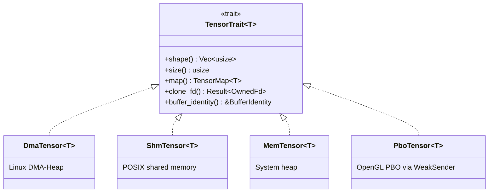
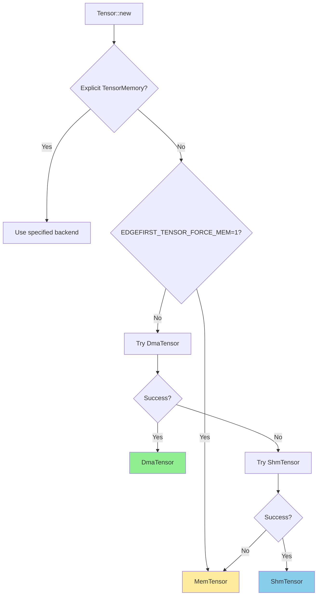

# edgefirst-tensor Architecture

## Overview

`edgefirst-tensor` is the zero-copy tensor primitive that the rest of the
EdgeFirst HAL is built on. Its job is to give the higher-level crates a
uniform multi-dimensional array type that can be backed by any of four memory
sources — DMA-BUF, POSIX shared memory, the system heap, or an OpenGL Pixel
Buffer Object — without forcing the consumer to know which backend is in use.
A single `Tensor<T>` value is enough to feed CPU code, hand a buffer to a GPU
shader, share an inference output with another process, or import a frame
straight from a V4L2 camera.

## Module Map

| Module | Source | Responsibility |
|--------|--------|----------------|
| [`lib.rs`](https://github.com/EdgeFirstAI/hal/blob/main/crates/tensor/src/lib.rs) | local | Public surface: `Tensor<T>`, `TensorTrait`, `TensorMemory`, `BufferIdentity`, multi-plane composition (`from_planes`) |
| [`dma.rs`](https://github.com/EdgeFirstAI/hal/blob/main/crates/tensor/src/dma.rs) | local | `DmaTensor<T>` — Linux DMA-BUF allocation via `dma-heap` |
| [`dmabuf.rs`](https://github.com/EdgeFirstAI/hal/blob/main/crates/tensor/src/dmabuf.rs) | local | `mmap` + `DMA_BUF_IOCTL_SYNC` cache-coherency helpers used by `DmaMap` |
| [`shm.rs`](https://github.com/EdgeFirstAI/hal/blob/main/crates/tensor/src/shm.rs) | local | `ShmTensor<T>` — POSIX shared memory backend |
| [`mem.rs`](https://github.com/EdgeFirstAI/hal/blob/main/crates/tensor/src/mem.rs) | local | `MemTensor<T>` — heap-backed tensor with no syscalls |
| [`pbo.rs`](https://github.com/EdgeFirstAI/hal/blob/main/crates/tensor/src/pbo.rs) | local | `PboTensor<T>` — wrapper around an OpenGL Pixel Buffer Object plus the `PboOps` trait the GL backend implements |
| [`tensor_dyn.rs`](https://github.com/EdgeFirstAI/hal/blob/main/crates/tensor/src/tensor_dyn.rs) | local | `TensorDyn` — dtype-erased tensor, image metadata (`PixelFormat`, row stride, plane offset, multi-plane composition) |
| [`format.rs`](https://github.com/EdgeFirstAI/hal/blob/main/crates/tensor/src/format.rs) | local | `PixelFormat`, `DType`, format/shape compatibility checks |
| [`error.rs`](https://github.com/EdgeFirstAI/hal/blob/main/crates/tensor/src/error.rs) | local | `Error`, `Result` |

## Key Types and Traits

- [`Tensor<T>`](https://docs.rs/edgefirst-tensor/latest/edgefirst_tensor/struct.Tensor.html) — generic strongly-typed tensor.
- [`TensorDyn`](https://docs.rs/edgefirst-tensor/latest/edgefirst_tensor/struct.TensorDyn.html) — dtype-erased tensor used by image processing and the C API.
- [`TensorTrait`](https://docs.rs/edgefirst-tensor/latest/edgefirst_tensor/trait.TensorTrait.html) — common operations across all backends (`shape`, `size`, `map`, `clone_fd`, `buffer_identity`).
- [`TensorMapTrait`](https://docs.rs/edgefirst-tensor/latest/edgefirst_tensor/trait.TensorMapTrait.html) — RAII map handle giving slice access (and ndarray views with the `ndarray` feature).
- [`TensorMemory`](https://docs.rs/edgefirst-tensor/latest/edgefirst_tensor/enum.TensorMemory.html) — request a specific backend at construction time.
- [`BufferIdentity`](https://docs.rs/edgefirst-tensor/latest/edgefirst_tensor/struct.BufferIdentity.html) — stable cache key (`id() -> u64`) plus a `Weak<()>` liveness guard for caches that need to detect stale entries.
- [`PlaneDescriptor`](https://docs.rs/edgefirst-tensor/latest/edgefirst_tensor/struct.PlaneDescriptor.html) — duplicated fd plus optional stride/offset, used for multi-plane DMA-BUF imports.
- [`PixelFormat`](https://docs.rs/edgefirst-tensor/latest/edgefirst_tensor/enum.PixelFormat.html) / [`DType`](https://docs.rs/edgefirst-tensor/latest/edgefirst_tensor/enum.DType.html) — image metadata attached via `set_format` / `with_format`.

## Internal Architecture

### Backend dispatch

Each backend provides its own map type implementing `TensorMapTrait<T>`:

| Tensor | Map | Mechanism |
|--------|-----|-----------|
| `DmaTensor<T>` | `DmaMap<T>` | `mmap` + `DMA_BUF_IOCTL_SYNC` for cache coherency |
| `ShmTensor<T>` | `ShmMap<T>` | `mmap`/`munmap` on the POSIX shared memory fd |
| `MemTensor<T>` | `MemMap<T>` | Direct raw pointer into `Vec<T>` (no syscall) |
| `PboTensor<T>` | `PboMap<T>` | GL thread `glMapBufferRange` / `glUnmapBuffer` via channel |

`TensorMap<T>` implements `Deref<Target=[T]>` and `DerefMut`. With the
`ndarray` feature enabled, `TensorMapTrait` also provides `view()` /
`view_mut()` returning ndarray `ArrayView` / `ArrayViewMut`.

### Memory selection logic

The fallback chain is **DMA → SHM → Heap**. `EDGEFIRST_TENSOR_FORCE_MEM=1`
short-circuits the chain to `MemTensor`, primarily for unit tests on hosts
without DMA-heap permissions.

### PBO tensors and the WeakSender pattern

PBO tensors are different from the other three backends: they are not
allocated by the tensor crate at all. They are OpenGL Pixel Buffer Objects
managed by the GL thread inside `edgefirst-image`. The tensor crate provides
the `PboTensor` wrapper and the `PboOps` trait that the GL backend implements
to perform map / unmap / delete operations.

`PboTensor` holds a `WeakSender` (not a `Sender`) for the channel that talks
to the GL thread. This is a deliberate design choice: if `PboTensor` held a
strong `Sender`, any surviving PBO tensor would keep the channel alive,
preventing `GLProcessorThreaded::drop()` from joining the GL thread at
shutdown. The `WeakSender` pattern lets the GL thread exit cleanly when
the `ImageProcessor` is dropped, even if PBO tensors still exist; subsequent
PBO operations on orphaned tensors return `PboDisconnected`.

### BufferIdentity and EGL image caching

Every tensor allocation or import creates a fresh `BufferIdentity` carrying:

- `id() -> u64` — monotonically increasing integer. Suitable as a HashMap or
  EGL image cache key; changes every time the underlying buffer changes.
- `weak() -> Weak<()>` — goes dead when the owning tensor (and all clones)
  are dropped, allowing caches to detect stale entries without holding a
  strong reference.

The image processing backends use `BufferIdentity::id()` to key an EGL image
cache so that re-importing the same camera buffer across frames does not
re-create a GPU texture. See
[`crates/image/ARCHITECTURE.md`](https://github.com/EdgeFirstAI/hal/blob/main/crates/image/ARCHITECTURE.md)
for the cache implementation.

## Performance Considerations

### When to use each backend

The choice of memory type significantly impacts performance depending on the
workload:

1. **Heap memory (`MemTensor<T>`)** — fastest for pure CPU algorithms (image
   resize, filtering, format conversion). Standard heap allocation has
   minimal overhead and is OS-optimized. Recommended when no hardware
   acceleration is required.

2. **DMA memory (`DmaTensor<T>`)** — adds CPU-level overhead for allocation
   and mapping but provides substantial benefits when interfacing with
   hardware accelerators:
   - Zero-copy access from G2D (NXP i.MX graphics processor)
   - Zero-copy access from OpenGL/GPU
   - Zero-copy access from V4L2 video capture and codec engines
   - Hardware DMA operations benefit from DMA-capable memory alignment and
     page locking

3. **Shared memory (`ShmTensor<T>`)** — slowest option, with CPU overhead
   from POSIX shared memory operations. Does not support hardware DMA. Use
   only for cross-process buffer sharing when DMA-BUF is unavailable
   (insufficient permissions, non-Linux platforms, persistent memory
   requirements).

**Selection guidance:**
- Pure CPU workloads → `MemTensor` (Heap).
- Hardware-accelerated paths (G2D, OpenGL, V4L2, codec) → `DmaTensor`.
- Cross-process buffer sharing when DMA cannot be used → `ShmTensor`.

### Multi-plane DMA-BUF support

Single-plane DMA-BUF buffers (one fd per buffer) are the common case: V4L2
single-planar capture, MIPI-CSI direct capture, and HAL-allocated buffers
all hit this path. The tensor crate also supports multi-plane formats
(NV12/NV16 from VPU and NeoISP, where Y and UV reside in separate
allocations) via `Tensor::from_planes(luma, chroma, PixelFormat::Nv12)`.
Each plane keeps its own DMA-BUF fd and per-plane stride / offset.

The C API exposes this through
[`hal_import_image(proc, y_pd, uv_pd, ...)`](https://github.com/EdgeFirstAI/hal/blob/main/crates/capi/include/edgefirst/hal.h)
which takes two `PlaneDescriptor`s and combines them via `from_planes`. The
GStreamer integration element `edgefirstcameraadaptor` detects multi-plane
buffers (`gst_buffer_n_memory() > 1`) and extracts per-plane fds via
`gst_dmabuf_memory_get_fd()`.

This work was implemented under **EDGEAI-1107**. See
[`../image/ARCHITECTURE.md`](https://github.com/EdgeFirstAI/hal/blob/main/crates/image/ARCHITECTURE.md)
for the OpenGL-side multi-plane path (`create_image_from_dma2`).

## Inter-Crate Interfaces

The tensor crate is the foundation; every other `edgefirst-*` crate depends
on it:

| Consumer | Interface | Purpose |
|----------|-----------|---------|
| [`edgefirst-image`](https://github.com/EdgeFirstAI/hal/blob/main/crates/image/) | `Tensor<u8>`, `TensorDyn`, `PboOps` impl | Image processor input/output buffers, PBO management |
| [`edgefirst-decoder`](https://github.com/EdgeFirstAI/hal/blob/main/crates/decoder/) | `Tensor<T>`, `TensorMap` | Reading model output tensors |
| [`edgefirst-hal`](https://github.com/EdgeFirstAI/hal/blob/main/crates/hal/) | `pub use edgefirst_tensor as tensor` | Re-export |
| [`edgefirst-hal-capi`](https://github.com/EdgeFirstAI/hal/blob/main/crates/capi/) | `from_fd`, `clone_fd`, `from_planes` | Tensor lifetime across the FFI boundary |

The `BufferIdentity` API is the inter-crate cache contract: image-side EGL
caches and downstream consumers (e.g. `edgefirstcameraadaptor`) all key on
`buffer_identity().id()` to detect when a logical buffer's contents have
changed. See
[Appendix C: DMA-BUF Identity and Tensor Caching](https://github.com/EdgeFirstAI/hal/blob/main/ARCHITECTURE.md#appendix-c-dma-buf-identity-and-tensor-caching)
in the project ARCHITECTURE.md for the cross-crate story.

## Platform-Specific Notes

| Platform | DMA | SHM | Mem | PBO |
|----------|-----|-----|-----|-----|
| Linux (NXP i.MX, x86_64, aarch64) | Yes | Yes | Yes | Yes (with OpenGL feature) |
| macOS | No | Yes | Yes | No |
| Other Unix | No | Yes | Yes | No |
| Windows | No | No | Yes | No |

The `dma-heap` and `libc` dependencies are gated on `cfg(target_os =
"linux")` in `Cargo.toml`; non-Linux builds simply skip the DMA backend
without compile errors.

## Cross-References

- Project architecture: [../../ARCHITECTURE.md](https://github.com/EdgeFirstAI/hal/blob/main/ARCHITECTURE.md)
- DMA-BUF identity story: [ARCHITECTURE.md#appendix-c-dma-buf-identity-and-tensor-caching](https://github.com/EdgeFirstAI/hal/blob/main/ARCHITECTURE.md#appendix-c-dma-buf-identity-and-tensor-caching)
- Image-side EGL cache and PBO dispatch: [../image/ARCHITECTURE.md](https://github.com/EdgeFirstAI/hal/blob/main/crates/image/ARCHITECTURE.md)
- C API tensor lifetime: [../capi/ARCHITECTURE.md](https://github.com/EdgeFirstAI/hal/blob/main/crates/capi/ARCHITECTURE.md)
