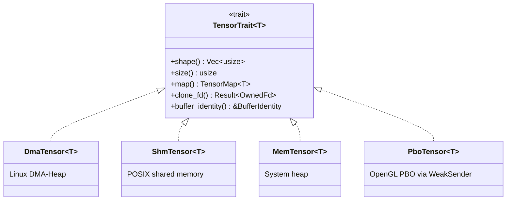
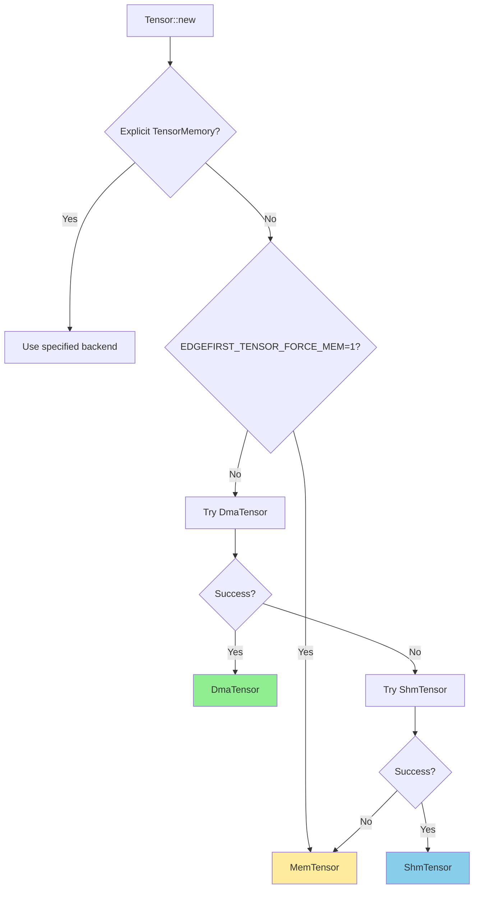

# edgefirst-tensor Architecture

## Overview

`edgefirst-tensor` is the zero-copy tensor primitive that the rest of the
EdgeFirst HAL is built on. Its job is to give the higher-level crates a
uniform multi-dimensional array type that can be backed by any of four memory
sources — DMA-BUF, POSIX shared memory, the system heap, or an OpenGL Pixel
Buffer Object — without forcing the consumer to know which backend is in use.
A single `Tensor<T>` value is enough to feed CPU code, hand a buffer to a GPU
shader, share an inference output with another process, or import a frame
straight from a V4L2 camera.

## Module Map

| Module | Source | Responsibility |
|--------|--------|----------------|
| [`lib.rs`](https://github.com/EdgeFirstAI/hal/blob/main/crates/tensor/src/lib.rs) | local | Public surface: `Tensor<T>`, `TensorTrait`, `TensorMemory`, `BufferIdentity`, `Region` + `view`/`batch` sub-regions, multi-plane composition (`from_planes`) |
| [`dma.rs`](https://github.com/EdgeFirstAI/hal/blob/main/crates/tensor/src/dma.rs) | local | `DmaTensor<T>` — Linux DMA-BUF allocation via `dma-heap` |
| [`dmabuf.rs`](https://github.com/EdgeFirstAI/hal/blob/main/crates/tensor/src/dmabuf.rs) | local | `mmap` + `DMA_BUF_IOCTL_SYNC` cache-coherency helpers used by `DmaMap` |
| [`iosurface.rs`](https://github.com/EdgeFirstAI/hal/blob/main/crates/tensor/src/iosurface.rs) | local | `IoSurfaceTensor<T>` — macOS IOSurface allocation via raw FFI to the IOSurface + CoreFoundation frameworks (the macOS counterpart to `DmaTensor`) |
| [`shm.rs`](https://github.com/EdgeFirstAI/hal/blob/main/crates/tensor/src/shm.rs) | local | `ShmTensor<T>` — POSIX shared memory backend |
| [`mem.rs`](https://github.com/EdgeFirstAI/hal/blob/main/crates/tensor/src/mem.rs) | local | `MemTensor<T>` — heap-backed tensor with no syscalls |
| [`pbo.rs`](https://github.com/EdgeFirstAI/hal/blob/main/crates/tensor/src/pbo.rs) | local | `PboTensor<T>` — wrapper around an OpenGL Pixel Buffer Object plus the `PboOps` trait the GL backend implements |
| [`tensor_dyn.rs`](https://github.com/EdgeFirstAI/hal/blob/main/crates/tensor/src/tensor_dyn.rs) | local | `TensorDyn` — dtype-erased tensor, image metadata (`PixelFormat`, row stride, plane offset, multi-plane composition) |
| [`format.rs`](https://github.com/EdgeFirstAI/hal/blob/main/crates/tensor/src/format.rs) | local | `PixelFormat`, `DType`, format/shape compatibility checks |
| [`error.rs`](https://github.com/EdgeFirstAI/hal/blob/main/crates/tensor/src/error.rs) | local | `Error`, `Result` |

## Key Types and Traits

- [`Tensor<T>`](https://docs.rs/edgefirst-tensor/latest/edgefirst_tensor/struct.Tensor.html) — generic strongly-typed tensor.
- [`TensorDyn`](https://docs.rs/edgefirst-tensor/latest/edgefirst_tensor/struct.TensorDyn.html) — dtype-erased tensor used by image processing and the C API.
- **`Region`** — `{ x, y, width, height }` in pixels; the single rectangle type, used by `view`, `Crop` (source sampling), and image geometry. Re-exported by the image and python crates.
- **`view(region)` / `batch(n)`** — owned, zero-allocation sub-region of a tensor sharing the parent's `BufferIdentity` (replaces the former byte-offset `subview`); `batch(n)` selects element *n* along the leading `N` dimension. Out-of-bounds → error, never clamp. The convert mechanics (GL `glViewport`, etc.) live in the image crate. See [Views and sub-regions](#views-and-sub-regions).
- [`TensorTrait`](https://docs.rs/edgefirst-tensor/latest/edgefirst_tensor/trait.TensorTrait.html) — **the unifying backend trait**: the common operations every memory backend implements (`shape`, `size`, `map`, `clone_fd`, `buffer_identity`, and the zero-copy sub-region `view`). `TensorStorage<T>` dispatches to the active backend's impl; `Tensor::subview`/`view`/`batch` route through `TensorTrait::view` so each backend's identity-sharing rule lives in one place.
- [`TensorMapTrait`](https://docs.rs/edgefirst-tensor/latest/edgefirst_tensor/trait.TensorMapTrait.html) — RAII map handle giving slice access (and ndarray views with the `ndarray` feature).
- [`TensorMemory`](https://docs.rs/edgefirst-tensor/latest/edgefirst_tensor/enum.TensorMemory.html) — request a specific backend at construction time.
- [`BufferIdentity`](https://docs.rs/edgefirst-tensor/latest/edgefirst_tensor/struct.BufferIdentity.html) — stable cache key (`id() -> u64`) plus a `Weak<()>` liveness guard for caches that need to detect stale entries.
- [`PlaneDescriptor`](https://docs.rs/edgefirst-tensor/latest/edgefirst_tensor/struct.PlaneDescriptor.html) — duplicated fd plus optional stride/offset, used for multi-plane DMA-BUF imports.
- [`PixelFormat`](https://docs.rs/edgefirst-tensor/latest/edgefirst_tensor/enum.PixelFormat.html) / [`DType`](https://docs.rs/edgefirst-tensor/latest/edgefirst_tensor/enum.DType.html) — image metadata attached via `set_format` / `with_format`.

## Internal Architecture

### Backend dispatch



Each backend provides its own map type implementing `TensorMapTrait<T>`:

| Tensor | Map | Mechanism |
|--------|-----|-----------|
| `DmaTensor<T>` | `DmaMap<T>` | `mmap` + `DMA_BUF_IOCTL_SYNC` for cache coherency |
| `ShmTensor<T>` | `ShmMap<T>` | `mmap`/`munmap` on the POSIX shared memory fd |
| `MemTensor<T>` | `MemMap<T>` | Direct raw pointer into `Vec<T>` (no syscall) |
| `PboTensor<T>` | `PboMap<T>` | GL thread `glMapBufferRange` / `glUnmapBuffer` via channel |

`TensorMap<T>` implements `Deref<Target=[T]>` and `DerefMut`. With the
`ndarray` feature enabled, `TensorMapTrait` also provides `view()` /
`view_mut()` returning ndarray `ArrayView` / `ArrayViewMut`.

### Views and sub-regions

A **view** is a lightweight, zero-allocation sub-region of a tensor. It shares
the parent's buffer and **`BufferIdentity`** (no new allocation, no new GPU
import) and addresses a rectangular window of the parent's leading spatial frame:

```rust
/// The single rectangle type in the workspace. Pixel units of the leading
/// frame; byte addressing is derived from the parent's effective_row_stride().
pub struct Region { pub x: usize, pub y: usize, pub width: usize, pub height: usize }

impl Tensor<T> {   // and identically on TensorDyn
    /// Owned sub-region sharing self's BufferIdentity (an Arc clone — cheap,
    /// once per view, never per pixel). Composes: a view of a view adds offsets.
    pub fn view(&self, region: Region) -> Result<Self>;
    /// Sugar for element `n` along the leading `N` dimension (N prepended to the
    /// base layout — packed HWC or planar CHW). `batch(0)` on an N==1 tensor is
    /// byte- and identity-equivalent to the whole tensor.
    pub fn batch(&self, n: usize) -> Result<Self>;
}
```

`view`/`batch` are supported on **every** backend — `Mem`, `Shm`, Linux
DMA-BUF, macOS IOSurface, and PBO. Each shares its underlying resource (heap
`Arc`, cloned fd, retained `IOSurfaceRef`, or `Arc<PboHandle>`) and its
`BufferIdentity`, and carries the window's byte offset so a CPU map of the
sub-view reads the correct bytes (the IOSurface and PBO offset support is what
lets a GPU-backed decoder output be sub-viewed without the earlier
`InvalidOperation("subview only supported for Mem, Dma, and Shm tensors")`).

`view`/`batch` return an **owned** handle (not a borrow) so the value flows
unchanged through `convert(src, dst, …)`, the C ABI (`hal_tensor *`), and PyO3
(`#[pyclass]`) without a lifetime parameter rippling across three language
surfaces. An out-of-bounds region or `n ≥ N` returns an error
(`Error::RegionOutOfBounds` / `Error::BatchIndexOutOfBounds`) — `view`/`batch`
never clamp and never panic.

`view`/`batch` are the **only** sub-addressing primitive; they replace the
former byte-offset `subview`. `plane_offset` is **not** a sub-region mechanism —
it survives solely as an *import attribute* for genuine foreign or multi-plane
DMA-BUF imports (a non-zero start byte, or a chroma plane), where it participates
in the EGL cache key. It is never how a batch tile is selected.

`view`/`batch` are **raw tensor** concepts; the *mechanics* of consuming one for
GPU work live in the image crate — `convert()` lowers a **destination** view to a
`glViewport`/`glScissor` into the parent's one render target, and a **source**
view to a sampling rectangle, never re-keying the EGLImage (see
[`crates/image/ARCHITECTURE.md` § Batched preprocessing](https://github.com/EdgeFirstAI/hal/blob/main/crates/image/ARCHITECTURE.md#batched-preprocessing-building-a-batch-via-convert)).

For plain CPU access a consumer maps a view, or maps the parent whole and slices
the mapped `ArrayView` (the decoder reads batched model outputs this way). The
Python binding mirrors this with `numpy` + the buffer protocol; the C API exposes
first-class `hal_tensor_view` / `hal_tensor_batch` handles (it does not make
callers hand-roll pixel→byte math).

### Memory selection logic



The fallback chain is **DMA → SHM → Heap**. `EDGEFIRST_TENSOR_FORCE_MEM=1`
short-circuits the chain to `MemTensor`, primarily for unit tests on hosts
without DMA-heap permissions.

### PBO tensors and the WeakSender pattern

PBO tensors are different from the other three backends: they are not
allocated by the tensor crate at all. They are OpenGL Pixel Buffer Objects
managed by the GL thread inside `edgefirst-image`. The tensor crate provides
the `PboTensor` wrapper and the `PboOps` trait that the GL backend implements
to perform map / unmap / delete operations.

`PboTensor` holds an `Arc<dyn PboOps>` — a trait object the GL backend
implements to perform map / unmap / delete on the tensor's behalf. The
image crate's `GlPboOps` is the concrete implementation; it owns a
`WeakSender` to the GL thread's message channel. The weak-sender
ownership lives **inside the trait impl**, not in `PboTensor` itself,
so the tensor crate has no compile-time dependency on the image
crate's channel implementation. The `WeakSender` is the mechanism
that lets the GL thread exit cleanly when `ImageProcessor` is
dropped, even while PBO tensors are still alive; subsequent PBO
operations on orphaned tensors return `PboDisconnected`.

### BufferIdentity and EGL image caching

Every tensor allocation or import creates a fresh `BufferIdentity`
carrying:

- `id() -> u64` — monotonically increasing integer. Used by the image
  crate's EGL image cache as the lookup key.
- `weak() -> Weak<()>` — goes dead when the owning tensor (and all
  clones) are dropped, allowing caches to detect stale entries without
  holding a strong reference.

The image processing backends key their EGL image cache on
`BufferIdentity.id()` (plus the import geometry — `width`/`height`/`row_stride`/
`format`) so that the **same tensor object** reused across frames hits the cache.
A sub-region of a tensor **shares the parent's `BufferIdentity`** and resolves
the parent's geometry, so the image backend keys every tile of one batched
destination on that parent — it imports a single EGLImage and selects the tile
with `glViewport`, never a per-offset import. `plane_offset` therefore addresses
only genuine offset-distinct *imports* (a foreign DMA-BUF starting at a non-zero
byte offset, or a multi-plane chroma plane), **not** batch tiling. Because the
key carries the geometry, reconfiguring a reused source buffer to a new size
re-keys to a fresh import rather than returning the previous frame's image (a
`last_import_reason` field recording `Reconfigure` is a planned observability
addition). The cache does **not** rescue a pipeline that
re-imports the same DMA-BUF every frame: each `hal_import_image` /
`hal_tensor_from_fd` call mints a new `BufferIdentity` with a fresh
ID, so re-imports always miss. The contract is:

- Downstream caches (V4L2 / GStreamer adaptors) cache external
  DMA-BUFs by stable `(inode, plane_offset)` and hold each
  `hal_tensor *` alive across frames.
- That keeps `BufferIdentity.id()` constant for the same physical
  buffer, which in turn keeps the in-HAL EGL image cache hitting.

See
[`crates/image/ARCHITECTURE.md`](https://github.com/EdgeFirstAI/hal/blob/main/crates/image/ARCHITECTURE.md)
for the EGL image cache implementation and
[the project ARCHITECTURE Appendix C](https://github.com/EdgeFirstAI/hal/blob/main/ARCHITECTURE.md#appendix-c-dma-buf-identity-and-tensor-caching)
for the full cross-cutting story.

## Zero-copy CUDA Tensor Mapping

The CUDA surface maps the float PBO produced by `ImageProcessor::convert()`
directly to a CUDA device pointer, enabling zero-copy inference with TensorRT
and other CUDA consumers. The cross-crate data-flow story lives in
[`ARCHITECTURE.md § Zero-copy CUDA tensor mapping`](https://github.com/EdgeFirstAI/hal/blob/main/ARCHITECTURE.md#zero-copy-cuda-tensor-mapping);
this section covers the tensor-crate implementation detail.

### Runtime symbol loading (`OnceLock` table)

All `libcudart` entry points are resolved once via `dlopen("libcudart.so")`
and stored in a process-global `OnceLock<CudaSymbols>`. If `libcudart` is
absent at runtime, the `OnceLock` stores `None` and every subsequent call
fast-fails to `None` / `false` without retrying the dlopen. There is no
link-time dependency and no compile-time feature gate.

`is_cuda_available() -> bool` returns `true` only if the symbol table was
populated successfully.

### `CudaHandle` — two backing variants

| Variant | Source | Device pointer lifetime |
|---------|--------|------------------------|
| `GlBuffer` | `cudaGraphicsGLRegisterBuffer` on a PBO | Per-map: valid between `cudaGraphicsMapResources` and `cudaGraphicsUnmapResources` |
| `ExternalMem` | `cudaImportExternalMemory(OpaqueFd)` on a DMA-BUF fd | Persistent: valid for the lifetime of the `CudaHandle` |

Both variants expose the same `device_ptr() -> *mut c_void` / `len() -> usize`
interface to callers via `CudaMap`.

### `CudaMap` — RAII guard

`CudaMap` is the scoped guard returned by `Tensor::cuda_map()` and
`TensorDyn::cuda_map()`. Its semantics:

- **Construction** — calls `cudaGraphicsMapResources` (GL-buffer path) or
  returns the persistent pointer (external-memory path). Routing to the
  GL worker thread is handled by `CudaGlOps`.
- **`device_ptr() -> *mut c_void`** — the raw device pointer; valid for
  the lifetime of the guard.
- **`len() -> usize`** — byte length of the mapped region.
- **`Drop`** — calls `cudaGraphicsUnmapResources` (GL-buffer path only),
  releasing the PBO back to the GL pipeline. The PBO must not be
  re-mapped while the guard is alive.

`CudaMap` is `Send` (the device pointer is usable from any thread via the
per-device CUDA primary context) but not `Sync` (two threads must not
concurrently access the raw pointer without external synchronization).

### `CudaGlOps` — GL-worker routing

`cudaGraphicsGLRegisterBuffer` and `cudaGraphicsMapResources` must run on
the GL-context thread. `CudaGlOps` is the trait the GL backend implements
to route those calls through the existing GL-thread message channel —
the same mechanism `PboOps` uses for PBO map/unmap/delete. Fast-fail
behavior: if `cuda_map()` is called on a tensor whose `CudaGlOps`
implementation reports that CUDA is absent or the GL thread has exited,
the call returns `None` immediately.

### DMA-BUF import (`ExternalMem` path)

For DMA-BUF-backed tensors, `cuda_map()` calls
`cudaImportExternalMemory` with `cudaExternalMemoryHandleTypeOpaqueFd`.
The DMA-BUF fd is `dup`'d before being handed to CUDA; CUDA takes
ownership of the dup'd fd on success (closing it when the
`CudaExternalMemory` handle is destroyed). This path is independent of
the GL thread.

### Drop order

Within a `PboTensor`'s internal state, the `CudaHandle` is owned by a
field that is declared before the PBO storage. Rust's field-drop order
(declaration order, reverse of construction) guarantees that
`cudaGraphicsUnregisterResource` runs before `glDeleteBuffers`, which is
the requirement from the CUDA–GL interop spec.

### Fast-fail on the non-GL path

`Tensor::cuda()` (the lower-level direct accessor, distinct from
`cuda_map()`) returns `None` if the tensor's backing storage is not
GPU-registered (e.g. `MemTensor`, `DmaTensor` without a CUDA import, or
`ShmTensor`). `cuda_map()` calls `cuda()` internally and propagates the
`None` without going to the GL thread.

## Performance Considerations

### When to use each backend

The choice of memory type significantly impacts performance depending on the
workload:

1. **Heap memory (`MemTensor<T>`)** — fastest for pure CPU algorithms (image
   resize, filtering, format conversion). Standard heap allocation has
   minimal overhead and is OS-optimized. Recommended when no hardware
   acceleration is required.

2. **DMA memory (`DmaTensor<T>`)** — adds CPU-level overhead for allocation
   and mapping but provides substantial benefits when interfacing with
   hardware accelerators:
   - Zero-copy access from G2D (NXP i.MX graphics processor)
   - Zero-copy access from OpenGL/GPU
   - Zero-copy access from V4L2 video capture and codec engines
   - Hardware DMA operations benefit from DMA-capable memory alignment and
     page locking

3. **Shared memory (`ShmTensor<T>`)** — slowest option, with CPU overhead
   from POSIX shared memory operations. Does not support hardware DMA. Use
   only for cross-process buffer sharing when DMA-BUF is unavailable
   (insufficient permissions, non-Linux platforms, persistent memory
   requirements).

**Selection guidance:**
- Pure CPU workloads → `MemTensor` (Heap).
- Hardware-accelerated paths (G2D, OpenGL, V4L2, codec) → `DmaTensor`.
- Cross-process buffer sharing when DMA cannot be used → `ShmTensor`.

### Multi-plane DMA-BUF support

Single-plane DMA-BUF buffers (one fd per buffer) are the common case: V4L2
single-planar capture, MIPI-CSI direct capture, and HAL-allocated buffers
all hit this path. The tensor crate also supports multi-plane formats
(NV12/NV16 from VPU and NeoISP, where Y and UV reside in separate
allocations) via `Tensor::from_planes(luma, chroma, PixelFormat::Nv12)`.
Each plane keeps its own DMA-BUF fd and per-plane stride / offset.

The C API exposes this through
[`hal_import_image(proc, y_pd, uv_pd, ...)`](https://github.com/EdgeFirstAI/hal/blob/main/crates/capi/include/edgefirst/hal.h)
which takes two `PlaneDescriptor`s and combines them via `from_planes`.
A downstream GStreamer source/transform element that wants to feed
multi-plane buffers into the HAL detects them via
`gst_buffer_n_memory() > 1` and extracts per-plane fds with
`gst_dmabuf_memory_get_fd()` on each `GstMemory` block, then passes
each fd into a separate `hal_plane_descriptor`.

See
[`crates/image/ARCHITECTURE.md`](https://github.com/EdgeFirstAI/hal/blob/main/crates/image/ARCHITECTURE.md)
for the OpenGL-side multi-plane import path that consumes per-plane fds
via EGL attributes.

## Inter-Crate Interfaces

The tensor crate is the foundation of the data-plane crates — image,
decoder, capi, and gpu-probe all depend on it. The tracker and bench
crates are independent of it (tracker operates on `DetectionBox` and
`nalgebra`; bench is a thin `serde_json` wrapper for benchmark IO):

| Consumer | Interface | Purpose |
|----------|-----------|---------|
| [`edgefirst-image`](https://github.com/EdgeFirstAI/hal/blob/main/crates/image/) | `Tensor<u8>`, `TensorDyn`, `PboOps` impl | Image processor input/output buffers, PBO management |
| [`edgefirst-decoder`](https://github.com/EdgeFirstAI/hal/blob/main/crates/decoder/) | `Tensor<T>`, `TensorMap` | Reading model output tensors |
| [`edgefirst-hal`](https://github.com/EdgeFirstAI/hal/blob/main/crates/hal/) | `pub use edgefirst_tensor as tensor` | Re-export |
| [`edgefirst-hal-capi`](https://github.com/EdgeFirstAI/hal/blob/main/crates/capi/) | `from_fd`, `clone_fd`, `from_planes` | Tensor lifetime across the FFI boundary |
| [`gpu-probe`](https://github.com/EdgeFirstAI/hal/blob/main/crates/gpu-probe/) | `Tensor` allocation | Allocates the DMA-BUF round-trip buffer the probe verifies |

`BufferIdentity` is the in-HAL cache contract: the image crate's EGL
image cache keys on `buffer_identity().id()`, which is stable for the
lifetime of a tensor object. **Downstream import caches** (V4L2 /
libcamera / GStreamer adaptors) must not key on
`buffer_identity().id()` —
that id is regenerated on every HAL import. Downstream caches key on
the stable kernel `(inode, plane_offset)` of the external DMA-BUF and
then keep the resulting `hal_tensor *` alive across frames, which
keeps `buffer_identity().id()` stable and so keeps the image-side
cache hitting. See
[Appendix C: DMA-BUF Identity and Tensor Caching](https://github.com/EdgeFirstAI/hal/blob/main/ARCHITECTURE.md#appendix-c-dma-buf-identity-and-tensor-caching)
in the project ARCHITECTURE.md for the full two-layer story.

## Platform-Specific Notes

| Platform | DMA | SHM | Mem | PBO |
|----------|-----|-----|-----|-----|
| Linux (NXP i.MX, x86_64, aarch64) | Yes (DMA-BUF) | Yes | Yes | Yes (with OpenGL feature) |
| macOS | Yes (IOSurface) | Yes | Yes | No |
| Other Unix | No | Yes | Yes | No |
| Windows | No | No | Yes | No |

### `TensorMemory::Dma` is unified across Linux and macOS

`TensorMemory::Dma` is a single enum variant on both platforms — same
discriminant value, same `HalTensorMemory::Dma=1` over the C ABI — but
the underlying storage type differs:

- **Linux**: `TensorStorage::Dma(DmaTensor<T>)` backed by a DMA-BUF fd
  from `/dev/dma_heap/*`.
- **macOS**: `TensorStorage::Dma(IoSurfaceTensor<T>)` backed by an
  `IOSurfaceRef` from the IOSurface framework.

Match arms work identically on both platforms because the
`TensorTrait` impl is the same shape (`new`, `map`, `name`, `memory`,
`buffer_identity`) regardless of which inner type is in play. The only
methods that genuinely differ are the platform-specific *export*
handles:

- **Linux**: `clone_fd()` produces a duplicated DMA-BUF fd suitable
  for passing to V4L2, the GL backend's `EGL_EXT_image_dma_buf_import`
  path, or any other Linux GPU API.
- **macOS**: `surface_id()` returns an `IOSurfaceID` (`u32`) stable
  across processes — pair it with a Mach port or XPC handoff so the
  receiver can call `IOSurfaceLookup(id)` to recover the
  `IOSurfaceRef`. `surface_ref()` returns the borrowed pointer for
  direct handoff to ANGLE's `EGL_ANGLE_iosurface_client_buffer`, to
  CIImage, AVSampleBufferDisplayLayer, etc.

`from_iosurface()` (the import-side constructor) is macOS-only and
mirrors `from_fd()` — the receiver retains the surface for the
tensor's lifetime; the producer keeps its own retain count.

### Cross-platform availability probes

| Probe | Returns true when |
|-------|-------------------|
| `is_dma_available()` | Linux DMA-BUF heap is mountable. False on every other OS. |
| `is_iosurface_available()` | macOS IOSurface framework is present. False on every other OS. |
| `is_gpu_buffer_available()` | The platform-native GPU-coherent kind is available (Linux: dma; macOS: iosurface). The portable probe — prefer this one when you only care whether `TensorMemory::Dma` will succeed. |
| `is_shm_available()` | `shm_open` works. True on Linux and macOS, false on Windows. |

The Linux-specific `dma-heap` and macOS-specific `IOSurface` /
`CoreFoundation` framework links are gated by per-target sections in
`Cargo.toml`; each platform only pulls in the deps it needs.

## Cross-References

- Project architecture: [../../ARCHITECTURE.md](https://github.com/EdgeFirstAI/hal/blob/main/ARCHITECTURE.md)
- DMA-BUF identity story: [ARCHITECTURE.md#appendix-c-dma-buf-identity-and-tensor-caching](https://github.com/EdgeFirstAI/hal/blob/main/ARCHITECTURE.md#appendix-c-dma-buf-identity-and-tensor-caching)
- Image-side EGL cache and PBO dispatch: [../image/ARCHITECTURE.md](https://github.com/EdgeFirstAI/hal/blob/main/crates/image/ARCHITECTURE.md)
- C API tensor lifetime: [../capi/ARCHITECTURE.md](https://github.com/EdgeFirstAI/hal/blob/main/crates/capi/ARCHITECTURE.md)
