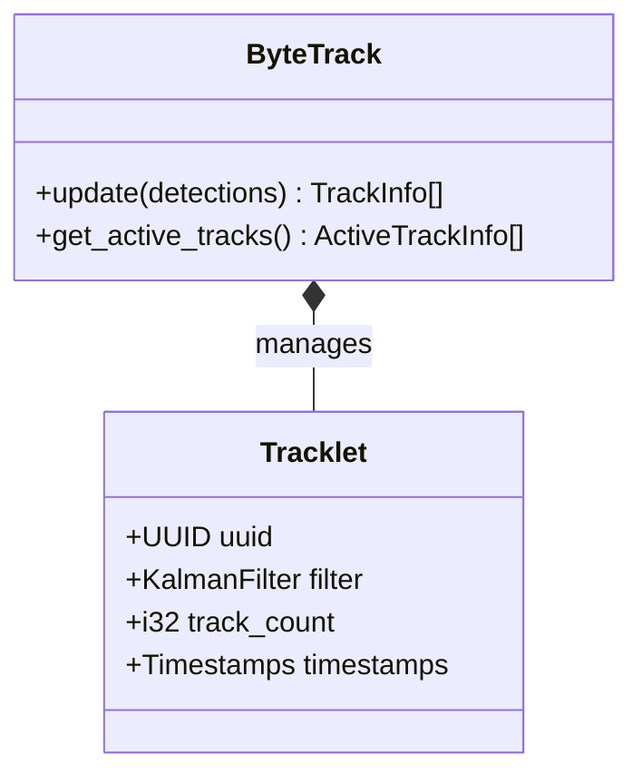
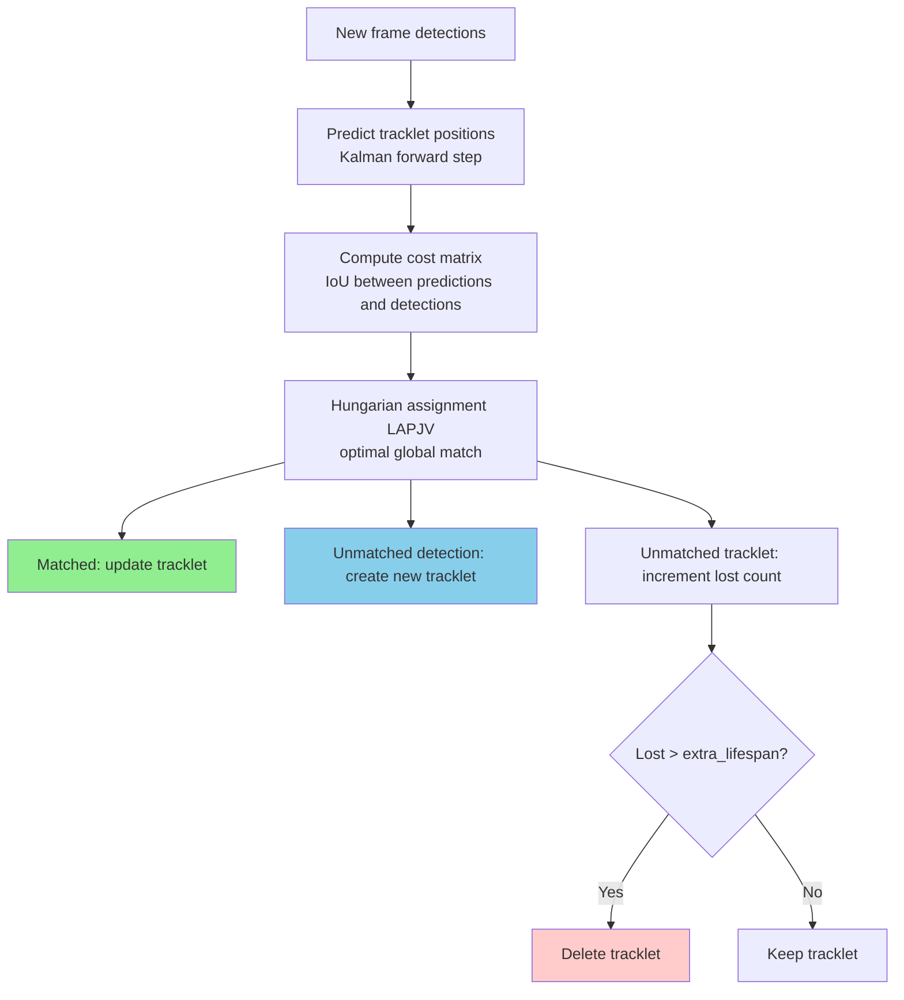

# edgefirst-tracker Architecture

## Overview

`edgefirst-tracker` provides multi-object tracking algorithms for associating
detections across video frames. Today it ships a single algorithm,
**ByteTrack**, with Kalman-smoothed trajectory prediction and two-pass
detection association. The crate is generic over the detection box type, so it
plugs into any pipeline that produces XYXY bounding boxes with a confidence
score and a class label.

## Module Map

| Module | Source | Responsibility |
|--------|--------|----------------|
| [`lib.rs`](https://github.com/EdgeFirstAI/hal/blob/main/crates/tracker/src/lib.rs) | local | `Tracker` and `DetectionBox` traits, `TrackInfo`, `ActiveTrackInfo` |
| [`bytetrack.rs`](https://github.com/EdgeFirstAI/hal/blob/main/crates/tracker/src/bytetrack.rs) | local | `ByteTrack<T>` and `ByteTrackBuilder`; tracklet lifecycle and association |
| [`kalman.rs`](https://github.com/EdgeFirstAI/hal/blob/main/crates/tracker/src/kalman.rs) | local | Kalman filter for box-state prediction and update |

## Key Types and Traits

- [`Tracker<T>`](https://docs.rs/edgefirst-tracker/latest/edgefirst_tracker/trait.Tracker.html) — minimal trait every tracker implements (`update` + `get_active_tracks`).
- [`DetectionBox`](https://docs.rs/edgefirst-tracker/latest/edgefirst_tracker/trait.DetectionBox.html) — trait detection types implement so the tracker can read XYXY boxes, scores, and labels without copying.
- [`TrackInfo`](https://docs.rs/edgefirst-tracker/latest/edgefirst_tracker/struct.TrackInfo.html) — per-track metadata returned by `update`: UUID, Kalman-smoothed location, age, timestamps.
- [`ActiveTrackInfo<T>`](https://docs.rs/edgefirst-tracker/latest/edgefirst_tracker/struct.ActiveTrackInfo.html) — `TrackInfo` paired with the last raw detection box for inspection.
- [`ByteTrack<T>`](https://docs.rs/edgefirst-tracker/latest/edgefirst_tracker/bytetrack/struct.ByteTrack.html) / [`ByteTrackBuilder`](https://docs.rs/edgefirst-tracker/latest/edgefirst_tracker/bytetrack/struct.ByteTrackBuilder.html) — concrete tracker plus a builder for tunable thresholds.

## Internal Architecture

### Class layout

### Tracking flow

Each call to `ByteTrack::update` runs through a fixed pipeline:

The two-pass nature of ByteTrack means high-confidence detections are matched
first (using `track_high_conf` as the gating threshold); on the second pass,
remaining low-confidence detections are tried against still-unmatched
tracklets to recover briefly occluded objects without admitting noise into the
high-confidence pool.

### Kalman filter state

Each tracklet owns a constant-velocity Kalman filter modeling box state as
`[x_center, y_center, aspect, height, ẋ, ẏ, ȧ, ḣ]`. The `track_update`
parameter on the builder controls the gain — lower values trust the predicted
trajectory more, higher values trust the new measurement more. See
[`crates/tracker/src/kalman.rs`](https://github.com/EdgeFirstAI/hal/blob/main/crates/tracker/src/kalman.rs)
for the matrix definitions.

## Performance Considerations

- **No GPU code paths.** ByteTrack is a CPU-only, single-threaded
  algorithm — the crate does not depend on Rayon. The cost matrix uses
  [`lapjv`](https://docs.rs/lapjv) which is small enough that a single
  thread comfortably handles realtime workloads at ≤300 simultaneous
  tracks.
- **UUID generation** uses [`uuid`](https://docs.rs/uuid)'s `v4` random
  generator. This is a per-track one-time cost (~hundreds of ns), not a
  per-frame cost.
- **Tracing spans** are emitted via [`tracing`](https://docs.rs/tracing) on
  the `update` hot path; they cost a single relaxed atomic load when no
  subscriber is installed. See the
  [Performance Tracing](https://github.com/EdgeFirstAI/hal/blob/main/README.md#performance-tracing)
  section of the project README for capture and viewing instructions.

## Tracing Span Catalog

All spans emitted by this crate. The catalog exactly matches the `tracing::trace_span!`
call sites in `crates/tracker/src/bytetrack.rs` (no spans are emitted in `kalman.rs`).

| Span name | Source line | When it fires | Fields |
|-----------|-------------|---------------|--------|
| `tracker.update` | [`bytetrack.rs:439`](https://github.com/EdgeFirstAI/hal/blob/main/crates/tracker/src/bytetrack.rs#L439) | Once per `Tracker::update` call, wraps the entire update pipeline | `n_detections` (input box count), `n_tracklets` (active tracklets at entry), `timestamp` |
| `tracker.update.predict` | [`bytetrack.rs:463`](https://github.com/EdgeFirstAI/hal/blob/main/crates/tracker/src/bytetrack.rs#L463) | Kalman predict step — fires only when tracklets exist; skipped on empty tracker | (none) |
| `tracker.update.match_high_conf` | [`bytetrack.rs:470`](https://github.com/EdgeFirstAI/hal/blob/main/crates/tracker/src/bytetrack.rs#L470) | First-pass LAPJV assignment (high-confidence detections vs all tracklets) — fires only when tracklets exist | (none) |
| `tracker.update.match_low_conf` | [`bytetrack.rs:494`](https://github.com/EdgeFirstAI/hal/blob/main/crates/tracker/src/bytetrack.rs#L494) | Second-pass LAPJV assignment (remaining unmatched detections vs remaining unmatched tracklets) — fires only when tracklets exist | (none) |

The four child spans are sequential and non-overlapping within `tracker.update`.
In the Perfetto timeline they appear as adjacent slices inside the parent span.
Tracklet expiry and new-tracklet spawning happen after the spans close and do
not have their own instrumentation.

## Inter-Crate Interfaces

The tracker crate has no compile-time dependency on any other `edgefirst-*`
crate. It is consumed as an optional feature by:

- [`edgefirst-decoder`](https://github.com/EdgeFirstAI/hal/blob/main/crates/decoder/) (feature `tracker`) — exposes `decode_tracked()` which accepts any `Tracker<DetectBox>` implementation.
- [`edgefirst-image`](https://github.com/EdgeFirstAI/hal/blob/main/crates/image/) (feature `tracker`) — adds `draw_masks_tracked()` for rendering masks for tracked detections and returning track info. `ColorMode::Track` is the planned per-UUID palette mode, but currently aliases `ColorMode::Instance` (detection-order coloring) until the per-track palette lands.
- [`edgefirst-hal`](https://github.com/EdgeFirstAI/hal/blob/main/crates/hal/) (feature `tracker`) — re-exports as `edgefirst_hal::tracker`.

The boundary type is the [`DetectionBox`](https://docs.rs/edgefirst-tracker/latest/edgefirst_tracker/trait.DetectionBox.html)
trait; the decoder's `DetectBox` implements it, but any third-party detection
type can plug in by implementing the trait.

## Cross-References

- Project architecture: [../../ARCHITECTURE.md](https://github.com/EdgeFirstAI/hal/blob/main/ARCHITECTURE.md)
- Decoder integration: [../decoder/ARCHITECTURE.md](https://github.com/EdgeFirstAI/hal/blob/main/crates/decoder/ARCHITECTURE.md)
- Image-side consumer (`draw_masks_tracked`): [../image/ARCHITECTURE.md](https://github.com/EdgeFirstAI/hal/blob/main/crates/image/ARCHITECTURE.md)
- Performance tracing usage: [README.md#performance-tracing](https://github.com/EdgeFirstAI/hal/blob/main/README.md#performance-tracing)
